# Planteamiento del diseño
## Proyecto 3 – Batalla Naval: juego de dos jugadores sobre un microprocesador RISC-V con periférico VGA

---

## 1. Introducción y comprensión del problema

Este documento presenta el planteamiento del diseño del sistema **Batalla Naval**. A diferencia de los proyectos anteriores, donde el comportamiento de la aplicación se describía mediante lógica combinacional, secuencial y máquinas de estado dedicadas en SystemVerilog, en este proyecto dicho comportamiento se describe como un programa en lenguaje ensamblador que se ejecuta sobre un procesador propio, diseñado por el equipo. El hardware desarrollado deja entonces de ser la aplicación en sí misma y pasa a ser la plataforma computacional —núcleo, memorias y periféricos— sobre la cual dicha aplicación corre.

La aplicación a implementar es una versión simplificada del clásico juego de Batalla Naval para dos jugadores. El **Jugador 1** interactúa físicamente con la tarjeta de FPGA: observa su tablero y el del oponente en un monitor VGA, y coloca barcos y dispara mediante botones locales. El **Jugador 2** interactúa de forma remota mediante una aplicación de PC desarrollada en Python, que se comunica con la FPGA por UART; dicha aplicación despliega en la PC el tablero propio del Jugador 2 y el estado conocido del tablero rival, y transmite hacia la FPGA las coordenadas de colocación de barcos y de disparo. Todo el control de la partida —colocación, turnos, validación de disparos, detección de barcos hundidos y condición de victoria— se ejecuta exclusivamente en el microprocesador RISC-V dentro de la FPGA; la aplicación de PC funciona como una terminal de entrada/salida remota, sin lógica de juego propia, de forma análoga al rol que cumplía la PC en el Proyecto 2.

Cada jugador cuenta con un tablero propio de 8×8 casillas y coloca una flota de tres barcos, de tamaños 4, 3 y 2 casillas, en orientación horizontal o vertical, sin que los barcos se traslapen ni salgan del tablero. Una casilla puede encontrarse en uno de cuatro estados visibles: agua, barco propio (visible únicamente a su dueño), impacto o fallo. Un barco se considera hundido cuando todas sus casillas han sido impactadas, y la partida se gana cuando un jugador hunde toda la flota contraria. Una restricción central del diseño es que, en ningún momento, un jugador puede observar la disposición de barcos del otro antes de descubrirla mediante disparos: ni el Jugador 1 en su pantalla VGA, ni la aplicación de PC del Jugador 2 a través de la información que recibe por UART.

El problema de diseño consiste entonces en construir, desde cero, tanto la plataforma de cómputo (núcleo RISC-V, memorias y periféricos mapeados en memoria) como el software que corre sobre ella (el programa en ensamblador que implementa las reglas del juego) y el protocolo de comunicación que conecta a ambos jugadores. Los periféricos únicamente deben exponer recursos de entrada/salida —video, botones, sonido, comunicación serial— sin contener lógica de reglas del juego; la única excepción es el manejo de bajo nivel estrictamente necesario para operar cada periférico (por ejemplo, temporización VGA, antirrebote de botones o formación de tramas UART a nivel de bit), el cual sí corresponde al hardware del periférico.

---

## 2. Objetivos del proyecto

**Objetivo general:** diseñar e implementar, sobre una FPGA, un microprocesador RISC-V de 32 bits (subconjunto rv32i) capaz de ejecutar un programa en ensamblador que controle por completo un juego de Batalla Naval de dos jugadores, coordinando un jugador local por VGA/botones y un jugador remoto conectado por UART.

**Objetivos específicos:**

1. Diseñar e implementar un microprocesador rv32i de ciclo único, sintetizable, con memorias de programa y datos accedidas mediante buses independientes.
2. Diseñar periféricos mapeados en memoria para generación de video VGA, lectura de entradas del jugador local e indicadores locales (displays de 7 segmentos, LED, buzzer), reutilizando el periférico UART del Proyecto 2 para la comunicación con el jugador remoto.
3. Implementar en ensamblador RISC-V la lógica completa de Batalla Naval: colocación de barcos, alternancia de turnos, validación de disparos y determinación de la partida.
4. Diseñar la aplicación de PC (Python) que actúa como interfaz remota del Jugador 2, y el protocolo de comunicación sobre UART entre dicha aplicación y el microprocesador.
5. Aplicar una metodología de diseño modular y validación por etapas, separando núcleo, memorias y cada periférico como bloques independientes y verificables.

---

## 3. Arquitectura general y subsistemas

El sistema integra una plataforma de cómputo embebida en la FPGA, compuesta por el núcleo RV32I, una memoria ROM de programa, una memoria RAM de datos y un conjunto de periféricos mapeados en memoria. La comunicación serial permite enlazar al segundo jugador desde una PC.

La memoria de programa se conecta al núcleo mediante un bus **dedicado** (`ProgAddress`/`ProgIn`), de forma que el fetch de instrucción nunca se ve bloqueado por un acceso a datos. La memoria de datos y todos los periféricos —UART, entradas del Jugador 1, VGA, buzzer y displays— comparten en cambio un mismo bus de datos de tres líneas (`address`, `write`, `read`), seleccionados mediante decodificación de direcciones.

Los principales bloques funcionales considerados son:

- Núcleo RISC-V (datapath + unidad de control).
- Memoria ROM de programa y memoria RAM de datos.
- Decodificación de direcciones (MMIO) y multiplexor de lectura del bus compartido.
- Periférico UART (reutilizado del Proyecto 2), único canal de interacción del Jugador 2.
- Periférico VGA, expuesto como memoria de video de doble puerto (mapa de tiles).
- Periférico de entradas del Jugador 1, con antirrebote.
- Periféricos de salida: displays de 7 segmentos, LED de estado, buzzer.
- Generación de relojes: reloj principal de 100 MHz y, mediante PLL, el reloj de píxel de 25 MHz para VGA.
- Aplicación de PC en Python, como interfaz remota del Jugador 2.

**Distribución hardware / software:**

- **Hardware (FPGA):** núcleo RISC-V, decodificador de direcciones, memorias, controlador VGA con doble puerto, controlador UART, periférico de botones con antirrebote, y drivers de displays, LED y buzzer.
- **Software (ensamblador RV32I):** control del flujo del juego, gestión de tableros en RAM, validación de reglas, control de fases y turnos.
- **Software externo (PC):** interfaz para visualización del tablero y envío de comandos del Jugador 2, sin lógica de juego propia.

---

## 4. Diagrama de primer nivel

El diagrama de primer nivel representa el sistema completo de la FPGA como un único bloque funcional, identificando únicamente sus interfaces físicas con el exterior.

**Entradas:**

| Señal | Descripción |
|---|---|
| `CLK` | Reloj principal de 100 MHz. |
| `BTN_RST` | Reinicio general del sistema. |
| `arriba`, `abajo`, `izquierda`, `derecha` | Navegación del cursor del Jugador 1. |
| `BTN_SEL` | Selección / rotación de barco. |
| `BTN_OK` | Confirmación de colocación o disparo. |
| `UART_RX` | Recepción serial desde la PC del Jugador 2. |

**Salidas:**

| Señal | Descripción |
|---|---|
| `VGA_HS`, `VGA_VS`, RGB | Sincronismos y color para el monitor VGA. |
| `UART_TX` | Transmisión serial hacia la PC del Jugador 2. |
| `DISP_SEG`, `DISP_AN` | Multiplexación de los displays de 7 segmentos. |
| `LEDs` | Indicadores de fase del juego. |
| `Buzzer` | Retroalimentación sonora. |

El sistema recibe las interacciones físicas locales y remotas, procesa las acciones del juego de manera autónoma mediante el código ensamblador, y actualiza en tiempo real las pantallas y los indicadores de estado. En este nivel no se especifica cómo se realizan internamente estas funciones.

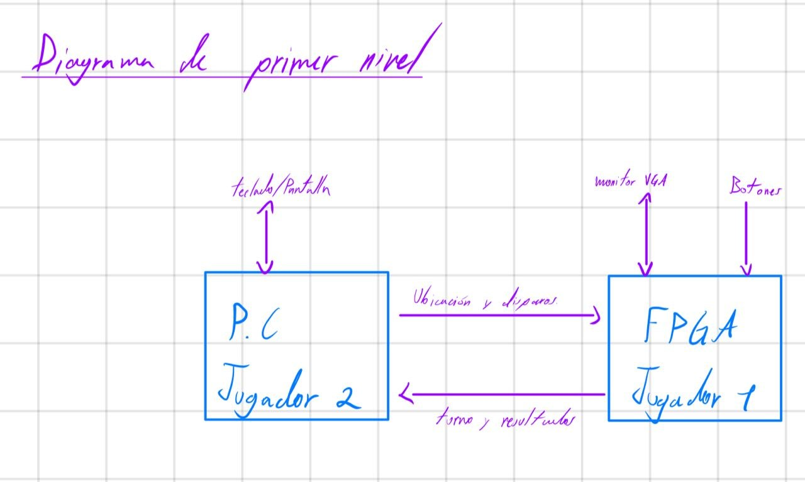

---

## 5. Diagrama de segundo nivel

El segundo nivel divide el sistema completo en sus bloques funcionales principales: núcleo RISC-V, ROM, RAM, decodificación MMIO, UART, VGA, entradas del Jugador 1, displays/LED/buzzer, y la aplicación de PC como bloque externo conectado por UART.

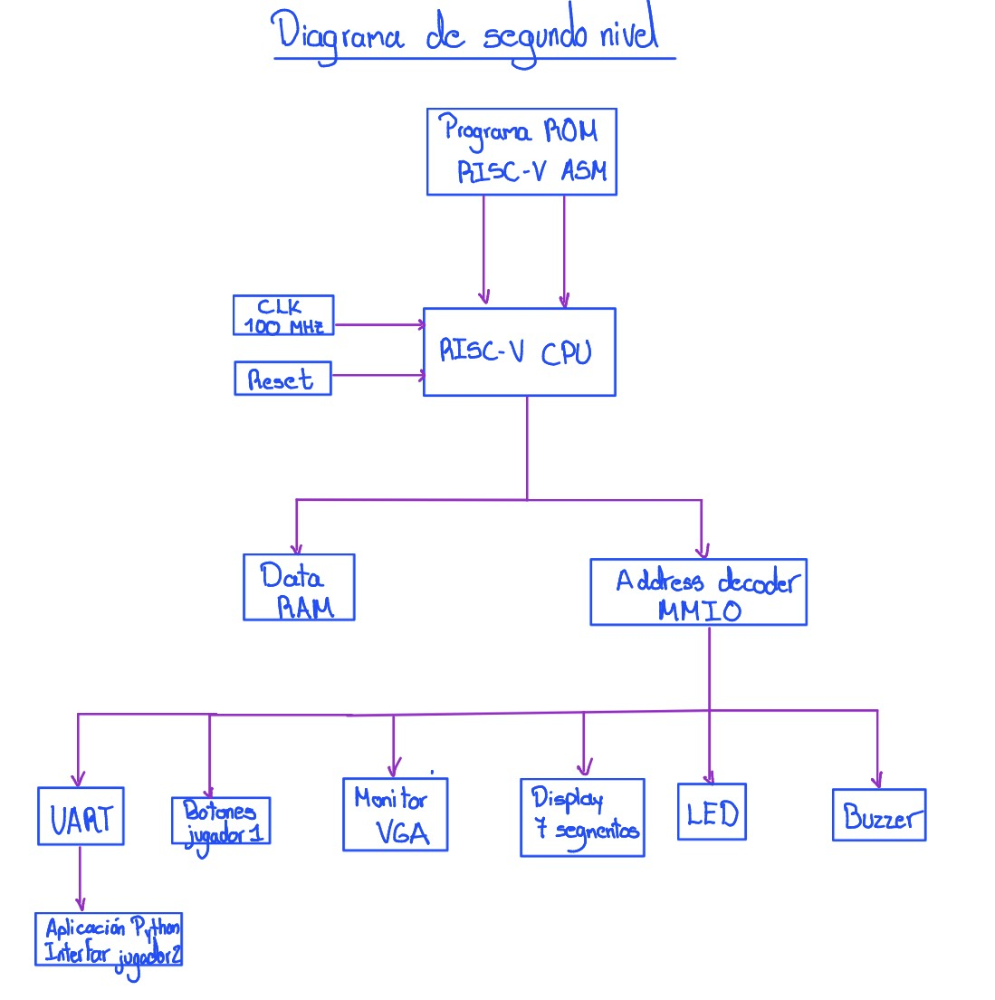

---

## 6. Diagramas de tercer nivel

El tercer nivel presenta los bloques funcionales internos de la solución, organizado en cuatro diagramas principales.

### 6.1 Procesador RISC-V

El diagrama de tercer nivel muestra el datapath de ciclo único del
microprocesador RV32I: el datapath principal (instrucción, registros,
ALU y memoria de datos) y la lógica de siguiente PC (branches y saltos).

#### Señales de entrada

| Señal            | Ancho  | Origen                     | Descripción                                   |
|-------------------|--------|----------------------------|------------------------------------------------|
| `clk_i`            | 1 bit  | Externo                    | Reloj del sistema.                              |
| `rst_i`            | 1 bit  | Externo                    | Reinicio del procesador.                        |
| `ProgIn_i[31:0]`   | 32 bits| ROM                        | Instrucción leída de la memoria de programa.    |
| `DataIn_i[31:0]`   | 32 bits| RAM / periféricos          | Dato leído de la memoria de datos (para `lw`).  |

#### Señales de salida

| Señal               | Ancho  | Destino            | Descripción                                        |
|----------------------|--------|---------------------|------------------------------------------------------|
| `ProgAddress_o[31:0]`| 32 bits| ROM                  | Dirección de la siguiente instrucción a leer (`PC`).  |
| `DataAddress_o[31:0]`| 32 bits| RAM / periféricos    | Dirección de memoria de datos (`ALU_Result`).         |
| `DataOut_o[31:0]`    | 32 bits| RAM / periféricos    | Dato a escribir en memoria (`RD2`, para `sw`).        |
| `we_o`                | 1 bit  | RAM / periféricos    | Habilita escritura en memoria de datos (`MemWrite`).  |

#### Señales de control (generadas por la Unidad de Control)

| Señal        | Ancho    | Bloque que controla        | Descripción                                                        |
|---------------|----------|------------------------------|-----------------------------------------------------------------------|
| `RegWrite`    | 1 bit    | Banco de Registros           | Habilita escritura de `WriteData` en el registro `rd`.                |
| `ImmSrc`      | N bits   | Generador de Inmediatos      | Selecciona el formato del inmediato (I, S, B, U, J).                  |
| `ALUSrcA`     | 1 bit    | MUX A                        | Selecciona entre `RD1` y `PC` como entrada A de la ALU.               |
| `ALUSrcB`     | 1 bit    | MUX B                        | Selecciona entre `RD2` e `Imm` como entrada B de la ALU.               |
| `ALUControl`  | N bits   | ALU                          | Selecciona la operación de la ALU (suma, resta, lógicas, comparación).|
| `ResultSrc`   | N bits   | MUX Writeback                | Selecciona entre `ALU_Result`, `DataIn_i` y `PC_plus_4`.               |
| `Branch_Ctrl` | N bits   | Comparador y Lógica de Saltos| Indica el tipo de bifurcación (`beq`, `bne`, `blt`, `bge`, `jal`, `jalr`) o ausencia de ella. |

#### Explicación del datapath

**Camino del PC e instrucción.** El `Registro PC` mantiene la dirección
de la instrucción actual. La señal `PC[31:0]` se distribuye hacia tres
destinos: `ProgAddress_o`, el bloque `PC + 4` (dirección secuencial
siguiente) y el `MUX A`. La ROM responde por `ProgIn_i[31:0]`, que entra
al `Decodificador de instrucción`, el cual extrae `opcode/funct`,
`rs1/rs2/rd` y los campos inmediatos.

**Unidad de control.** A partir de `opcode/funct` genera todas las
señales de control de la tabla anterior, que gobiernan el resto del
datapath.

**Banco de registros y generador de inmediatos.** El `Banco de
Registros` lee `RD1` y `RD2` a partir de `rs1`/`rs2`, y escribe
`WriteData` en `rd` cuando `RegWrite` está activo. El `Generador de
Inmediatos` decodifica el campo inmediato según `ImmSrc` y produce
`Imm[31:0]`.

**ALU.** El `MUX A` selecciona entre `RD1` y `PC`. El `MUX B` selecciona entre
`RD2` e `Imm`. La `ALU` produce `ALU_Result` según `ALUControl`, que se
usa como `DataAddress_o`. `RD2` se envía directamente como `DataOut_o`
(para `sw`).

**Escritura de resultado (Writeback).** El `MUX Writeback` selecciona,
según `ResultSrc`, entre `ALU_Result`, `DataIn_i` y `PC_plus_4` (para
`jal`/`jalr`). El resultado (`WriteData`) regresa al Banco de Registros.

**Lógica de siguiente PC.** El `Comparador de Bifurcaciones` recibe
`RD1`, `RD2` y `Branch_Ctrl`, y produce `BranchTaken`. La `Lógica
Branch/Saltos` recibe `PC`, `Imm`, `RD1`, `BranchTaken` y `Branch_Ctrl`,
y calcula `TargetPC` junto con `PCsrc`
(`PCsrc = Jump | (Branch & BranchTaken)`). El `MUX Next PC` selecciona,
según `PCsrc`, entre `PC_plus_4` y `TargetPC`, produciendo
`NextPC[31:0]`, que regresa al `Registro PC`.
### 6.2 Memorias, interconexión MMIO y UART

El subsistema de memorias, interconexión MMIO y comunicación UART
permite conectar el procesador RISC-V con la memoria de programa, la
memoria de datos y los diferentes periféricos del sistema. La
arquitectura utiliza una interfaz independiente para la memoria de
instrucciones y una interfaz compartida para el acceso a la RAM y a los
periféricos mapeados en memoria.

El procesador proporciona las señales `ProgAddress_o[31:0]` para el
acceso a la memoria de programa y `DataAddress_o[31:0]`,
`DataOut_o[31:0]` y `we_o` para las operaciones sobre memoria de datos
y periféricos. Los datos obtenidos durante una operación de lectura
regresan al procesador mediante `DataIn_i[31:0]`.

#### Memoria ROM

La memoria ROM almacena las instrucciones que ejecuta el procesador y
utiliza una interfaz independiente del bus de datos. El procesador
coloca la dirección de la instrucción requerida en
`ProgAddress_o[31:0]` y la ROM retorna la instrucción correspondiente
mediante `ProgIn_i[31:0]`.

Debido a que la ROM pertenece al espacio de programa y dispone de su
propia interfaz con el procesador, no participa en el multiplexor de
lectura utilizado por la RAM y los periféricos MMIO. Cuando sea
necesario, la dirección generada por el procesador se adapta a la
organización interna de la memoria antes de realizar el acceso.

#### Bus de datos e interconexión MMIO

La RAM y los periféricos comparten la interfaz de datos del procesador.
La dirección del acceso se presenta mediante `DataAddress_o[31:0]`,
mientras que `DataOut_o[31:0]` constituye el bus común utilizado para
transferir hacia los dispositivos el dato que debe escribirse.

La señal `we_o` indica que el procesador está realizando una operación
de escritura. Sin embargo, esta señal no se conecta directamente como
habilitación de escritura de todos los dispositivos. Primero se combina
con la señal de selección correspondiente al dispositivo direccionado,
de manera que únicamente el bloque seleccionado pueda modificar su
contenido.

#### Decodificación de direcciones

El decodificador de direcciones recibe `DataAddress_o[31:0]` y determina
qué región del mapa de memoria está siendo accedida. Como resultado,
genera señales de selección independientes para la RAM y para cada uno
de los periféricos mapeados en memoria.

Las principales señales de selección consideradas en la interconexión
son:

- `sel_RAM`
- `sel_UART`
- `sel_INPUT`
- `sel_DISPLAY`
- `sel_LED`
- `sel_BUZZER`
- `sel_VGA`

Estas señales permiten que una misma interfaz de dirección y datos sea
compartida por los diferentes dispositivos sin que más de un bloque
responda simultáneamente al mismo acceso.

#### Generación de habilitaciones de escritura

Para cada dispositivo se genera una habilitación de escritura a partir
de la señal global `we_o` y de la señal de selección obtenida mediante
la decodificación de direcciones. De forma general, la habilitación de
escritura de un dispositivo se expresa como

\[
we_x = we_o \land sel_x
\]

donde `sel_x` representa la señal de selección del dispositivo
correspondiente.

Por ejemplo, para la memoria RAM y el periférico UART se tiene

\[
we_{RAM} = we_o \land sel_{RAM}
\]

\[
we_{UART} = we_o \land sel_{UART}
\]

Con este esquema, aunque `DataOut_o[31:0]` se distribuya hacia varios
bloques, solamente el dispositivo seleccionado puede almacenar el dato
durante una operación de escritura.

#### Memoria RAM

La memoria RAM se utiliza para almacenar los datos requeridos durante la
ejecución del programa. El bloque recibe el dato de escritura desde
`DataOut_o[31:0]`, una dirección interna derivada de
`DataAddress_o[31:0]` y la habilitación `we_RAM`.

Debido a que la RAM ocupa solamente una región del espacio total de
direcciones, se utiliza una adaptación de dirección para convertir la
dirección global generada por el procesador en una dirección válida
dentro de la memoria. Para una memoria organizada en palabras de
32 bits, esta adaptación puede representarse conceptualmente como

\[
RAM\_addr =
\frac{DataAddress_o - BASE_{RAM}}{4}
\]

donde `BASE_RAM` corresponde a la dirección inicial de la región
reservada para la RAM.

Durante una operación de lectura, la RAM produce `ram_rdata[31:0]`, que
se conecta como una de las entradas del multiplexor general de lectura.

#### Adaptación de direcciones de los periféricos

Los periféricos no requieren utilizar directamente los 32 bits de
`DataAddress_o`. Una vez identificada la región correspondiente mediante
el decodificador, la dirección puede reducirse o adaptarse al formato
requerido por cada dispositivo.

En los periféricos basados en registros, esta dirección interna permite
seleccionar el registro particular que será leído o escrito. En el caso
del UART, la dirección interna permite seleccionar entre sus registros
de control/estado, transmisión y recepción. El periférico VGA utiliza
una dirección interna de mayor tamaño debido a la cantidad de posiciones
que componen su memoria de video.

#### Multiplexor de lectura

Cada dispositivo que permite operaciones de lectura genera su propia
salida de datos. Entre estas señales se encuentran `ram_rdata`,
`uart_rdata` y las salidas de lectura correspondientes a los demás
periféricos.

El multiplexor general de lectura utiliza las señales de selección
generadas por el decodificador para determinar cuál de estos datos debe
regresar al procesador. Su salida se conecta a `DataIn_i[31:0]`.

De esta manera, durante una lectura se establece el siguiente recorrido
general:

`DataAddress_o` → decodificador → selección del dispositivo →
dato de lectura → multiplexor → `DataIn_i`.

Este mecanismo permite utilizar un único bus de retorno de 32 bits para
la RAM y los diferentes periféricos MMIO.

#### Integración del periférico UART

El UART constituye uno de los periféricos conectados a la interconexión
MMIO. Desde el punto de vista del procesador, se accede a sus registros
mediante las mismas señales utilizadas para los demás dispositivos:
`DataAddress_o[31:0]`, `DataOut_o[31:0]`, `DataIn_i[31:0]` y la
habilitación de escritura correspondiente.

Internamente, el periférico se divide en un registro de control y estado,
un registro de transmisión, un registro de recepción, un transmisor
UART, un receptor UART y un generador de baud. La selección interna de
los registros permite determinar qué información debe escribirse o
retornarse durante cada acceso realizado por el procesador.

El registro de transmisión almacena la información que posteriormente
será serializada por el transmisor UART. En sentido contrario, el
receptor UART reconstruye la información recibida serialmente y permite
almacenarla en el registro de recepción. El registro de control y estado
proporciona la información necesaria para coordinar las operaciones de
transmisión y recepción.

El generador de baud obtiene, a partir del reloj principal del sistema,
la referencia temporal utilizada por los bloques de transmisión y
recepción. Finalmente, las señales físicas `uart_tx` y `uart_rx`
permiten establecer la comunicación serial entre el sistema implementado
en la FPGA y la aplicación ejecutada en la computadora.

El funcionamiento interno de los registros, el generador de baud, el
transmisor, el receptor y las máquinas de estado asociadas se desarrolla
con mayor detalle en los diagramas de cuarto nivel.

### 6.3 Periférico VGA y sistema de relojes
El bloque VGA de tercer nivel se organiza en cuatro subsistemas: generación del reloj de
píxel (PLL), generación de temporización (contadores y sincronismos), memoria de video de
doble puerto, y generación de color/RGB. El procesador solo interactúa con este bloque a
través de una interfaz de escritura tipo memoria (`vga_we_i`, `vga_addr_i`, `vga_wdata_i`),
mapeada en el rango `0x0001_1000`–`0x0001_17FF`.
 
#### Señales de entrada
 
| Señal | Ancho | Origen | Descripción |
|---|---|---|---|
| `clk_i` | 1 bit | Externo (oscilador) | Reloj del sistema, 100 MHz. |
| `rst_i` | 1 bit | Externo | Reinicio del periférico. |
| `vga_we_i` | 1 bit | CPU / decodificador MMIO | Habilitación de escritura de una casilla. |
| `vga_addr_i[8:0]` | 9 bits | CPU / decodificador MMIO | Dirección lineal de tile (`fila*20+columna`). |
| `vga_wdata_i[31:0]` | 32 bits | CPU / decodificador MMIO | Palabra a escribir en la casilla (color en `[2:0]`). |
 
#### Señales de salida
 
| Señal | Ancho | Destino | Descripción |
|---|---|---|---|
| `vga_hs_o` | 1 bit | Monitor VGA | Sincronismo horizontal. |
| `vga_vs_o` | 1 bit | Monitor VGA | Sincronismo vertical. |
| `vga_r_o[3:0]` | 4 bits | Monitor VGA | Componente roja. |
| `vga_g_o[3:0]` | 4 bits | Monitor VGA | Componente verde. |
| `vga_b_o[3:0]` | 4 bits | Monitor VGA | Componente azul. |
 
#### Señales internas relevantes (entre subbloques)
 
| Señal | Ancho | Bloque que la genera | Descripción |
|---|---|---|---|
| `clk_pix_o` | 1 bit | PLL | Reloj de píxel derivado, 25 MHz. |
| `locked_o` | 1 bit | PLL | Indica que el PLL ya estabilizó su salida. |
| `hcount` | 10 bits | Generador de temporización | Posición horizontal del haz (0–799). |
| `vcount` | 10 bits | Generador de temporización | Línea actual del cuadro (0–524). |
| `video_on` | 1 bit | Generador de temporización | 1 si el haz está en el área visible 640×480. |
| `tile_data` | 32 bits | Memoria de video | Palabra leída de la casilla actual. |
 
#### Explicación del bloque
 
El `PLL` recibe `clk_i` (100 MHz) y genera `clk_pix_o` (25 MHz), único reloj usado por el resto
del bloque VGA. El `Generador de temporización` produce `hcount`/`vcount` mediante dos
contadores encadenados, y a partir de ellos deriva `vga_hs_o`, `vga_vs_o` y `video_on` por
comparación de rango contra los tiempos estándar de 640×480@60Hz. La `Memoria de video`
resuelve internamente la dirección de tile correspondiente a (`hcount`, `vcount`) y expone
`tile_data`, mientras en paralelo acepta escrituras del CPU por su puerto A
(`vga_we_i`, `vga_addr_i`, `vga_wdata_i`) en el dominio de 100 MHz — de ahí que la memoria sea
de **doble puerto y doble reloj**, siendo el único punto donde se cruzan ambos dominios de
reloj del sistema. Finalmente, el `Generador de color y RGB` traduce `tile_data` en los
niveles físicos `vga_r_o`/`vga_g_o`/`vga_b_o`, forzando negro cuando `video_on = 0`.

### 6.4 Periféricos locales
El bloque de periféricos locales agrupa cuatro subsistemas independientes entre sí, todos
mapeados en memoria y accedidos por el bus estándar de periféricos (`addr_i[1:0]`,
`wdata_i[31:0]`, `we_i`, `rdata_o[31:0]`): entradas del Jugador 1, displays de 7 segmentos,
LED de estado y buzzer.
 
#### Señales de entrada
 
| Señal | Ancho | Origen | Descripción |
|---|---|---|---|
| `clk_i` | 1 bit | Externo | Reloj del sistema, 100 MHz. |
| `rst_i` | 1 bit | Externo | Reinicio de los periféricos. |
| `btn_raw_i[6:0]` | 7 bits | Botones físicos | Arriba, abajo, izquierda, derecha, SEL, OK, RST sin filtrar. |
| `addr_i[1:0]` | 2 bits | CPU / decodificador MMIO | Selección de registro interno por periférico. |
| `wdata_i[31:0]` | 32 bits | CPU / decodificador MMIO | Dato de escritura (displays, LED, buzzer). |
| `we_i` | 1 bit | CPU / decodificador MMIO | Habilitación de escritura. |
 
#### Señales de salida
 
| Señal | Ancho | Destino | Descripción |
|---|---|---|---|
| `rdata_o[31:0]` | 32 bits | CPU / decodificador MMIO | Lectura del registro seleccionado. |
| `seg_o[6:0]` | 7 bits | Displays físicos | Patrón de segmentos activos. |
| `anode_o[3:0]` | 4 bits | Displays físicos | Ánodo del dígito actualmente encendido. |
| `led_o[2:0]` | 3 bits | LED físico | Indicador de fase del juego. |
| `buzz_pwm_o` | 1 bit | Buzzer físico | Señal PWM de audio. |
 
#### Explicación del bloque
 
Las entradas físicas pasan por una cadena de sincronización, filtrado antirrebote y
detección de flanco antes de quedar disponibles como pulsos en el registro de estado,
leído por el CPU en `0x0001_0120`. Los displays de 7 segmentos reciben 4 dígitos BCD
(`0x0001_0130`) y los multiplexan por persistencia de visión hacia `seg_o`/`anode_o`. El LED
de estado (`0x0001_0138`) refleja directamente la fase actual del juego. El buzzer
(`0x0001_0140`) recibe un código de tono y un disparo puntual, y genera de forma autónoma una
señal PWM de duración fija sin requerir intervención continua del software.

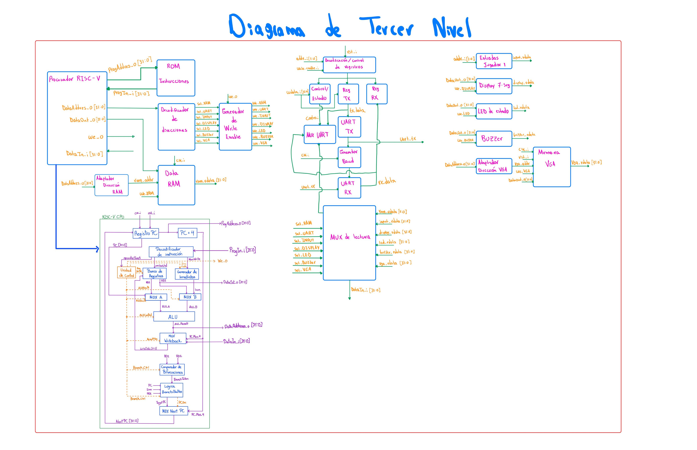

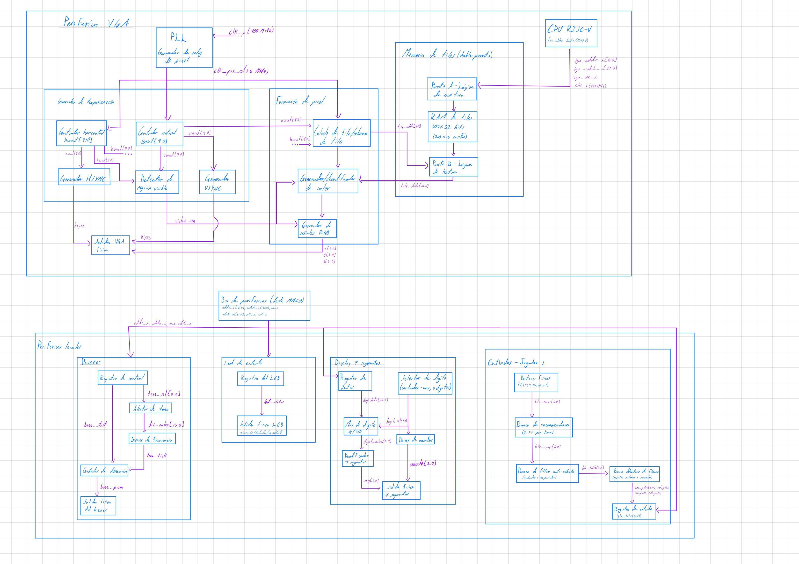

---

## 7. Diagramas de cuarto nivel

Cada módulo funcional identificado en el nivel anterior se documenta individualmente con:

1. Nombre del módulo.
2. Diagrama modular (entradas/salidas).
3. Objetivo.
4. Tabla de entradas y tabla de salidas.
5. Relación con los demás módulos.
6. Explicación de funcionamiento.
7. Diseño y justificación técnica.
8. Ecuaciones, tablas de verdad o máquinas de estado, cuando correspondan.
9. Comportamiento durante el reset.
10. Casos especiales y condiciones de borde.
11. Estrategia de validación.

**Formato de tabla de señales:**

| Señal | Ancho | Dirección | Descripción |
|---|---|---|---|
| `clk_i` | 1 bit | Entrada | Reloj principal del módulo. |
| `rst_i` | 1 bit | Entrada | Reinicio del módulo. |
| `data_i` | 32 bits | Entrada | Dato recibido desde el módulo anterior. |
| `data_o` | 32 bits | Salida | Resultado producido por el módulo. |

**Módulos a documentar** (uno por cada uno, siguiendo el formato anterior):

- **Procesador y memoria:** registro del PC, sumador PC+4, banco de registros, ALU, generador de inmediatos, unidad de control, comparador de bifurcaciones, multiplexores de operandos y de write-back, ROM, RAM, decodificador de direcciones, multiplexor de lectura.
- **VGA y periféricos locales:** PLL, contadores H/V, generadores HSYNC/VSYNC, detector de región visible, cálculo de dirección de tile, memoria de tiles, generador de color, sincronizador y debouncer de botones, detector de flanco, controlador de displays, registro del LED, generador del buzzer.
- **UART:** registro de control/estado, registro TX, registro RX, generador de baud, transmisor, receptor, lógica de detección/descarte de datos inválidos.

### 7.1 Registros de transmisión y recepción del UART

Los registros de transmisión y recepción constituyen la interfaz de
almacenamiento entre el procesador y los bloques encargados de realizar
la comunicación serial. El registro TX almacena temporalmente el dato
que debe ser enviado por el transmisor UART, mientras que el registro RX
mantiene el último dato recibido correctamente para que posteriormente
pueda ser leído por el procesador.

Ambos registros forman parte del periférico UART mapeado en memoria. El
registro TX se encuentra asociado a la dirección `0x0001_0044`, mientras
que el registro RX corresponde a la dirección `0x0001_0048`.

#### Registro de transmisión (TX)

El objetivo del registro TX es almacenar el dato escrito por el
procesador antes de iniciar su transmisión serial. El dato proviene del
bus `wdata_i[31:0]` y solamente debe almacenarse cuando se realiza una
operación de escritura dirigida al registro de transmisión.

La selección del registro se realiza mediante `addr_i[1:0]`. Dentro de
la interfaz del UART se utiliza `addr_i = 01` para identificar el
registro TX. Por lo tanto, la condición de carga puede expresarse como:

$$
load_{TX} = write\_enable_i \land (addr_i = 01)
$$

Cuando `load_TX` está activo, el registro captura el dato presente en
`wdata_i[31:0]`. El valor almacenado queda disponible para el bloque
transmisor UART, encargado posteriormente de realizar la conversión del
dato paralelo a la secuencia serial correspondiente.

##### Entradas del registro TX

| Señal | Ancho | Dirección | Descripción |
|---|---:|---|---|
| `clk_i` | 1 bit | Entrada | Reloj principal del sistema. |
| `rst_i` | 1 bit | Entrada | Reinicio del registro. |
| `write_enable_i` | 1 bit | Entrada | Indica una operación de escritura sobre el periférico UART. |
| `addr_i[1:0]` | 2 bits | Entrada | Selecciona el registro interno del UART. |
| `wdata_i[31:0]` | 32 bits | Entrada | Dato proveniente del procesador que será almacenado para su transmisión. |

##### Salidas del registro TX

| Señal | Ancho | Dirección | Descripción |
|---|---:|---|---|
| `tx_data` | Según implementación del UART | Salida | Dato almacenado que se entrega al transmisor UART. |

#### Registro de recepción (RX)

El registro RX realiza la función complementaria al registro TX. Su
objetivo es almacenar el dato reconstruido por el receptor UART después
de completar correctamente una recepción.

A diferencia del registro TX, el registro RX no es cargado directamente
por una escritura del procesador. El dato proviene del receptor UART
mediante `rx_data` y su almacenamiento se habilita mediante `rx_load`.
Esta señal indica que la recepción ha terminado y que el dato recibido
ha sido considerado válido.

De forma conceptual, la operación de carga del registro puede
representarse como:

$$
RX \leftarrow rx\_data
\qquad \text{si} \qquad
rx\_load = 1
$$

Una vez almacenado, el dato permanece disponible para que el procesador
pueda consultarlo mediante una operación de lectura. Dentro del
periférico UART se utiliza `addr_i = 10` para seleccionar el registro de
recepción.

##### Entradas del registro RX

| Señal | Ancho | Dirección | Descripción |
|---|---:|---|---|
| `clk_i` | 1 bit | Entrada | Reloj principal del sistema. |
| `rst_i` | 1 bit | Entrada | Reinicio del registro. |
| `rx_data` | Según implementación del UART | Entrada | Dato reconstruido por el receptor UART. |
| `rx_load` | 1 bit | Entrada | Habilita el almacenamiento de un nuevo dato recibido correctamente. |

##### Salidas del registro RX

| Señal | Ancho | Dirección | Descripción |
|---|---:|---|---|
| `rx_data_reg` | Según implementación del UART | Salida | Dato recibido y almacenado, disponible para su lectura. |

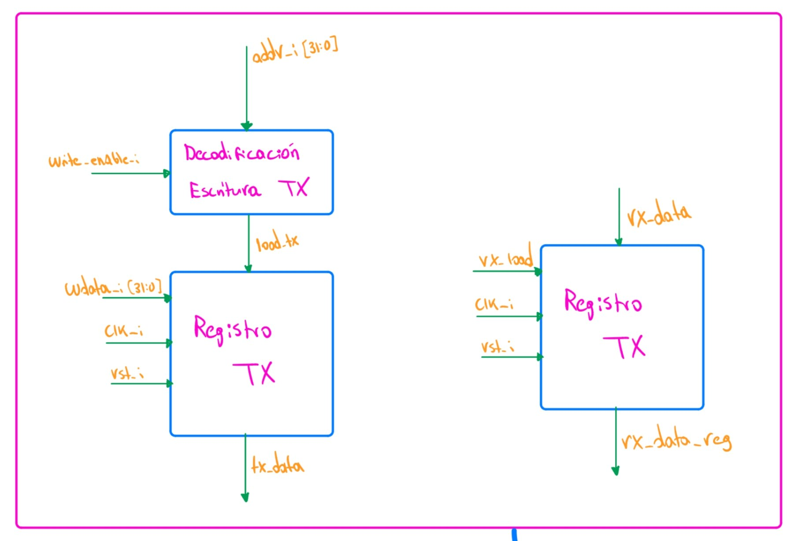

#### Relación con los demás módulos

Los registros TX y RX funcionan como elementos de enlace entre la
interfaz MMIO del procesador y los bloques internos de comunicación del
UART.

Durante una transmisión, el flujo de información es:

**Procesador → `wdata_i` → Registro TX → UART TX → `uart_tx`**

El procesador escribe el dato en el registro TX y posteriormente el
transmisor UART se encarga de convertirlo en una secuencia serial que
sale físicamente mediante `uart_tx`.

Durante una recepción, el flujo ocurre en sentido contrario:

**`uart_rx` → UART RX → Registro RX → interfaz de lectura → Procesador**

El receptor UART reconstruye el dato recibido serialmente. Cuando la
recepción finaliza correctamente, `rx_load` permite almacenar el dato en
el registro RX para que pueda ser leído posteriormente por el
procesador.

De esta manera, el procesador no necesita manipular directamente la
temporización de la comunicación serial, sino que interactúa con el
UART mediante operaciones convencionales de lectura y escritura sobre
registros mapeados en memoria.

#### Funcionamiento

El registro TX se actualiza únicamente cuando se realiza una operación
de escritura sobre su dirección interna. Su comportamiento puede
representarse como:

$$
TX_{next} =
\begin{cases}
wdata_i, & \text{si } load_{TX}=1 \\
TX, & \text{si } load_{TX}=0
\end{cases}
$$

Por su parte, el registro RX se actualiza únicamente cuando la lógica de
recepción indica que existe un nuevo dato válido:

$$
RX_{next} =
\begin{cases}
rx\_data, & \text{si } rx\_load=1 \\
RX, & \text{si } rx\_load=0
\end{cases}
$$

Esto permite que ambos registros mantengan su contenido mientras no se
presente una nueva operación válida de carga.

#### Diseño y justificación técnica

La utilización de registros independientes para transmisión y recepción
permite desacoplar el funcionamiento del procesador de la temporización
propia de la comunicación UART. El procesador trabaja con transferencias
paralelas mediante la interfaz MMIO, mientras que los bloques UART TX y
UART RX se encargan de realizar las conversiones entre representación
paralela y serial.

La separación entre TX y RX también permite que cada camino de
comunicación mantenga su propio dato sin que una operación de recepción
modifique la información almacenada para transmisión, o viceversa.

La selección mediante `addr_i[1:0]` permite además utilizar una única
interfaz MMIO para acceder a los diferentes registros internos del
periférico UART.

#### Comportamiento durante el reset

Cuando `rst_i` se encuentra activo, los registros TX y RX regresan a un
estado inicial conocido. Conceptualmente, su comportamiento durante el
reinicio puede expresarse como:

$$
rst_i = 1
\quad \Rightarrow \quad
TX = 0,\qquad RX = 0
$$

Esto evita que después de un reinicio el sistema interprete información
residual almacenada previamente como un dato válido de transmisión o
recepción.

#### Casos especiales y condiciones de borde

Una escritura dirigida a otro registro interno del UART no debe
modificar el contenido del registro TX. Por lo tanto, aunque
`write_enable_i` esté activo, el registro conserva su contenido si
`addr_i` no corresponde al registro de transmisión.

De igual forma, el registro RX solamente debe actualizarse cuando
`rx_load` indique la existencia de un nuevo dato válido. Si se detecta
una recepción inválida, el dato no debe cargarse en el registro RX y el
último valor válido almacenado debe conservarse.

Estas condiciones pueden resumirse mediante:

$$
load_{TX}=0
\quad \Rightarrow \quad
TX_{next}=TX
$$

$$
rx\_load=0
\quad \Rightarrow \quad
RX_{next}=RX
$$

La generación de `rx_load` y el tratamiento de una recepción inválida
se desarrollan posteriormente en la lógica de detección y recuperación
del receptor UART.

#### Estrategia de validación

La validación del registro TX se realizará mediante simulación,
aplicando diferentes valores sobre `wdata_i[31:0]` y verificando que el
registro solamente se actualice cuando `write_enable_i = 1` y
`addr_i = 01`. También se comprobará que las escrituras dirigidas a
otros registros internos del UART no modifiquen su contenido.

Para el registro RX se aplicarán diferentes valores de `rx_data` y se
verificará que solamente sean almacenados cuando `rx_load = 1`. Cuando
`rx_load = 0`, el registro deberá conservar el último dato almacenado.

### 7.2 Registro de control y estado del UART

El registro de control y estado permite al procesador supervisar y
coordinar el funcionamiento del periférico UART. Este registro concentra
la información necesaria para conocer el estado de los bloques de
transmisión y recepción y permite establecer las señales de control
requeridas por el periférico.

Dentro del mapa de memoria, el registro de control y estado del UART se
encuentra asociado a la dirección `0x0001_0040`. A nivel interno del
periférico se selecciona mediante `addr_i = 00`.

#### Objetivo

El objetivo de este módulo es proporcionar una interfaz entre el
procesador y las señales de control y estado generadas por los bloques
UART TX y UART RX. De esta forma, el procesador puede consultar el estado
del periférico antes de realizar operaciones de transmisión o recepción.

La condición de selección del registro puede representarse como:

$$
sel_{CTRL} = (addr_i = 00)
$$

En caso de requerirse una escritura sobre los campos de control del
registro, la habilitación correspondiente se obtiene mediante:

$$
write_{CTRL} =
write\_enable_i \land (addr_i = 00)
$$

#### Entradas

| Señal | Ancho | Dirección | Descripción |
|---|---:|---|---|
| `clk_i` | 1 bit | Entrada | Reloj principal del sistema. |
| `rst_i` | 1 bit | Entrada | Reinicio del módulo. |
| `write_enable_i` | 1 bit | Entrada | Indica una operación de escritura sobre el periférico UART. |
| `addr_i[1:0]` | 2 bits | Entrada | Selecciona el registro interno del UART. |
| `wdata_i[31:0]` | 32 bits | Entrada | Datos de control provenientes del procesador. |
| `estado_TX` | Según implementación | Entrada | Información de estado proveniente del transmisor UART. |
| `estado_RX` | Según implementación | Entrada | Información de estado proveniente del receptor UART. |

#### Salidas

| Señal | Ancho | Dirección | Descripción |
|---|---:|---|---|
| `control_i[31:0]` | 32 bits | Salida | Palabra que contiene la información de control y estado disponible para lectura por el procesador. |

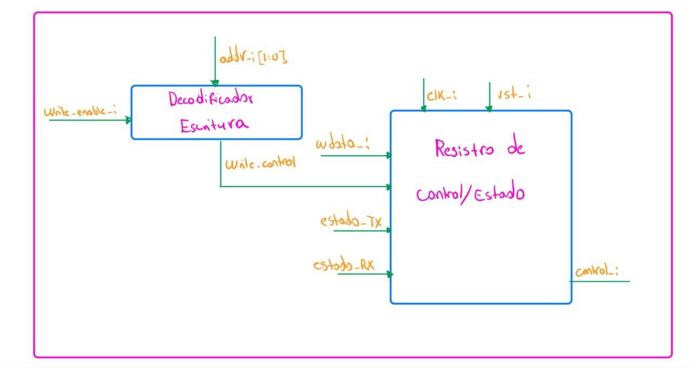

#### Relación con los demás módulos

El registro de control y estado se encuentra conectado con los bloques
de transmisión y recepción del UART. Estos bloques proporcionan las
señales que representan su condición de operación y permiten informar al
procesador sobre el estado actual de la comunicación.

El flujo de información de estado puede representarse como:

**UART TX / UART RX → Registro de control y estado → MUX de lectura UART → Procesador**

Para las operaciones de control realizadas por software, el flujo ocurre
en sentido contrario:

**Procesador → `wdata_i` → Registro de control y estado → lógica interna del UART**

De esta forma, el registro constituye el punto de comunicación entre el
software ejecutado por el procesador y el estado interno del periférico
UART.

#### Funcionamiento

Cuando el procesador realiza una lectura de la dirección correspondiente
al registro de control y estado, la información contenida en
`rdata_status[31:0]` se entrega al multiplexor interno de lectura del
UART. Posteriormente, esta información puede regresar al procesador por
medio de la interfaz MMIO.

La selección del dato de estado durante una lectura se produce cuando:

$$
addr_i = 00
$$

Si existen campos de control modificables por software, estos solamente
pueden actualizarse cuando se cumple:

$$
write\_enable_i = 1
\qquad \text{y} \qquad
addr_i = 00
$$

por lo que:

$$
write_{CTRL} =
write\_enable_i \land (addr_i = 00)
$$

Las señales de estado provenientes del transmisor y del receptor se
utilizan para formar la palabra de estado disponible para el procesador.

#### Diseño y justificación técnica

La utilización de un registro de control y estado permite concentrar en
una única posición del espacio de memoria la información necesaria para
coordinar el UART. Esto simplifica la interacción del software con el
hardware, ya que el procesador puede consultar el estado del periférico
mediante una operación convencional de lectura MMIO.

La separación entre este registro y los registros TX y RX permite que
los datos transmitidos o recibidos permanezcan independientes de las
señales utilizadas para controlar y supervisar la comunicación.

La interfaz de 32 bits mantiene además compatibilidad con la interfaz
estándar utilizada por los periféricos del sistema.

#### Comportamiento durante el reset

Cuando `rst_i` se encuentra activo, los campos de control almacenados
por el módulo deben regresar a su estado inicial. Las señales de estado
deben representar la condición inicial de los bloques TX y RX después
del reinicio.

De forma conceptual:

$$
rst_i = 1
\quad \Rightarrow \quad
Control = Control_{inicial}
$$

Una vez retirado el reset, el registro vuelve a responder a las
operaciones de lectura y escritura realizadas por el procesador.

#### Casos especiales y condiciones de borde

Una escritura realizada sobre los registros TX o RX no debe modificar
los campos de control almacenados en este módulo. Por lo tanto, el
registro únicamente acepta una operación de escritura cuando
`addr_i = 00`.

De forma equivalente:

$$
addr_i \neq 00
\quad \Rightarrow \quad
write_{CTRL}=0
$$

Las señales de estado deben reflejar únicamente las condiciones
proporcionadas por los bloques de transmisión y recepción. Un dato
recibido de forma inválida no debe presentarse al procesador como una
recepción válida.

#### Estrategia de validación

La validación del módulo se realizará mediante simulación. Primero se
comprobará que una lectura con `addr_i = 00` produzca en
`rdata_status[31:0]` la información correspondiente al estado del UART.

También se realizarán operaciones de escritura sobre diferentes valores
de `addr_i`, verificando que los campos de control solamente puedan
modificarse cuando `write_enable_i = 1` y `addr_i = 00`.

Finalmente, se comprobará el comportamiento durante `rst_i` y se
variarán las señales provenientes de los bloques TX y RX para verificar
que la palabra de estado refleje correctamente los cambios producidos
por estos módulos.

### 7.3 Generador de baud

El generador de baud proporciona la referencia temporal utilizada por
los bloques de transmisión y recepción del UART. Su función consiste en
obtener, a partir del reloj principal del sistema, una señal periódica
denominada `baud_tick`, que permite sincronizar las operaciones internas
asociadas con la comunicación serial.

El sistema utiliza un reloj principal de 100 MHz, mientras que la
comunicación UART debe operar a una velocidad de 115200 baudios. Debido
a esta diferencia de frecuencias, es necesario incorporar un bloque que
genere la temporización requerida por el periférico UART.

#### Objetivo

El objetivo del generador de baud es producir una señal de habilitación
temporal a partir de `clk_i`. Esta señal permite que las máquinas de
estado de transmisión y recepción avancen de acuerdo con la
temporización definida para la comunicación UART.

El bloque se implementa conceptualmente mediante un contador y una
lógica de comparación. El contador incrementa con el reloj principal y,
al alcanzar el valor establecido, se genera `baud_tick` y se reinicia
el conteo.

#### Entradas

| Señal | Ancho | Dirección | Descripción |
|---|---:|---|---|
| `clk_i` | 1 bit | Entrada | Reloj principal del sistema de 100 MHz. |
| `rst_i` | 1 bit | Entrada | Reinicio del generador de baud. |

#### Salidas

| Señal | Ancho | Dirección | Descripción |
|---|---:|---|---|
| `baud_tick` | 1 bit | Salida | Pulso periódico utilizado como referencia temporal por los bloques UART TX y UART RX. |

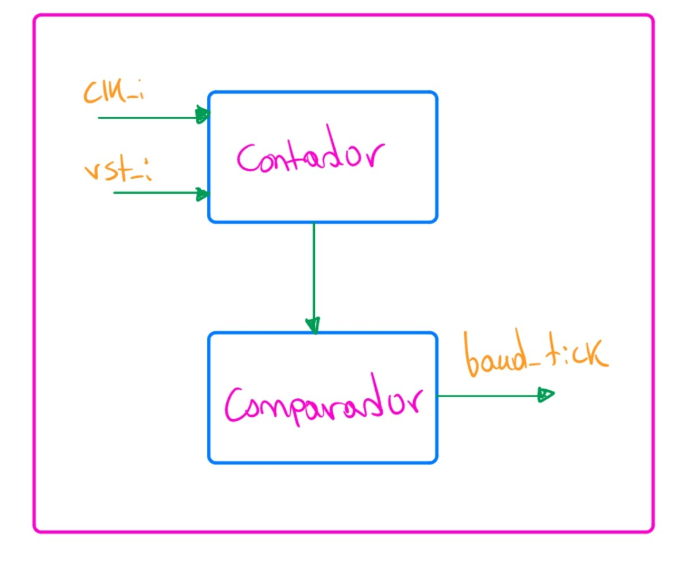

#### Relación con los demás módulos

El generador de baud recibe directamente el reloj principal del sistema
y proporciona `baud_tick` a los bloques de transmisión y recepción.

El flujo de la señal puede representarse como:

**`clk_i` → Generador de baud → `baud_tick` → UART TX / UART RX**

De esta manera, los bloques UART TX y UART RX permanecen sincronizados
con una referencia temporal derivada del mismo reloj del sistema.

#### Funcionamiento

Internamente, el generador está compuesto por un contador y una lógica
de comparación. El contador incrementa su valor con cada ciclo de
`clk_i`.

De forma conceptual, mientras no se alcance el valor terminal:

$$
contador_{next} = contador + 1
$$

Cuando el contador alcanza el valor definido para generar la referencia
temporal, se produce un pulso en `baud_tick` y el contador comienza
nuevamente el conteo.

El comportamiento puede representarse como:

$$
baud\_tick =
\begin{cases}
1, & \text{si } contador = N-1 \\
0, & \text{en otro caso}
\end{cases}
$$

y la actualización del contador como:

$$
contador_{next} =
\begin{cases}
0, & \text{si } contador = N-1 \\
contador + 1, & \text{en otro caso}
\end{cases}
$$

donde $N$ representa el número de ciclos del reloj principal utilizados
para generar la referencia temporal requerida por el UART.

La relación general entre la frecuencia del reloj, la frecuencia de la
referencia generada y el valor de división puede expresarse como:

$$
N = \frac{f_{clk}}{f_{tick}}
$$

Para el sistema diseñado:

$$
f_{clk}=100\text{ MHz}
$$

mientras que la comunicación UART opera a:

$$
baud=115200\text{ baudios}
$$

El valor definitivo de $f_{tick}$ y, por lo tanto, de $N$, depende de la
estrategia de temporización utilizada por la implementación del UART.

#### Diseño y justificación técnica

Se utiliza un contador síncrono porque permite derivar la referencia
temporal del UART directamente del reloj principal sin introducir un
reloj externo adicional. `baud_tick` se utiliza como una señal de
habilitación periódica, mientras que la lógica secuencial de los bloques
UART continúa sincronizada con `clk_i`.

Esta estructura mantiene todos los bloques principales dentro del mismo
dominio de reloj y permite centralizar la generación de la referencia
temporal utilizada por el transmisor y el receptor.

La separación del generador de baud como módulo independiente también
facilita su validación y permite modificar la velocidad de comunicación
sin alterar directamente la estructura de las máquinas de estado del
transmisor y del receptor.

#### Comportamiento durante el reset

Cuando `rst_i` se encuentra activo, el contador interno regresa a su
valor inicial y `baud_tick` permanece inactivo.

Conceptualmente:

$$
rst_i=1
\quad\Rightarrow\quad
contador=0
$$

$$
rst_i=1
\quad\Rightarrow\quad
baud\_tick=0
$$

Al retirar el reset, el contador comienza nuevamente a incrementar a
partir de cero hasta alcanzar el valor terminal correspondiente.

#### Casos especiales y condiciones de borde

El contador debe reiniciarse inmediatamente después de alcanzar su valor
terminal para evitar la generación de pulsos adicionales o intervalos
incorrectos entre pulsos consecutivos.

Además, `baud_tick` debe permanecer activo únicamente durante el
intervalo definido por el diseño, evitando que una misma condición de
conteo provoque múltiples avances en las máquinas de estado UART.

El valor utilizado como límite del contador deberá establecerse de
acuerdo con la temporización finalmente utilizada por los bloques UART
TX y UART RX.

#### Estrategia de validación

La validación del generador de baud se realizará inicialmente mediante
simulación. Se verificará que, después de retirar `rst_i`, el contador
avance correctamente y que `baud_tick` sea generado únicamente al
alcanzar el valor terminal establecido.

También se medirá el número de ciclos de `clk_i` existentes entre dos
pulsos consecutivos de `baud_tick`, comprobando que corresponda con el
valor de división definido.

Finalmente, durante la integración con los bloques UART TX y UART RX se
verificará que la referencia temporal generada permita realizar
correctamente la transmisión y recepción a la velocidad de comunicación
establecida de 115200 baudios.

### 7.4 Transmisor UART

El transmisor UART es el bloque encargado de convertir el dato almacenado
en el registro TX desde su representación paralela a una secuencia serial
que pueda enviarse hacia la computadora mediante la señal física
`uart_tx`.

Para realizar esta operación, el transmisor utiliza la referencia temporal
`baud_tick` proporcionada por el generador de baud. El funcionamiento del
bloque es coordinado mediante una máquina de estados y un contador de
posición, los cuales controlan el avance de la transmisión.

#### Objetivo

El objetivo del transmisor UART es realizar la conversión paralelo-serie
del dato almacenado en el registro TX y controlar la secuencia temporal
necesaria para enviarlo mediante `uart_tx`.

El módulo debe mantener el dato estable durante cada intervalo de
transmisión y avanzar solamente cuando la referencia temporal
`baud_tick` indique que corresponde continuar con la siguiente etapa.

#### Entradas

| Señal | Ancho | Dirección | Descripción |
|---|---:|---|---|
| `clk_i` | 1 bit | Entrada | Reloj principal del sistema. |
| `rst_i` | 1 bit | Entrada | Reinicio del transmisor. |
| `tx_data` | Según implementación del UART | Entrada | Dato paralelo proveniente del registro TX. |
| `tx_start` | 1 bit | Entrada | Solicitud para iniciar la transmisión de un nuevo dato. |
| `baud_tick` | 1 bit | Entrada | Referencia temporal proporcionada por el generador de baud. |

#### Salidas

| Señal | Ancho | Dirección | Descripción |
|---|---:|---|---|
| `uart_tx` | 1 bit | Salida | Señal serial de transmisión hacia la computadora. |
| `estado_TX` | Según implementación | Salida | Información del estado actual del transmisor utilizada por la lógica de control/estado. |

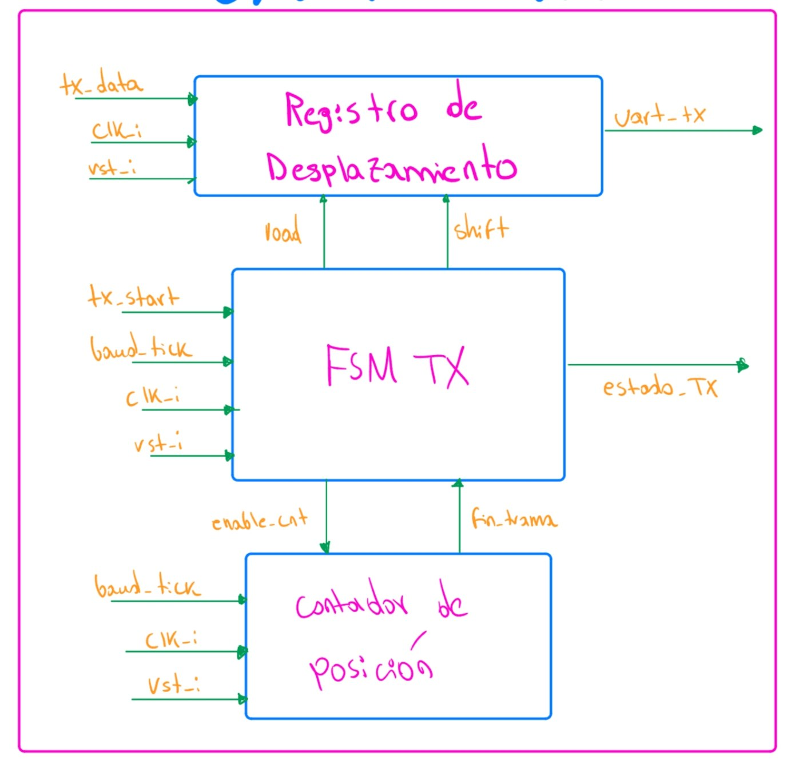

#### Relación con los demás módulos

El transmisor recibe `tx_data` desde el registro TX y utiliza
`baud_tick`, generado por el módulo de baud, como referencia para el
avance de la transmisión.

El flujo principal de información puede representarse como:

**Registro TX → `tx_data` → UART TX → `uart_tx`**

Por otra parte, la temporización sigue el recorrido:

**Generador de baud → `baud_tick` → UART TX**

El transmisor también proporciona información mediante `estado_TX`, la
cual puede ser utilizada por el registro de control y estado para
informar al procesador acerca de la condición actual del bloque.

#### Funcionamiento

El transmisor se divide internamente en una sección de datos y una
sección de control.

La sección de datos se encarga de mantener la información que será
transmitida y de colocar sobre `uart_tx` el valor correspondiente en
cada etapa de la transmisión.

La sección de control determina cuándo cargar un nuevo dato, cuándo
avanzar dentro de la transmisión y cuándo finalizar el envío. Para ello
utiliza una máquina de estados y un contador de posición.

De manera general, el proceso comienza cuando se recibe `tx_start`.
La máquina de estados abandona su condición de reposo e inicia la
secuencia de transmisión. Posteriormente, cada activación válida de
`baud_tick` permite avanzar en el proceso hasta completar el dato.

Una vez finalizada la transmisión, el bloque retorna al estado de reposo
y queda preparado para aceptar una nueva solicitud.

#### Diseño y justificación técnica

La separación entre la ruta de datos y la lógica de control permite
mantener una estructura modular. El registro o estructura de
desplazamiento se encarga de la información transmitida, mientras que la
máquina de estados determina el orden de las operaciones.

El contador de posición permite identificar el avance dentro de la
transmisión sin necesidad de representar cada posición mediante un
estado diferente de la máquina.

Esta organización reduce la complejidad de la FSM y permite que la
temporización permanezca controlada por `baud_tick`, mientras que toda
la lógica secuencial continúa sincronizada con `clk_i`.

#### Máquina de estados del transmisor

La lógica de control del transmisor se organiza mediante una máquina de
estados finitos. En el diseño propuesto se consideran los estados
`IDLE`, `START`, `DATA` y `STOP`.

- **IDLE:** el transmisor permanece en reposo mientras espera una
  solicitud `tx_start`.
- **START:** inicia la secuencia de transmisión.
- **DATA:** se realiza el envío secuencial de los datos. Un contador
  permite determinar cuándo se ha alcanzado la última posición.
- **STOP:** corresponde a la etapa final de la transmisión antes de
  regresar al estado de reposo.

Las transiciones principales se representan conceptualmente como:

**IDLE → START**

cuando:

$$
tx\_start = 1
$$

Si no existe una solicitud de transmisión:

$$
tx\_start = 0
$$

la máquina permanece en `IDLE`.

Desde `START` se avanza a `DATA` cuando se presenta la referencia
temporal correspondiente:

$$
baud\_tick = 1
$$

Mientras no se haya alcanzado la última posición de datos, la máquina
permanece en `DATA`:

$$
baud\_tick = 1 \land \neg fin\_trama
$$

Cuando se alcanza la última posición:

$$
baud\_tick = 1 \land fin\_trama
$$

la máquina avanza hacia `STOP`.

Finalmente, después de completar el intervalo correspondiente a `STOP`,
la máquina regresa al estado `IDLE`, quedando disponible para una nueva
transmisión.

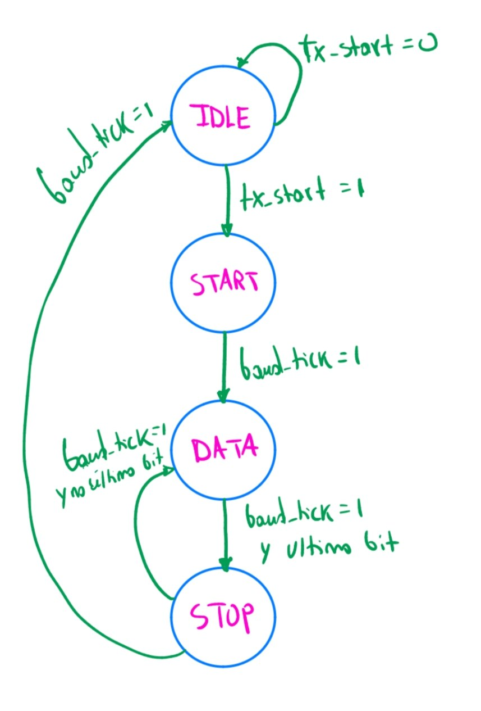

#### Control interno del transmisor

La máquina de estados utiliza el contador de posición para determinar
el avance de la transmisión. De manera general, el contador recibe una
habilitación `enable_cnt` y avanza de acuerdo con `baud_tick`.

El contador produce la señal `fin_trama`, que informa a la máquina de
estados que se alcanzó la última posición correspondiente a los datos.

La relación entre ambos bloques puede representarse como:

**FSM TX → `enable_cnt` → Contador**

y:

**Contador → `fin_trama` → FSM TX**

Además, la FSM genera las señales internas necesarias para controlar la
carga y el desplazamiento de la información que será transmitida.

#### Comportamiento durante el reset

Cuando `rst_i` se encuentra activo, el transmisor debe regresar a su
condición inicial. La máquina de estados se coloca en `IDLE`, el
contador de posición vuelve a su valor inicial y la lógica de
transmisión queda preparada para comenzar una nueva operación.

Conceptualmente:

$$
rst_i = 1
\quad\Rightarrow\quad
estado_{TX}=IDLE
$$

y:

$$
rst_i = 1
\quad\Rightarrow\quad
contador_{TX}=0
$$

Esto evita que una transmisión incompleta continúe después de un
reinicio del sistema.

#### Casos especiales y condiciones de borde

Mientras el transmisor se encuentre realizando una operación, una nueva
solicitud de transmisión no debe alterar la secuencia actualmente en
curso. El siguiente dato solamente debe comenzar a transmitirse cuando
el bloque haya regresado a su condición disponible.

Asimismo, el contador debe indicar `fin_trama` únicamente cuando se haya
alcanzado la última posición correspondiente, evitando que la máquina de
estados abandone `DATA` de forma anticipada.

El transmisor también debe permanecer sincronizado con `baud_tick` para
evitar que la salida avance más de una posición durante un mismo
intervalo de transmisión.

#### Estrategia de validación

La validación del transmisor se realizará mediante simulación. Se
aplicará un dato conocido en `tx_data` y posteriormente se activará
`tx_start`.

Durante la simulación se comprobará que la máquina de estados siga la
secuencia esperada:

**IDLE → START → DATA → STOP → IDLE**

También se verificará que el contador avance de acuerdo con
`baud_tick`, que `fin_trama` sea generado en la posición correspondiente
y que la salida `uart_tx` cambie de acuerdo con la secuencia controlada
por el transmisor.

Finalmente, el transmisor se integrará con el generador de baud y el
receptor UART para realizar una prueba de lazo cerrado, verificando que
el dato transmitido pueda recuperarse correctamente.

### 7.5 Receptor UART

El receptor UART es el bloque encargado de recibir la información serial
proveniente de la computadora mediante la señal física `uart_rx` y
reconstruir el dato para que pueda ser utilizado por el resto del
sistema.

Para realizar esta operación, el receptor utiliza la referencia temporal
`baud_tick` generada por el módulo de baud. El proceso de recepción es
coordinado mediante una máquina de estados y un contador de posición,
los cuales permiten identificar el inicio, la recepción de los datos y
la finalización de la comunicación.

#### Objetivo

El objetivo del receptor UART es realizar la conversión serie-paralelo
de la información presente en `uart_rx`, controlar el avance temporal
de la recepción y proporcionar al resto del periférico la información
necesaria para determinar cuándo se ha completado correctamente un nuevo
dato.

Al finalizar una recepción, el bloque proporciona el dato reconstruido
mediante `rx_data`, una indicación de finalización mediante `rx_done` y
el resultado de la validación mediante `rx_valid`.

#### Entradas

| Señal | Ancho | Dirección | Descripción |
|---|---:|---|---|
| `clk_i` | 1 bit | Entrada | Reloj principal del sistema. |
| `rst_i` | 1 bit | Entrada | Reinicio del receptor. |
| `uart_rx` | 1 bit | Entrada | Señal serial proveniente de la computadora. |
| `baud_tick` | 1 bit | Entrada | Referencia temporal proporcionada por el generador de baud. |

#### Salidas

| Señal | Ancho | Dirección | Descripción |
|---|---:|---|---|
| `rx_data` | Según implementación del UART | Salida | Dato reconstruido a partir de la información recibida serialmente. |
| `rx_done` | 1 bit | Salida | Indica que se ha completado el proceso de recepción de un dato. |
| `rx_valid` | 1 bit | Salida | Indica que la recepción completada cumple las condiciones de validez definidas por el receptor. |
| `estado_RX` | Según implementación | Salida | Información del estado actual del receptor utilizada por la lógica de control/estado. |

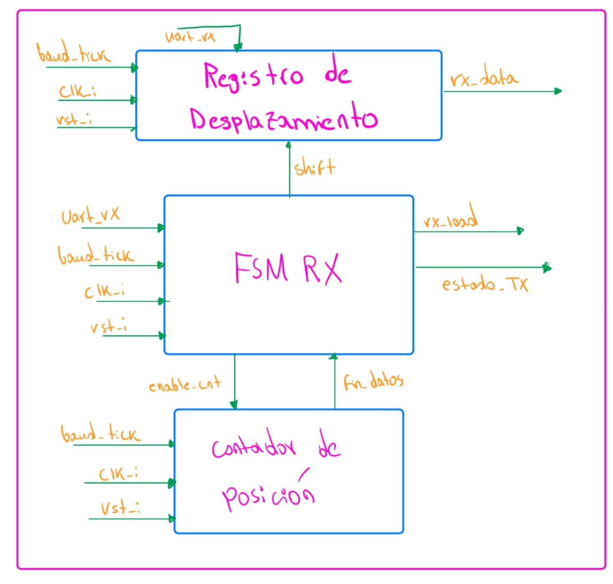

#### Relación con los demás módulos

El receptor UART se conecta directamente con la entrada física
`uart_rx`. La información recibida es procesada internamente hasta
obtener el dato paralelo `rx_data`.

El flujo principal de recepción puede representarse como:

**`uart_rx` → UART RX → `rx_data` → Registro RX**

El generador de baud proporciona la referencia temporal utilizada
durante este proceso:

**Generador de baud → `baud_tick` → UART RX**

Además, las señales `rx_done` y `rx_valid` son utilizadas por la lógica
de detección y recuperación para determinar si el dato reconstruido
puede almacenarse en el registro RX.

El flujo de control correspondiente es:

**UART RX → `rx_done`, `rx_valid` → Lógica de detección/recuperación → `rx_load`**

Finalmente, `estado_RX` permite comunicar información sobre la condición
del receptor al registro de control y estado del UART.

#### Funcionamiento

El receptor permanece inicialmente esperando la llegada de una nueva
transmisión sobre `uart_rx`. Cuando se detecta el comienzo de una
recepción, la máquina de estados abandona su condición de reposo e inicia
el proceso de adquisición.

Durante la recepción, el bloque de muestreo y registro de desplazamiento
captura progresivamente la información presente en `uart_rx`. El avance
se realiza utilizando `baud_tick` como referencia temporal.

Paralelamente, un contador de posición mantiene el seguimiento del
avance dentro de la recepción. Cuando se alcanza la última posición de
datos, el contador genera `fin_datos`, permitiendo a la máquina de
estados continuar hacia la etapa final.

Una vez completado el proceso, el receptor proporciona el dato mediante
`rx_data` y genera `rx_done`. La recepción también es evaluada para
producir `rx_valid`, señal que posteriormente determina si el dato puede
ser almacenado o debe ser descartado.

#### Diseño y justificación técnica

El receptor se divide conceptualmente en una ruta de datos y una lógica
de control. La ruta de datos realiza el muestreo y almacenamiento
temporal de la información serial, mientras que la lógica de control
coordina las diferentes etapas de la recepción.

El uso de un contador de posición evita representar individualmente cada
posición de datos como un estado diferente de la máquina. De esta forma,
la FSM puede mantenerse compacta y concentrarse en las etapas generales
de la recepción.

La validación se mantiene separada de la carga del registro RX. Esta
separación permite que finalizar una recepción no implique
automáticamente almacenar el dato, ya que primero debe comprobarse que
la recepción sea válida.

#### Máquina de estados del receptor

Para controlar el proceso de recepción se utiliza una máquina de estados
finitos. En el diseño propuesto se consideran los estados `IDLE`,
`START`, `DATA` y `STOP`.

- **IDLE:** el receptor permanece esperando el inicio de una nueva
  transmisión.
- **START:** corresponde a la detección y procesamiento del comienzo de
  la recepción.
- **DATA:** se reciben progresivamente los datos y el contador controla
  la posición actual.
- **STOP:** corresponde a la etapa final de la recepción, después de la
  cual se determina la finalización del dato y se regresa al estado de
  reposo.

Mientras la línea de recepción permanezca en su condición de reposo, la
máquina se mantiene en `IDLE`:

$$
uart\_rx = 1
\quad\Rightarrow\quad
estado_{next}=IDLE
$$

Cuando se detecta la condición de inicio:

$$
uart\_rx = 0
\quad\Rightarrow\quad
IDLE \rightarrow START
$$

Una vez alcanzada la referencia temporal correspondiente en `START`, la
máquina continúa hacia la recepción de los datos:

$$
baud\_tick = 1
\quad\Rightarrow\quad
START \rightarrow DATA
$$

Mientras no se haya alcanzado la última posición de datos, el receptor
permanece en `DATA`:

$$
baud\_tick = 1 \land \neg fin\_datos
\quad\Rightarrow\quad
DATA \rightarrow DATA
$$

Cuando se alcanza la última posición:

$$
baud\_tick = 1 \land fin\_datos
\quad\Rightarrow\quad
DATA \rightarrow STOP
$$

Finalmente, una vez completada la etapa `STOP`, la máquina retorna a
`IDLE` y queda disponible para una nueva recepción.

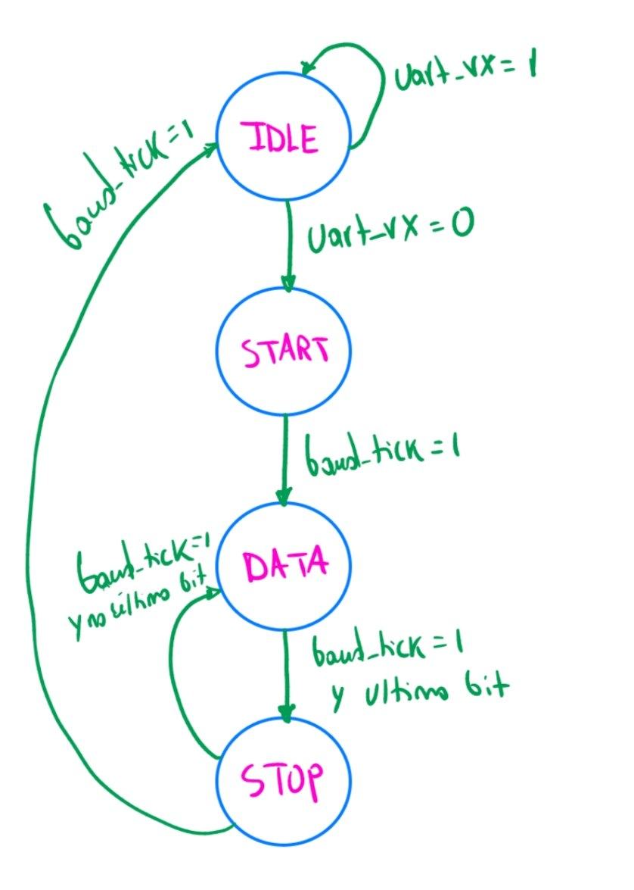

#### Control interno del receptor

La máquina de estados y el contador de posición trabajan en conjunto
para controlar la recepción. La FSM habilita el conteo mediante
`enable_cnt`, mientras que el contador informa cuándo se ha alcanzado la
última posición mediante `fin_datos`.

La relación entre ambos bloques puede representarse como:

**FSM RX → `enable_cnt` → Contador**

y:

**Contador → `fin_datos` → FSM RX**

La máquina de estados también genera las señales internas necesarias
para controlar el muestreo y desplazamiento de los datos recibidos.

Al finalizar el proceso, se genera `rx_done`. La información recibida es
evaluada para obtener `rx_valid`. Estas dos señales se utilizan
posteriormente para decidir si `rx_data` debe cargarse en el registro RX
o descartarse.

#### Comportamiento durante el reset

Cuando `rst_i` se encuentra activo, el receptor regresa a su condición
inicial. La máquina de estados vuelve a `IDLE` y el contador de posición
se reinicia.

Conceptualmente:

$$
rst_i = 1
\quad\Rightarrow\quad
estado_{RX}=IDLE
$$

$$
rst_i = 1
\quad\Rightarrow\quad
contador_{RX}=0
$$

Además, las indicaciones asociadas con una recepción completada deben
permanecer inactivas:

$$
rst_i = 1
\quad\Rightarrow\quad
rx\_done=0
$$

Esto evita que después de un reinicio se interprete una recepción
incompleta como un nuevo dato disponible.

#### Casos especiales y condiciones de borde

Si no se detecta el comienzo de una nueva recepción, la máquina debe
permanecer en `IDLE` sin modificar el dato previamente almacenado en el
registro RX.

Una recepción incompleta o considerada inválida no debe provocar la
carga del registro RX. La finalización del proceso y la validez del dato
se tratan como condiciones diferentes: `rx_done` indica que el proceso
terminó, mientras que `rx_valid` indica si el resultado puede ser
aceptado.

Por lo tanto, la presencia de:

$$
rx\_done=1
$$

no implica por sí sola que el dato deba almacenarse. La decisión final
se realiza mediante la lógica de detección y recuperación descrita en la
sección siguiente.

#### Estrategia de validación

La validación del receptor se realizará inicialmente mediante simulación.
Se aplicará sobre `uart_rx` una secuencia serial conocida y se verificará
el recorrido de la máquina de estados:

**IDLE → START → DATA → STOP → IDLE**

También se comprobará que el contador avance de acuerdo con `baud_tick`
y que `fin_datos` se active únicamente después de alcanzar la posición
correspondiente.

Al finalizar la recepción se verificará que `rx_data` contenga la
información reconstruida y que `rx_done` indique correctamente la
finalización del proceso.

También se probarán condiciones de recepción inválida para verificar que
la lógica de validación pueda diferenciarlas de una recepción aceptada.

Finalmente, durante la integración se realizará una prueba de lazo
cerrado conectando el transmisor con el receptor y comprobando que un
dato enviado por UART TX pueda ser reconstruido correctamente por
UART RX.

---

## 8. Mapa de memoria, registros y organización de datos

### 8.1 Mapa de memoria

| Rango de direcciones | Componente |
|---|---|
| `0x0000_0000 – 0x0000_1FFF` | ROM de programa |
| `0x0000_2000 – 0x0000_2FFF` | RAM de datos |
| `0x0001_0000 – 0x0001_FFFF` | Periféricos mapeados en memoria |
| `0x0001_1000 – 0x0001_17FF` | Memoria de video VGA |

### 8.2 Registros de periféricos

| Periférico | Registro | Dirección |
|---|---|---|
| UART | Control/Estado | `0x0001_0040` |
| UART | Datos TX | `0x0001_0044` |
| UART | Datos RX | `0x0001_0048` |
| Entradas J1 | Estado | `0x0001_0120` |
| Displays 7-seg | Datos | `0x0001_0130` |
| LED de estado | Datos | `0x0001_0138` |
| Buzzer | Control | `0x0001_0140` |

### 8.3 Organización de tableros en RAM
*(Redactar: estructura propuesta por tablero, p. ej. arreglo de 64 posiciones, campos de turno, contadores de partidas ganadas, variables temporales de la partida)*

### 8.4 Interfaz estándar de periféricos
Todos los periféricos de registro comparten la interfaz de 32 bits (`clk_i`, `rst_i`, `write_enable_i`, `addr_i[1:0]`, `wdata_i[31:0]`, `rdata_o[31:0]`). El VGA es la excepción: usa un campo de dirección más ancho por comportarse como memoria de video.

---

## 9. Protocolo UART, flujo del programa y aplicación de PC

### 9.1 Protocolo de aplicación sobre UART
*(Redactar: formato de trama; mensajes PC→FPGA —colocación de barco, disparo—; mensajes FPGA→PC —aceptación/rechazo, inicio de batalla, cambio de turno, resultado de disparo propio y recibido, resultado final—; manejo de tramas inválidas; ejemplos byte a byte)*

### 9.2 Flujo del programa ensamblador
Inicialización → colocación concurrente (J1 por VGA/botones, J2 por UART) → fase de batalla (turnos, disparos, actualización) → fin de partida → reinicio (`BTN_RST`) conservando el contador de partidas ganadas.

*(Redactar: propuesta de subrutinas y convención de registros)*

### 9.3 Aplicación de PC en Python
*(Redactar: arquitectura de la aplicación, uso de pyserial, visualización de tablero propio y estado conocido del rival, validación de entradas del usuario)*

---

## 10. Decisiones de diseño y justificación

- **Arquitectura del núcleo:** *(justificar ciclo único vs. multiciclo, tipo de unidad de control)*
- **Organización de memoria:** *(justificar bus dedicado de ROM vs. bus compartido de RAM/periféricos)*
- **Diseño VGA:** *(justificar resolución de la cuadrícula de tiles y sincronización entre dominio de 100 MHz y 25 MHz en la memoria de doble puerto)*
- **Diseño UART:** *(justificar reutilización del Proyecto 2 y ajustes necesarios)*
- **Organización de tableros:** *(justificar estructura de datos elegida)*
- **Protocolo de comunicación:** *(justificar formato de trama elegido)*

---

## 11. Estrategia de validación y plan de implementación

### 11.1 Validación por bloque

| Bloque | Prueba | Resultado esperado |
|---|---|---|
| Núcleo RISC-V | Testbench autoverificable por instrucción | Registros/memoria coinciden con el valor esperado |
| ROM / RAM | Lectura/escritura en direcciones de borde | Sin corrupción de datos |
| UART | Loopback TX→RX | Trama recibida coincide con la transmitida a 115200 baudios |
| Entradas J1 | Rebotes simulados | Antirrebote entrega un único flanco limpio |
| VGA | Inspección de temporización | `VGA_HS`/`VGA_VS` cumplen 640×480@60Hz |

### 11.2 Plan de implementación
*(Redactar: orden progresivo, p. ej. generadores de habilitación → memorias → UART → núcleo con testbench propio → VGA → entradas → integración → ensamblador del juego → aplicación Python → simulación integral → pruebas en placa)*

### 11.3 Riesgos y mitigaciones

| Riesgo | Mitigación |
|---|---|
| | |

---

## 12. Distribución del trabajo

| Persona | Área principal |
|---|---|
| P1 | Procesador RISC-V: datapath, unidad de control, banco de registros, ALU, interfaz del procesador |
| P2 | VGA y periféricos locales: controlador VGA, memoria de tiles, sistema de relojes, botones, displays, LED, buzzer |
| P3 | Memorias, interconexión y comunicación: ROM, RAM, decodificación MMIO, UART, organización de datos, protocolo, software |
| Todos | Integración: interfaces, nombres de señales, anchos de buses, comportamiento del reset, revisión cruzada |

*(Completar tabla de revisión cruzada y cronograma si se desea documentar aquí)*

---

## 13. Referencias

*(Listar fuentes utilizadas para RISC-V, VGA, UART, debouncing, Python y demás decisiones técnicas)*

## Referencias

1. L. Llamas, *"Controlador VGA con FPGA"*, [En línea]. Disponible en: https://www.luisllamas.es/fpga-vga-hdmi-generacion-video/ [Accedido: 2026-09-24].
2. Y. Alkattan, *"640x480 VGA framebuffer en FPGA"*, Repositorio de GitHub. Disponible en: https://github.com/Yousef-Alkattan/640x480-VGAframebuffer
3. Enciclopedia Académica, *"Señal de sincronismo VGA"*, [En línea]. Disponible en: https://es-academic.com/dic.nsf/eswiki/495866
