# Planteamiento del diseño
## Proyecto 3 – Batalla Naval: juego de dos jugadores sobre un microprocesador RISC-V con periférico VGA

---

## 1. Introducción y comprensión del problema

Este documento presenta el planteamiento del diseño del sistema **Batalla Naval**. A diferencia de los proyectos anteriores, donde el comportamiento de la aplicación se describía mediante lógica combinacional, secuencial y máquinas de estado dedicadas en SystemVerilog, en este proyecto dicho comportamiento se describe como un programa en lenguaje ensamblador que se ejecuta sobre un procesador propio, diseñado por el equipo. El hardware desarrollado deja entonces de ser la aplicación en sí misma y pasa a ser la plataforma computacional —núcleo, memorias y periféricos— sobre la cual dicha aplicación corre.

La aplicación a implementar es una versión simplificada del clásico juego de Batalla Naval para dos jugadores. El **Jugador 1** interactúa físicamente con la tarjeta de FPGA: observa su tablero y el del oponente en un monitor VGA, y coloca barcos y dispara mediante botones locales. El **Jugador 2** interactúa de forma remota mediante una aplicación de PC desarrollada en Python, que se comunica con la FPGA por UART; dicha aplicación despliega en la PC el tablero propio del Jugador 2 y el estado conocido del tablero rival, y transmite hacia la FPGA las coordenadas de colocación de barcos y de disparo. Todo el control de la partida —colocación, turnos, validación de disparos, detección de barcos hundidos y condición de victoria— se ejecuta exclusivamente en el microprocesador RISC-V dentro de la FPGA; la aplicación de PC funciona como una terminal de entrada/salida remota, sin lógica de juego propia, de forma análoga al rol que cumplía la PC en el Proyecto 2.

Cada jugador cuenta con un tablero propio de 8×8 casillas y coloca una flota de tres barcos, de tamaños 4, 3 y 2 casillas, en orientación horizontal o vertical, sin que los barcos se traslapen ni salgan del tablero. Una casilla puede encontrarse en uno de cuatro estados visibles: agua, barco propio (visible únicamente a su dueño), impacto o fallo. Un barco se considera hundido cuando todas sus casillas han sido impactadas, y la partida se gana cuando un jugador hunde toda la flota contraria. Una restricción central del diseño es que, en ningún momento, un jugador puede observar la disposición de barcos del otro antes de descubrirla mediante disparos: ni el Jugador 1 en su pantalla VGA, ni la aplicación de PC del Jugador 2 a través de la información que recibe por UART.

El problema de diseño consiste entonces en construir, desde cero, tanto la plataforma de cómputo (núcleo RISC-V, memorias y periféricos mapeados en memoria) como el software que corre sobre ella (el programa en ensamblador que implementa las reglas del juego) y el protocolo de comunicación que conecta a ambos jugadores. Los periféricos únicamente deben exponer recursos de entrada/salida —video, botones, sonido, comunicación serial— sin contener lógica de reglas del juego; la única excepción es el manejo de bajo nivel estrictamente necesario para operar cada periférico (por ejemplo, temporización VGA, antirrebote de botones o formación de tramas UART a nivel de bit), el cual sí corresponde al hardware del periférico.

---

## 2. Objetivos del proyecto

**Objetivo general:** diseñar e implementar, sobre una FPGA, un microprocesador RISC-V de 32 bits (subconjunto rv32i) capaz de ejecutar un programa en ensamblador que controle por completo un juego de Batalla Naval de dos jugadores, coordinando un jugador local por VGA/botones y un jugador remoto conectado por UART.

**Objetivos específicos:**

1. Diseñar e implementar un microprocesador rv32i de ciclo único, sintetizable, con memorias de programa y datos accedidas mediante buses independientes.
2. Diseñar periféricos mapeados en memoria para generación de video VGA, lectura de entradas del jugador local e indicadores locales (displays de 7 segmentos, LED, buzzer), reutilizando el periférico UART del Proyecto 2 para la comunicación con el jugador remoto.
3. Implementar en ensamblador RISC-V la lógica completa de Batalla Naval: colocación de barcos, alternancia de turnos, validación de disparos y determinación de la partida.
4. Diseñar la aplicación de PC (Python) que actúa como interfaz remota del Jugador 2, y el protocolo de comunicación sobre UART entre dicha aplicación y el microprocesador.
5. Aplicar una metodología de diseño modular y validación por etapas, separando núcleo, memorias y cada periférico como bloques independientes y verificables.

---

## 3. Arquitectura general y subsistemas

El sistema integra una plataforma de cómputo embebida en la FPGA, compuesta por el núcleo RV32I, una memoria ROM de programa, una memoria RAM de datos y un conjunto de periféricos mapeados en memoria. La comunicación serial permite enlazar al segundo jugador desde una PC.

La memoria de programa se conecta al núcleo mediante un bus **dedicado** (`ProgAddress`/`ProgIn`), de forma que el fetch de instrucción nunca se ve bloqueado por un acceso a datos. La memoria de datos y todos los periféricos —UART, entradas del Jugador 1, VGA, buzzer y displays— comparten en cambio un mismo bus de datos de tres líneas (`address`, `write`, `read`), seleccionados mediante decodificación de direcciones.

Los principales bloques funcionales considerados son:

- Núcleo RISC-V (datapath + unidad de control).
- Memoria ROM de programa y memoria RAM de datos.
- Decodificación de direcciones (MMIO) y multiplexor de lectura del bus compartido.
- Periférico UART (reutilizado del Proyecto 2), único canal de interacción del Jugador 2.
- Periférico VGA, expuesto como memoria de video de doble puerto (mapa de tiles).
- Periférico de entradas del Jugador 1, con antirrebote.
- Periféricos de salida: displays de 7 segmentos, LED de estado, buzzer.
- Generación de relojes: reloj principal de 100 MHz y, mediante PLL, el reloj de píxel de 25 MHz para VGA.
- Aplicación de PC en Python, como interfaz remota del Jugador 2.

**Distribución hardware / software:**

- **Hardware (FPGA):** núcleo RISC-V, decodificador de direcciones, memorias, controlador VGA con doble puerto, controlador UART, periférico de botones con antirrebote, y drivers de displays, LED y buzzer.
- **Software (ensamblador RV32I):** control del flujo del juego, gestión de tableros en RAM, validación de reglas, control de fases y turnos.
- **Software externo (PC):** interfaz para visualización del tablero y envío de comandos del Jugador 2, sin lógica de juego propia.

---

## 4. Diagrama de primer nivel

El diagrama de primer nivel representa el sistema completo de la FPGA como un único bloque funcional, identificando únicamente sus interfaces físicas con el exterior.

**Entradas:**

| Señal | Descripción |
|---|---|
| `CLK` | Reloj principal de 100 MHz. |
| `BTN_RST` | Reinicio general del sistema. |
| `arriba`, `abajo`, `izquierda`, `derecha` | Navegación del cursor del Jugador 1. |
| `BTN_SEL` | Selección / rotación de barco. |
| `BTN_OK` | Confirmación de colocación o disparo. |
| `UART_RX` | Recepción serial desde la PC del Jugador 2. |

**Salidas:**

| Señal | Descripción |
|---|---|
| `VGA_HS`, `VGA_VS`, RGB | Sincronismos y color para el monitor VGA. |
| `UART_TX` | Transmisión serial hacia la PC del Jugador 2. |
| `DISP_SEG`, `DISP_AN` | Multiplexación de los displays de 7 segmentos. |
| `LEDs` | Indicadores de fase del juego. |
| `Buzzer` | Retroalimentación sonora. |

El sistema recibe las interacciones físicas locales y remotas, procesa las acciones del juego de manera autónoma mediante el código ensamblador, y actualiza en tiempo real las pantallas y los indicadores de estado. En este nivel no se especifica cómo se realizan internamente estas funciones.


---

## 5. Diagrama de segundo nivel

El segundo nivel divide el sistema completo en sus bloques funcionales principales: núcleo RISC-V, ROM, RAM, decodificación MMIO, UART, VGA, entradas del Jugador 1, displays/LED/buzzer, y la aplicación de PC como bloque externo conectado por UART.


---

## 6. Diagramas de tercer nivel

El tercer nivel presenta los bloques funcionales internos de la solución, organizado en cuatro diagramas principales.

### 6.1 Procesador RISC-V

El diagrama de tercer nivel muestra el datapath de ciclo único del
microprocesador RV32I: el datapath principal (instrucción, registros,
ALU y memoria de datos) y la lógica de siguiente PC (branches y saltos).

#### Señales de entrada

| Señal            | Ancho  | Origen                     | Descripción                                   |
|-------------------|--------|----------------------------|------------------------------------------------|
| `clk_i`            | 1 bit  | Externo                    | Reloj del sistema.                              |
| `rst_i`            | 1 bit  | Externo                    | Reinicio del procesador.                        |
| `ProgIn_i[31:0]`   | 32 bits| ROM                        | Instrucción leída de la memoria de programa.    |
| `DataIn_i[31:0]`   | 32 bits| RAM / periféricos          | Dato leído de la memoria de datos (para `lw`).  |

#### Señales de salida

| Señal               | Ancho  | Destino            | Descripción                                        |
|----------------------|--------|---------------------|------------------------------------------------------|
| `ProgAddress_o[31:0]`| 32 bits| ROM                  | Dirección de la siguiente instrucción a leer (`PC`).  |
| `DataAddress_o[31:0]`| 32 bits| RAM / periféricos    | Dirección de memoria de datos (`ALU_Result`).         |
| `DataOut_o[31:0]`    | 32 bits| RAM / periféricos    | Dato a escribir en memoria (`RD2`, para `sw`).        |
| `we_o`                | 1 bit  | RAM / periféricos    | Habilita escritura en memoria de datos (`MemWrite`).  |

#### Señales de control (generadas por la Unidad de Control)

| Señal        | Ancho    | Bloque que controla        | Descripción                                                        |
|---------------|----------|------------------------------|-----------------------------------------------------------------------|
| `RegWrite`    | 1 bit    | Banco de Registros           | Habilita escritura de `WriteData` en el registro `rd`.                |
| `ImmSrc`      | N bits   | Generador de Inmediatos      | Selecciona el formato del inmediato (I, S, B, U, J).                  |
| `ALUSrcA`     | 1 bit    | MUX A                        | Selecciona entre `RD1` y `PC` como entrada A de la ALU.               |
| `ALUSrcB`     | 1 bit    | MUX B                        | Selecciona entre `RD2` e `Imm` como entrada B de la ALU.               |
| `ALUControl`  | N bits   | ALU                          | Selecciona la operación de la ALU (suma, resta, lógicas, comparación).|
| `ResultSrc`   | N bits   | MUX Writeback                | Selecciona entre `ALU_Result`, `DataIn_i` y `PC_plus_4`.               |
| `Branch_Ctrl` | N bits   | Comparador y Lógica de Saltos| Indica el tipo de bifurcación (`beq`, `bne`, `blt`, `bge`, `jal`, `jalr`) o ausencia de ella. |

#### Explicación del datapath

**Camino del PC e instrucción.** El `Registro PC` mantiene la dirección
de la instrucción actual. La señal `PC[31:0]` se distribuye hacia tres
destinos: `ProgAddress_o`, el bloque `PC + 4` (dirección secuencial
siguiente) y el `MUX A`. La ROM responde por `ProgIn_i[31:0]`, que entra
al `Decodificador de instrucción`, el cual extrae `opcode/funct`,
`rs1/rs2/rd` y los campos inmediatos.

**Unidad de control.** A partir de `opcode/funct` genera todas las
señales de control de la tabla anterior, que gobiernan el resto del
datapath.

**Banco de registros y generador de inmediatos.** El `Banco de
Registros` lee `RD1` y `RD2` a partir de `rs1`/`rs2`, y escribe
`WriteData` en `rd` cuando `RegWrite` está activo. El `Generador de
Inmediatos` decodifica el campo inmediato según `ImmSrc` y produce
`Imm[31:0]`.

**ALU.** El `MUX A` selecciona entre `RD1` y `PC`. El `MUX B` selecciona entre
`RD2` e `Imm`. La `ALU` produce `ALU_Result` según `ALUControl`, que se
usa como `DataAddress_o`. `RD2` se envía directamente como `DataOut_o`
(para `sw`).

**Escritura de resultado (Writeback).** El `MUX Writeback` selecciona,
según `ResultSrc`, entre `ALU_Result`, `DataIn_i` y `PC_plus_4` (para
`jal`/`jalr`). El resultado (`WriteData`) regresa al Banco de Registros.

**Lógica de siguiente PC.** El `Comparador de Bifurcaciones` recibe
`RD1`, `RD2` y `Branch_Ctrl`, y produce `BranchTaken`. La `Lógica
Branch/Saltos` recibe `PC`, `Imm`, `RD1`, `BranchTaken` y `Branch_Ctrl`,
y calcula `TargetPC` junto con `PCsrc`
(`PCsrc = Jump | (Branch & BranchTaken)`). El `MUX Next PC` selecciona,
según `PCsrc`, entre `PC_plus_4` y `TargetPC`, produciendo
`NextPC[31:0]`, que regresa al `Registro PC`.
### 6.2 Memorias, interconexión MMIO y UART

El subsistema de memorias, interconexión MMIO y comunicación UART
permite conectar el procesador RISC-V con la memoria de programa, la
memoria de datos y los diferentes periféricos del sistema. La
arquitectura utiliza una interfaz independiente para la memoria de
instrucciones y una interfaz compartida para el acceso a la RAM y a los
periféricos mapeados en memoria.

El procesador proporciona las señales `ProgAddress_o[31:0]` para el
acceso a la memoria de programa y `DataAddress_o[31:0]`,
`DataOut_o[31:0]` y `we_o` para las operaciones sobre memoria de datos
y periféricos. Los datos obtenidos durante una operación de lectura
regresan al procesador mediante `DataIn_i[31:0]`.

#### Memoria ROM

La memoria ROM almacena las instrucciones que ejecuta el procesador y
utiliza una interfaz independiente del bus de datos. El procesador
coloca la dirección de la instrucción requerida en
`ProgAddress_o[31:0]` y la ROM retorna la instrucción correspondiente
mediante `ProgIn_i[31:0]`.

Debido a que la ROM pertenece al espacio de programa y dispone de su
propia interfaz con el procesador, no participa en el multiplexor de
lectura utilizado por la RAM y los periféricos MMIO. Cuando sea
necesario, la dirección generada por el procesador se adapta a la
organización interna de la memoria antes de realizar el acceso.

#### Bus de datos e interconexión MMIO

La RAM y los periféricos comparten la interfaz de datos del procesador.
La dirección del acceso se presenta mediante `DataAddress_o[31:0]`,
mientras que `DataOut_o[31:0]` constituye el bus común utilizado para
transferir hacia los dispositivos el dato que debe escribirse.

La señal `we_o` indica que el procesador está realizando una operación
de escritura. Sin embargo, esta señal no se conecta directamente como
habilitación de escritura de todos los dispositivos. Primero se combina
con la señal de selección correspondiente al dispositivo direccionado,
de manera que únicamente el bloque seleccionado pueda modificar su
contenido.

#### Decodificación de direcciones

El decodificador de direcciones recibe `DataAddress_o[31:0]` y determina
qué región del mapa de memoria está siendo accedida. Como resultado,
genera señales de selección independientes para la RAM y para cada uno
de los periféricos mapeados en memoria.

Las principales señales de selección consideradas en la interconexión
son:

- `sel_RAM`
- `sel_UART`
- `sel_INPUT`
- `sel_DISPLAY`
- `sel_LED`
- `sel_BUZZER`
- `sel_VGA`

Estas señales permiten que una misma interfaz de dirección y datos sea
compartida por los diferentes dispositivos sin que más de un bloque
responda simultáneamente al mismo acceso.

#### Generación de habilitaciones de escritura

Para cada dispositivo se genera una habilitación de escritura a partir
de la señal global `we_o` y de la señal de selección obtenida mediante
la decodificación de direcciones. De forma general, la habilitación de
escritura de un dispositivo se expresa como

\[
we_x = we_o \land sel_x
\]

donde `sel_x` representa la señal de selección del dispositivo
correspondiente.

Por ejemplo, para la memoria RAM y el periférico UART se tiene

\[
we_{RAM} = we_o \land sel_{RAM}
\]

\[
we_{UART} = we_o \land sel_{UART}
\]

Con este esquema, aunque `DataOut_o[31:0]` se distribuya hacia varios
bloques, solamente el dispositivo seleccionado puede almacenar el dato
durante una operación de escritura.

#### Memoria RAM

La memoria RAM se utiliza para almacenar los datos requeridos durante la
ejecución del programa. El bloque recibe el dato de escritura desde
`DataOut_o[31:0]`, una dirección interna derivada de
`DataAddress_o[31:0]` y la habilitación `we_RAM`.

Debido a que la RAM ocupa solamente una región del espacio total de
direcciones, se utiliza una adaptación de dirección para convertir la
dirección global generada por el procesador en una dirección válida
dentro de la memoria. Para una memoria organizada en palabras de
32 bits, esta adaptación puede representarse conceptualmente como

\[
RAM\_addr =
\frac{DataAddress_o - BASE_{RAM}}{4}
\]

donde `BASE_RAM` corresponde a la dirección inicial de la región
reservada para la RAM.

Durante una operación de lectura, la RAM produce `ram_rdata[31:0]`, que
se conecta como una de las entradas del multiplexor general de lectura.

#### Adaptación de direcciones de los periféricos

Los periféricos no requieren utilizar directamente los 32 bits de
`DataAddress_o`. Una vez identificada la región correspondiente mediante
el decodificador, la dirección puede reducirse o adaptarse al formato
requerido por cada dispositivo.

En los periféricos basados en registros, esta dirección interna permite
seleccionar el registro particular que será leído o escrito. En el caso
del UART, la dirección interna permite seleccionar entre sus registros
de control/estado, transmisión y recepción. El periférico VGA utiliza
una dirección interna de mayor tamaño debido a la cantidad de posiciones
que componen su memoria de video.

#### Multiplexor de lectura

Cada dispositivo que permite operaciones de lectura genera su propia
salida de datos. Entre estas señales se encuentran `ram_rdata`,
`uart_rdata` y las salidas de lectura correspondientes a los demás
periféricos.

El multiplexor general de lectura utiliza las señales de selección
generadas por el decodificador para determinar cuál de estos datos debe
regresar al procesador. Su salida se conecta a `DataIn_i[31:0]`.

De esta manera, durante una lectura se establece el siguiente recorrido
general:

`DataAddress_o` → decodificador → selección del dispositivo →
dato de lectura → multiplexor → `DataIn_i`.

Este mecanismo permite utilizar un único bus de retorno de 32 bits para
la RAM y los diferentes periféricos MMIO.

#### Integración del periférico UART

El UART constituye uno de los periféricos conectados a la interconexión
MMIO. Desde el punto de vista del procesador, se accede a sus registros
mediante las mismas señales utilizadas para los demás dispositivos:
`DataAddress_o[31:0]`, `DataOut_o[31:0]`, `DataIn_i[31:0]` y la
habilitación de escritura correspondiente.

Internamente, el periférico se divide en un registro de control y estado,
un registro de transmisión, un registro de recepción, un transmisor
UART, un receptor UART y un generador de baud. La selección interna de
los registros permite determinar qué información debe escribirse o
retornarse durante cada acceso realizado por el procesador.

El registro de transmisión almacena la información que posteriormente
será serializada por el transmisor UART. En sentido contrario, el
receptor UART reconstruye la información recibida serialmente y permite
almacenarla en el registro de recepción. El registro de control y estado
proporciona la información necesaria para coordinar las operaciones de
transmisión y recepción.

El generador de baud obtiene, a partir del reloj principal del sistema,
la referencia temporal utilizada por los bloques de transmisión y
recepción. Finalmente, las señales físicas `uart_tx` y `uart_rx`
permiten establecer la comunicación serial entre el sistema implementado
en la FPGA y la aplicación ejecutada en la computadora.

El funcionamiento interno de los registros, el generador de baud, el
transmisor, el receptor y las máquinas de estado asociadas se desarrolla
con mayor detalle en los diagramas de cuarto nivel.

### 6.3 Periférico VGA y sistema de relojes
El bloque VGA de tercer nivel se organiza en cuatro subsistemas: generación del reloj de
píxel (PLL), generación de temporización (contadores y sincronismos), memoria de video de
doble puerto, y generación de color/RGB. El procesador solo interactúa con este bloque a
través de una interfaz de escritura tipo memoria (`vga_we_i`, `vga_addr_i`, `vga_wdata_i`),
mapeada en el rango `0x0001_1000`–`0x0001_17FF`.
 
#### Señales de entrada
 
| Señal | Ancho | Origen | Descripción |
|---|---|---|---|
| `clk_i` | 1 bit | Externo (oscilador) | Reloj del sistema, 100 MHz. |
| `rst_i` | 1 bit | Externo | Reinicio del periférico. |
| `vga_we_i` | 1 bit | CPU / decodificador MMIO | Habilitación de escritura de una casilla. |
| `vga_addr_i[8:0]` | 9 bits | CPU / decodificador MMIO | Dirección lineal de tile (`fila*20+columna`). |
| `vga_wdata_i[31:0]` | 32 bits | CPU / decodificador MMIO | Palabra a escribir en la casilla (color en `[2:0]`). |
 
#### Señales de salida
 
| Señal | Ancho | Destino | Descripción |
|---|---|---|---|
| `vga_hs_o` | 1 bit | Monitor VGA | Sincronismo horizontal. |
| `vga_vs_o` | 1 bit | Monitor VGA | Sincronismo vertical. |
| `vga_r_o[3:0]` | 4 bits | Monitor VGA | Componente roja. |
| `vga_g_o[3:0]` | 4 bits | Monitor VGA | Componente verde. |
| `vga_b_o[3:0]` | 4 bits | Monitor VGA | Componente azul. |
 
#### Señales internas relevantes (entre subbloques)
 
| Señal | Ancho | Bloque que la genera | Descripción |
|---|---|---|---|
| `clk_pix_o` | 1 bit | PLL | Reloj de píxel derivado, 25 MHz. |
| `locked_o` | 1 bit | PLL | Indica que el PLL ya estabilizó su salida. |
| `hcount` | 10 bits | Generador de temporización | Posición horizontal del haz (0–799). |
| `vcount` | 10 bits | Generador de temporización | Línea actual del cuadro (0–524). |
| `video_on` | 1 bit | Generador de temporización | 1 si el haz está en el área visible 640×480. |
| `tile_data` | 32 bits | Memoria de video | Palabra leída de la casilla actual. |
 
#### Explicación del bloque
 
El `PLL` recibe `clk_i` (100 MHz) y genera `clk_pix_o` (25 MHz), único reloj usado por el resto
del bloque VGA. El `Generador de temporización` produce `hcount`/`vcount` mediante dos
contadores encadenados, y a partir de ellos deriva `vga_hs_o`, `vga_vs_o` y `video_on` por
comparación de rango contra los tiempos estándar de 640×480@60Hz. La `Memoria de video`
resuelve internamente la dirección de tile correspondiente a (`hcount`, `vcount`) y expone
`tile_data`, mientras en paralelo acepta escrituras del CPU por su puerto A
(`vga_we_i`, `vga_addr_i`, `vga_wdata_i`) en el dominio de 100 MHz — de ahí que la memoria sea
de **doble puerto y doble reloj**, siendo el único punto donde se cruzan ambos dominios de
reloj del sistema. Finalmente, el `Generador de color y RGB` traduce `tile_data` en los
niveles físicos `vga_r_o`/`vga_g_o`/`vga_b_o`, forzando negro cuando `video_on = 0`.


### 6.4 Periféricos locales
El bloque de periféricos locales agrupa cuatro subsistemas independientes entre sí, todos
mapeados en memoria y accedidos por el bus estándar de periféricos (`addr_i[1:0]`,
`wdata_i[31:0]`, `we_i`, `rdata_o[31:0]`): entradas del Jugador 1, displays de 7 segmentos,
LED de estado y buzzer.
 
#### Señales de entrada
 
| Señal | Ancho | Origen | Descripción |
|---|---|---|---|
| `clk_i` | 1 bit | Externo | Reloj del sistema, 100 MHz. |
| `rst_i` | 1 bit | Externo | Reinicio de los periféricos. |
| `btn_raw_i[6:0]` | 7 bits | Botones físicos | Arriba, abajo, izquierda, derecha, SEL, OK, RST sin filtrar. |
| `addr_i[1:0]` | 2 bits | CPU / decodificador MMIO | Selección de registro interno por periférico. |
| `wdata_i[31:0]` | 32 bits | CPU / decodificador MMIO | Dato de escritura (displays, LED, buzzer). |
| `we_i` | 1 bit | CPU / decodificador MMIO | Habilitación de escritura. |
 
#### Señales de salida
 
| Señal | Ancho | Destino | Descripción |
|---|---|---|---|
| `rdata_o[31:0]` | 32 bits | CPU / decodificador MMIO | Lectura del registro seleccionado. |
| `seg_o[6:0]` | 7 bits | Displays físicos | Patrón de segmentos activos. |
| `anode_o[3:0]` | 4 bits | Displays físicos | Ánodo del dígito actualmente encendido. |
| `led_o[2:0]` | 3 bits | LED físico | Indicador de fase del juego. |
| `buzz_pwm_o` | 1 bit | Buzzer físico | Señal PWM de audio. |
 
#### Explicación del bloque
 
Las entradas físicas pasan por una cadena de sincronización, filtrado antirrebote y
detección de flanco antes de quedar disponibles como pulsos en el registro de estado,
leído por el CPU en `0x0001_0120`. Los displays de 7 segmentos reciben 4 dígitos BCD
(`0x0001_0130`) y los multiplexan por persistencia de visión hacia `seg_o`/`anode_o`. El LED
de estado (`0x0001_0138`) refleja directamente la fase actual del juego. El buzzer
(`0x0001_0140`) recibe un código de tono y un disparo puntual, y genera de forma autónoma una
señal PWM de duración fija sin requerir intervención continua del software.

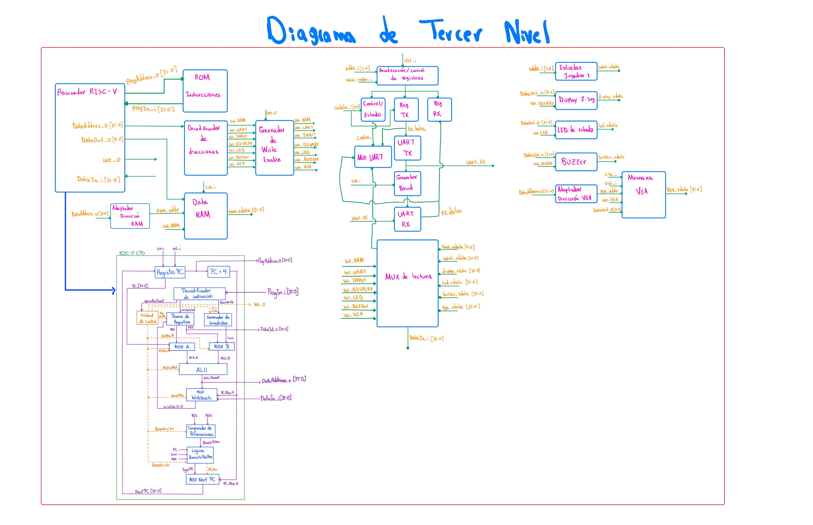


---

## 7. Diagramas de cuarto nivel

Cada módulo funcional identificado en el nivel anterior se documenta individualmente con:

1. Nombre del módulo.
2. Diagrama modular (entradas/salidas).
3. Objetivo.
4. Tabla de entradas y tabla de salidas.
5. Relación con los demás módulos.
6. Explicación de funcionamiento.
7. Diseño y justificación técnica.
8. Ecuaciones, tablas de verdad o máquinas de estado, cuando correspondan.
9. Comportamiento durante el reset.
10. Casos especiales y condiciones de borde.
11. Estrategia de validación.

**Formato de tabla de señales:**

| Señal | Ancho | Dirección | Descripción |
|---|---|---|---|
| `clk_i` | 1 bit | Entrada | Reloj principal del módulo. |
| `rst_i` | 1 bit | Entrada | Reinicio del módulo. |
| `data_i` | 32 bits | Entrada | Dato recibido desde el módulo anterior. |
| `data_o` | 32 bits | Salida | Resultado producido por el módulo. |

**Módulos a documentar** (uno por cada uno, siguiendo el formato anterior):

- **Procesador y memoria:** registro del PC, sumador PC+4, banco de registros, ALU, generador de inmediatos, unidad de control, comparador de bifurcaciones, multiplexores de operandos y de write-back, ROM, RAM, decodificador de direcciones, multiplexor de lectura.
- **VGA y periféricos locales:** PLL, contadores H/V, generadores HSYNC/VSYNC, detector de región visible, cálculo de dirección de tile, memoria de tiles, generador de color, sincronizador y debouncer de botones, detector de flanco, controlador de displays, registro del LED, generador del buzzer.
- **UART:** registro de control/estado, registro TX, registro RX, generador de baud, transmisor, receptor, lógica de detección/descarte de datos inválidos.

### 7.1 Registros de transmisión y recepción del UART

Los registros de transmisión y recepción constituyen la interfaz de
almacenamiento entre el procesador y los bloques encargados de realizar
la comunicación serial. El registro TX almacena temporalmente el dato
que debe ser enviado por el transmisor UART, mientras que el registro RX
mantiene el último dato recibido correctamente para que posteriormente
pueda ser leído por el procesador.

Ambos registros forman parte del periférico UART mapeado en memoria. El
registro TX se encuentra asociado a la dirección `0x0001_0044`, mientras
que el registro RX corresponde a la dirección `0x0001_0048`.

#### Registro de transmisión (TX)

El objetivo del registro TX es almacenar el dato escrito por el
procesador antes de iniciar su transmisión serial. El dato proviene del
bus `wdata_i[31:0]` y solamente debe almacenarse cuando se realiza una
operación de escritura dirigida al registro de transmisión.

La selección del registro se realiza mediante `addr_i[1:0]`. Dentro de
la interfaz del UART se utiliza `addr_i = 01` para identificar el
registro TX. Por lo tanto, la condición de carga puede expresarse como:

$$
load_{TX} = write\_enable_i \land (addr_i = 01)
$$

Cuando `load_TX` está activo, el registro captura el dato presente en
`wdata_i[31:0]`. El valor almacenado queda disponible para el bloque
transmisor UART, encargado posteriormente de realizar la conversión del
dato paralelo a la secuencia serial correspondiente.

##### Entradas del registro TX

| Señal | Ancho | Dirección | Descripción |
|---|---:|---|---|
| `clk_i` | 1 bit | Entrada | Reloj principal del sistema. |
| `rst_i` | 1 bit | Entrada | Reinicio del registro. |
| `write_enable_i` | 1 bit | Entrada | Indica una operación de escritura sobre el periférico UART. |
| `addr_i[1:0]` | 2 bits | Entrada | Selecciona el registro interno del UART. |
| `wdata_i[31:0]` | 32 bits | Entrada | Dato proveniente del procesador que será almacenado para su transmisión. |

##### Salidas del registro TX

| Señal | Ancho | Dirección | Descripción |
|---|---:|---|---|
| `tx_data` | Según implementación del UART | Salida | Dato almacenado que se entrega al transmisor UART. |

#### Registro de recepción (RX)

El registro RX realiza la función complementaria al registro TX. Su
objetivo es almacenar el dato reconstruido por el receptor UART después
de completar correctamente una recepción.

A diferencia del registro TX, el registro RX no es cargado directamente
por una escritura del procesador. El dato proviene del receptor UART
mediante `rx_data` y su almacenamiento se habilita mediante `rx_load`.
Esta señal indica que la recepción ha terminado y que el dato recibido
ha sido considerado válido.

De forma conceptual, la operación de carga del registro puede
representarse como:

$$
RX \leftarrow rx\_data
\qquad \text{si} \qquad
rx\_load = 1
$$

Una vez almacenado, el dato permanece disponible para que el procesador
pueda consultarlo mediante una operación de lectura. Dentro del
periférico UART se utiliza `addr_i = 10` para seleccionar el registro de
recepción.

##### Entradas del registro RX

| Señal | Ancho | Dirección | Descripción |
|---|---:|---|---|
| `clk_i` | 1 bit | Entrada | Reloj principal del sistema. |
| `rst_i` | 1 bit | Entrada | Reinicio del registro. |
| `rx_data` | Según implementación del UART | Entrada | Dato reconstruido por el receptor UART. |
| `rx_load` | 1 bit | Entrada | Habilita el almacenamiento de un nuevo dato recibido correctamente. |

##### Salidas del registro RX

| Señal | Ancho | Dirección | Descripción |
|---|---:|---|---|
| `rx_data_reg` | Según implementación del UART | Salida | Dato recibido y almacenado, disponible para su lectura. |


#### Relación con los demás módulos

Los registros TX y RX funcionan como elementos de enlace entre la
interfaz MMIO del procesador y los bloques internos de comunicación del
UART.

Durante una transmisión, el flujo de información es:

**Procesador → `wdata_i` → Registro TX → UART TX → `uart_tx`**

El procesador escribe el dato en el registro TX y posteriormente el
transmisor UART se encarga de convertirlo en una secuencia serial que
sale físicamente mediante `uart_tx`.

Durante una recepción, el flujo ocurre en sentido contrario:

**`uart_rx` → UART RX → Registro RX → interfaz de lectura → Procesador**

El receptor UART reconstruye el dato recibido serialmente. Cuando la
recepción finaliza correctamente, `rx_load` permite almacenar el dato en
el registro RX para que pueda ser leído posteriormente por el
procesador.

De esta manera, el procesador no necesita manipular directamente la
temporización de la comunicación serial, sino que interactúa con el
UART mediante operaciones convencionales de lectura y escritura sobre
registros mapeados en memoria.

#### Funcionamiento

El registro TX se actualiza únicamente cuando se realiza una operación
de escritura sobre su dirección interna. Su comportamiento puede
representarse como:

$$
TX_{next} =
\begin{cases}
wdata_i, & \text{si } load_{TX}=1 \\
TX, & \text{si } load_{TX}=0
\end{cases}
$$

Por su parte, el registro RX se actualiza únicamente cuando la lógica de
recepción indica que existe un nuevo dato válido:

$$
RX_{next} =
\begin{cases}
rx\_data, & \text{si } rx\_load=1 \\
RX, & \text{si } rx\_load=0
\end{cases}
$$

Esto permite que ambos registros mantengan su contenido mientras no se
presente una nueva operación válida de carga.

#### Diseño y justificación técnica

La utilización de registros independientes para transmisión y recepción
permite desacoplar el funcionamiento del procesador de la temporización
propia de la comunicación UART. El procesador trabaja con transferencias
paralelas mediante la interfaz MMIO, mientras que los bloques UART TX y
UART RX se encargan de realizar las conversiones entre representación
paralela y serial.

La separación entre TX y RX también permite que cada camino de
comunicación mantenga su propio dato sin que una operación de recepción
modifique la información almacenada para transmisión, o viceversa.

La selección mediante `addr_i[1:0]` permite además utilizar una única
interfaz MMIO para acceder a los diferentes registros internos del
periférico UART.

#### Comportamiento durante el reset

Cuando `rst_i` se encuentra activo, los registros TX y RX regresan a un
estado inicial conocido. Conceptualmente, su comportamiento durante el
reinicio puede expresarse como:

$$
rst_i = 1
\quad \Rightarrow \quad
TX = 0,\qquad RX = 0
$$

Esto evita que después de un reinicio el sistema interprete información
residual almacenada previamente como un dato válido de transmisión o
recepción.

#### Casos especiales y condiciones de borde

Una escritura dirigida a otro registro interno del UART no debe
modificar el contenido del registro TX. Por lo tanto, aunque
`write_enable_i` esté activo, el registro conserva su contenido si
`addr_i` no corresponde al registro de transmisión.

De igual forma, el registro RX solamente debe actualizarse cuando
`rx_load` indique la existencia de un nuevo dato válido. Si se detecta
una recepción inválida, el dato no debe cargarse en el registro RX y el
último valor válido almacenado debe conservarse.

Estas condiciones pueden resumirse mediante:

$$
load_{TX}=0
\quad \Rightarrow \quad
TX_{next}=TX
$$

$$
rx\_load=0
\quad \Rightarrow \quad
RX_{next}=RX
$$

La generación de `rx_load` y el tratamiento de una recepción inválida
se desarrollan posteriormente en la lógica de detección y recuperación
del receptor UART.

#### Estrategia de validación

La validación del registro TX se realizará mediante simulación,
aplicando diferentes valores sobre `wdata_i[31:0]` y verificando que el
registro solamente se actualice cuando `write_enable_i = 1` y
`addr_i = 01`. También se comprobará que las escrituras dirigidas a
otros registros internos del UART no modifiquen su contenido.

Para el registro RX se aplicarán diferentes valores de `rx_data` y se
verificará que solamente sean almacenados cuando `rx_load = 1`. Cuando
`rx_load = 0`, el registro deberá conservar el último dato almacenado.

### 7.2 Registro de control y estado del UART

El registro de control y estado permite al procesador supervisar y
coordinar el funcionamiento del periférico UART. Este registro concentra
la información necesaria para conocer el estado de los bloques de
transmisión y recepción y permite establecer las señales de control
requeridas por el periférico.

Dentro del mapa de memoria, el registro de control y estado del UART se
encuentra asociado a la dirección `0x0001_0040`. A nivel interno del
periférico se selecciona mediante `addr_i = 00`.

#### Objetivo

El objetivo de este módulo es proporcionar una interfaz entre el
procesador y las señales de control y estado generadas por los bloques
UART TX y UART RX. De esta forma, el procesador puede consultar el estado
del periférico antes de realizar operaciones de transmisión o recepción.

La condición de selección del registro puede representarse como:

$$
sel_{CTRL} = (addr_i = 00)
$$

En caso de requerirse una escritura sobre los campos de control del
registro, la habilitación correspondiente se obtiene mediante:

$$
write_{CTRL} =
write\_enable_i \land (addr_i = 00)
$$

#### Entradas

| Señal | Ancho | Dirección | Descripción |
|---|---:|---|---|
| `clk_i` | 1 bit | Entrada | Reloj principal del sistema. |
| `rst_i` | 1 bit | Entrada | Reinicio del módulo. |
| `write_enable_i` | 1 bit | Entrada | Indica una operación de escritura sobre el periférico UART. |
| `addr_i[1:0]` | 2 bits | Entrada | Selecciona el registro interno del UART. |
| `wdata_i[31:0]` | 32 bits | Entrada | Datos de control provenientes del procesador. |
| `estado_TX` | Según implementación | Entrada | Información de estado proveniente del transmisor UART. |
| `estado_RX` | Según implementación | Entrada | Información de estado proveniente del receptor UART. |

#### Salidas

| Señal | Ancho | Dirección | Descripción |
|---|---:|---|---|
| `control_i[31:0]` | 32 bits | Salida | Palabra que contiene la información de control y estado disponible para lectura por el procesador. |

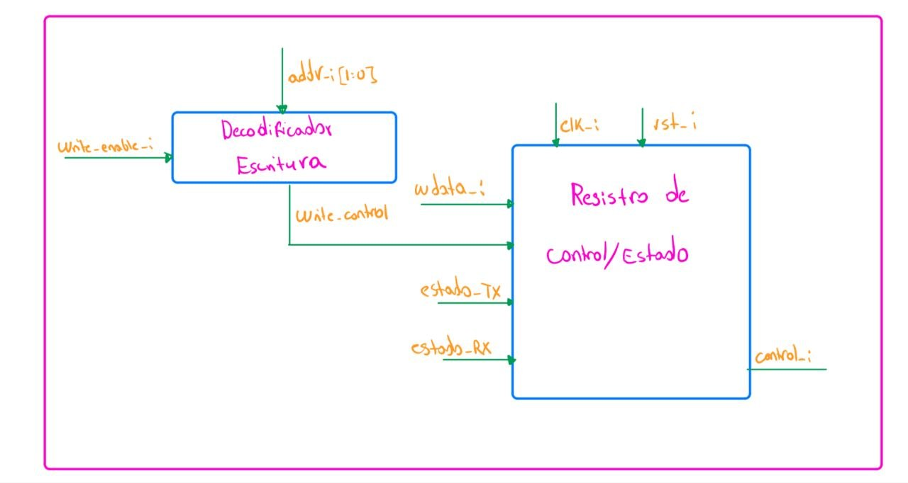

#### Relación con los demás módulos

El registro de control y estado se encuentra conectado con los bloques
de transmisión y recepción del UART. Estos bloques proporcionan las
señales que representan su condición de operación y permiten informar al
procesador sobre el estado actual de la comunicación.

El flujo de información de estado puede representarse como:

**UART TX / UART RX → Registro de control y estado → MUX de lectura UART → Procesador**

Para las operaciones de control realizadas por software, el flujo ocurre
en sentido contrario:

**Procesador → `wdata_i` → Registro de control y estado → lógica interna del UART**

De esta forma, el registro constituye el punto de comunicación entre el
software ejecutado por el procesador y el estado interno del periférico
UART.

#### Funcionamiento

Cuando el procesador realiza una lectura de la dirección correspondiente
al registro de control y estado, la información contenida en
`rdata_status[31:0]` se entrega al multiplexor interno de lectura del
UART. Posteriormente, esta información puede regresar al procesador por
medio de la interfaz MMIO.

La selección del dato de estado durante una lectura se produce cuando:

$$
addr_i = 00
$$

Si existen campos de control modificables por software, estos solamente
pueden actualizarse cuando se cumple:

$$
write\_enable_i = 1
\qquad \text{y} \qquad
addr_i = 00
$$

por lo que:

$$
write_{CTRL} =
write\_enable_i \land (addr_i = 00)
$$

Las señales de estado provenientes del transmisor y del receptor se
utilizan para formar la palabra de estado disponible para el procesador.

#### Diseño y justificación técnica

La utilización de un registro de control y estado permite concentrar en
una única posición del espacio de memoria la información necesaria para
coordinar el UART. Esto simplifica la interacción del software con el
hardware, ya que el procesador puede consultar el estado del periférico
mediante una operación convencional de lectura MMIO.

La separación entre este registro y los registros TX y RX permite que
los datos transmitidos o recibidos permanezcan independientes de las
señales utilizadas para controlar y supervisar la comunicación.

La interfaz de 32 bits mantiene además compatibilidad con la interfaz
estándar utilizada por los periféricos del sistema.

#### Comportamiento durante el reset

Cuando `rst_i` se encuentra activo, los campos de control almacenados
por el módulo deben regresar a su estado inicial. Las señales de estado
deben representar la condición inicial de los bloques TX y RX después
del reinicio.

De forma conceptual:

$$
rst_i = 1
\quad \Rightarrow \quad
Control = Control_{inicial}
$$

Una vez retirado el reset, el registro vuelve a responder a las
operaciones de lectura y escritura realizadas por el procesador.

#### Casos especiales y condiciones de borde

Una escritura realizada sobre los registros TX o RX no debe modificar
los campos de control almacenados en este módulo. Por lo tanto, el
registro únicamente acepta una operación de escritura cuando
`addr_i = 00`.

De forma equivalente:

$$
addr_i \neq 00
\quad \Rightarrow \quad
write_{CTRL}=0
$$

Las señales de estado deben reflejar únicamente las condiciones
proporcionadas por los bloques de transmisión y recepción. Un dato
recibido de forma inválida no debe presentarse al procesador como una
recepción válida.

#### Estrategia de validación

La validación del módulo se realizará mediante simulación. Primero se
comprobará que una lectura con `addr_i = 00` produzca en
`rdata_status[31:0]` la información correspondiente al estado del UART.

También se realizarán operaciones de escritura sobre diferentes valores
de `addr_i`, verificando que los campos de control solamente puedan
modificarse cuando `write_enable_i = 1` y `addr_i = 00`.

Finalmente, se comprobará el comportamiento durante `rst_i` y se
variarán las señales provenientes de los bloques TX y RX para verificar
que la palabra de estado refleje correctamente los cambios producidos
por estos módulos.

### 7.3 Generador de baud

El generador de baud proporciona la referencia temporal utilizada por
los bloques de transmisión y recepción del UART. Su función consiste en
obtener, a partir del reloj principal del sistema, una señal periódica
denominada `baud_tick`, que permite sincronizar las operaciones internas
asociadas con la comunicación serial.

El sistema utiliza un reloj principal de 100 MHz, mientras que la
comunicación UART debe operar a una velocidad de 115200 baudios. Debido
a esta diferencia de frecuencias, es necesario incorporar un bloque que
genere la temporización requerida por el periférico UART.

#### Objetivo

El objetivo del generador de baud es producir una señal de habilitación
temporal a partir de `clk_i`. Esta señal permite que las máquinas de
estado de transmisión y recepción avancen de acuerdo con la
temporización definida para la comunicación UART.

El bloque se implementa conceptualmente mediante un contador y una
lógica de comparación. El contador incrementa con el reloj principal y,
al alcanzar el valor establecido, se genera `baud_tick` y se reinicia
el conteo.

#### Entradas

| Señal | Ancho | Dirección | Descripción |
|---|---:|---|---|
| `clk_i` | 1 bit | Entrada | Reloj principal del sistema de 100 MHz. |
| `rst_i` | 1 bit | Entrada | Reinicio del generador de baud. |

#### Salidas

| Señal | Ancho | Dirección | Descripción |
|---|---:|---|---|
| `baud_tick` | 1 bit | Salida | Pulso periódico utilizado como referencia temporal por los bloques UART TX y UART RX. |

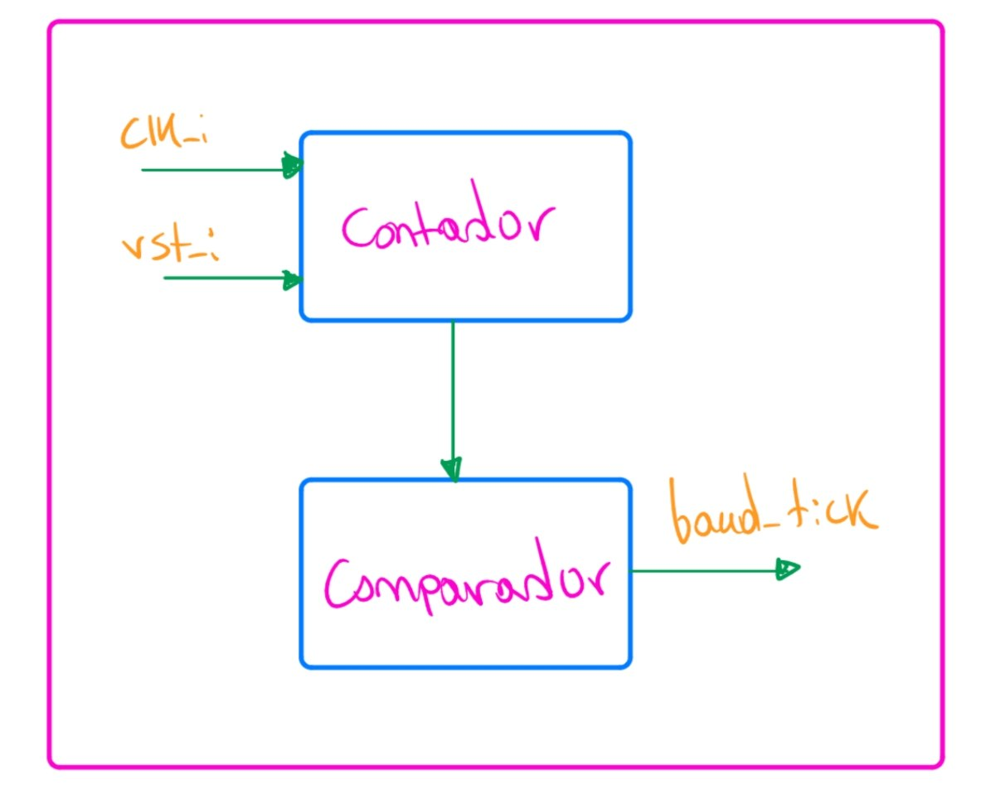

#### Relación con los demás módulos

El generador de baud recibe directamente el reloj principal del sistema
y proporciona `baud_tick` a los bloques de transmisión y recepción.

El flujo de la señal puede representarse como:

**`clk_i` → Generador de baud → `baud_tick` → UART TX / UART RX**

De esta manera, los bloques UART TX y UART RX permanecen sincronizados
con una referencia temporal derivada del mismo reloj del sistema.

#### Funcionamiento

Internamente, el generador está compuesto por un contador y una lógica
de comparación. El contador incrementa su valor con cada ciclo de
`clk_i`.

De forma conceptual, mientras no se alcance el valor terminal:

$$
contador_{next} = contador + 1
$$

Cuando el contador alcanza el valor definido para generar la referencia
temporal, se produce un pulso en `baud_tick` y el contador comienza
nuevamente el conteo.

El comportamiento puede representarse como:

$$
baud\_tick =
\begin{cases}
1, & \text{si } contador = N-1 \\
0, & \text{en otro caso}
\end{cases}
$$

y la actualización del contador como:

$$
contador_{next} =
\begin{cases}
0, & \text{si } contador = N-1 \\
contador + 1, & \text{en otro caso}
\end{cases}
$$

donde $N$ representa el número de ciclos del reloj principal utilizados
para generar la referencia temporal requerida por el UART.

La relación general entre la frecuencia del reloj, la frecuencia de la
referencia generada y el valor de división puede expresarse como:

$$
N = \frac{f_{clk}}{f_{tick}}
$$

Para el sistema diseñado:

$$
f_{clk}=100\text{ MHz}
$$

mientras que la comunicación UART opera a:

$$
baud=115200\text{ baudios}
$$

El valor definitivo de $f_{tick}$ y, por lo tanto, de $N$, depende de la
estrategia de temporización utilizada por la implementación del UART.

#### Diseño y justificación técnica

Se utiliza un contador síncrono porque permite derivar la referencia
temporal del UART directamente del reloj principal sin introducir un
reloj externo adicional. `baud_tick` se utiliza como una señal de
habilitación periódica, mientras que la lógica secuencial de los bloques
UART continúa sincronizada con `clk_i`.

Esta estructura mantiene todos los bloques principales dentro del mismo
dominio de reloj y permite centralizar la generación de la referencia
temporal utilizada por el transmisor y el receptor.

La separación del generador de baud como módulo independiente también
facilita su validación y permite modificar la velocidad de comunicación
sin alterar directamente la estructura de las máquinas de estado del
transmisor y del receptor.

#### Comportamiento durante el reset

Cuando `rst_i` se encuentra activo, el contador interno regresa a su
valor inicial y `baud_tick` permanece inactivo.

Conceptualmente:

$$
rst_i=1
\quad\Rightarrow\quad
contador=0
$$

$$
rst_i=1
\quad\Rightarrow\quad
baud\_tick=0
$$

Al retirar el reset, el contador comienza nuevamente a incrementar a
partir de cero hasta alcanzar el valor terminal correspondiente.

#### Casos especiales y condiciones de borde

El contador debe reiniciarse inmediatamente después de alcanzar su valor
terminal para evitar la generación de pulsos adicionales o intervalos
incorrectos entre pulsos consecutivos.

Además, `baud_tick` debe permanecer activo únicamente durante el
intervalo definido por el diseño, evitando que una misma condición de
conteo provoque múltiples avances en las máquinas de estado UART.

El valor utilizado como límite del contador deberá establecerse de
acuerdo con la temporización finalmente utilizada por los bloques UART
TX y UART RX.

#### Estrategia de validación

La validación del generador de baud se realizará inicialmente mediante
simulación. Se verificará que, después de retirar `rst_i`, el contador
avance correctamente y que `baud_tick` sea generado únicamente al
alcanzar el valor terminal establecido.

También se medirá el número de ciclos de `clk_i` existentes entre dos
pulsos consecutivos de `baud_tick`, comprobando que corresponda con el
valor de división definido.

Finalmente, durante la integración con los bloques UART TX y UART RX se
verificará que la referencia temporal generada permita realizar
correctamente la transmisión y recepción a la velocidad de comunicación
establecida de 115200 baudios.

### 7.4 Transmisor UART

El transmisor UART es el bloque encargado de convertir el dato almacenado
en el registro TX desde su representación paralela a una secuencia serial
que pueda enviarse hacia la computadora mediante la señal física
`uart_tx`.

Para realizar esta operación, el transmisor utiliza la referencia temporal
`baud_tick` proporcionada por el generador de baud. El funcionamiento del
bloque es coordinado mediante una máquina de estados y un contador de
posición, los cuales controlan el avance de la transmisión.

#### Objetivo

El objetivo del transmisor UART es realizar la conversión paralelo-serie
del dato almacenado en el registro TX y controlar la secuencia temporal
necesaria para enviarlo mediante `uart_tx`.

El módulo debe mantener el dato estable durante cada intervalo de
transmisión y avanzar solamente cuando la referencia temporal
`baud_tick` indique que corresponde continuar con la siguiente etapa.

#### Entradas

| Señal | Ancho | Dirección | Descripción |
|---|---:|---|---|
| `clk_i` | 1 bit | Entrada | Reloj principal del sistema. |
| `rst_i` | 1 bit | Entrada | Reinicio del transmisor. |
| `tx_data` | Según implementación del UART | Entrada | Dato paralelo proveniente del registro TX. |
| `tx_start` | 1 bit | Entrada | Solicitud para iniciar la transmisión de un nuevo dato. |
| `baud_tick` | 1 bit | Entrada | Referencia temporal proporcionada por el generador de baud. |

#### Salidas

| Señal | Ancho | Dirección | Descripción |
|---|---:|---|---|
| `uart_tx` | 1 bit | Salida | Señal serial de transmisión hacia la computadora. |
| `estado_TX` | Según implementación | Salida | Información del estado actual del transmisor utilizada por la lógica de control/estado. |

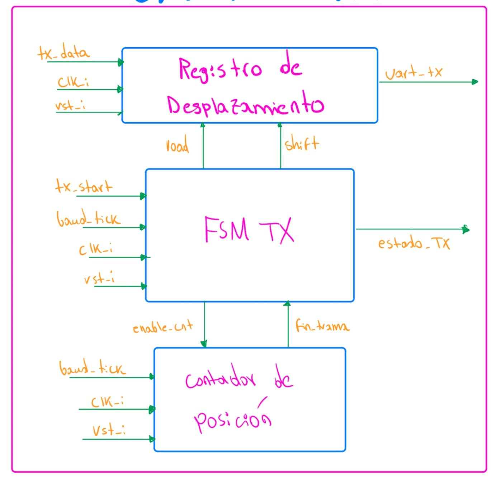

#### Relación con los demás módulos

El transmisor recibe `tx_data` desde el registro TX y utiliza
`baud_tick`, generado por el módulo de baud, como referencia para el
avance de la transmisión.

El flujo principal de información puede representarse como:

**Registro TX → `tx_data` → UART TX → `uart_tx`**

Por otra parte, la temporización sigue el recorrido:

**Generador de baud → `baud_tick` → UART TX**

El transmisor también proporciona información mediante `estado_TX`, la
cual puede ser utilizada por el registro de control y estado para
informar al procesador acerca de la condición actual del bloque.

#### Funcionamiento

El transmisor se divide internamente en una sección de datos y una
sección de control.

La sección de datos se encarga de mantener la información que será
transmitida y de colocar sobre `uart_tx` el valor correspondiente en
cada etapa de la transmisión.

La sección de control determina cuándo cargar un nuevo dato, cuándo
avanzar dentro de la transmisión y cuándo finalizar el envío. Para ello
utiliza una máquina de estados y un contador de posición.

De manera general, el proceso comienza cuando se recibe `tx_start`.
La máquina de estados abandona su condición de reposo e inicia la
secuencia de transmisión. Posteriormente, cada activación válida de
`baud_tick` permite avanzar en el proceso hasta completar el dato.

Una vez finalizada la transmisión, el bloque retorna al estado de reposo
y queda preparado para aceptar una nueva solicitud.

#### Diseño y justificación técnica

La separación entre la ruta de datos y la lógica de control permite
mantener una estructura modular. El registro o estructura de
desplazamiento se encarga de la información transmitida, mientras que la
máquina de estados determina el orden de las operaciones.

El contador de posición permite identificar el avance dentro de la
transmisión sin necesidad de representar cada posición mediante un
estado diferente de la máquina.

Esta organización reduce la complejidad de la FSM y permite que la
temporización permanezca controlada por `baud_tick`, mientras que toda
la lógica secuencial continúa sincronizada con `clk_i`.

#### Máquina de estados del transmisor

La lógica de control del transmisor se organiza mediante una máquina de
estados finitos. En el diseño propuesto se consideran los estados
`IDLE`, `START`, `DATA` y `STOP`.

- **IDLE:** el transmisor permanece en reposo mientras espera una
  solicitud `tx_start`.
- **START:** inicia la secuencia de transmisión.
- **DATA:** se realiza el envío secuencial de los datos. Un contador
  permite determinar cuándo se ha alcanzado la última posición.
- **STOP:** corresponde a la etapa final de la transmisión antes de
  regresar al estado de reposo.

Las transiciones principales se representan conceptualmente como:

**IDLE → START**

cuando:

$$
tx\_start = 1
$$

Si no existe una solicitud de transmisión:

$$
tx\_start = 0
$$

la máquina permanece en `IDLE`.

Desde `START` se avanza a `DATA` cuando se presenta la referencia
temporal correspondiente:

$$
baud\_tick = 1
$$

Mientras no se haya alcanzado la última posición de datos, la máquina
permanece en `DATA`:

$$
baud\_tick = 1 \land \neg fin\_trama
$$

Cuando se alcanza la última posición:

$$
baud\_tick = 1 \land fin\_trama
$$

la máquina avanza hacia `STOP`.

Finalmente, después de completar el intervalo correspondiente a `STOP`,
la máquina regresa al estado `IDLE`, quedando disponible para una nueva
transmisión.


#### Control interno del transmisor

La máquina de estados utiliza el contador de posición para determinar
el avance de la transmisión. De manera general, el contador recibe una
habilitación `enable_cnt` y avanza de acuerdo con `baud_tick`.

El contador produce la señal `fin_trama`, que informa a la máquina de
estados que se alcanzó la última posición correspondiente a los datos.

La relación entre ambos bloques puede representarse como:

**FSM TX → `enable_cnt` → Contador**

y:

**Contador → `fin_trama` → FSM TX**

Además, la FSM genera las señales internas necesarias para controlar la
carga y el desplazamiento de la información que será transmitida.

#### Comportamiento durante el reset

Cuando `rst_i` se encuentra activo, el transmisor debe regresar a su
condición inicial. La máquina de estados se coloca en `IDLE`, el
contador de posición vuelve a su valor inicial y la lógica de
transmisión queda preparada para comenzar una nueva operación.

Conceptualmente:

$$
rst_i = 1
\quad\Rightarrow\quad
estado_{TX}=IDLE
$$

y:

$$
rst_i = 1
\quad\Rightarrow\quad
contador_{TX}=0
$$

Esto evita que una transmisión incompleta continúe después de un
reinicio del sistema.

#### Casos especiales y condiciones de borde

Mientras el transmisor se encuentre realizando una operación, una nueva
solicitud de transmisión no debe alterar la secuencia actualmente en
curso. El siguiente dato solamente debe comenzar a transmitirse cuando
el bloque haya regresado a su condición disponible.

Asimismo, el contador debe indicar `fin_trama` únicamente cuando se haya
alcanzado la última posición correspondiente, evitando que la máquina de
estados abandone `DATA` de forma anticipada.

El transmisor también debe permanecer sincronizado con `baud_tick` para
evitar que la salida avance más de una posición durante un mismo
intervalo de transmisión.

#### Estrategia de validación

La validación del transmisor se realizará mediante simulación. Se
aplicará un dato conocido en `tx_data` y posteriormente se activará
`tx_start`.

Durante la simulación se comprobará que la máquina de estados siga la
secuencia esperada:

**IDLE → START → DATA → STOP → IDLE**

También se verificará que el contador avance de acuerdo con
`baud_tick`, que `fin_trama` sea generado en la posición correspondiente
y que la salida `uart_tx` cambie de acuerdo con la secuencia controlada
por el transmisor.

Finalmente, el transmisor se integrará con el generador de baud y el
receptor UART para realizar una prueba de lazo cerrado, verificando que
el dato transmitido pueda recuperarse correctamente.

### 7.5 Receptor UART

El receptor UART es el bloque encargado de recibir la información serial
proveniente de la computadora mediante la señal física `uart_rx` y
reconstruir el dato para que pueda ser utilizado por el resto del
sistema.

Para realizar esta operación, el receptor utiliza la referencia temporal
`baud_tick` generada por el módulo de baud. El proceso de recepción es
coordinado mediante una máquina de estados y un contador de posición,
los cuales permiten identificar el inicio, la recepción de los datos y
la finalización de la comunicación.

#### Objetivo

El objetivo del receptor UART es realizar la conversión serie-paralelo
de la información presente en `uart_rx`, controlar el avance temporal
de la recepción y proporcionar al resto del periférico la información
necesaria para determinar cuándo se ha completado correctamente un nuevo
dato.

Al finalizar una recepción, el bloque proporciona el dato reconstruido
mediante `rx_data`, una indicación de finalización mediante `rx_done` y
el resultado de la validación mediante `rx_valid`.

#### Entradas

| Señal | Ancho | Dirección | Descripción |
|---|---:|---|---|
| `clk_i` | 1 bit | Entrada | Reloj principal del sistema. |
| `rst_i` | 1 bit | Entrada | Reinicio del receptor. |
| `uart_rx` | 1 bit | Entrada | Señal serial proveniente de la computadora. |
| `baud_tick` | 1 bit | Entrada | Referencia temporal proporcionada por el generador de baud. |

#### Salidas

| Señal | Ancho | Dirección | Descripción |
|---|---:|---|---|
| `rx_data` | Según implementación del UART | Salida | Dato reconstruido a partir de la información recibida serialmente. |
| `rx_done` | 1 bit | Salida | Indica que se ha completado el proceso de recepción de un dato. |
| `rx_valid` | 1 bit | Salida | Indica que la recepción completada cumple las condiciones de validez definidas por el receptor. |
| `estado_RX` | Según implementación | Salida | Información del estado actual del receptor utilizada por la lógica de control/estado. |


#### Relación con los demás módulos

El receptor UART se conecta directamente con la entrada física
`uart_rx`. La información recibida es procesada internamente hasta
obtener el dato paralelo `rx_data`.

El flujo principal de recepción puede representarse como:

**`uart_rx` → UART RX → `rx_data` → Registro RX**

El generador de baud proporciona la referencia temporal utilizada
durante este proceso:

**Generador de baud → `baud_tick` → UART RX**

Además, las señales `rx_done` y `rx_valid` son utilizadas por la lógica
de detección y recuperación para determinar si el dato reconstruido
puede almacenarse en el registro RX.

El flujo de control correspondiente es:

**UART RX → `rx_done`, `rx_valid` → Lógica de detección/recuperación → `rx_load`**

Finalmente, `estado_RX` permite comunicar información sobre la condición
del receptor al registro de control y estado del UART.

#### Funcionamiento

El receptor permanece inicialmente esperando la llegada de una nueva
transmisión sobre `uart_rx`. Cuando se detecta el comienzo de una
recepción, la máquina de estados abandona su condición de reposo e inicia
el proceso de adquisición.

Durante la recepción, el bloque de muestreo y registro de desplazamiento
captura progresivamente la información presente en `uart_rx`. El avance
se realiza utilizando `baud_tick` como referencia temporal.

Paralelamente, un contador de posición mantiene el seguimiento del
avance dentro de la recepción. Cuando se alcanza la última posición de
datos, el contador genera `fin_datos`, permitiendo a la máquina de
estados continuar hacia la etapa final.

Una vez completado el proceso, el receptor proporciona el dato mediante
`rx_data` y genera `rx_done`. La recepción también es evaluada para
producir `rx_valid`, señal que posteriormente determina si el dato puede
ser almacenado o debe ser descartado.

#### Diseño y justificación técnica

El receptor se divide conceptualmente en una ruta de datos y una lógica
de control. La ruta de datos realiza el muestreo y almacenamiento
temporal de la información serial, mientras que la lógica de control
coordina las diferentes etapas de la recepción.

El uso de un contador de posición evita representar individualmente cada
posición de datos como un estado diferente de la máquina. De esta forma,
la FSM puede mantenerse compacta y concentrarse en las etapas generales
de la recepción.

La validación se mantiene separada de la carga del registro RX. Esta
separación permite que finalizar una recepción no implique
automáticamente almacenar el dato, ya que primero debe comprobarse que
la recepción sea válida.

#### Máquina de estados del receptor

Para controlar el proceso de recepción se utiliza una máquina de estados
finitos. En el diseño propuesto se consideran los estados `IDLE`,
`START`, `DATA` y `STOP`.

- **IDLE:** el receptor permanece esperando el inicio de una nueva
  transmisión.
- **START:** corresponde a la detección y procesamiento del comienzo de
  la recepción.
- **DATA:** se reciben progresivamente los datos y el contador controla
  la posición actual.
- **STOP:** corresponde a la etapa final de la recepción, después de la
  cual se determina la finalización del dato y se regresa al estado de
  reposo.

Mientras la línea de recepción permanezca en su condición de reposo, la
máquina se mantiene en `IDLE`:

$$
uart\_rx = 1
\quad\Rightarrow\quad
estado_{next}=IDLE
$$

Cuando se detecta la condición de inicio:

$$
uart\_rx = 0
\quad\Rightarrow\quad
IDLE \rightarrow START
$$

Una vez alcanzada la referencia temporal correspondiente en `START`, la
máquina continúa hacia la recepción de los datos:

$$
baud\_tick = 1
\quad\Rightarrow\quad
START \rightarrow DATA
$$

Mientras no se haya alcanzado la última posición de datos, el receptor
permanece en `DATA`:

$$
baud\_tick = 1 \land \neg fin\_datos
\quad\Rightarrow\quad
DATA \rightarrow DATA
$$

Cuando se alcanza la última posición:

$$
baud\_tick = 1 \land fin\_datos
\quad\Rightarrow\quad
DATA \rightarrow STOP
$$

Finalmente, una vez completada la etapa `STOP`, la máquina retorna a
`IDLE` y queda disponible para una nueva recepción.


#### Control interno del receptor

La máquina de estados y el contador de posición trabajan en conjunto
para controlar la recepción. La FSM habilita el conteo mediante
`enable_cnt`, mientras que el contador informa cuándo se ha alcanzado la
última posición mediante `fin_datos`.

La relación entre ambos bloques puede representarse como:

**FSM RX → `enable_cnt` → Contador**

y:

**Contador → `fin_datos` → FSM RX**

La máquina de estados también genera las señales internas necesarias
para controlar el muestreo y desplazamiento de los datos recibidos.

Al finalizar el proceso, se genera `rx_done`. La información recibida es
evaluada para obtener `rx_valid`. Estas dos señales se utilizan
posteriormente para decidir si `rx_data` debe cargarse en el registro RX
o descartarse.

#### Comportamiento durante el reset

Cuando `rst_i` se encuentra activo, el receptor regresa a su condición
inicial. La máquina de estados vuelve a `IDLE` y el contador de posición
se reinicia.

Conceptualmente:

$$
rst_i = 1
\quad\Rightarrow\quad
estado_{RX}=IDLE
$$

$$
rst_i = 1
\quad\Rightarrow\quad
contador_{RX}=0
$$

Además, las indicaciones asociadas con una recepción completada deben
permanecer inactivas:

$$
rst_i = 1
\quad\Rightarrow\quad
rx\_done=0
$$

Esto evita que después de un reinicio se interprete una recepción
incompleta como un nuevo dato disponible.

#### Casos especiales y condiciones de borde

Si no se detecta el comienzo de una nueva recepción, la máquina debe
permanecer en `IDLE` sin modificar el dato previamente almacenado en el
registro RX.

Una recepción incompleta o considerada inválida no debe provocar la
carga del registro RX. La finalización del proceso y la validez del dato
se tratan como condiciones diferentes: `rx_done` indica que el proceso
terminó, mientras que `rx_valid` indica si el resultado puede ser
aceptado.

Por lo tanto, la presencia de:

$$
rx\_done=1
$$

no implica por sí sola que el dato deba almacenarse. La decisión final
se realiza mediante la lógica de detección y recuperación descrita en la
sección siguiente.

#### Estrategia de validación

La validación del receptor se realizará inicialmente mediante simulación.
Se aplicará sobre `uart_rx` una secuencia serial conocida y se verificará
el recorrido de la máquina de estados:

**IDLE → START → DATA → STOP → IDLE**

También se comprobará que el contador avance de acuerdo con `baud_tick`
y que `fin_datos` se active únicamente después de alcanzar la posición
correspondiente.

Al finalizar la recepción se verificará que `rx_data` contenga la
información reconstruida y que `rx_done` indique correctamente la
finalización del proceso.

También se probarán condiciones de recepción inválida para verificar que
la lógica de validación pueda diferenciarlas de una recepción aceptada.

Finalmente, durante la integración se realizará una prueba de lazo
cerrado conectando el transmisor con el receptor y comprobando que un
dato enviado por UART TX pueda ser reconstruido correctamente por
UART RX.


### 7.6 Detección de dato recibido y descarte/recuperación

La lógica de detección de dato recibido y descarte/recuperación se
encarga de determinar qué debe ocurrir una vez que el receptor UART
finaliza una operación de recepción.

El bloque utiliza las señales `rx_done` y `rx_valid` generadas durante
el proceso de recepción. A partir de estas señales se determina si el
dato recibido puede almacenarse en el registro RX o si debe descartarse.

Esta separación evita que una recepción finalizada pero inválida
modifique el contenido disponible para el procesador.

#### Objetivo

El objetivo del módulo es generar una señal de carga para el registro RX
únicamente cuando se haya completado una recepción válida.

Cuando la recepción finaliza correctamente, se genera `rx_load`, que
permite almacenar `rx_data` en el registro RX.

La condición utilizada es:

`rx_load = rx_done ∧ rx_valid`

Por otra parte, si la recepción termina pero el dato no es considerado
válido, se genera la condición de descarte:

`discard = rx_done ∧ ¬rx_valid`

De esta manera se distinguen claramente los casos de recepción válida e
inválida.

#### Entradas

| Señal | Ancho | Dirección | Descripción |
|---|---:|---|---|
| `rx_done` | 1 bit | Entrada | Indica que el receptor UART ha completado una operación de recepción. |
| `rx_valid` | 1 bit | Entrada | Indica que el resultado de la recepción cumple las condiciones de validez establecidas por el receptor. |

#### Salidas

| Señal | Ancho | Dirección | Descripción |
|---|---:|---|---|
| `rx_load` | 1 bit | Salida | Habilita la carga de `rx_data` en el registro RX. |
| `discard` | 1 bit | Salida | Indica que la recepción finalizada no debe almacenarse. |

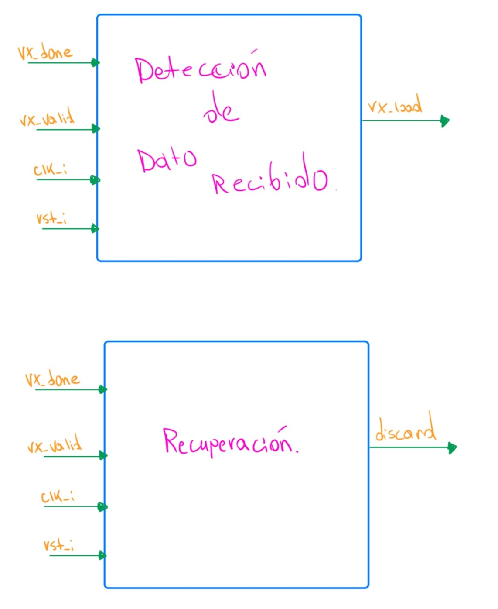

#### Relación con los demás módulos

Este bloque se encuentra entre el receptor UART y el registro RX.

El receptor proporciona las señales `rx_done` y `rx_valid`, mientras
que el dato recibido se encuentra disponible directamente mediante
`rx_data`.

El flujo de datos es:

**UART RX → `rx_data` → Registro RX**

Mientras que el flujo de control es:

**UART RX → `rx_done`, `rx_valid` → Detección/recuperación → `rx_load` → Registro RX**

Por lo tanto, `rx_data` no necesita atravesar la lógica de detección.
Esta lógica únicamente determina si el registro RX debe aceptar o no el
dato proporcionado por el receptor.

#### Funcionamiento

El funcionamiento del bloque depende de la combinación de `rx_done` y
`rx_valid`.

Cuando:

`rx_done = 0`

no existe una nueva recepción completada. Por lo tanto:

`rx_load = 0`

`discard = 0`

Si la recepción ha finalizado y el dato es válido:

`rx_done = 1`

`rx_valid = 1`

entonces:

`rx_load = 1`

`discard = 0`

En este caso, el registro RX puede almacenar el valor presente en
`rx_data`.

Por el contrario, si la recepción finaliza pero el resultado no es
válido:

`rx_done = 1`

`rx_valid = 0`

se obtiene:

`rx_load = 0`

`discard = 1`

En este caso el dato no debe cargarse en el registro RX.

La lógica puede resumirse mediante la siguiente tabla:

| `rx_done` | `rx_valid` | `rx_load` | `discard` | Acción |
|:---:|:---:|:---:|:---:|---|
| 0 | 0 | 0 | 0 | No existe una recepción terminada. |
| 0 | 1 | 0 | 0 | No se realiza ninguna carga mientras la recepción no haya finalizado. |
| 1 | 0 | 0 | 1 | El dato recibido se descarta. |
| 1 | 1 | 1 | 0 | El dato recibido se almacena en el registro RX. |

#### Detección de dato recibido

La detección de un nuevo dato disponible se realiza mediante la
combinación de la indicación de finalización y la indicación de validez.

La expresión utilizada es:

`rx_load = rx_done ∧ rx_valid`

Por lo tanto, el registro RX solamente recibe una habilitación de carga
cuando ambas condiciones se cumplen simultáneamente.

Cuando `rx_load = 1`, el registro RX realiza conceptualmente la
operación:

`RX_next = rx_data`

Si `rx_load = 0`, el contenido previamente almacenado se conserva:

`RX_next = RX`

Esto evita que una recepción incompleta o inválida sobrescriba un dato
recibido correctamente con anterioridad.

#### Descarte y recuperación

La condición de descarte se produce cuando el receptor indica que una
recepción ha terminado, pero la validación determina que el resultado
no debe aceptarse.

La expresión correspondiente es:

`discard = rx_done ∧ ¬rx_valid`

Cuando `discard = 1`, no se genera `rx_load` y, por lo tanto, el registro
RX conserva su contenido anterior.

Después de esta condición, el receptor puede regresar a su estado de
reposo y quedar preparado para detectar el inicio de una nueva
recepción.

De esta forma, la recuperación no requiere almacenar el dato inválido ni
modificar el último dato válido disponible para el procesador.

#### Diseño y justificación técnica

Se mantiene separada la finalización de una recepción de la aceptación
del dato. Esto permite distinguir entre el hecho de haber completado una
operación UART y el hecho de haber recibido información considerada
válida.

La lógica propuesta es sencilla y puede implementarse de forma
combinacional a partir de `rx_done` y `rx_valid`. Por esta razón, este
bloque no requiere almacenar un estado adicional para decidir si debe
generarse `rx_load`.

Además, mantener `rx_data` separado de la lógica de validación simplifica
la ruta de datos: el receptor entrega directamente el dato al registro
RX y la señal `rx_load` determina si dicho dato debe almacenarse.

#### Comportamiento durante el reset

Debido a que `rx_load` y `discard` se obtienen directamente a partir de
`rx_done` y `rx_valid`, su condición después del reset depende del estado
inicial de estas señales en el receptor UART.

El receptor debe regresar a su condición de reposo durante el reset y no
indicar una recepción finalizada. Por lo tanto, después del reinicio no
debe generarse una carga accidental del registro RX.

Conceptualmente:

`rx_done = 0  →  rx_load = 0`

y:

`rx_done = 0  →  discard = 0`

#### Casos especiales y condiciones de borde

La presencia de `rx_valid = 1` por sí sola no debe provocar la carga del
registro RX. Para aceptar el dato también debe haberse completado la
recepción.

De igual forma, `rx_done = 1` por sí sola tampoco garantiza que el dato
sea almacenado, ya que todavía debe cumplirse la condición
`rx_valid = 1`.

Esto garantiza que solamente la combinación:

`rx_done = 1 ∧ rx_valid = 1`

produzca `rx_load = 1`.

Cuando una recepción sea inválida, el contenido anterior del registro RX
debe mantenerse sin cambios.

#### Estrategia de validación

La validación del módulo se realizará comprobando las cuatro
combinaciones posibles de las entradas `rx_done` y `rx_valid`.

Se verificará especialmente que para:

`rx_done = 1, rx_valid = 1`

se obtenga:

`rx_load = 1, discard = 0`

y que para:

`rx_done = 1, rx_valid = 0`

se obtenga:

`rx_load = 0, discard = 1`

Posteriormente, el bloque se integrará con UART RX y el registro RX. Se
realizará una recepción válida y se comprobará que el dato sea
almacenado. Después se provocará una condición considerada inválida y se
verificará que el contenido anterior del registro RX permanezca sin
modificaciones.

Finalmente, se comprobará que después de una recepción descartada el
receptor pueda regresar a su condición de reposo y procesar
correctamente una nueva recepción.
---
### 7.7 PLL

**Diagrama modular:**


**Objetivo:** generar, a partir del reloj de entrada de 100 MHz, un reloj estable de 25 MHz
para el dominio de video, indicando mediante `locked_o` cuándo la salida es válida.

**Tabla de señales:**

| Señal | Ancho | Dirección | Descripción |
|---|---|---|---|
| `clk_i` | 1 bit | Entrada | Reloj de referencia, 100 MHz. |
| `rst_i` | 1 bit | Entrada | Reset del bloque. |
| `clk_pix_o` | 1 bit | Salida | Reloj derivado, 25 MHz. |
| `locked_o` | 1 bit | Salida | Indica que la salida ya es estable. |

**Relación con los demás módulos:** alimenta al Generador de temporización VGA y, junto con
el puerto A, a la Memoria de video.

**Explicación de funcionamiento:** primitiva de FPGA (IP de PLL) que usa un lazo de enganche
de fase para producir una salida sincronizada en frecuencia respecto a `clk_i`.

**Diseño y justificación técnica:** se eligió una relación de división entera 4:1
(100 MHz → 25 MHz) por ser la más simple posible, evitando fracciones que aumenten el
*jitter*. Se descartó un divisor por lógica (`÷4` con contador) porque no viaja por la red de
distribución de reloj dedicada de la FPGA, complicando el cierre de *timing*.

**Ecuaciones:** `f_pix = f_clk / 4 = 25 MHz`.

**Comportamiento durante el reset:** con `rst_i` activo, `locked_o = 0` y `clk_pix_o` no se
considera válido.

**Casos especiales y condiciones de borde:** tiempo de estabilización tras el reset (el
sistema debe esperar `locked_o = 1` antes de iniciar el barrido de video); posible pérdida de
enganche en operación.

**Estrategia de validación:** medir en hardware la frecuencia real de `clk_pix_o` con
osciloscopio/analizador lógico y verificar la activación de `locked_o` tras el reset.

---

### 7.8 Generador de temporización VGA

**Diagrama modular:**


**Objetivo:** generar toda la temporización 640×480@60Hz a partir del reloj de píxel: posición
del haz, sincronismos y detección de región visible.

**Tabla de señales:**

| Señal | Ancho | Dirección | Descripción |
|---|---|---|---|
| `clk_pix_i` | 1 bit | Entrada | Reloj de píxel, 25 MHz. |
| `rst_i` | 1 bit | Entrada | Reset del bloque. |
| `hcount_o` | 10 bits | Salida | Posición horizontal del haz (0–799). |
| `vcount_o` | 10 bits | Salida | Línea actual del cuadro (0–524). |
| `hsync_o` | 1 bit | Salida | Sincronismo horizontal (polaridad negativa). |
| `vsync_o` | 1 bit | Salida | Sincronismo vertical (polaridad negativa). |
| `video_on_o` | 1 bit | Salida | 1 si el haz está en el área visible 640×480. |

**Relación con los demás módulos:** recibe `clk_pix_o` del PLL; entrega `hcount_o`/`vcount_o`
a la Memoria de video y `video_on_o` al Generador de color y RGB.

**Explicación de funcionamiento:** internamente contiene un contador horizontal (0–799) que
genera un pulso interno al completar cada línea; ese pulso habilita al contador vertical
(0–524). Tres comparadores de rango derivan `hsync_o`, `vsync_o` y `video_on_o` a partir de
ambos contadores.

**Diseño y justificación técnica:** se fusionaron en un solo módulo los que originalmente
serían 5 bloques (contador H, contador V, HSYNC, VSYNC, detector de región visible) porque
ninguna señal intermedia tiene un consumidor fuera de este grupo.

**Ecuaciones / tablas:**
```
if (hcount==799): hcount<=0; h_max<=1   else: hcount<=hcount+1
if (h_max): if (vcount==524): vcount<=0  else: vcount<=vcount+1
hsync_o = NOT(hcount>=656 AND hcount<752)
vsync_o = NOT(vcount>=490 AND vcount<492)
video_on_o = (hcount<640) AND (vcount<480)
```

| Región horizontal | Rango `hcount` | Región vertical | Rango `vcount` |
|---|---|---|---|
| Visible | 0–639 | Visible | 0–479 |
| Front porch | 640–655 | Front porch | 480–489 |
| Sync pulse | 656–751 | Sync pulse | 490–491 |
| Back porch | 752–799 | Back porch | 492–524 |

**Comportamiento durante el reset:** `hcount_o=0`, `vcount_o=0`, `video_on_o=1`,
`hsync_o=vsync_o=1`.

**Casos especiales y condiciones de borde:** el pulso interno de fin de línea debe durar
exactamente un ciclo; verificar límites exactos de cada comparador; confirmar en hardware la
polaridad de sincronismo esperada por el monitor.

**Estrategia de validación:** simular un cuadro completo y verificar recorrido de
`hcount_o`/`vcount_o`, ancho de los pulsos de sync, y coincidencia de `video_on_o` con el
rectángulo 640×480.

---

### 7.9 Memoria de video

**Diagrama modular:**


**Objetivo:** almacenar el contenido de las 300 casillas de la cuadrícula de video y resolver
internamente la dirección de lectura a partir de la posición del haz.

**Tabla de señales:**

| Señal | Ancho | Dirección | Descripción |
|---|---|---|---|
| `clk_i` | 1 bit | Entrada (puerto A) | Reloj del sistema, 100 MHz. |
| `vga_we_i` | 1 bit | Entrada (puerto A) | Habilitación de escritura del CPU. |
| `vga_addr_i` | 9 bits | Entrada (puerto A) | Dirección de tile a escribir. |
| `vga_wdata_i` | 32 bits | Entrada (puerto A) | Palabra a escribir. |
| `clk_pix_i` | 1 bit | Entrada (puerto B) | Reloj de píxel, 25 MHz. |
| `hcount_i` | 10 bits | Entrada (puerto B) | Posición horizontal actual. |
| `vcount_i` | 10 bits | Entrada (puerto B) | Línea actual del cuadro. |
| `tile_data_o` | 32 bits | Salida (puerto B) | Palabra leída de la casilla correspondiente. |

**Relación con los demás módulos:** el puerto A recibe señales del CPU vía MMIO; el puerto B
recibe `hcount_o`/`vcount_o` del Generador de temporización y entrega `tile_data_o` al
Generador de color y RGB.

**Explicación de funcionamiento:** cada ciclo de `clk_pix_i` se calcula la dirección de tile
correspondiente a la posición actual del haz y se usa para leer la memoria de doble puerto;
en paralelo, el puerto A escribe de forma independiente cuando el CPU lo solicita.

**Diseño y justificación técnica:** se fusionó el cálculo de dirección dentro de la memoria
porque ese dato es de uso exclusivamente interno. Se usa la primitiva de BRAM de doble
puerto y doble reloj de la FPGA (no un FIFO, dado que el acceso es aleatorio, no secuencial),
que resuelve internamente el cruce de dominio de reloj. La división entre 32 (tamaño de
tile) se resuelve tomando los bits superiores de `hcount`/`vcount` por ser 32 potencia de 2.

**Ecuaciones:**
```
tile_col = hcount_i[9:5]
tile_row = vcount_i[9:5]
tile_addr = tile_row*20 + tile_col
on posedge clk_i:     if (vga_we_i): mem[vga_addr_i] <= vga_wdata_i
on posedge clk_pix_i: tile_data_o <= mem[tile_addr]
```

**Comportamiento durante el reset:** no se limpia por hardware (según el enunciado); la
inicialización del contenido es responsabilidad del software.

**Casos especiales y condiciones de borde:** direcciones fuera de rango durante *blanking*
(se ignoran porque `video_on_o=0` fuerza negro aguas abajo); colisión de puerto en la misma
dirección (no crítico, imperceptible a 60 Hz); latencia de lectura de un ciclo.

**Estrategia de validación:** escribir un patrón conocido por el puerto A y verificar
coincidencia al leer por el puerto B en toda la cuadrícula, incluyendo las esquinas.

---

### 7.10 Generador de color y RGB

**Diagrama modular:**


**Objetivo:** convertir la palabra leída de la memoria de video en los niveles físicos R/G/B,
forzando negro durante el *blanking*.

**Tabla de señales:**

| Señal | Ancho | Dirección | Descripción |
|---|---|---|---|
| `tile_data_i` | 32 bits | Entrada | Palabra leída de la memoria de video. |
| `video_on_i` | 1 bit | Entrada | 1 si el haz está en el área visible. |
| `r_o` | 4 bits | Salida | Componente roja. |
| `g_o` | 4 bits | Salida | Componente verde. |
| `b_o` | 4 bits | Salida | Componente azul. |

**Relación con los demás módulos:** recibe `tile_data_o` de la Memoria de video y
`video_on_o` del Generador de temporización; su salida va a la salida física del sistema.

**Explicación de funcionamiento:** extrae `tile_data_i[2:0]` como código de color y lo
traduce mediante una tabla fija a una combinación de (r,g,b); si `video_on_i=0`, fuerza
(0,0,0).

**Diseño y justificación técnica:** se fusionó la extracción de bits con la tabla de RGB
porque no es una decisión de diseño independiente. Se usa una tabla de consulta (no una
fórmula) por ser una paleta pequeña y fija.

**Tabla de verdad (paleta a confirmar por el equipo):**

| `tile_data_i[2:0]` | Significado | `r_o` | `g_o` | `b_o` |
|---|---|---|---|---|
| `000` | Agua | 0 | 4 | 15 |
| `001` | Barco propio | 8 | 8 | 8 |
| `010` | Impacto | 15 | 0 | 0 |
| `011` | Fallo | 15 | 15 | 15 |
| `1xx` | Reservado HUD | — | — | — |

**Comportamiento durante el reset:** sin estado propio (combinacional); depende del contenido
inicial (indefinido) de la memoria hasta que el software la inicialice.

**Casos especiales y condiciones de borde:** `video_on_i=0` tiene prioridad absoluta sobre
cualquier color.

**Estrategia de validación:** simular los 8 valores posibles de `tile_data_i[2:0]` y verificar
el color esperado; confirmar que fuera de `video_on_i` la salida siempre es negro.

---

### 7.11 Condicionador de entradas de botones

**Diagrama modular:**


**Objetivo:** convertir las 7 entradas físicas de botones en un registro confiable, libre de
metaestabilidad y rebotes, legible por el CPU.

**Tabla de señales:**

| Señal | Ancho | Dirección | Descripción |
|---|---|---|---|
| `clk_i` | 1 bit | Entrada | Reloj del sistema, 100 MHz. |
| `rst_i` | 1 bit | Entrada | Reset del módulo. |
| `btn_raw_i` | 7 bits | Entrada | Arriba, abajo, izq, der, SEL, OK, RST sin filtrar. |
| `addr_i` | 2 bits | Entrada | Selección de registro interno. |
| `rdata_o` | 32 bits | Salida | Registro de estado (`0x0001_0120`). |

**Relación con los demás módulos:** módulo hoja; expone su registro al bus de periféricos.

**Explicación de funcionamiento:** cada línea pasa por sincronizador (2 flip-flops), filtro
antirrebote (contador + comparador) y detector de flanco, generando pulsos de un ciclo que se
cargan en el registro de estado.

**Diseño y justificación técnica:** se fusionaron las 4 etapas porque ninguna señal
intermedia tiene consumidor fuera de esta cadena. Se exponen pulsos de flanco (no nivel) para
que la unidad de control reaccione una sola vez por pulsación.

**Codificación del registro `btn_status` (`0x0001_0120`):**

| Bit | Señal |
|---|---|
| `[0]` | `nav_up_pulse` |
| `[1]` | `nav_down_pulse` |
| `[2]` | `nav_left_pulse` |
| `[3]` | `nav_right_pulse` |
| `[4]` | `sel_pulse` |
| `[5]` | `ok_pulse` |
| `[6]` | `rst_pulse` |

**Comportamiento durante el reset:** todos los registros internos se fuerzan a 0;
`rdata_o = 0` inmediatamente tras el reset.

**Casos especiales y condiciones de borde:** no confundir `rst_i` (reset de hardware) con
`rst_pulse` (bit que indica que BTN_RST fue presionado, manejado por software); el pulso debe
durar exactamente un ciclo.

**Estrategia de validación:** simular rebotes y verificar que el filtro los descarta; simular
pulsación sostenida y verificar un único pulso de flanco.

---

### 7.12 Controlador de displays de 7 segmentos

**Diagrama modular:**


**Objetivo:** mostrar en 4 dígitos de 7 segmentos el contador acumulado de partidas ganadas de
ambos jugadores (00–99 cada uno) mediante multiplexado.

**Tabla de señales:**

| Señal | Ancho | Dirección | Descripción |
|---|---|---|---|
| `clk_i` | 1 bit | Entrada | Reloj del sistema, 100 MHz. |
| `rst_i` | 1 bit | Entrada | Reset del módulo. |
| `wdata_i` | 32 bits | Entrada | 4 dígitos BCD (`0x0001_0130`). |
| `we_i` | 1 bit | Entrada | Habilitación de escritura. |
| `seg_o` | 7 bits | Salida | Patrón de segmentos activos. |
| `anode_o` | 4 bits | Salida | Ánodo del dígito activo. |

**Relación con los demás módulos:** módulo hoja; recibe datos del CPU vía bus de periféricos.

**Explicación de funcionamiento:** un contador de refresco recorre los 4 dígitos, seleccionando
en cada instante qué valor va a las líneas de segmento y qué ánodo se enciende, aprovechando
persistencia de visión.

**Diseño y justificación técnica:** se almacena el valor ya codificado en BCD para evitar un
divisor/módulo por 10 en hardware. Se usa tabla de consulta para el decodificador de 7
segmentos por no seguir un patrón aritmético simple.

**Tabla de verdad del decodificador (`seg_o[gfedcba]`):**

| Dígito | `seg_o` |
|---|---|
| 0 | `0111111` |
| 1 | `0000110` |
| 2 | `1011011` |
| 3 | `1001111` |
| 4 | `1100110` |
| 5 | `1101101` |
| 6 | `1111101` |
| 7 | `0000111` |
| 8 | `1111111` |
| 9 | `1101111` |

**Comportamiento durante el reset:** `wdata` almacenado se fuerza a 0 (displays en "00 00");
el recorrido de refresco reinicia desde el dígito 0.

**Casos especiales y condiciones de borde:** frecuencia de refresco suficiente para evitar
parpadeo (>100 Hz recomendado); ánodo y valor de segmento deben cambiar en el mismo ciclo.

**Estrategia de validación:** simular un valor conocido y verificar en forma de onda el orden
de activación de ánodos con su segmento correspondiente; validar en hardware ausencia de
parpadeo.

---

### 7.13 Registro del LED de estado

**Diagrama modular:**


**Objetivo:** exponer hacia el LED físico el estado actual del sistema (colocación, batalla,
resultado).

**Tabla de señales:**

| Señal | Ancho | Dirección | Descripción |
|---|---|---|---|
| `clk_i` | 1 bit | Entrada | Reloj del sistema. |
| `rst_i` | 1 bit | Entrada | Reset del módulo. |
| `wdata_i` | 32 bits | Entrada | Solo se usan los bits `[2:0]` (`0x0001_0138`). |
| `we_i` | 1 bit | Entrada | Habilitación de escritura. |
| `led_o` | 3 bits | Salida | Señal física hacia el/los LED(s). |

**Relación con los demás módulos:** módulo hoja; actualizado por el programa en ensamblador
en cada cambio de fase.

**Explicación de funcionamiento:** registro simple que captura `wdata_i[2:0]` cuando `we_i=1`
y lo refleja directamente en `led_o`.

**Diseño y justificación técnica:** no se fusiona con otros módulos por ser ya la unidad
mínima posible.

**Codificación propuesta:**

| `led_o` | Significado |
|---|---|
| `001` | Fase de colocación |
| `010` | Fase de batalla |
| `100` | Resultado final |

**Comportamiento durante el reset:** `led_o` se fuerza a `000` hasta que el software escriba
el primer estado válido.

**Casos especiales y condiciones de borde:** confirmar que el software siempre escribe un
valor válido antes de que el estado sea observable.

**Estrategia de validación:** simular la escritura de cada código válido y verificar `led_o`;
validar en hardware el cambio visible en cada transición de fase.

---

### 7.14 Generador del buzzer

**Diagrama modular:**


**Objetivo:** generar la retroalimentación sonora del juego (impacto, fallo, hundido,
colocación inválida, victoria) a partir de una sola escritura del CPU, con duración
autocontenida.

**Tabla de señales:**

| Señal | Ancho | Dirección | Descripción |
|---|---|---|---|
| `clk_i` | 1 bit | Entrada | Reloj del sistema. |
| `rst_i` | 1 bit | Entrada | Reset del módulo. |
| `wdata_i` | 32 bits | Entrada | `tone_sel[2:0]` + `buzz_start` (`0x0001_0140`). |
| `we_i` | 1 bit | Entrada | Habilitación de escritura. |
| `buzz_pwm_o` | 1 bit | Salida | Señal PWM hacia el buzzer físico. |

**Relación con los demás módulos:** módulo hoja; recibe una orden puntual del CPU y genera la
señal de audio de forma autónoma.

**Explicación de funcionamiento:** el código de tono se traduce mediante tabla a un valor de
división de frecuencia; el divisor genera pulsos a esa frecuencia; un contador de duración
produce la señal PWM final durante un tiempo fijo y se detiene automáticamente.

**Diseño y justificación técnica:** se fusionaron registro de control, selector de tono,
divisor de frecuencia y contador de duración por ser subpasos de una sola función. El
hardware controla la duración para no obligar al software a llevar temporización de audio.

**Codificación propuesta del registro de control:**

| `tone_sel` | Evento |
|---|---|
| `000` | Impacto |
| `001` | Fallo |
| `010` | Barco hundido |
| `011` | Colocación inválida |
| `100` | Victoria |

**Comportamiento durante el reset:** contadores internos en 0, `buzz_pwm_o=0` (silencio).

**Casos especiales y condiciones de borde:** definir si una nueva orden interrumpe el sonido
en curso (recomendado: sí); duración fija por tono debe ser perceptible pero no bloqueante
ante eventos consecutivos.

**Estrategia de validación:** simular el disparo de cada tono y verificar frecuencia de
`buzz_pwm_o` y apagado automático tras la duración esperada.

---

### 7.15 Registro del PC

El registro del PC almacena la dirección de la instrucción que se ejecuta
en el ciclo actual. Es el único elemento de estado del camino de
instrucciones del procesador: en cada flanco de reloj captura la
dirección calculada por el bloque de siguiente PC.

#### Objetivo

El objetivo del registro del PC es mantener la dirección de la
instrucción en ejecución y actualizarla de forma síncrona con `clk_i`,
tomando el valor `NextPC` proveniente del multiplexor de siguiente PC.

#### Entradas

| Señal | Ancho | Dirección | Descripción |
|---|---:|---|---|
| `clk_i` | 1 bit | Entrada | Reloj principal del sistema. |
| `rst_i` | 1 bit | Entrada | Reinicio del registro. |
| `NextPC[31:0]` | 32 bits | Entrada | Dirección de la siguiente instrucción, proveniente del `MUX Next PC`. |

#### Salidas

| Señal | Ancho | Dirección | Descripción |
|---|---:|---|---|
| `PC[31:0]` | 32 bits | Salida | Dirección de la instrucción actual. |

#### Relación con los demás módulos

`PC` se conecta a `ProgAddress_o` (dirección enviada a la ROM), al
sumador `PC + 4`, al `MUX A` de la ALU y a la lógica de branch/saltos.
Su entrada `NextPC` proviene del `MUX Next PC`.

El flujo de la señal puede representarse como:

**`NextPC` → Registro PC → `PC` → ROM / PC + 4 / Lógica de Branch**

#### Funcionamiento

En cada flanco de subida de `clk_i`, el registro captura `NextPC`:

$$
PC_{next} = NextPC
$$

Como el procesador es de ciclo único, en cada ciclo se ejecuta una
instrucción completa y el nuevo valor del PC queda disponible para el
ciclo siguiente.

#### Diseño y justificación técnica

Un único registro de 32 bits es suficiente porque no existen etapas de
segmentación: la instrucción se busca, decodifica y ejecuta dentro del
mismo ciclo. El registro es el único punto donde el procesador conserva
la posición dentro del programa.

#### Comportamiento durante el reset

Cuando `rst_i` está activo, el registro regresa al vector de reset
definido en el mapa de memoria:

$$
rst_i=1
\quad\Rightarrow\quad
PC=\texttt{0x0000\_0000}
$$

De esta forma la ejecución siempre inicia en la primera instrucción del
programa almacenado en la ROM.

#### Casos especiales y condiciones de borde

El registro no realiza ninguna validación sobre `NextPC`; se asume que
el programa solo genera direcciones dentro del rango de la ROM
(`0x0000_0000` a `0x0000_1FFF`). Los destinos de salto siempre llegan
con el bit 0 en cero.

#### Estrategia de validación

Se aplicará `rst_i` y se verificará que `PC` sea `0x0000_0000`. Luego se
presentarán distintos valores en `NextPC` y se comprobará que `PC` los
capture únicamente en el flanco activo de `clk_i`.

---

### 7.16 Sumador PC+4

El sumador PC+4 calcula la dirección de la instrucción secuencial
siguiente. Es un bloque puramente combinacional que opera en paralelo
con el resto del datapath.

#### Objetivo

El objetivo del sumador es obtener `PCPlus4`, que se utiliza como
siguiente PC cuando no hay salto y como dirección de retorno que se
guarda en el banco de registros durante `jal` y `jalr`.

#### Entradas

| Señal | Ancho | Dirección | Descripción |
|---|---:|---|---|
| `PC[31:0]` | 32 bits | Entrada | Dirección de la instrucción actual. |

#### Salidas

| Señal | Ancho | Dirección | Descripción |
|---|---:|---|---|
| `PCPlus4[31:0]` | 32 bits | Salida | Dirección de la instrucción secuencial siguiente. |

#### Relación con los demás módulos

Recibe `PC` del registro del PC. Su salida se conecta al `MUX Next PC`
y al `MUX Write-back`.

**Registro PC → `PC` → Sumador PC+4 → `PCPlus4` → MUX Next PC / MUX Write-back**

#### Funcionamiento

El bloque suma la constante 4 al PC, ya que cada instrucción RV32I
ocupa 4 bytes:

$$
PCPlus4 = PC + 4
$$

#### Diseño y justificación técnica

Se utiliza un sumador dedicado en lugar de reutilizar la ALU, porque la
ALU está ocupada en el mismo ciclo ejecutando la operación de la
instrucción actual. Al ser el segundo operando una constante, el
sumador es más simple que uno de propósito general.

#### Comportamiento durante el reset

Al ser combinacional no tiene estado propio. Mientras `PC` valga
`0x0000_0000` tras el reset, `PCPlus4` valdrá `0x0000_0004`.

#### Casos especiales y condiciones de borde

Un desbordamiento de 32 bits no es alcanzable, ya que el programa
reside en el rango `0x0000_0000` a `0x0000_1FFF`.

#### Estrategia de validación

Se verificará mediante aserciones en el banco de pruebas del datapath
que `PCPlus4` sea siempre igual a `PC + 4` para valores representativos
de `PC`, incluyendo el inicial y el último de la ROM.

---

### 7.17 Banco de registros

El banco de registros almacena los registros de propósito general de la
arquitectura RV32I. Ofrece dos puertos de lectura combinacionales y un
puerto de escritura síncrono, y garantiza que el registro `x0` siempre
entregue cero.

#### Objetivo

El objetivo del banco de registros es suministrar los operandos fuente
`RD1` y `RD2` de la instrucción en curso y almacenar el resultado
`WriteData` en el registro destino `rd` cuando `RegWrite` está activo.

#### Entradas

| Señal | Ancho | Dirección | Descripción |
|---|---:|---|---|
| `clk_i` | 1 bit | Entrada | Reloj principal del sistema. |
| `rst_i` | 1 bit | Entrada | Reinicio del módulo. |
| `rs1[4:0]` | 5 bits | Entrada | Índice del primer registro fuente. |
| `rs2[4:0]` | 5 bits | Entrada | Índice del segundo registro fuente. |
| `rd[4:0]` | 5 bits | Entrada | Índice del registro destino. |
| `WriteData[31:0]` | 32 bits | Entrada | Dato a escribir en `rd`. |
| `RegWrite` | 1 bit | Entrada | Habilitación de escritura. |

#### Salidas

| Señal | Ancho | Dirección | Descripción |
|---|---:|---|---|
| `RD1[31:0]` | 32 bits | Salida | Valor del registro `rs1`. |
| `RD2[31:0]` | 32 bits | Salida | Valor del registro `rs2`. |

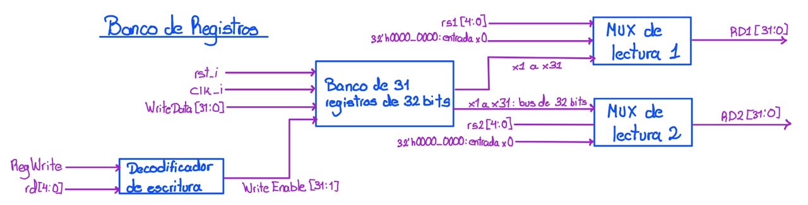

#### Relación con los demás módulos

Los índices `rs1`, `rs2` y `rd` provienen del decodificador de
instrucción, `RegWrite` de la unidad de control y `WriteData` del
`MUX Write-back`. Las salidas `RD1` y `RD2` alimentan los multiplexores
de operandos de la ALU, el comparador de bifurcaciones y la lógica de
branch/saltos. Además, `RD2` se envía como `DataOut_o` para las
instrucciones de almacenamiento.

**Decodificador de instrucción → `rs1`/`rs2`/`rd` → Banco de registros → `RD1`/`RD2` → ALU / Branch / Memoria**

#### Funcionamiento

El banco físico contiene 31 registros de 32 bits (`x1` a `x31`). Cada
puerto de lectura utiliza un multiplexor que selecciona entre el bus de
lectura del banco y la constante cero:

$$
RD1 =
\begin{cases}
0, & \text{si } rs1 = 0 \\
x[rs1], & \text{en otro caso}
\end{cases}
$$

$$
RD2 =
\begin{cases}
0, & \text{si } rs2 = 0 \\
x[rs2], & \text{en otro caso}
\end{cases}
$$

Para la escritura, un decodificador combina `RegWrite` y `rd` y genera
un vector `WriteEnable[31:1]` de una sola línea activa:

$$
WriteEnable[i] = RegWrite \cdot (rd = i), \quad i = 1,\dots,31
$$

En el flanco de subida de `clk_i`, el registro cuya línea esté activa
captura `WriteData`. No existe línea de habilitación para `x0`.

#### Diseño y justificación técnica

Se implementa `x0` como una constante seleccionada por el multiplexor de
lectura y no como un registro al que se ignora la escritura. Con esta
estructura es imposible modificar `x0`, sin depender de lógica adicional
que descarte la escritura. Además, se ahorra un registro de 32 bits.

Las lecturas son combinacionales porque los operandos deben estar
disponibles dentro del mismo ciclo en que se ejecuta la instrucción, y
la escritura es síncrona para que el resultado se almacene al final del
ciclo.

#### Comportamiento durante el reset

El programa en ensamblador no debe suponer valores iniciales en los
registros, por lo que el reset no es obligatorio para el
funcionamiento del programa. En simulación se recomienda inicializar
los registros en cero para evitar valores indefinidos.

#### Casos especiales y condiciones de borde

Cuando `rd` coincide con `rs1` o `rs2` en la misma instrucción, la
lectura devuelve el valor anterior a la escritura, ya que esta última
solo se realiza en el siguiente flanco de reloj. Una escritura con
`rd = 0` no tiene ningún efecto.

#### Estrategia de validación

Se escribirá un patrón distinto en cada registro `x1` a `x31` y se
leerá de vuelta por ambos puertos. También se intentará escribir en
`x0` y se comprobará que su lectura permanece en cero, y se verificará
el caso en que `rd` coincide con `rs1`.

---

### 7.18 ALU

La ALU ejecuta la operación aritmética, lógica, de desplazamiento o de
comparación correspondiente a la instrucción actual. Está formada por
cuatro unidades funcionales que operan en paralelo y un multiplexor que
selecciona el resultado final.

#### Objetivo

El objetivo de la ALU es producir `ALU_Result` a partir de los
operandos `ALU_OperandA` y `ALU_OperandB` y del código de operación
`ALU_Control`.

#### Entradas

| Señal | Ancho | Dirección | Descripción |
|---|---:|---|---|
| `ALU_OperandA[31:0]` | 32 bits | Entrada | Primer operando, proveniente del `MUX A`. |
| `ALU_OperandB[31:0]` | 32 bits | Entrada | Segundo operando, proveniente del `MUX B`. |
| `ALU_Control[3:0]` | 4 bits | Entrada | Código de la operación a realizar. |

#### Salidas

| Señal | Ancho | Dirección | Descripción |
|---|---:|---|---|
| `ALU_Result[31:0]` | 32 bits | Salida | Resultado de la operación seleccionada. |

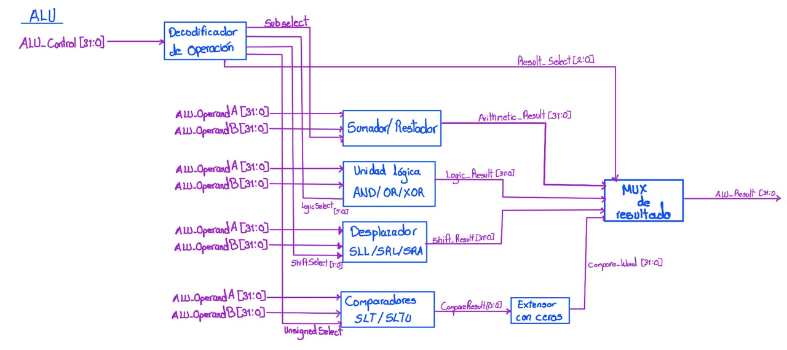

#### Relación con los demás módulos

Los operandos provienen de los multiplexores de operandos y
`ALU_Control` de la unidad de control. `ALU_Result` se conecta a
`DataAddress_o` y al `MUX Write-back`.

**Multiplexores de operandos + Unidad de control → ALU → `ALU_Result` → Memoria de datos / MUX Write-back**

#### Funcionamiento

El decodificador de operación traduce `ALU_Control` en las señales de
selección internas: `Sub_select`, `LogicSelect[1:0]`, `ShiftSelect[1:0]`,
`UnsignedSelect` y `Result_Select[2:0]`. Las cuatro unidades funcionales
calculan su resultado de forma simultánea:

- Sumador/restador, con resultado `Arithmetic_Result`.
- Unidad lógica AND/OR/XOR, con resultado `Logic_Result`.
- Desplazador SLL/SRL/SRA, con resultado `Shift_Result`.
- Comparadores SLT/SLTU, cuyo resultado de 1 bit se extiende con ceros a
  32 bits (`Compare_Word`).

El multiplexor de resultado escoge una de las cuatro salidas según
`Result_Select`. La tabla de verdad del decodificador de operación es:

| ALU_Control | Operación | Sub_select | LogicSelect | ShiftSelect | UnsignedSelect | Result_Select |
|---|---|---|---|---|---|---|
| `0000` | add | 0 | – | – | – | `000` |
| `0001` | sub | 1 | – | – | – | `000` |
| `0010` | and | – | `00` | – | – | `001` |
| `0011` | or | – | `01` | – | – | `001` |
| `0100` | xor | – | `10` | – | – | `001` |
| `0101` | sll | – | – | `00` | – | `010` |
| `0110` | srl | – | – | `01` | – | `010` |
| `0111` | sra | – | – | `10` | – | `010` |
| `1000` | slt | – | – | – | 0 | `011` |
| `1001` | sltu | – | – | – | 1 | `011` |

Las operaciones aritméticas se expresan como:

$$
Arithmetic\_Result =
\begin{cases}
A + B, & \text{si } Sub\_select = 0 \\
A - B, & \text{si } Sub\_select = 1
\end{cases}
$$

#### Diseño y justificación técnica

Se divide la ALU en unidades funcionales independientes en lugar de una
única descripción monolítica. Cada unidad puede sintetizarse y
verificarse por separado, y la estructura refleja el hardware real. El
costo es que se calculan las cuatro operaciones en cada ciclo aunque
solo se use una, lo cual es aceptable en un procesador de ciclo único
con pocos recursos por operación.

`ALU_Control` utiliza 4 bits porque solo hay diez operaciones distintas.

#### Comportamiento durante el reset

La ALU es combinacional y no tiene estado propio, por lo que no
requiere lógica de reset.

#### Casos especiales y condiciones de borde

En los desplazamientos solo se utilizan los 5 bits menos significativos
de `ALU_OperandB`, ya que un registro de 32 bits admite desplazamientos
de 0 a 31 posiciones. Las comparaciones `slt` y `sltu` difieren en la
interpretación de los operandos: con signo en complemento a dos y sin
signo, respectivamente. En la suma y la resta el desbordamiento se
descarta, como define la arquitectura RISC-V.

#### Estrategia de validación

Se probarán las diez operaciones con pares de operandos que incluyan
cero, valores negativos, máximo positivo y mínimo negativo,
desbordamiento de suma y resta, y desplazamientos por 0 y por 31,
comparando cada resultado con el valor esperado calculado en el banco
de pruebas.

---

### 7.19 Generador de inmediatos

El generador de inmediatos extrae el campo inmediato de la instrucción
y lo extiende con signo a 32 bits. La posición de los bits del
inmediato depende del formato de la instrucción, por lo que el bloque
calcula los cuatro formatos soportados y selecciona uno.

#### Objetivo

El objetivo del generador es entregar `Imm[31:0]` con el formato
indicado por `ImmSrc`: I, S, B o J.

#### Entradas

| Señal | Ancho | Dirección | Descripción |
|---|---:|---|---|
| `ProgIn_i[31:0]` | 32 bits | Entrada | Instrucción completa leída de la ROM. |
| `ImmSrc[1:0]` | 2 bits | Entrada | Selección del formato de inmediato. |

#### Salidas

| Señal | Ancho | Dirección | Descripción |
|---|---:|---|---|
| `Imm[31:0]` | 32 bits | Salida | Inmediato extendido con signo. |

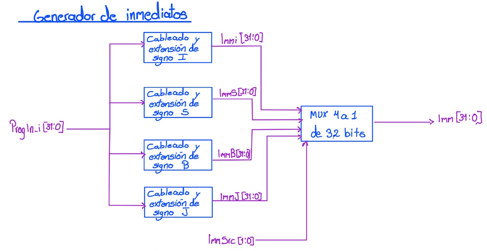

#### Relación con los demás módulos

`ImmSrc` proviene de la unidad de control. `Imm` se conecta al
`MUX B` de la ALU y a la lógica de branch/saltos.

**ROM → `ProgIn_i` → Generador de inmediatos → `Imm` → MUX B / Lógica de branch**

#### Funcionamiento

Cuatro bloques de cableado y extensión de signo operan en paralelo,
uno por formato (`ImmI`, `ImmS`, `ImmB`, `ImmJ`). Un multiplexor de
4 a 1 selecciona la salida según `ImmSrc`:

| ImmSrc | Formato | Instrucciones | Composición (signo en `Instr[31]`) |
|---|---|---|---|
| `00` | I | `lw`, aritméticas con inmediato, `jalr` | `Instr[31:20]` |
| `01` | S | `sw` | `Instr[31:25]`, `Instr[11:7]` |
| `10` | B | `beq`, `bne`, `blt`, `bge` | `Instr[31]`, `Instr[7]`, `Instr[30:25]`, `Instr[11:8]`, `0` |
| `11` | J | `jal` | `Instr[31]`, `Instr[19:12]`, `Instr[20]`, `Instr[30:21]`, `0` |

#### Diseño y justificación técnica

Calcular los cuatro formatos en paralelo y seleccionar al final con un
multiplexor mantiene el bloque puramente combinacional y con un retardo
independiente del formato. Cada formato es solo cableado y replicación
del bit de signo, por lo que no consume lógica aritmética.

Se codifica `ImmSrc` con 2 bits porque solo se soportan cuatro formatos;
el formato U (`lui`, `auipc`) no forma parte del conjunto de
instrucciones requerido.

#### Comportamiento durante el reset

El bloque es combinacional y no requiere lógica de reset.

#### Casos especiales y condiciones de borde

En los formatos B y J el bit menos significativo del inmediato es
siempre cero, porque los destinos de salto están alineados a 2 bytes;
ese bit no se extrae de la instrucción sino que se fija en cero. El bit
de signo se replica sobre los bits altos, por lo que los inmediatos
negativos deben producir valores con los bits altos en uno.

#### Estrategia de validación

Se probará al menos una instrucción de cada formato con inmediato
positivo y con inmediato negativo, comparando bit a bit `Imm` contra el
valor calculado manualmente.

---

### 7.20 Unidad de control

La unidad de control decodifica los campos `opcode`, `funct3` y
`funct7` de la instrucción y genera todas las señales de control del
datapath. Está formada por un decodificador de instrucciones, que
identifica cuál de las instrucciones soportadas se recibió, y una
lógica combinacional que traduce esa identificación en señales de
control.

#### Objetivo

El objetivo de la unidad de control es determinar, para cada
instrucción, qué debe hacer cada bloque del procesador en ese ciclo.

#### Entradas

| Señal | Ancho | Dirección | Descripción |
|---|---:|---|---|
| `opcode[6:0]` | 7 bits | Entrada | Campo `opcode` de la instrucción. |
| `funct3[2:0]` | 3 bits | Entrada | Campo `funct3` de la instrucción. |
| `funct7[6:0]` | 7 bits | Entrada | Campo `funct7` de la instrucción. |

#### Salidas

| Señal | Ancho | Dirección | Descripción |
|---|---:|---|---|
| `RegWrite` | 1 bit | Salida | Habilita la escritura en el banco de registros. |
| `ALUSrcA` | 1 bit | Salida | Selector del `MUX A`. |
| `ALUSrcB` | 1 bit | Salida | Selector del `MUX B`. |
| `ALUControl[3:0]` | 4 bits | Salida | Código de operación de la ALU. |
| `ImmSrc[1:0]` | 2 bits | Salida | Formato del inmediato. |
| `ResultSrc[1:0]` | 2 bits | Salida | Selector del `MUX Write-back`. |
| `BranchCtrl[1:0]` | 2 bits | Salida | Tipo de comparación de branch. |
| `Branch` | 1 bit | Salida | Indica un branch condicional. |
| `Jump` | 1 bit | Salida | Indica un salto incondicional (`jal` o `jalr`). |
| `JALR` | 1 bit | Salida | Distingue `jalr` de `jal`. |
| `MemWrite` | 1 bit | Salida | Habilita la escritura en memoria de datos (`we_o`). |

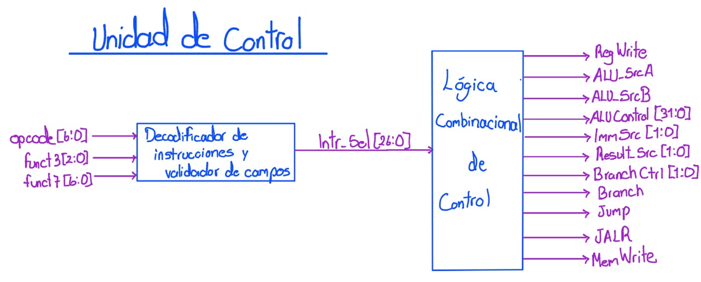

#### Relación con los demás módulos

Recibe los campos de la instrucción del decodificador de instrucción y
controla el banco de registros, los multiplexores de operandos, la ALU,
el generador de inmediatos, el multiplexor de write-back, la lógica de
branch/saltos y la escritura en memoria.

**Decodificador de instrucción → Unidad de control → señales de control → Datapath**

#### Funcionamiento

El decodificador de instrucciones y validador de campos produce un
código interno `Instr_Sel` que identifica la instrucción. La lógica
combinacional de control convierte `Instr_Sel` en las señales de
salida según la siguiente tabla:

| Instrucción | `opcode` | `funct3` | `funct7` | RegWrite | ImmSrc | ALUSrcB | ALUControl | MemWrite | ResultSrc | Branch | Jump | JALR | BranchCtrl |
|---|---|---|---|---|---|---|---|---|---|---|---|---|---|
| `add` | `0110011` | `000` | `0000000` | 1 | xx | 0 | `0000` | 0 | `00` | 0 | 0 | 0 | xx |
| `sub` | `0110011` | `000` | `0100000` | 1 | xx | 0 | `0001` | 0 | `00` | 0 | 0 | 0 | xx |
| `and` | `0110011` | `111` | – | 1 | xx | 0 | `0010` | 0 | `00` | 0 | 0 | 0 | xx |
| `or` | `0110011` | `110` | – | 1 | xx | 0 | `0011` | 0 | `00` | 0 | 0 | 0 | xx |
| `xor` | `0110011` | `100` | – | 1 | xx | 0 | `0100` | 0 | `00` | 0 | 0 | 0 | xx |
| `sll` | `0110011` | `001` | – | 1 | xx | 0 | `0101` | 0 | `00` | 0 | 0 | 0 | xx |
| `srl` | `0110011` | `101` | `0000000` | 1 | xx | 0 | `0110` | 0 | `00` | 0 | 0 | 0 | xx |
| `sra` | `0110011` | `101` | `0100000` | 1 | xx | 0 | `0111` | 0 | `00` | 0 | 0 | 0 | xx |
| `slt` | `0110011` | `010` | – | 1 | xx | 0 | `1000` | 0 | `00` | 0 | 0 | 0 | xx |
| `sltu` | `0110011` | `011` | – | 1 | xx | 0 | `1001` | 0 | `00` | 0 | 0 | 0 | xx |
| `addi` | `0010011` | `000` | – | 1 | `00` | 1 | `0000` | 0 | `00` | 0 | 0 | 0 | xx |
| `andi` | `0010011` | `111` | – | 1 | `00` | 1 | `0010` | 0 | `00` | 0 | 0 | 0 | xx |
| `ori` | `0010011` | `110` | – | 1 | `00` | 1 | `0011` | 0 | `00` | 0 | 0 | 0 | xx |
| `xori` | `0010011` | `100` | – | 1 | `00` | 1 | `0100` | 0 | `00` | 0 | 0 | 0 | xx |
| `slli` | `0010011` | `001` | – | 1 | `00` | 1 | `0101` | 0 | `00` | 0 | 0 | 0 | xx |
| `srli` | `0010011` | `101` | `0000000` | 1 | `00` | 1 | `0110` | 0 | `00` | 0 | 0 | 0 | xx |
| `srai` | `0010011` | `101` | `0100000` | 1 | `00` | 1 | `0111` | 0 | `00` | 0 | 0 | 0 | xx |
| `slti` | `0010011` | `010` | – | 1 | `00` | 1 | `1000` | 0 | `00` | 0 | 0 | 0 | xx |
| `sltui` | `0010011` | `011` | – | 1 | `00` | 1 | `1001` | 0 | `00` | 0 | 0 | 0 | xx |
| `lw` | `0000011` | `010` | – | 1 | `00` | 1 | `0000` | 0 | `01` | 0 | 0 | 0 | xx |
| `sw` | `0100011` | `010` | – | 0 | `01` | 1 | `0000` | 1 | xx | 0 | 0 | 0 | xx |
| `beq` | `1100011` | `000` | – | 0 | `10` | x | xxxx | 0 | xx | 1 | 0 | 0 | `00` |
| `bne` | `1100011` | `001` | – | 0 | `10` | x | xxxx | 0 | xx | 1 | 0 | 0 | `01` |
| `blt` | `1100011` | `100` | – | 0 | `10` | x | xxxx | 0 | xx | 1 | 0 | 0 | `10` |
| `bge` | `1100011` | `101` | – | 0 | `10` | x | xxxx | 0 | xx | 1 | 0 | 0 | `11` |
| `jal` | `1101111` | – | – | 1 | `11` | x | xxxx | 0 | `10` | 0 | 1 | 0 | xx |
| `jalr` | `1100111` | `000` | – | 1 | `00` | x | xxxx | 0 | `10` | 0 | 1 | 1 | xx |

La señal `ALUSrcA` se mantiene en 0 (`RD1`) para todas las instrucciones
soportadas.

#### Diseño y justificación técnica

Se genera `ALUControl` dentro de la unidad de control, en lugar de
enviar `funct3` y `funct7` hasta la ALU. Así la ALU queda independiente
del formato de instrucción RISC-V y toda la información de
decodificación se concentra en un único módulo que puede verificarse
contra la tabla anterior.

Se utilizan señales `Jump` y `JALR` separadas porque `jal` y `jalr`
calculan el destino con bases distintas (`PC` y `RD1`, respectivamente).
`BranchCtrl` y `ImmSrc` utilizan 2 bits porque solo se distinguen cuatro
casos en cada una.

#### Comportamiento durante el reset

La unidad de control es combinacional y no requiere lógica de reset.

#### Casos especiales y condiciones de borde

Cualquier combinación de `opcode`, `funct3` y `funct7` que no
corresponda a una instrucción soportada debe producir `RegWrite = 0`,
`MemWrite = 0`, `Branch = 0` y `Jump = 0`, de modo que una instrucción
inválida no modifique el estado del procesador.

#### Estrategia de validación

Se recorrerán todas las instrucciones soportadas y se comparará cada
señal de salida con la tabla de funcionamiento. Adicionalmente, se
probarán combinaciones inválidas de `opcode` y `funct` para comprobar
que ninguna escribe en registros ni en memoria.

---

### 7.21 Comparador de bifurcaciones y lógica de branch/saltos

Este bloque determina si una instrucción de control de flujo cambia el
PC y calcula la dirección de destino. Está formado por el comparador de
bifurcaciones, que evalúa la condición de los branches, y por la lógica
de branch/saltos, que calcula `TargetPC` y genera `PCsrc`.

#### Objetivo

El objetivo del bloque es producir `TargetPC`, la dirección de destino
de los branches y saltos, y `PCsrc`, la señal que indica al `MUX Next PC`
si debe tomarse ese destino en lugar de `PC + 4`.

#### Entradas

| Señal | Ancho | Dirección | Descripción |
|---|---:|---|---|
| `RD1[31:0]` | 32 bits | Entrada | Primer operando de comparación y base de `jalr`. |
| `RD2[31:0]` | 32 bits | Entrada | Segundo operando de comparación. |
| `PC[31:0]` | 32 bits | Entrada | Dirección de la instrucción actual. |
| `Imm[31:0]` | 32 bits | Entrada | Inmediato de formato B, J o I. |
| `BranchCtrl[1:0]` | 2 bits | Entrada | Tipo de comparación del branch. |
| `Branch` | 1 bit | Entrada | Indica un branch condicional. |
| `Jump` | 1 bit | Entrada | Indica un salto incondicional. |
| `JALR` | 1 bit | Entrada | Distingue `jalr` de `jal`. |

#### Salidas

| Señal | Ancho | Dirección | Descripción |
|---|---:|---|---|
| `TargetPC[31:0]` | 32 bits | Salida | Dirección de destino del branch o salto. |
| `PCsrc` | 1 bit | Salida | Selección del `MUX Next PC`. |

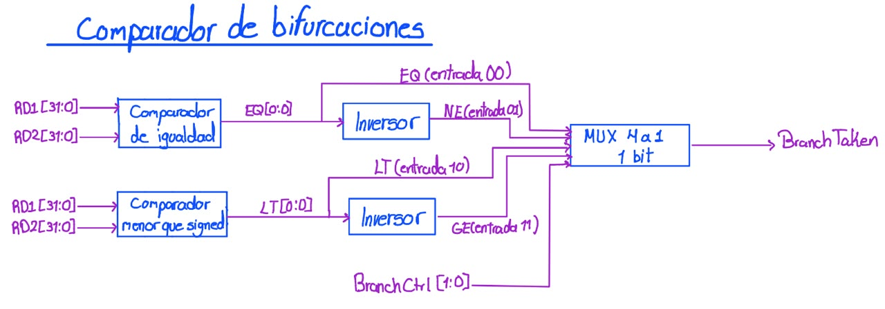

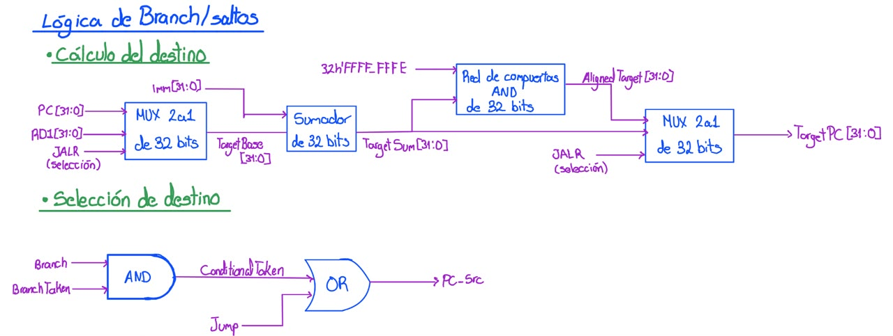

#### Relación con los demás módulos

`RD1` y `RD2` provienen del banco de registros, `PC` del registro del
PC, `Imm` del generador de inmediatos y las señales de control de la
unidad de control. `TargetPC` y `PCsrc` se conectan al `MUX Next PC`.

**Banco de registros + Unidad de control → Comparador y lógica de branch → `TargetPC` / `PCsrc` → MUX Next PC**

#### Funcionamiento

**Comparador de bifurcaciones.** Un comparador de igualdad genera `EQ`
y un comparador con signo genera `LT`. Dos inversores obtienen
`NE = ¬EQ` y `GE = ¬LT`. Un multiplexor de 4 a 1 de un bit, seleccionado
por `BranchCtrl`, entrega `BranchTaken`:

| BranchCtrl | Instrucción | BranchTaken |
|---|---|---|
| `00` | `beq` | `EQ` |
| `01` | `bne` | `NE` |
| `10` | `blt` | `LT` |
| `11` | `bge` | `GE` |

**Cálculo del destino.** Un multiplexor de 2 a 1 selecciona la base del
cálculo entre `PC` y `RD1`, según `JALR`. Un sumador de 32 bits suma
esa base con `Imm`:

$$
TargetSum = Base + Imm, \qquad
Base =
\begin{cases}
PC, & \text{si } JALR = 0 \\
RD1, & \text{si } JALR = 1
\end{cases}
$$

Una red de compuertas AND aplica la máscara `0xFFFF_FFFE` para poner en
cero el bit 0:

$$
AlignedTarget = TargetSum \,\&\, \texttt{0xFFFFFFFE}
$$

Un segundo multiplexor, seleccionado por `JALR`, entrega `AlignedTarget`
para `jalr` y `TargetSum` en los demás casos.

**Selección de destino.** La señal `PCsrc` se obtiene con una
compuerta AND y una compuerta OR:

$$
ConditionalTaken = Branch \cdot BranchTaken
$$

$$
PCsrc = ConditionalTaken + Jump
$$

#### Diseño y justificación técnica

Con la señal `JALR` separada de `Jump`, un único sumador sirve para los
tres tipos de cálculo de destino: branch y `jal` usan `PC + Imm`, y
`jalr` usa `RD1 + Imm`. Solo cambia la base de la suma.

La máscara sobre el bit 0 responde a la especificación RISC-V, que
exige poner en cero el bit menos significativo de la dirección
calculada por `jalr`. En los branches y en `jal` el bit 0 del
inmediato ya es cero por construcción.

El comparador solo incluye comparación con signo porque las
instrucciones requeridas son `beq`, `bne`, `blt` y `bge`.

#### Comportamiento durante el reset

El bloque es combinacional y no requiere lógica de reset.

#### Casos especiales y condiciones de borde

Cuando `Branch` y `Jump` están en cero, `PCsrc` es cero y el
`MUX Next PC` selecciona `PC + 4`. Si `RD1 + Imm` es impar en un
`jalr`, la máscara garantiza que `TargetPC` quede alineado. Los
destinos hacia atrás (inmediato negativo) dependen de la correcta
extensión de signo del generador de inmediatos.

#### Estrategia de validación

Se probará cada una de las cuatro condiciones de branch en los casos
tomado y no tomado, incluyendo operandos negativos para `blt` y `bge`.
También se probarán `jal` y `jalr` con desplazamientos positivos y
negativos, y un `jalr` con destino impar, verificando `TargetPC` y
`PCsrc` contra valores calculados manualmente.

---

### 7.22 Multiplexores de operandos de la ALU

Los multiplexores de operandos seleccionan los valores que entran a la
ALU. El `MUX A` escoge el primer operando y el `MUX B` el segundo.

#### Objetivo

El objetivo de estos multiplexores es permitir que la ALU opere tanto
con dos registros como con un registro y un inmediato, según el tipo de
instrucción.

#### Entradas

| Señal | Ancho | Dirección | Descripción |
|---|---:|---|---|
| `RD1[31:0]` | 32 bits | Entrada | Primer registro fuente. |
| `PC[31:0]` | 32 bits | Entrada | Dirección de la instrucción actual (entrada reservada del `MUX A`). |
| `RD2[31:0]` | 32 bits | Entrada | Segundo registro fuente. |
| `Imm[31:0]` | 32 bits | Entrada | Inmediato de la instrucción. |
| `ALUSrcA` | 1 bit | Entrada | Selector del `MUX A`. |
| `ALUSrcB` | 1 bit | Entrada | Selector del `MUX B`. |

#### Salidas

| Señal | Ancho | Dirección | Descripción |
|---|---:|---|---|
| `ALU_OperandA[31:0]` | 32 bits | Salida | Primer operando de la ALU. |
| `ALU_OperandB[31:0]` | 32 bits | Salida | Segundo operando de la ALU. |

#### Relación con los demás módulos

Las entradas provienen del banco de registros, del registro del PC y
del generador de inmediatos; los selectores provienen de la unidad de
control. Las salidas alimentan la ALU.

**Banco de registros / Generador de inmediatos → MUX A / MUX B → ALU**

#### Funcionamiento

$$
ALU\_OperandA =
\begin{cases}
RD1, & \text{si } ALUSrcA = 0 \\
PC, & \text{si } ALUSrcA = 1
\end{cases}
$$

$$
ALU\_OperandB =
\begin{cases}
RD2, & \text{si } ALUSrcB = 0 \\
Imm, & \text{si } ALUSrcB = 1
\end{cases}
$$

#### Diseño y justificación técnica

Son multiplexores de 2 a 1 puramente combinacionales, por lo que no
requieren un diagrama interno. Para las instrucciones requeridas,
`ALUSrcA` siempre vale 0; la entrada `PC` se conserva únicamente por si
se amplía el conjunto de instrucciones con `auipc`.

#### Comportamiento durante el reset

Los multiplexores son combinacionales y no requieren lógica de reset.

#### Casos especiales y condiciones de borde

En las instrucciones de branch y salto, `ALUSrcB` es indiferente porque
la ALU no participa en la decisión del salto. En `lw` y `sw`, `ALUSrcB`
selecciona el inmediato para calcular la dirección efectiva.

#### Estrategia de validación

Se verificarán en la simulación del datapath los valores de
`ALU_OperandA` y `ALU_OperandB` para una instrucción de tipo R, una de
tipo I y una de acceso a memoria.

---

### 7.23 Multiplexor de write-back

El multiplexor de write-back selecciona el dato que se escribe en el
banco de registros al final de la instrucción.

#### Objetivo

El objetivo del multiplexor es entregar `WriteData` a partir de una de
tres fuentes: el resultado de la ALU, el dato leído de memoria o la
dirección de retorno `PC + 4`.

#### Entradas

| Señal | Ancho | Dirección | Descripción |
|---|---:|---|---|
| `ALU_Result[31:0]` | 32 bits | Entrada | Resultado de la ALU. |
| `DataIn_i[31:0]` | 32 bits | Entrada | Dato leído de la memoria de datos o de un periférico. |
| `PCPlus4[31:0]` | 32 bits | Entrada | Dirección de retorno para `jal` y `jalr`. |
| `ResultSrc[1:0]` | 2 bits | Entrada | Selector del multiplexor. |

#### Salidas

| Señal | Ancho | Dirección | Descripción |
|---|---:|---|---|
| `WriteData[31:0]` | 32 bits | Salida | Dato a escribir en el banco de registros. |

#### Relación con los demás módulos

`ResultSrc` proviene de la unidad de control. La salida `WriteData` se
conecta al banco de registros.

**ALU / Memoria / PC+4 → MUX Write-back → `WriteData` → Banco de registros**

#### Funcionamiento

$$
WriteData =
\begin{cases}
ALU\_Result, & ResultSrc = 00 \\
DataIn\_i, & ResultSrc = 01 \\
PCPlus4, & ResultSrc = 10
\end{cases}
$$

#### Diseño y justificación técnica

Un multiplexor combinacional de tres entradas concentra en un solo
punto todas las fuentes posibles del resultado, sin necesidad de
diagrama interno. Con 2 bits de selección queda una combinación sin
uso (`11`).

#### Comportamiento durante el reset

El multiplexor es combinacional y no requiere lógica de reset.

#### Casos especiales y condiciones de borde

Para instrucciones que no escriben en registros (`sw`, branches),
`ResultSrc` es indiferente, ya que `RegWrite` está en cero.

#### Estrategia de validación

Se verificará en la simulación del datapath que `WriteData` corresponda
al resultado de la ALU en una instrucción aritmética, al dato de
memoria en un `lw` y a `PC + 4` en un `jal`.

---

### 7.24 ROM

La ROM almacena el programa en ensamblador del juego, ya convertido a
código máquina. Se accede mediante un bus de instrucciones
independiente del bus de datos, como lo exige la especificación del
proyecto.

#### Objetivo

El objetivo de la ROM es entregar la instrucción almacenada en la
dirección indicada por el PC.

#### Entradas

| Señal | Ancho | Dirección | Descripción |
|---|---:|---|---|
| `ProgAddress_o[31:0]` | 32 bits | Entrada | Dirección de la instrucción solicitada por el procesador. |

#### Salidas

| Señal | Ancho | Dirección | Descripción |
|---|---:|---|---|
| `ProgIn_i[31:0]` | 32 bits | Salida | Instrucción almacenada en la dirección solicitada. |

#### Relación con los demás módulos

`ProgAddress_o` proviene del registro del PC y `ProgIn_i` se conecta al
decodificador de instrucción y al generador de inmediatos. Se
representa con el mismo bloque que aparece en el diagrama de tercer
nivel del sistema.

**Registro PC → `ProgAddress_o` → ROM → `ProgIn_i` → Decodificador de instrucción**

#### Funcionamiento

La ROM ocupa el rango `0x0000_0000` a `0x0000_1FFF` (8 KiB, 2048
palabras de 32 bits). Como las instrucciones están alineadas a 4
bytes, se descartan los dos bits menos significativos de la dirección
y se utilizan los bits `[12:2]` como índice de palabra:

$$
ProgIn\_i = ROM[ProgAddress\_o[12:2]]
$$

El contenido se carga desde el archivo generado al ensamblar el
programa.

#### Diseño y justificación técnica

La lectura se describe como combinacional porque el procesador es de
ciclo único: la instrucción debe estar disponible dentro del mismo
ciclo en que el PC cambia. Con una lectura síncrona la instrucción
llegaría un ciclo tarde y el procesador ejecutaría la instrucción
anterior. El tamaño de 2048 palabras es pequeño y puede implementarse
con la memoria distribuida de la FPGA.

No se realiza un diagrama de cuarto nivel porque la ROM es un arreglo
de memoria sin lógica interna propia que descomponer.

#### Comportamiento durante el reset

El contenido de la ROM no depende de `rst_i`. Tras el reset, el PC vale
`0x0000_0000` y la ROM entrega la primera instrucción del programa.

#### Casos especiales y condiciones de borde

Las direcciones fuera del rango `0x0000_0000` a `0x0000_1FFF` no
ocurren en operación normal, y por eso no se les asigna comportamiento.
Los bits `[1:0]` de la dirección se ignoran.

#### Estrategia de validación

Se recorrerán las direcciones del programa cargado y se comparará
`ProgIn_i` contra el archivo fuente, incluyendo la primera y la última
palabra del rango.

---

### 7.25 RAM

La RAM almacena los datos del programa: los tableros de ambos jugadores,
el turno activo, los contadores de partidas y la pila. Se accede
mediante el bus de datos, compartido con los periféricos.

#### Objetivo

El objetivo de la RAM es almacenar y devolver palabras de 32 bits en
las direcciones del rango `0x0000_2000` a `0x0000_2FFF`.

#### Entradas

| Señal | Ancho | Dirección | Descripción |
|---|---:|---|---|
| `clk_i` | 1 bit | Entrada | Reloj principal del sistema. |
| `vam.addr[9:0]` | 10 bits | Entrada | Dirección local de palabra, generada por el adaptador de dirección. |
| `DataOut_o[31:0]` | 32 bits | Entrada | Dato a escribir, proveniente del procesador. |
| `we.RAM` | 1 bit | Entrada | Habilitación de escritura, proveniente del decodificador de direcciones. |

#### Salidas

| Señal | Ancho | Dirección | Descripción |
|---|---:|---|---|
| `vam.rdata[31:0]` | 32 bits | Salida | Dato leído de la dirección local. |

#### Relación con los demás módulos

El adaptador de dirección RAM convierte `DataAddress_o` en `vam.addr`,
el decodificador de direcciones genera `we.RAM` y la salida
`vam.rdata` se dirige al multiplexor de lectura. Se representa con el
mismo bloque que aparece en el diagrama de tercer nivel del sistema.

**Procesador → Adaptador de dirección → RAM → `vam.rdata` → MUX de lectura → `DataIn_i`**

#### Funcionamiento

La RAM contiene 1024 palabras de 32 bits (4 KiB). El adaptador de
dirección elimina la base `0x0000_2000` y los dos bits de byte,
quedando:

$$
vam.addr = DataAddress\_o[11:2]
$$

La escritura es síncrona: en el flanco de subida de `clk_i`, si
`we.RAM = 1`, se almacena `DataOut_o` en la posición `vam.addr`. La
lectura es combinacional:

$$
vam.rdata = RAM[vam.addr]
$$

#### Diseño y justificación técnica

Se utiliza lectura combinacional y escritura síncrona porque en un
procesador de ciclo único el dato de un `lw` debe estar disponible
dentro del mismo ciclo para escribirse en el banco de registros. El
adaptador de dirección permite que la RAM no dependa de su posición en
el mapa de memoria global.

No se realiza un diagrama de cuarto nivel porque la RAM es un arreglo
de memoria sin lógica interna propia que descomponer.

#### Comportamiento durante el reset

El contenido de la RAM no se reinicia con `rst_i`. El enunciado
establece que la limpieza de los tableros y de los contadores se
realiza por software en la etapa de inicialización del programa.

#### Casos especiales y condiciones de borde

Solo se escribe en la RAM cuando el decodificador de direcciones activa
`we.RAM`, es decir, cuando la dirección está dentro de su rango. Los
accesos en los extremos del rango (`0x0000_2000` y `0x0000_2FFC`) deben
funcionar correctamente.

#### Estrategia de validación

Se escribirán y leerán patrones de datos distintos en varias
direcciones, incluyendo la primera y la última palabra, y se
comprobará que una escritura con `we.RAM = 0` no modifica el contenido.

---

### 7.26 Decodificador de direcciones

El decodificador de direcciones determina, a partir de
`DataAddress_o`, qué memoria o periférico participa en el acceso de
datos actual. Incluye el generador de habilitaciones de escritura, que
combina cada selección con la señal `we_o` del procesador.

#### Objetivo

El objetivo del decodificador es activar una única línea de selección
por acceso y generar la habilitación de escritura correspondiente a la
RAM y a cada periférico.

#### Entradas

| Señal | Ancho | Dirección | Descripción |
|---|---:|---|---|
| `DataAddress_o[31:0]` | 32 bits | Entrada | Dirección del acceso a datos. |
| `we_o` | 1 bit | Entrada | Escritura solicitada por el procesador. |

#### Salidas

| Señal | Ancho | Dirección | Descripción |
|---|---:|---|---|
| `sel_RAM` | 1 bit | Salida | Selecciona la RAM de datos. |
| `sel_UART` | 1 bit | Salida | Selecciona el periférico UART. |
| `sel_INPUT` | 1 bit | Salida | Selecciona las entradas del Jugador 1. |
| `sel_DISPLAY` | 1 bit | Salida | Selecciona los displays de 7 segmentos. |
| `sel_LED` | 1 bit | Salida | Selecciona el LED de estado. |
| `sel_Buzzer` | 1 bit | Salida | Selecciona el buzzer. |
| `sel_VGA` | 1 bit | Salida | Selecciona la memoria de video. |
| `we.RAM`, `we.UART`, `we.DISPLAY`, `we.LED`, `we.Buzzer`, `we.VGA` | 1 bit c/u | Salida | Habilitación de escritura de cada destino. |

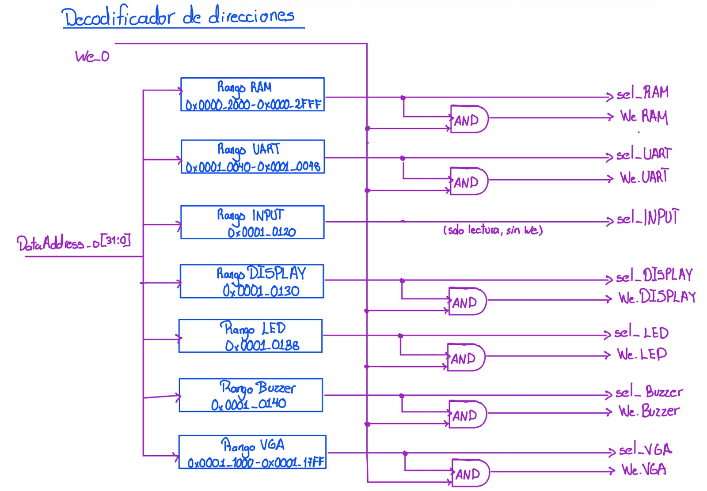

#### Relación con los demás módulos

Recibe `DataAddress_o` y `we_o` del procesador. Las señales `sel_*`
controlan el multiplexor de lectura y las señales `we.*` se conectan a
la RAM y a cada periférico.

**Procesador → Decodificador de direcciones → `sel_*` / `we.*` → RAM / Periféricos / MUX de lectura**

#### Funcionamiento

Cada selección se obtiene comparando la dirección con el rango del
mapa de memoria definido en el enunciado:

| Señal | Rango de direcciones |
|---|---|
| `sel_RAM` | `0x0000_2000` a `0x0000_2FFF` |
| `sel_UART` | `0x0001_0040` a `0x0001_0048` |
| `sel_INPUT` | `0x0001_0120` |
| `sel_DISPLAY` | `0x0001_0130` |
| `sel_LED` | `0x0001_0138` |
| `sel_Buzzer` | `0x0001_0140` |
| `sel_VGA` | `0x0001_1000` a `0x0001_17FF` |

Cada habilitación de escritura se obtiene como:

$$
we.X = we\_o \cdot sel\_X
$$

Las entradas del Jugador 1 son de solo lectura, por lo que no tienen
señal de escritura.

#### Diseño y justificación técnica

Se decodifica por rangos para cubrir de forma simple los destinos que
ocupan varias direcciones: los tres registros del UART y la memoria de
video, que abarca 512 palabras. Los rangos son disjuntos, así que a lo
sumo una selección está activa por acceso.

#### Comportamiento durante el reset

El decodificador es combinacional y no requiere lógica de reset.

#### Casos especiales y condiciones de borde

Una dirección fuera de todos los rangos no activa ninguna selección ni
ninguna habilitación de escritura, de modo que una escritura a una
dirección inválida no afecta ningún destino. Las direcciones del UART
dentro del rango pero no asignadas a un registro deben tratarse según
la definición del periférico.

#### Estrategia de validación

Se recorrerán direcciones dentro y fuera de cada rango, incluyendo el
primer y el último valor de cada uno, verificando que como máximo una
línea `sel_*` esté activa y que cada `we.*` solo se active cuando
`we_o = 1` y la dirección corresponda a su destino.

---

### 7.27 Multiplexor de lectura

El multiplexor de lectura selecciona cuál de las fuentes de datos
(RAM o periféricos) responde a una lectura del procesador.

#### Objetivo

El objetivo del multiplexor es entregar `DataIn_i` con el dato de la
memoria o del periférico seleccionado por el decodificador de
direcciones.

#### Entradas

| Señal | Ancho | Dirección | Descripción |
|---|---:|---|---|
| `vam.rdata[31:0]` | 32 bits | Entrada | Dato leído de la RAM. |
| `rdata_UART[31:0]` | 32 bits | Entrada | Dato leído del UART. |
| `rdata_INPUT[31:0]` | 32 bits | Entrada | Dato leído de las entradas del Jugador 1. |
| `rdata_DISPLAY[31:0]` | 32 bits | Entrada | Dato leído de los displays. |
| `rdata_LED[31:0]` | 32 bits | Entrada | Dato leído del LED de estado. |
| `rdata_Buzzer[31:0]` | 32 bits | Entrada | Dato leído del buzzer. |
| `rdata_VGA[31:0]` | 32 bits | Entrada | Dato leído de la memoria de video. |
| `sel_*` | 1 bit c/u | Entrada | Señales de selección del decodificador de direcciones. |

#### Salidas

| Señal | Ancho | Dirección | Descripción |
|---|---:|---|---|
| `DataIn_i[31:0]` | 32 bits | Salida | Dato entregado al procesador. |

#### Relación con los demás módulos

Recibe las salidas de lectura de la RAM y de los periféricos, y las
selecciones del decodificador de direcciones. Su salida se conecta al
puerto `DataIn_i` del procesador.

**RAM / Periféricos → MUX de lectura → `DataIn_i` → Procesador**

#### Funcionamiento

La salida corresponde a la fuente cuya señal de selección está activa:

$$
DataIn\_i =
\begin{cases}
vam.rdata, & sel\_RAM = 1 \\
rdata\_UART, & sel\_UART = 1 \\
\vdots & \vdots \\
rdata\_VGA, & sel\_VGA = 1 \\
0, & \text{en otro caso}
\end{cases}
$$

#### Diseño y justificación técnica

Se utiliza un multiplexor central en lugar de un bus compartido con
lógica de tres estados, porque los buses tri-estado internos no son la
práctica recomendada en una FPGA y el multiplexor es más sencillo de
sintetizar y verificar. Como el decodificador activa a lo sumo una
selección, no hay ambigüedad.

#### Comportamiento durante el reset

El multiplexor es combinacional y no requiere lógica de reset.

#### Casos especiales y condiciones de borde

Si ninguna selección está activa, la salida se fuerza a cero. Esto evita
inferir latches y entrega un valor definido ante una lectura de
dirección inválida.

#### Estrategia de validación

Se validará junto con el decodificador de direcciones: para cada
dirección de prueba se comprobará que `DataIn_i` corresponda a la
fuente esperada y que valga cero para direcciones fuera de rango.

## 8. Mapa de memoria, registros y organización de datos

### 8.1 Mapa de memoria

| Rango de direcciones | Componente |
|---|---|
| `0x0000_0000 – 0x0000_1FFF` | ROM de programa |
| `0x0000_2000 – 0x0000_2FFF` | RAM de datos |
| `0x0001_0000 – 0x0001_FFFF` | Periféricos mapeados en memoria |
| `0x0001_1000 – 0x0001_17FF` | Memoria de video VGA |

### 8.2 Registros de periféricos

| Periférico | Registro | Dirección |
|---|---|---|
| UART | Control/Estado | `0x0001_0040` |
| UART | Datos TX | `0x0001_0044` |
| UART | Datos RX | `0x0001_0048` |
| Entradas J1 | Estado | `0x0001_0120` |
| Displays 7-seg | Datos | `0x0001_0130` |
| LED de estado | Datos | `0x0001_0138` |
| Buzzer | Control | `0x0001_0140` |

### 8.3 Organización lógica de la RAM

La memoria RAM del sistema se encuentra ubicada en el intervalo de
direcciones comprendido entre `0x0000_2000` y `0x0000_2FFF`. Esta memoria
es utilizada por el procesador para almacenar información modificable
durante la ejecución del programa.

A diferencia de la ROM, cuyo contenido corresponde al programa ejecutado
por el procesador, la RAM almacena los datos necesarios para mantener el
estado actual de la aplicación.

#### Organización propuesta

Para facilitar el acceso desde el programa en ensamblador, se propone
dividir lógicamente la RAM en diferentes regiones de acuerdo con la
función de los datos almacenados.

La organización general propuesta es:

| Región | Contenido |
|---|---|
| Tablero local | Estado de las posiciones correspondientes al tablero del jugador local. |
| Tablero remoto | Información conocida sobre el tablero del jugador remoto. |
| Información de barcos | Datos necesarios para representar la posición y estado de los barcos. |
| Estado de la partida | Variables utilizadas para representar la etapa actual del juego. |
| Control de turnos | Información utilizada para determinar el jugador que posee el turno. |
| Resultados de disparos | Información temporal asociada con las acciones realizadas durante la partida. |
| Variables auxiliares | Contadores, índices y datos temporales utilizados por el programa. |

Esta separación es lógica y permite que el software mantenga organizada
la información utilizada durante la ejecución.

#### Direccionamiento

El procesador accede a la RAM mediante `DataAddress_o[31:0]`. Debido a
que la RAM comienza en la dirección `0x0000_2000`, la dirección interna
puede obtenerse conceptualmente eliminando el desplazamiento
correspondiente a la dirección base.

Para accesos organizados por palabras de 32 bits, la adaptación puede
representarse como:

`ram_addr = (DataAddress_o - 0x0000_2000) / 4`

De esta manera:

`0x0000_2000 → palabra 0`

`0x0000_2004 → palabra 1`

`0x0000_2008 → palabra 2`

y así sucesivamente dentro del espacio asignado a la RAM.

#### Acceso desde el procesador

Cuando `DataAddress_o` se encuentra dentro del intervalo asignado a la
RAM, el decodificador de direcciones activa `sel_RAM`.

La selección puede representarse conceptualmente como:

`sel_RAM = 1`, si `0x0000_2000 ≤ DataAddress_o ≤ 0x0000_2FFF`

Para una operación de escritura, la habilitación de la memoria se
obtiene mediante:

`we_RAM = we_o ∧ sel_RAM`

Cuando `we_RAM = 1`, el valor presente en `DataOut_o[31:0]` puede ser
almacenado en la posición seleccionada de la RAM.

Durante una lectura, el dato obtenido de la memoria se entrega mediante
`ram_rdata[31:0]` al multiplexor general de lectura:

**RAM → `ram_rdata` → MUX de lectura → `DataIn_i` → CPU**

#### Uso durante la ejecución del juego

Al comenzar la ejecución del programa, las estructuras necesarias para
representar el estado de la partida deben inicializarse antes de iniciar
el intercambio de información entre los jugadores.

Durante la fase de colocación, la RAM permite almacenar la información
que representa la configuración utilizada por el juego. Posteriormente,
durante el desarrollo de la partida, el procesador puede actualizar las
posiciones afectadas por las acciones realizadas y conservar la
información necesaria para controlar los turnos y el progreso del juego.

La utilización de regiones lógicas independientes facilita que las
rutinas en ensamblador accedan a cada estructura mediante direcciones
base y desplazamientos conocidos.

#### Justificación de la organización

La división lógica de la memoria permite separar la información según su
función y simplifica el desarrollo del programa en ensamblador.

Además, utilizar posiciones conocidas dentro de la RAM permite acceder a
las diferentes estructuras mediante operaciones convencionales de carga
y almacenamiento del procesador, sin requerir hardware adicional para
distinguir cada variable del juego.

Esta organización también facilita la depuración, ya que durante las
pruebas es posible inspeccionar regiones específicas de la memoria y
comprobar de forma independiente el contenido asociado con cada parte
del estado de la partida.

#### Condiciones de borde

Los accesos destinados a la RAM deben permanecer dentro del intervalo:

`0x0000_2000 – 0x0000_2FFF`

Una dirección fuera de este intervalo no debe activar `sel_RAM`.

Asimismo, al utilizar accesos por palabras de 32 bits, las estructuras
de software deben respetar la organización y alineamiento definidos para
evitar que dos variables utilicen accidentalmente la misma posición de
memoria.

#### Estrategia de validación

La organización de la RAM se verificará inicialmente mediante
simulación, realizando operaciones de escritura y lectura sobre
diferentes posiciones dentro del intervalo asignado.

Se comprobará que una escritura con `we_RAM = 1` modifique únicamente la
posición seleccionada y que una lectura posterior permita recuperar el
mismo valor mediante `ram_rdata`.

También se probarán las direcciones inicial y final del espacio asignado
a la RAM, así como direcciones externas al intervalo, verificando que el
decodificador active `sel_RAM` únicamente cuando corresponda.

Durante la integración con el programa en ensamblador se comprobará que
las diferentes estructuras lógicas puedan actualizarse sin interferir
entre sí.

### 8.4 Interfaz estándar de periféricos
Todos los periféricos de registro comparten la interfaz de 32 bits (`clk_i`, `rst_i`, `write_enable_i`, `addr_i[1:0]`, `wdata_i[31:0]`, `rdata_o[31:0]`). El VGA es la excepción: usa un campo de dirección más ancho por comportarse como memoria de video.

---

## 9. Protocolo UART, flujo del programa y aplicación de PC
### 9.1 Protocolo de aplicación sobre UART

La comunicación entre la FPGA y la aplicación ejecutada en la
computadora del Jugador 2 se realiza mediante el periférico UART a una
velocidad de 115200 baudios. En este proyecto, UART constituye el único
medio de interacción del Jugador 2 con la partida.

El protocolo de aplicación permite transmitir las órdenes del Jugador 2
hacia la FPGA y enviar desde la FPGA la información necesaria para que
la aplicación mantenga actualizada la representación de la partida.

#### Formato general de las tramas

Se propone utilizar un protocolo basado en caracteres ASCII. Cada
mensaje está compuesto por un identificador seguido por los campos
necesarios para representar la información correspondiente.

Los campos se separan mediante comas y cada trama termina con el
carácter de salto de línea `\n`.

El formato general es:

`TIPO,CAMPO1,CAMPO2,...\n`

Esta estructura permite identificar fácilmente el comienzo lógico del
mensaje mediante su tipo y detectar su final mediante `\n`.

La utilización de caracteres ASCII facilita tanto la implementación de
la aplicación Python como la depuración de la comunicación mediante una
terminal serial.

#### Mensajes desde la PC hacia la FPGA

La aplicación del Jugador 2 debe poder enviar como mínimo dos tipos de
órdenes: colocación de barcos y disparos.

##### Colocación de barco

Se define el mensaje:

`P,barco,fila,columna,orientacion\n`

donde:

| Campo | Descripción |
|---|---|
| `P` | Identifica una solicitud de colocación de barco. |
| `barco` | Identificador del barco, con valores entre 0 y 2. |
| `fila` | Fila de la casilla inicial. |
| `columna` | Columna de la casilla inicial. |
| `orientacion` | Orientación del barco: `H` para horizontal o `V` para vertical. |

Por ejemplo:

`P,1,3,4,H\n`

indica una solicitud para colocar el barco identificado como `1`,
iniciando en la fila `3`, columna `4`, con orientación horizontal.

La FPGA debe comprobar que la colocación sea válida antes de modificar
el estado de la partida.

##### Disparo

Para solicitar un disparo se define el mensaje:

`S,fila,columna\n`

donde:

| Campo | Descripción |
|---|---|
| `S` | Identifica una solicitud de disparo. |
| `fila` | Fila de la casilla objetivo. |
| `columna` | Columna de la casilla objetivo. |

Por ejemplo:

`S,5,2\n`

representa un disparo del Jugador 2 dirigido a la casilla ubicada en la
fila `5` y columna `2` del tablero del Jugador 1.

#### Mensajes desde la FPGA hacia la PC

La FPGA debe informar a la aplicación del Jugador 2 sobre los eventos
que modifican o afectan el estado de la partida.

Se proponen los siguientes tipos de mensajes.

##### Resultado de colocación

Cuando la FPGA procesa una solicitud de colocación, responde indicando
si fue aceptada o rechazada.

Colocación aceptada:

`PA,barco\n`

Por ejemplo:

`PA,1\n`

indica que la colocación del barco `1` fue aceptada.

Si la colocación es rechazada:

`PR,barco,motivo\n`

Los motivos requeridos para el rechazo son:

| Código | Motivo |
|---|---|
| `O` | El barco se traslapa con otro barco previamente colocado. |
| `F` | La posición solicitada provoca que el barco quede fuera del tablero. |

Por ejemplo:

`PR,1,O\n`

indica que la colocación del barco `1` fue rechazada debido a un
traslape.

#### Inicio de la fase de batalla

Cuando ambos jugadores hayan completado la colocación de su flota, la
FPGA informa a la aplicación que inicia la fase de batalla.

Se utiliza:

`B\n`

donde `B` representa el inicio de la batalla.

#### Cambio de turno

Para informar a quién corresponde realizar la siguiente acción se
utiliza:

`T,jugador\n`

donde `jugador` identifica al jugador que posee el turno.

Por ejemplo:

`T,2\n`

indica que corresponde actuar al Jugador 2.

#### Resultado de un disparo del Jugador 2

Después de procesar un disparo enviado por la PC, la FPGA devuelve su
resultado mediante:

`SR,fila,columna,resultado\n`

Se proponen los siguientes códigos para `resultado`:

| Código | Resultado |
|---|---|
| `F` | Fallo. |
| `I` | Impacto. |
| `H` | Barco hundido. |

Por ejemplo:

`SR,5,2,I\n`

indica que el disparo realizado sobre la fila `5`, columna `2`, produjo
un impacto.

#### Disparo recibido del Jugador 1

Cuando el Jugador 1 realiza un disparo sobre el tablero del Jugador 2,
la FPGA debe informar a la aplicación para que esta pueda actualizar la
representación del tablero propio.

Se utiliza:

`DR,fila,columna,resultado\n`

donde `resultado` utiliza los mismos códigos definidos anteriormente.

Por ejemplo:

`DR,3,6,F\n`

indica que el Jugador 1 realizó un disparo sobre la fila `3`, columna
`6`, del tablero del Jugador 2 y el resultado fue un fallo.

#### Resultado final de la partida

Cuando la partida termina, la FPGA envía:

`FIN,ganador\n`

donde `ganador` identifica al jugador que obtuvo la victoria.

Por ejemplo:

`FIN,2\n`

indica que el Jugador 2 ganó la partida.

El mensaje final puede ampliarse posteriormente con los campos
necesarios para incluir el resumen de la partida requerido por el
sistema.

#### Resumen de mensajes

| Dirección | Trama | Función |
|---|---|---|
| PC → FPGA | `P,barco,fila,columna,orientacion\n` | Solicitud de colocación de un barco. |
| PC → FPGA | `S,fila,columna\n` | Solicitud de disparo. |
| FPGA → PC | `PA,barco\n` | Colocación aceptada. |
| FPGA → PC | `PR,barco,motivo\n` | Colocación rechazada. |
| FPGA → PC | `B\n` | Inicio de la fase de batalla. |
| FPGA → PC | `T,jugador\n` | Cambio de turno. |
| FPGA → PC | `SR,fila,columna,resultado\n` | Resultado de un disparo del Jugador 2. |
| FPGA → PC | `DR,fila,columna,resultado\n` | Disparo recibido desde el Jugador 1. |
| FPGA → PC | `FIN,ganador\n` | Resultado final de la partida. |

#### Validación de mensajes

La aplicación Python debe validar la información introducida por el
Jugador 2 antes de transmitirla. Esto permite evitar el envío de
comandos evidentemente incorrectos.

Sin embargo, la FPGA también debe validar todos los mensajes recibidos y
no puede depender únicamente de la validación realizada por la
aplicación.

Un mensaje recibido debe comprobarse antes de modificar el estado de la
partida. Entre las condiciones que deben verificarse se encuentran:

- que el tipo de mensaje sea reconocido;
- que exista la cantidad esperada de campos;
- que los campos posean valores válidos;
- que el identificador del barco se encuentre entre 0 y 2;
- que la fila y columna correspondan a posiciones válidas del tablero;
- que la orientación sea `H` o `V`;
- que la acción corresponda con la fase actual de la partida;
- que el jugador pueda realizar la acción en el turno correspondiente.

#### Manejo de datos inválidos

Cualquier mensaje que no cumpla con el formato establecido debe ser
descartado sin modificar el estado actual de la partida.

Conceptualmente:

`mensaje válido → procesar comando`

`mensaje inválido → descartar y conservar estado`

De esta forma, un dato incorrecto recibido mediante UART no debe
provocar la colocación de un barco, modificar un tablero, cambiar un
turno ni generar un disparo.

Después de descartar un mensaje inválido, el sistema debe continuar
esperando una nueva trama, permitiendo recuperar la comunicación sin
necesidad de reiniciar la partida.

#### Ejemplo de comunicación

Un posible intercambio durante la colocación del Jugador 2 es:

PC → FPGA:

`P,0,2,3,H\n`

FPGA → PC:

`PA,0\n`

Posteriormente, si se intenta colocar otro barco en una posición que
produce traslape:

PC → FPGA:

`P,1,2,4,V\n`

la FPGA puede responder:

`PR,1,O\n`

Durante la fase de batalla, la FPGA informa el turno:

FPGA → PC:

`T,2\n`

El Jugador 2 realiza entonces un disparo:

PC → FPGA:

`S,5,2\n`

y la FPGA devuelve, por ejemplo:

`SR,5,2,I\n`

indicando que el disparo produjo un impacto.

Este intercambio permite que la aplicación de PC mantenga actualizada
la información presentada al Jugador 2 mientras la FPGA conserva el
control del estado general de la partida.

### 9.2 Flujo del programa ensamblador
Inicialización → colocación concurrente (J1 por VGA/botones, J2 por UART) → fase de batalla (turnos, disparos, actualización) → fin de partida → reinicio (`BTN_RST`) conservando el contador de partidas ganadas.

*(Redactar: propuesta de subrutinas y convención de registros)*

### 9.3 Aplicación de PC en Python
*(Redactar: arquitectura de la aplicación, uso de pyserial, visualización de tablero propio y estado conocido del rival, validación de entradas del usuario)*

---

## 10. Decisiones de diseño y justificación

- **Arquitectura del núcleo:** *(justificar ciclo único vs. multiciclo, tipo de unidad de control)*
- **Organización de memoria:** *(justificar bus dedicado de ROM vs. bus compartido de RAM/periféricos)*
- **Diseño VGA:** se eligió una cuadrícula de 20×15 bloques de 32×32 píxeles porque 32 es
  potencia de 2, lo que permite calcular fila/columna de tile tomando directamente los bits
  superiores de `hcount`/`vcount` (desplazamiento) en vez de un divisor aritmético completo, y
  porque esa cuadrícula alcanza para representar ambos tableros 8×8 más el HUD. La
  sincronización entre el dominio de 100 MHz (escritura del CPU) y el de 25 MHz (lectura de
  video) se resuelve mediante una memoria de tiles de doble puerto y doble reloj, primitiva
  nativa de la FPGA, sin necesidad de lógica de sincronización adicional diseñada por el
  equipo.
- **Diseño UART:** *(justificar reutilización del Proyecto 2 y ajustes necesarios)*
- **Organización de tableros:** *(justificar estructura de datos elegida)*
- **Protocolo de comunicación:** *(justificar formato de trama elegido)*

---

## 11. Estrategia de validación y plan de implementación

### 11.1 Validación por bloque

| Bloque | Prueba | Resultado esperado |
|---|---|---|
| Núcleo RISC-V | Testbench autoverificable por instrucción | Registros/memoria coinciden con el valor esperado |
| ROM / RAM | Lectura/escritura en direcciones de borde | Sin corrupción de datos |
| UART | Loopback TX→RX | Trama recibida coincide con la transmitida a 115200 baudios |
| Entradas J1 | Rebotes simulados | Antirrebote entrega un único flanco limpio |
| VGA | Inspección de temporización | `VGA_HS`/`VGA_VS` cumplen 640×480@60Hz |

### 11.2 Plan de implementación
*(Redactar: orden progresivo, p. ej. generadores de habilitación → memorias → UART → núcleo con testbench propio → VGA → entradas → integración → ensamblador del juego → aplicación Python → simulación integral → pruebas en placa)*

### 11.3 Riesgos y mitigaciones

| Riesgo | Mitigación |
|---|---|
| | |

---

## 12. Distribución del trabajo

| Persona | Área principal |
|---|---|
| P1 | Procesador RISC-V: datapath, unidad de control, banco de registros, ALU, interfaz del procesador |
| P2 | VGA y periféricos locales: controlador VGA, memoria de tiles, sistema de relojes, botones, displays, LED, buzzer |
| P3 | Memorias, interconexión y comunicación: ROM, RAM, decodificación MMIO, UART, organización de datos, protocolo, software |
| Todos | Integración: interfaces, nombres de señales, anchos de buses, comportamiento del reset, revisión cruzada |

*(Completar tabla de revisión cruzada y cronograma si se desea documentar aquí)*

---

## 13. Referencias

*(Listar fuentes utilizadas para RISC-V, VGA, UART, debouncing, Python y demás decisiones técnicas)*

## Referencias

1. L. Llamas, *"Controlador VGA con FPGA"*, [En línea]. Disponible en: https://www.luisllamas.es/fpga-vga-hdmi-generacion-video/ [Accedido: 2026-09-24].
2. Y. Alkattan, *"640x480 VGA framebuffer en FPGA"*, Repositorio de GitHub. Disponible en: https://github.com/Yousef-Alkattan/640x480-VGAframebuffer
3. Enciclopedia Académica, *"Señal de sincronismo VGA"*, [En línea]. Disponible en: https://es-academic.com/dic.nsf/eswiki/495866
