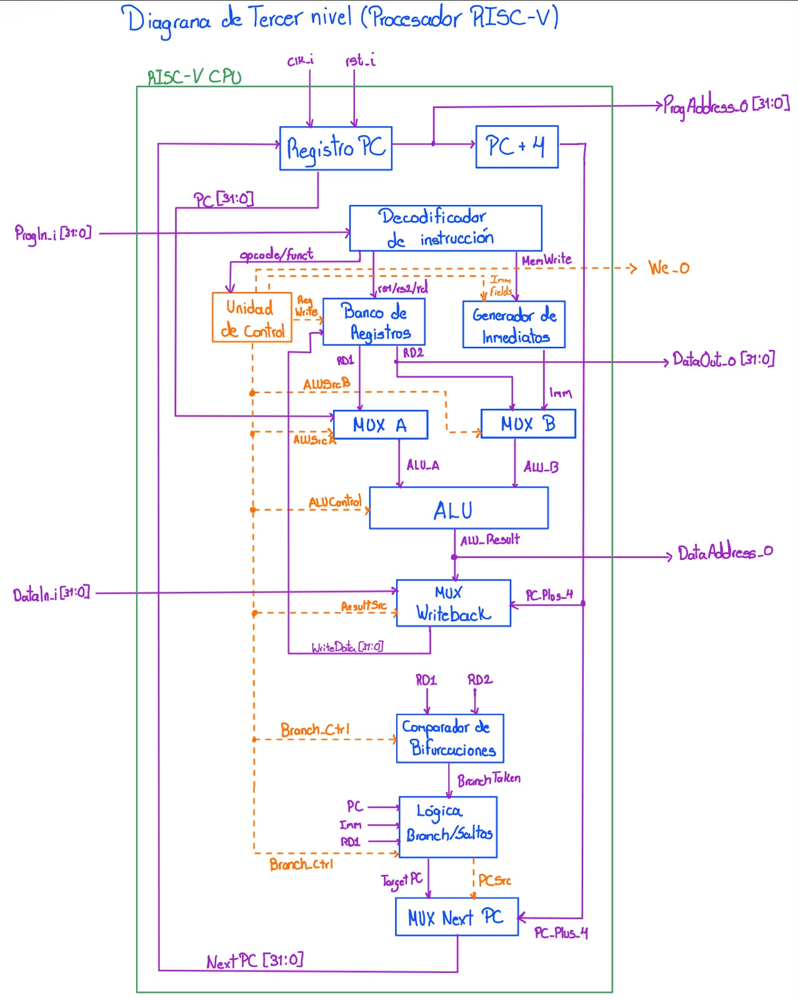
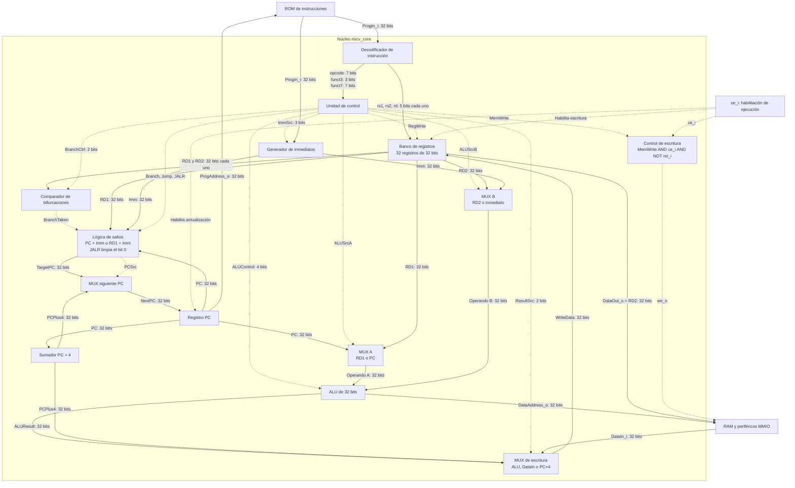
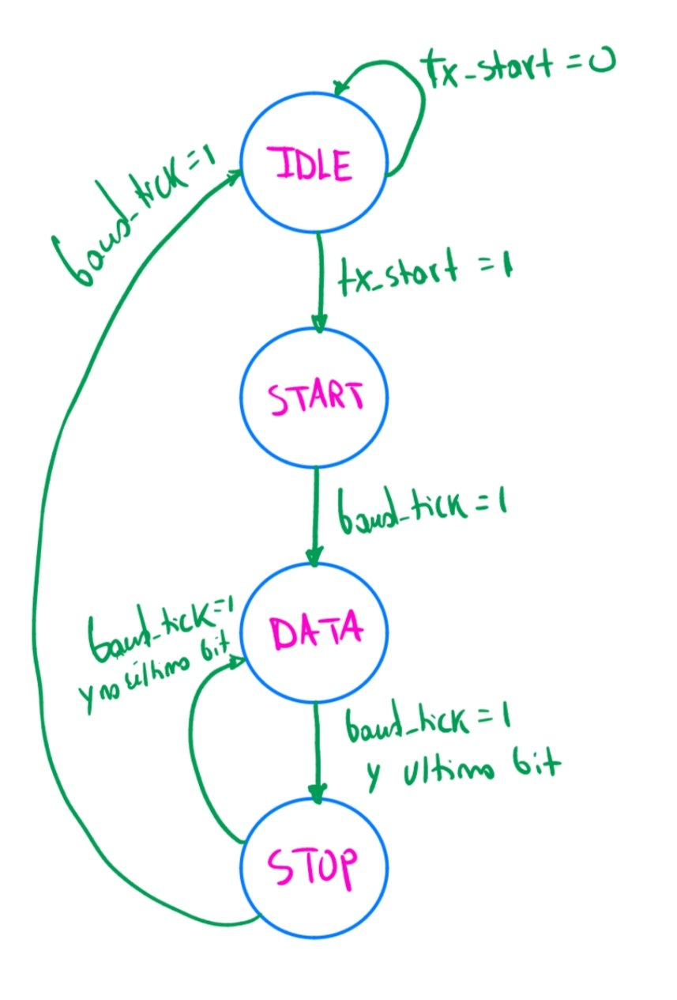
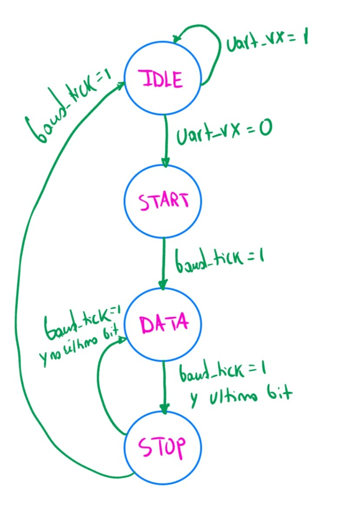
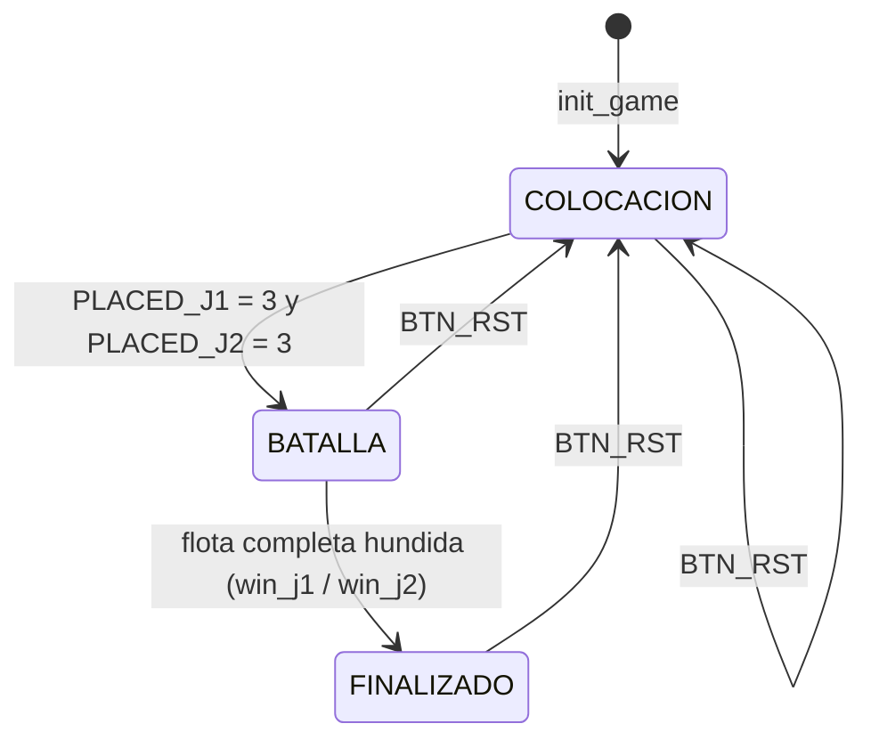

# Informe técnico: Batalla Naval — juego de dos jugadores sobre un microprocesador RISC-V con periférico VGA


## Resumen

Este informe presenta el diseño, la implementación y la verificación de un juego de Batalla Naval para dos jugadores utilizando una FPGA Nexys 4 Rev. B. El sistema integra un procesador RISC-V de 32 bits, memorias ROM y RAM, una interconexión de periféricos mapeados en memoria y periféricos VGA, UART, botones, displays, LED y buzzer. La lógica del juego se ejecuta mediante un programa en ensamblador de 1230 palabras, equivalente al 60,06 % de la ROM. El Jugador 1 utiliza los controles físicos y la pantalla VGA, mientras que el Jugador 2 participa desde una aplicación de PC desarrollada en Python.

La verificación inicial se realizó con 23 testbenches en Icarus Verilog, de los cuales 22 finalizaron correctamente y uno presentó diferencias en las comprobaciones de tiles VGA. Posteriormente, se completaron 33 pruebas del firmware en Vivado XSim y 77 pruebas automatizadas en Python, para un total de 110 pruebas aprobadas en esta etapa. También se comprobó la comunicación UART y se implementó la recuperación de estadísticas, que permite consultar las victorias, los aciertos y los fallos después de reconectar la aplicación.

La síntesis y la implementación se completaron en Vivado 2026.1 y se generó el bitstream utilizado para programar la FPGA. El diseño ocupó 3009 LUT y 1327 flip-flops, con un WNS de +3,653 ns y un WHS de +0,046 ns en las rutas temporizadas analizadas. Las pruebas físicas permitieron comprobar la colocación de barcos, los disparos, los turnos, la detección del ganador y el reinicio de la partida. Como aspectos pendientes quedan la simulación post-implementación temporizada, completar algunas restricciones de entrada y salida e incorporar las evidencias gráficas faltantes.

---

## 1. Introducción

### 1.1 Contexto

Este tercer proyecto del curso integra, por primera vez, el diseño de un microprocesador propio basado en la arquitectura RISC-V con el desarrollo de periféricos mapeados en memoria y la generación de video mediante VGA. A diferencia de los Proyectos 1 y 2, donde el control de la aplicación se describía mediante lógica combinacional, secuencial y máquinas de estado dedicadas en SystemVerilog, en este proyecto el comportamiento de la aplicación se describe como un **programa en lenguaje ensamblador** que se ejecuta sobre un procesador diseñado por el equipo. El hardware desarrollado deja entonces de ser la aplicación en sí misma y pasa a ser la plataforma computacional —núcleo, memorias y periféricos— sobre la cual dicha aplicación corre.

La aplicación es una versión simplificada del clásico juego de Batalla Naval (*Battleship*) para dos jugadores. El **Jugador 1** interactúa físicamente con la tarjeta de FPGA: observa su tablero y el del oponente en un monitor VGA, y coloca barcos y dispara mediante los botones locales. El **Jugador 2** interactúa de forma remota mediante una aplicación de PC, desarrollada por el equipo, que se comunica con la FPGA por UART: despliega en la PC el tablero propio y el estado conocido del tablero rival, y transmite hacia la FPGA las coordenadas de colocación de barcos y de disparo. Todo el control de la partida —colocación, turnos, validación de disparos, detección de barcos hundidos y condición de victoria— se ejecuta exclusivamente en el microprocesador RISC-V dentro de la FPGA; la aplicación de PC es una terminal de entrada/salida remota, de forma análoga al rol que cumplía la PC en el Proyecto 2.

Cada jugador cuenta con un tablero propio de 8×8 casillas y coloca una flota de tres barcos, de tamaños 4, 3 y 2 casillas, en orientación horizontal o vertical, sin traslapes y sin salir del tablero. Una casilla puede encontrarse en uno de cuatro estados visibles: agua, barco propio (visible únicamente a su dueño), impacto o fallo. Un barco se considera hundido cuando todas sus casillas han sido impactadas, y la partida se gana cuando un jugador hunde toda la flota contraria. Como cada jugador dispone de su propia pantalla (VGA para el Jugador 1, aplicación de PC para el Jugador 2), ninguno puede observar la disposición de barcos del otro antes de descubrirla mediante disparos.

### 1.2 Solución desarrollada

La solución es un sistema completo sobre la tarjeta Nexys 4 Rev. B cuyo módulo de nivel superior es `sistema_top`. Dicho módulo instancia el procesador (`processor_subsystem`), la interconexión de periféricos (`address_decoder` y `read_mux`), el periférico VGA (`vga_periferico`), el periférico UART (`uart_peripheral`) y el agrupador de periféricos locales (`perifericos_locales`). Además genera internamente la habilitación de reloj del procesador (`cpu_ce`) y el reset global a partir del botón CPU RESET.

Los bloques principales son:

- **Núcleo RISC-V (`riscv_core`)**: procesador de 32 bits, subconjunto rv32i (29 instrucciones), con buses de instrucciones y de datos independientes.
- **Memorias (`program_rom`, `data_ram`)**: ROM de 8 KiB cargada desde `game.hex` y RAM de 4 KiB para las variables y tableros del juego.
- **Interconexión MMIO (`address_decoder`, `read_mux`)**: selecciona el periférico accedido, genera su habilitación de escritura y multiplexa el dato de lectura de regreso al núcleo.
- **Periférico VGA (`vga_periferico`)**: video 640×480@60 Hz con mapa de 20×15 tiles de 32×32 píxeles, memoria de doble puerto con dos relojes (100 MHz y 25 MHz), generador de color con fuente de texto y cursor superpuesto, y reloj de píxel generado por un MMCM (`clk_wiz_pixel`).
- **Entradas del Jugador 1 (`btn_input`)**: sincronización, antirrebote (`button_debouncer`), detección de flanco y registro de estado de pulsos.
- **UART (`uart_peripheral`, `baud_gen`, `uart_tx`, `uart_rx`)**: periférico reutilizado del Proyecto 2, a 115 200 baudios 8N1.
- **Indicadores locales (`seg7_ctrl`, `led_reg`, `buzzer_gen`)**: marcador de victorias en displays de 7 segmentos, LED de fase y buzzer con cinco patrones sonoros.
- **Programa en ensamblador (`game.S`)**: toda la lógica del juego (colocación, turnos, validación, hundimiento, victoria, reinicio, actualización del VGA y de los indicadores).
- **Aplicación de PC (`pc/src/player2.py`)**: terminal remota del Jugador 2 en Python con Tkinter y pyserial.

En hardware residen el procesador, las memorias y los periféricos, que únicamente exponen registros de entrada/salida. En software (ensamblador) reside absolutamente toda la lógica del juego, y la aplicación de PC no contiene reglas de juego: solo valida el formato de las tramas, las transmite y muestra lo que la FPGA confirma.

<!-- PENDIENTE: confirmar el nombre final del top-level utilizado en Vivado (se asume `sistema_top`) -->

### 1.3 Alcance y limitaciones

Se implementó el sistema completo descrito en el planteamiento: procesador rv32i con 29 instrucciones, memorias separadas, interconexión MMIO, periféricos VGA, entradas, UART, displays, LED y buzzer, programa de juego en ensamblador y aplicación de PC. El código fuente fue verificado mediante testbenches autoverificables en Icarus Verilog (sección 12.1), incluyendo una simulación de partida completa con el firmware real (`game_firmware_tb`).

Durante la implementación se tomaron las siguientes decisiones que se apartan del planteamiento original, y que se documentan como decisiones de diseño:

- **Procesador con habilitación de reloj (`cpu_ce`)**: el núcleo sigue siendo uniciclo, pero en el sistema final confirma una instrucción cada 4 ciclos de `clk_i` (25 MIPS máximos) para relajar el camino crítico a 100 MHz. El archivo de restricciones declara las rutas del PC y del banco de registros como *multicycle path* (setup 4, hold 3).
- **Registro adicional de control del cursor VGA** en `0x0001_0148`, no previsto en el planteamiento, que superpone el cursor sobre la casilla seleccionada sin modificar la memoria de tiles.
- **Texto en el VGA**: se añadió la capacidad de mostrar caracteres (título, marcador y estadísticas) mediante el bit 11 de la palabra de tile y una fuente de 8×8.
- **Buzzer**: en lugar de generar tonos de distintas frecuencias, se utiliza un buzzer activo de corriente continua y cada evento se distingue por un patrón de pitidos (cantidad y duración) generado por una máquina de estados.
- **Mapeo de botones**: la tarjeta solo dispone de cinco pulsadores libres además del CPU RESET, por lo que los siete controles lógicos se asignaron a cuatro pulsadores de navegación, BTNC (OK) y dos interruptores (SW0 = SEL, SW1 = reinicio de la partida).
- **Marcador de victorias** que se conserva al reiniciar la partida con BTN_RST (los contadores solo se ponen en cero al arrancar el sistema).

Limitaciones conocidas:

- Los testbenches del procesador en `cpu/tb` no instancian el puerto `ce_i` agregado posteriormente al núcleo; para ejecutarlos se les debe fijar `ce_i = 1`.
- `sistema_top_tb.sv` declara `anode_o` de 4 bits mientras que el top final lo expone de 8 bits (solo genera una advertencia de relleno).
- El firmware no envía una notificación explícita de «inicio de colocación» por UART al arrancar o reiniciar (la aplicación de PC permite colocar desde que se conecta), y el mensaje `FIN,jugador` no incluye un resumen de la partida (disparos totales, barcos hundidos); el enunciado sugiere ambos.
- Al terminar la partida el VGA muestra el marcador de victorias y las estadísticas pero no un texto explícito con el jugador ganador, y el turno activo se indica únicamente con el cursor (visible solo en el turno del Jugador 1), el LED de fase y la notificación `T` al PC.
- El UART no aplica control de flujo: el Jugador 2 debe esperar la respuesta de la FPGA antes de enviar la siguiente trama.

Durante las pruebas físicas se comprobó el funcionamiento general del sistema. Una limitación identificada es que, al reconectar la aplicación de PC, se recuperan las estadísticas, pero no se reconstruyen automáticamente los tableros, el turno ni la fase de la partida.

---

## 2. Objetivos

### 2.1 Objetivo general

Diseñar e implementar, sobre una FPGA, un microprocesador RISC-V de 32 bits (subconjunto rv32i) capaz de ejecutar un programa en ensamblador que controle por completo un juego de Batalla Naval de dos jugadores, coordinando un jugador local mediante VGA y botones y un jugador remoto conectado por UART mediante una aplicación de PC.

### 2.2 Objetivos específicos

1. Diseñar e implementar un microprocesador rv32i, sintetizable, con memorias de programa y de datos accedidas mediante buses independientes.
2. Diseñar el mapa de memoria del sistema y la interconexión de periféricos mapeados en memoria que integra la RAM y los periféricos.
3. Diseñar un periférico de video VGA de 640×480 a 60 Hz basado en un mapa de tiles, con reloj de píxel de 25 MHz generado mediante MMCM, que permita actualizar una casilla con una única escritura del CPU.
4. Diseñar un periférico de entradas del Jugador 1 con antirrebote, y los periféricos de salida locales (displays de 7 segmentos, LED de estado y buzzer).
5. Reutilizar el periférico UART del Proyecto 2 como único canal del Jugador 2 y definir el protocolo de aplicación sobre UART entre la aplicación de PC y el microprocesador.
6. Implementar en ensamblador RISC-V la lógica completa del juego: colocación de barcos de ambos jugadores, alternancia de turnos, validación de disparos, detección de barcos hundidos y determinación de la partida.
7. Implementar la aplicación de PC del Jugador 2 como terminal de entrada/salida remota, sin lógica de juego propia.
8. Garantizar que ningún jugador pueda observar la disposición de barcos del otro antes de descubrirla mediante disparos.
9. Verificar el sistema mediante testbenches autoverificables y simulación post-implementación temporizada, y validar su funcionamiento en la FPGA.
10. Aplicar una metodología de diseño modular y validación por etapas, separando el núcleo, las memorias y cada periférico como bloques independientes y verificables, y analizar cómo las decisiones de arquitectura condicionan el programa que se ejecuta sobre ellos.

---

## 3. Especificaciones

### 3.1 Requisitos funcionales

**Tabla 3.1.** Requisitos funcionales y su implementación final.

| Requisito | Valor especificado | Implementación final |
|---|---|---|
| Tablero | 8×8 casillas por jugador | `BOARD_J1`/`BOARD_J2` de 64 palabras cada uno en RAM |
| Flota | 3 barcos de 4, 3 y 2 casillas | Identificadores 0, 1 y 2; longitud = 4 − id |
| Orientación | Horizontal o vertical | `ORIENTATION` (0 = H, 1 = V) para J1; campo `H`/`V` en la trama `P` para J2 |
| Estados de casilla | Agua, barco, impacto, fallo | `CELL_WATER=0`, `CELL_SHIP=1`, `CELL_HIT=2`, `CELL_MISS=3` |
| Barco hundido | Todas sus casillas impactadas | `check_ship_sunk_j1` / `check_ship_sunk_j2` |
| Condición de victoria | Hundir toda la flota rival | `check_win_j1` / `check_win_j2`; se envía `FIN,jugador` |
| Colocación concurrente | Ambos jugadores colocan a la vez | J1 con botones y J2 por UART; la batalla inicia cuando `PLACED_J1` y `PLACED_J2` valen 3 |
| Colocación inválida | Se rechaza (fuera de tablero, traslape) | J1: buzzer de colocación inválida; J2: `PR,barco,F` o `PR,barco,O` |
| Disparo repetido | No permitido | Se ignora y el turno no cambia |
| Procesador | RISC-V rv32i | 29 instrucciones, `riscv_core` de ciclo único con `cpu_ce` cada 4 ciclos |
| Memorias | ROM y RAM con buses independientes | ROM 8 KiB (2048 palabras), RAM 4 KiB (1024 palabras) |
| Relojes | 100 MHz y 25 MHz (píxel) | `clk_i` de la tarjeta y `clk_wiz_pixel` (MMCM) para el VGA |
| Video | VGA 640×480@60 Hz, mapa de tiles | 20×15 tiles de 32×32 px, 12 bits de color (4 por canal) |
| Entradas J1 | Arriba, abajo, izquierda, derecha, SEL, OK, RST con antirrebote | `btn_input`, antirrebote de 10 ms, registro de pulsos en `0x0001_0120` |
| UART | Canal único del Jugador 2 | 115 200 baudios, 8N1, ASCII terminado en `\n` |
| Displays | Marcador de victorias | 4 dígitos BCD en `0x0001_0130`, multiplexados |
| LED | Fase del juego | `led_o[2:0]`: 001 colocación, 010 batalla, 100 fin |
| Buzzer | Sonido por evento | 5 patrones de pitidos en `0x0001_0140` |
| BTN_RST | Reinicia la partida | `init_game` limpia tableros, VGA y estado; conserva las victorias |

### 3.2 Mapa de memoria

**Tabla 3.2.** Mapa de memoria del sistema (direcciones de byte; el núcleo solo accede a palabras alineadas).

| Región | Rango de direcciones | Contenido |
|---|---|---|
| ROM de instrucciones | `0x0000_0000` – `0x0000_1FFF` | Programa `game.hex` (bus de instrucciones independiente) |
| RAM de datos | `0x0000_2000` – `0x0000_2FFF` | Variables de juego, tableros y estado del parser UART |
| Periféricos MMIO | `0x0001_0000` – `0x0001_0FFF` | UART, entradas, display, LED, buzzer y control del cursor |
| Memoria de video VGA | `0x0001_1000` – `0x0001_14AF` (decodificador: hasta `0x0001_17FF`) | 300 palabras de tile (20×15) |

Los accesos fuera de estos rangos devuelven cero al leer y se ignoran al escribir. La ROM solo es accesible por el bus de instrucciones. La figura siguiente resume el mapa.

```text
0x0000_0000  ┌──────────────────┐
             │ ROM (8 KiB)      │  bus de instrucciones
0x0000_1FFF  └──────────────────┘
0x0000_2000  ┌──────────────────┐
             │ RAM (4 KiB)      │  bus de datos
0x0000_2FFF  └──────────────────┘
0x0001_0040  ┌──────────────────┐
             │ UART (3 reg.)    │
0x0001_0120  │ Entradas J1      │
0x0001_0130  │ Display 7 seg.   │
0x0001_0138  │ LED              │
0x0001_0140  │ Buzzer           │
0x0001_0148  │ Cursor VGA       │
             ├──────────────────┤
0x0001_1000  │ Memoria VGA      │
0x0001_14AF  └──────────────────┘
```

**Figura 3.1.** Mapa de memoria. Se observa que RAM y periféricos comparten el bus de datos y se separan solo por dirección.

### 3.3 Direcciones de periféricos

**Tabla 3.3.** Registros de los periféricos (coinciden con las constantes `.equ` de `game.S` y con `address_decoder`).

| Periférico | Registro | Offset | Dirección | Acceso |
|---|---|---|---|---|
| UART | STATUS | `0x040` | `0x0001_0040` | Lectura / escritura (limpia RX_VALID) |
| UART | TX | `0x044` | `0x0001_0044` | Escritura |
| UART | RX | `0x048` | `0x0001_0048` | Lectura |
| Entradas J1 | `btn_status` | `0x120` | `0x0001_0120` | Solo lectura |
| Display 7 seg. | `disp_data` | `0x130` | `0x0001_0130` | Escritura / lectura |
| LED | `led_status` | `0x138` | `0x0001_0138` | Escritura / lectura |
| Buzzer | control | `0x140` | `0x0001_0140` | Escritura / lectura |
| Cursor VGA | `vga_cursor_ctrl` | `0x148` | `0x0001_0148` | Escritura |
| Memoria VGA | tile *n* | `0x1000 + 4n` | `0x0001_1000 + 4n` | Escritura |

Las constantes de `game.S` son `UART_STATUS`, `UART_TX`, `UART_RX`, `INPUT`, `DISPLAY`, `LED`, `BUZZER` y `VGA_BASE`; el cursor se escribe con el desplazamiento `0x148` respecto a la base MMIO. El planteamiento original no listaba el registro del cursor.

### 3.4 Conjunto de instrucciones soportado

**Tabla 3.4.** Instrucciones implementadas (29), agrupadas por formato.

| Formato | Instrucciones | opcode | funct3 / funct7 |
|---|---|---|---|
| R | ADD, SUB | `0110011` | 000 / 0000000, 0100000 |
| R | SLL, SLT, SLTU | `0110011` | 001, 010, 011 / 0000000 |
| R | XOR, OR, AND | `0110011` | 100, 110, 111 / 0000000 |
| R | SRL, SRA | `0110011` | 101 / 0000000, 0100000 |
| I (aritmética) | ADDI, SLTI, SLTIU, XORI, ORI, ANDI | `0010011` | 000, 010, 011, 100, 110, 111 |
| I (desplazamiento) | SLLI, SRLI, SRAI | `0010011` | 001, 101, 101 / 0000000, 0000000, 0100000 |
| I (carga) | LW | `0000011` | 010 |
| I (salto) | JALR | `1100111` | 000 |
| S | SW | `0100011` | 010 |
| B | BEQ, BNE, BLT, BGE | `1100011` | 000, 001, 100, 101 |
| U | LUI | `0110111` | — |
| U | AUIPC | `0010111` | — |
| J | JAL | `1101111` | — |

No se implementan cargas/almacenamientos de byte o media palabra, BLTU/BGEU, FENCE, ECALL/EBREAK ni extensiones; no existen interrupciones ni excepciones. El programa `game.S` se ensambla con `-march=rv32i` y solo utiliza este subconjunto.

### 3.5 Interfaz estándar de periféricos

**Tabla 3.5.** Señales de la interfaz común de periféricos.

| Señal | Ancho | Dirección | Descripción |
|---|---|---|---|
| `clk_i` | 1 | Entrada | Reloj del sistema (100 MHz) |
| `rst_i` | 1 | Entrada | Reset síncrono activo en alto |
| `we_i` / `write_enable_i` | 1 | Entrada | Escritura, ya calificada por la selección del periférico |
| `addr_i` | 2 | Entrada | Selección de registro (solo UART, que tiene tres registros) |
| `wdata_i` | 32 | Entrada | Dato de escritura |
| `rdata_o` | 32 | Salida | Dato de lectura, enviado a `read_mux` |

Los periféricos de una sola palabra (entradas, display, LED, buzzer) no reciben `addr_i`: el decodificador genera una señal `we_X` dedicada para cada uno. El UART recibe `addr_i = (mmio_addr − 0x10040) >> 2`. El VGA es la excepción: recibe una dirección de tile de 9 bits `vga_addr_i = (mmio_addr − 0x11000) >> 2` y no devuelve datos (la memoria es de solo escritura para el CPU, `rdata` fijo en cero). El reset interno `rst_i` se deriva de `rst_ni` (botón activo en bajo) invertido, y todos los registros lo aplican de forma síncrona.

### 3.6 Memoria de video del periférico VGA

La pantalla de 640×480 se divide en una cuadrícula de **20 columnas × 15 filas** de tiles de 32×32 píxeles (300 tiles). La dirección de byte del tile en fila `f` y columna `c` es

`0x0001_1000 + 4·(f·20 + c)`

y el CPU actualiza una casilla con una única escritura. Se eligió 32×32 porque es potencia de dos (la división se reduce a tomar `hcount[9:5]` y `vcount[9:5]`), porque 8×8 casillas caben holgadamente (los dos tableros ocupan 8 filas y 8 columnas cada uno) y porque cabe en una sola memoria de 300 palabras.

Los dos tableros se dibujan en las filas 6 a 13: el del Jugador 1 en las columnas 1 a 8 y el del Jugador 2 en las columnas 11 a 18. Las demás posiciones se usan para el HUD de texto.

**Tabla 3.6.** Formato de la palabra de tile (32 bits; solo se usan los 12 bits inferiores).

| Bits | Campo | Descripción |
|---|---|---|
| [31:12] | — | Ignorados |
| [11] | `TEXT_ENABLE` | 1 = el tile muestra un carácter de la fuente |
| [10:3] | `ASCII` | Código del carácter (si `TEXT_ENABLE = 1`) |
| [2:0] | `color` | Estado de la casilla o color del carácter |

**Tabla 3.7.** Codificación de color de las casillas de tablero.

| Valor [2:0] | Estado | Color RGB (4 bits por canal) |
|---|---|---|
| `000` | Agua | (0, 4, 15) azul |
| `001` | Barco propio | (8, 8, 8) gris |
| `010` | Impacto | (15, 0, 0) rojo |
| `011` | Fallo | (15, 15, 15) blanco |
| otros | Depuración | (15, 0, 15) magenta |

Los tiles de texto se dibujan en blanco sobre negro. El **cursor** se controla con el registro `0x0001_0148` y se superpone como un borde amarillo de 2 píxeles: bit 7 = visible, bit 6 = tablero (0 = J1, 1 = J2), bits [5:3] = fila y bits [2:0] = columna. Una dirección fuera de rango (≥ 300) se ignora al escribir y se lee como cero. La memoria **no se limpia por hardware**: el firmware (`init_game`) escribe ceros en las 300 posiciones y dibuja el título.

### 3.7 Registro de entradas del Jugador 1

**Tabla 3.8.** Registro `btn_status` (`0x0001_0120`, solo lectura).

| Bit | Señal | Botón físico (Nexys 4) | Tipo |
|---|---|---|---|
| 0 | Arriba | BTNU | Pulso (sticky) |
| 1 | Abajo | BTND | Pulso (sticky) |
| 2 | Izquierda | BTNL | Pulso (sticky) |
| 3 | Derecha | BTNR | Pulso (sticky) |
| 4 | SEL (rotar orientación) | SW0 | Pulso (sticky) |
| 5 | OK (confirmar / disparar) | BTNC | Pulso (sticky) |
| 6 | RST (reiniciar partida) | SW1 | Pulso (sticky) |
| [31:7] | — | — | 0 |

Cada bit se pone en 1 cuando se detecta un flanco de subida de la entrada ya filtrada, y permanece en 1 hasta que el CPU realiza una lectura de la dirección `0x0001_0120` (`input_ack_i`), momento en que se borra. De esta forma una pulsación genera exactamente un evento aunque el programa tarde en consultarla.

### 3.8 Registros del periférico UART

**Tabla 3.9.** Registros del periférico UART.

| Dirección | `addr_i` | Registro | Bits | Descripción |
|---|---|---|---|---|
| `0x0001_0040` | `00` | STATUS | [0] `TX_BUSY` | 1 mientras se transmite un byte |
| | | | [1] `RX_VALID` | 1 si hay un byte recibido sin leer; se limpia escribiendo 1 en este bit |
| | | | [2] `RX_FRAME_ERROR` | 1 si el último bit de parada fue inválido |
| `0x0001_0044` | `01` | TX | [7:0] | Escribir inicia la transmisión del byte |
| `0x0001_0048` | `10` | RX | [7:0] | Último byte válido recibido |

Respecto al Proyecto 2 se conservó el periférico sin cambios funcionales; el firmware limpia `RX_VALID` escribiendo el valor 2 en STATUS inmediatamente después de leer RX, y espera `TX_BUSY = 0` antes de cada escritura en TX.

### 3.9 Protocolo de aplicación sobre UART

El protocolo es de **líneas de texto ASCII**: cada trama es una secuencia de campos separados por comas y terminada en el carácter de nueva línea `\n` (0x0A). Es legible a simple vista en un terminal serial y se interpreta byte a byte con una máquina de estados sin necesidad de búfer.

#### Trama física UART

**Tabla 3.10.** Parámetros de la trama física.

| Parámetro | Valor |
|---|---|
| Velocidad | 115 200 baudios |
| Bits de datos | 8 (LSB primero) |
| Paridad | Ninguna |
| Bits de parada | 1 |
| Ciclos de `clk_i` por bit | 868 (100 MHz / 115 200) |
| Control de flujo | Ninguno |

#### Mensajes PC → FPGA

**Tabla 3.11.** Mensajes del Jugador 2 hacia la FPGA.

| Mensaje | Formato | Campos | Significado |
|---|---|---|---|
| Colocación | `P,barco,fila,col,orient\n` | barco ∈ {0,1,2}; fila, col ∈ {0..7}; orient ∈ {H,V} | Coloca el barco en (fila, col) |
| Disparo | `S,fila,col\n` | fila, col ∈ {0..7} | Dispara a la casilla del Jugador 1 |
| Consulta de estadísticas | `Q\n` | Sin campos adicionales | Solicita los contadores actuales de ambos jugadores |

El barco 0 mide 4 casillas, el barco 1 mide 3 y el barco 2 mide 2. Una colocación horizontal ocupa (fila, col) … (fila, col+largo−1) y una vertical (fila, col) … (fila+largo−1, col).

#### Mensajes FPGA → PC

**Tabla 3.12.** Mensajes de la FPGA hacia el Jugador 2.

| Mensaje | Formato | Significado | Evento |
|---|---|---|---|
| `PA` | `PA,barco\n` | Colocación aceptada | Respuesta a `P` válida |
| `PR` | `PR,barco,F\n` | Rechazada: fuera del tablero | Respuesta a `P` inválida |
| `PR` | `PR,barco,O\n` | Rechazada: traslape o barco repetido | Respuesta a `P` inválida |
| `B` | `B\n` | Inicio de la batalla | Ambas flotas completas |
| `T` | `T,jugador\n` | Turno del jugador 1 o 2 | Inicio de batalla y tras cada disparo válido |
| `SR` | `SR,fila,col,res\n` | Resultado del disparo del J2 | res ∈ {F fallo, I impacto, H hundido} |
| `DR` | `DR,fila,col,res\n` | Resultado del disparo del J1 (mismo formato) | Informa al J2 sobre el disparo local |
| `FIN` | `FIN,jugador\n` | Fin de la partida y ganador | Victoria de J1 o J2 |
| `ST` | `ST,V1,V2,A1,F1,A2,F2\n` | Estadísticas acumuladas y de la partida | Respuesta a `Q` |

#### Consulta y sincronización de estadísticas

La aplicación del Jugador 2 envía `Q\n` al establecer una conexión
UART para consultar las estadísticas almacenadas en la FPGA.

El firmware responde con:

`ST,V1,V2,A1,F1,A2,F2\n`

Los seis campos numéricos representan, en orden:

- `V1`: victorias acumuladas del Jugador 1.
- `V2`: victorias acumuladas del Jugador 2.
- `A1`: disparos acertados del Jugador 1.
- `F1`: disparos fallidos del Jugador 1.
- `A2`: disparos acertados del Jugador 2.
- `F2`: disparos fallidos del Jugador 2.

Cada contador se transmite mediante dos dígitos ASCII. Las victorias
se almacenan en `WINS_J1` y `WINS_J2`, mientras que los aciertos y
fallos se obtienen de los registros `SHOTS_J1` y `SHOTS_J2`.

Al reiniciar una partida mediante `BTN_RST`, se conservan las victorias
acumuladas y se limpian los registros de disparos; por tanto, los
contadores de aciertos y fallos vuelven a cero.

La consulta permite recuperar las estadísticas al reconectar la
aplicación de PC sin reiniciar la FPGA. No reconstruye el tablero,
el turno ni la fase actual de la partida.

#### Manejo de datos inválidos

El receptor del firmware (`poll_uart`) es una máquina de estados que reconoce los comandos `P`, `S` y `Q` que valida cada carácter esperado (letra inicial, comas, dígitos 0–7, `H`/`V` y `\n`). Ante cualquier carácter inesperado, la máquina vuelve al estado 0 y **descarta la trama sin responder**. Los valores sintácticamente válidos pero ilegales se rechazan en `process_uart_place` con `PR` (fuera de tablero o traslape/barco ya colocado). Los disparos recibidos fuera de la fase de batalla, fuera del turno del J2 o sobre una casilla ya disparada se ignoran sin cambiar el estado. La aplicación de PC, por su parte, valida los campos antes de enviar (sección 10.3).

#### Ejemplo de intercambio

**Tabla 3.13.** Secuencia de ejemplo (el Jugador 1 ya colocó su flota).

| # | Dirección | Trama | Efecto |
|---|---|---|---|
| 1 | PC → FPGA | `P,0,0,0,H\n` | Barco de 4 en la fila 0, columnas 0–3 |
| 2 | FPGA → PC | `PA,0\n` | Aceptado |
| 3 | PC → FPGA | `P,1,0,2,H\n` | Traslapa con el barco 0 |
| 4 | FPGA → PC | `PR,1,O\n` | Rechazado |
| 5 | PC → FPGA | `P,1,5,0,V\n` | Fuera del tablero (5+3 > 8) |
| 6 | FPGA → PC | `PR,1,F\n` | Rechazado |
| 7 | PC → FPGA | `P,1,2,0,H\n`, `P,2,4,0,V\n` | Completa la flota; ambas aceptadas con `PA,1` y `PA,2` |
| 8 | FPGA → PC | `B\n`, `T,1\n` | Inicia la batalla, turno del J1 |
| 9 | FPGA → PC | `DR,0,0,I\n`, `T,2\n` | J1 dispara a (0,0): impacto; turno del J2 |
| 10 | PC → FPGA | `S,0,0\n` | J2 dispara a (0,0) |
| 11 | FPGA → PC | `SR,0,0,I\n`, `T,1\n` | Impacto; turno del J1 |

Los formatos `PR,1,O`, `PR,1,F`, `SR` y `DR` son los que emite `game.S` y los que verifica `game_firmware_tb`.

### 3.10 Organización de datos en RAM

**Tabla 3.14.** Variables en RAM (base `0x0000_2000`, una palabra de 32 bits por variable).

| Dirección | Nombre | Descripción |
|---|---|---|
| `0x2000` | `GAME_STATE` | 0 colocación, 1 batalla, 2 finalizado |
| `0x2004` | `TURN` | 1 = Jugador 1, 2 = Jugador 2 |
| `0x2008` | `CURSOR_ROW` | Fila del cursor (0–7) |
| `0x200C` | `CURSOR_COL` | Columna del cursor (0–7) |
| `0x2010` | `ORIENTATION` | 0 horizontal, 1 vertical |
| `0x2014` | `CURRENT_SHIP` | Barco en colocación del J1 (0–2) |
| `0x2018` | `PLACED_J1` | Barcos colocados por J1 |
| `0x201C` | `PLACED_J2` | Barcos colocados por J2 |
| `0x2020` | `WINS_J1` | Victorias de J1 (se conserva al reiniciar) |
| `0x2024` | `WINS_J2` | Victorias de J2 (se conserva al reiniciar) |
| `0x2100`–`0x21FC` | `BOARD_J1` | 64 palabras: 0 agua, 1–3 identidad del barco |
| `0x2200`–`0x22FC` | `BOARD_J2` | 64 palabras: 0 agua, 1–3 identidad del barco |
| `0x2300`–`0x23FC` | `SHOTS_J1` | 64 palabras: 0 sin disparar, 2 impacto, 3 fallo |
| `0x2400`–`0x24FC` | `SHOTS_J2` | 64 palabras: 0 sin disparar, 2 impacto, 3 fallo |
| `0x2500` | `UART_LAST_BYTE` | Último byte recibido |
| `0x2504` | `UART_PARSE_STATE` | Estado del parser (0–14) |
| `0x2508`–`0x2514` | `UART_SHIP/ROW/COL/ORIENT` | Campos de la trama en curso |
| `0x2518` | `UART_FRAME_READY` | 1 cuando hay una trama completa |
| `0x251C` | `J2_SHIP_MASK` | Máscara de barcos ya colocados por J2 |
| `0x2520` | `UART_CMD` | Tipo de trama (1 = P, 2 = S, 3 = Q) |

El índice de una casilla es `fila·8 + columna` y su dirección es `base + 4·índice`. En los tableros `BOARD_*` se guarda la identidad del barco (1 a 3, igual a `barco + 1`) para poder determinar si un barco quedó hundido; `SHOTS_*` solo guarda impacto o fallo.

### 3.11 Requisitos eléctricos

El sistema se implementa en la tarjeta **Digilent Nexys 4 Rev. B** (FPGA Xilinx Artix-7 XC7A100T-1CSG324C). Todos los pines de usuario usan el estándar **LVCMOS33** (3,3 V). Los pulsadores y los interruptores son activos en alto, excepto el botón CPU RESET, que es activo en bajo. El VGA utiliza un DAC resistivo de 4 bits por canal (12 bits de color) directamente conectado a la FPGA, con `hsync` y `vsync` activos en bajo. La UART utiliza el puente USB-UART integrado de la tarjeta (pines C4 y D4), por lo que la PC se conecta con el mismo cable USB de programación. Los displays de 7 segmentos son de ánodo común, con ánodos y segmentos activos en bajo. El LED de estado se conecta a LED0–LED2 (activos en alto). El buzzer es de tipo **activo de corriente continua** conectado al pin 1 del conector PMOD JA (B13), accionado directamente por la salida digital `buzz_pwm_o`; un nivel alto lo hace sonar.

<!-- PENDIENTE: confirmar el modelo exacto del buzzer y su corriente de consumo respecto al límite del pin PMOD -->

---

## 4. Fundamentación teórica


### 4.1 Arquitectura RISC-V y el subconjunto rv32i

RISC-V es una arquitectura de conjunto de instrucciones abierta y modular. La base de enteros de 32 bits (rv32i) define 32 registros de propósito general (`x0` vale siempre cero) y instrucciones de 32 bits con seis formatos: R (registro–registro), I (inmediato y cargas), S (almacenamientos), B (bifurcaciones), U (inmediato superior) y J (saltos). En todos ellos `opcode` ocupa los bits [6:0], y `rd`, `funct3`, `rs1`, `rs2` y `funct7` aparecen siempre en las mismas posiciones, lo que simplifica el decodificador. Los inmediatos se extienden en signo desde el bit 31.

En este proyecto se implementó el subconjunto de 29 instrucciones listado en la Tabla 3.4: aritmética, lógica, desplazamientos, comparaciones, `LW`/`SW`, cuatro bifurcaciones, `JAL`, `JALR`, `LUI` y `AUIPC`. Es suficiente para que el ensamblador (`-march=rv32i`) genere todo el programa del juego sin recurrir a multiplicación ni a accesos de byte: las multiplicaciones por 8 o 20 se resuelven con desplazamientos y sumas (por ejemplo, `fila*20 = (fila<<4) + (fila<<2)` en `game.S`). El módulo `instruction_decoder` separa los campos y `immediate_generator` construye los inmediatos I, S, B, J y U.

### 4.2 Datapath de ciclo único y unidad de control

En un procesador de ciclo único cada instrucción se completa en un único ciclo de reloj: se busca la instrucción, se decodifica, se leen los registros, se opera en la ALU, se accede a memoria si corresponde y se escribe el resultado. La unidad de control (`control_unit`) genera, a partir de `opcode`, `funct3` y `funct7`, las señales que gobiernan los multiplexores (`ALUSrcA`, `ALUSrcB`, `ResultSrc`), la operación de la ALU, la escritura del banco de registros y la escritura de memoria. El siguiente PC se elige entre `PC+4` y el destino de salto según el comparador de bifurcaciones.

La frecuencia máxima de un diseño de ciclo único está limitada por el camino crítico: la ruta más larga entre el PC, la ROM, el banco de registros, la ALU, la RAM o los periféricos y el registro de destino. Para no depender de que ese camino quepa en 10 ns, el sistema integra una **habilitación de reloj** (`cpu_ce`) que permite que el PC, el banco de registros y las escrituras ocurran una vez cada 4 ciclos de `clk_i`. Funcionalmente el procesador sigue siendo de ciclo único (una instrucción por cada confirmación), pero el análisis de timing puede tratar esas rutas como *multicycle path* de 4 ciclos (40 ns), lo que se declara en el archivo de restricciones. La velocidad efectiva es de 100 MHz / 4 = 25 MIPS como máximo, sobrada para un juego por turnos.

### 4.3 Memorias y buses independientes de programa y datos

Una arquitectura tipo Harvard usa memorias y buses distintos para instrucciones y datos. En este diseño la ROM se conecta al núcleo por `ProgAddress_o`/`ProgIn_i` y la RAM y los periféricos comparten el bus de datos (`DataAddress_o`, `DataOut_o`, `we_o`, `DataIn_i`). Como la búsqueda de la instrucción y el acceso a datos pueden ocurrir en el mismo ciclo sin competir por un puerto, una instrucción `LW` o `SW` no necesita ciclos adicionales y el ciclo de instrucción se mantiene único. La ROM (8 KiB) se inicializa desde `game.hex` con `$readmemh`, y la RAM (4 KiB) conserva su contenido ante un reset, por lo que el firmware inicializa explícitamente todas las variables antes de usarlas (`init_game`).

### 4.4 Entrada/salida mapeada en memoria

En la E/S mapeada en memoria los registros de los periféricos ocupan direcciones del mismo espacio que la memoria de datos, y el procesador los accede con las mismas instrucciones `LW`/`SW`. Un decodificador de direcciones (`address_decoder`) compara la dirección con el rango de cada dispositivo y produce una señal de selección `sel_X` y una habilitación de escritura `we_X = we & sel_X`; un multiplexor de lectura (`read_mux`) devuelve al núcleo el dato del dispositivo seleccionado, o cero si ninguno lo está. Cada periférico expone registros de **control** (por ejemplo el buzzer y el cursor VGA), de **estado** (el STATUS del UART) y de **datos** (TX, RX, tiles y marcador). Este esquema evita instrucciones especiales de E/S y permite que el programa en ensamblador controle todo el hardware con direcciones constantes (Tabla 3.3).

Un cuidado importante es que las lecturas pueden tener efectos secundarios: el registro de entradas se limpia al leerse. Por ello `sistema_top` genera `input_ack_i` solo cuando se lee esa dirección en el ciclo en que el CPU confirma la instrucción (`cpu_ce`), y no por el simple hecho de que la dirección esté seleccionada.

### 4.5 Generación de video VGA

Un monitor VGA se refresca recorriendo la imagen línea por línea. Dos señales de sincronismo (`hsync`, `vsync`, activas en bajo) delimitan cada línea y cada cuadro; entre ellos, el intervalo visible lleva los colores analógicos de los tres canales. Una resolución de 640×480 a 60 Hz usa un reloj de píxel nominal de 25,175 MHz; en este proyecto se emplea 25 MHz, que está dentro de la tolerancia de los monitores comunes.

**Tabla 4.1.** Temporización VGA 640×480@60 Hz (en períodos de reloj de píxel y en líneas).

| Parámetro | Horizontal (píxeles) | Vertical (líneas) |
|---|---|---|
| Zona visible | 640 | 480 |
| Front porch | 16 | 10 |
| Pulso de sincronismo | 96 | 2 |
| Back porch | 48 | 33 |
| **Total** | **800** | **525** |

La frecuencia de refresco es `f_pix / (800·525) = 25 MHz / 420 000 ≈ 59,52 Hz`. El generador `vga_timing` implementa dos contadores (`hcount` de 0 a 799 y `vcount` de 0 a 524), genera `hsync` y `vsync` por comparación de rangos y produce `video_on` cuando `hcount < 640` y `vcount < 480`. La salida de color se fuerza a negro fuera de la zona visible.

### 4.6 Gráficos orientados a tiles frente a framebuffer

Un *framebuffer* completo almacena el color de cada píxel: 640×480 = 307 200 píxeles; con 12 bits por píxel son 3 686 400 bits (≈ 3,5 Mbit), un 72 % de la memoria de bloque de la FPGA XC7A100T (4,86 Mbit) y, sobre todo, obligaría al CPU a escribir cientos de miles de palabras para redibujar la pantalla. Un mapa de *tiles* almacena en cambio un código por cada bloque de 32×32 píxeles: 20×15 = 300 palabras de 32 bits = 9 600 bits, unas 380 veces menos. Actualizar una casilla del juego cuesta una sola escritura, y el hardware calcula el color de cada píxel a partir del código del tile (agua, barco, impacto, fallo o carácter de texto) y de la posición dentro del tile. Esta es la razón por la que la lógica de juego (en ensamblador) puede dibujar los tableros, el marcador y el título con sencillas escrituras a `0x0001_1000 + 4·n`.

### 4.7 Memorias de doble puerto y cruce de dominios de reloj

La memoria de tiles es escrita por el CPU en el dominio de `clk_i` (100 MHz) y leída por la lógica de video en el dominio del reloj de píxel (25 MHz). Se modela como una memoria de doble puerto con dos relojes independientes: el puerto A escribe de forma síncrona con `clk_i` y el puerto B lee de forma síncrona con `clk_pix`. Como cada puerto es síncrono con su propio reloj y el CPU nunca lee la memoria de video, no se requiere un sincronizador adicional para los datos: la memoria desacopla ambos dominios. La lectura tiene una latencia de un ciclo de `clk_pix`, que se compensa retrasando un ciclo las señales de posición (`video_on`, posición dentro del tile y columna/fila del tile) que viajan hacia el generador de color.

El reloj de píxel se obtiene con un MMCM (Clocking Wizard, `clk_wiz_pixel`) a partir de los 100 MHz de la tarjeta. La señal `locked` del MMCM indica que el reloj es estable, y el reset del dominio de video se mantiene activo hasta que `locked = 1` (`rst_pix = rst_i | ~pll_locked`). Las únicas señales que cruzan de dominio son el reset (de `clk_i` a `clk_pix`), que se mantiene activo hasta que el MMCM está estable, y el registro del cursor, que cambia de forma infrecuente y cuyo efecto visual es tolerante a una actualización de un cuadro.

### 4.8 Metaestabilidad y sincronización de entradas asíncronas

Cuando una señal asíncrona (un pulsador, el pin de recepción de la UART) llega a un flip-flop y cambia cerca del flanco de reloj, la salida puede tardar un tiempo no acotado en resolverse a un nivel válido (metaestabilidad). La solución estándar es un sincronizador de dos flip-flops en cascada: el primero puede quedar metaestable, pero el segundo captura una señal que ya se resolvió con probabilidad muy alta. En este proyecto cada una de las siete líneas de `btn_input` pasa por un sincronizador de dos etapas antes de cualquier otra lógica, y `uart_rx` toma `uart_rx_i` a través de un registro de sincronización antes de muestrear los bits.

### 4.9 Antirrebote de pulsadores

Los contactos mecánicos rebotan durante unos milisegundos al cerrarse o abrirse, generando múltiples transiciones. Un filtro temporizado solo acepta un nuevo valor cuando la entrada se mantiene estable durante un tiempo mínimo; en este proyecto se reutiliza `button_debouncer` (del Proyecto 2) con una ventana de 10 ms, contada con una base de 1 ms (`ce_1ms`), es decir, 1 000 000 de ciclos de `clk_i` entre cambios aceptados. Tras el filtro, un detector de flanco compara el valor estable actual con el anterior para generar un pulso de un ciclo en cada pulsación. Finalmente, un registro de estado «pegajoso» (*sticky*) retiene ese pulso hasta que el CPU lo lee, de modo que el programa en ensamblador, que consulta los botones a una velocidad no sincronizada con la pulsación, nunca pierde ni duplica un evento.

### 4.10 Protocolo UART asíncrono

La UART transmite bytes de forma asíncrona sin línea de reloj: la línea está en alto en reposo, un bit de inicio (0) marca el comienzo, siguen los 8 bits de datos (LSB primero) y un bit de parada (1) cierra la trama. Ambos extremos deben usar la misma velocidad. A 115 200 baudios y con `clk_i` = 100 MHz, un bit dura `100 000 000 / 115 200 ≈ 868,06`, es decir, 868 ciclos (error de 0,007 %); una trama de 10 bits dura ≈ 86,8 µs, o sea ≈ 11 520 bytes/s. El receptor detecta el flanco de bajada del bit de inicio, espera medio bit para situarse en el centro del bit y muestrea cada bit en su mitad, lo que lo hace tolerante a pequeñas diferencias de frecuencia. El bit de parada se verifica y, si es inválido, se levanta `RX_FRAME_ERROR`.

### 4.11 Programación en ensamblador RISC-V

Un programa en ensamblador RISC-V se escribe con las instrucciones de la Tabla 3.4 y con pseudoinstrucciones que el ensamblador expande. La convención de llamado estándar usa `ra` (x1) para la dirección de retorno, `sp` (x2) para la pila, `a0`–`a7` para argumentos y retornos y `t0`–`t6`/`s0`–`s11` para temporales y registros guardados. En este proyecto el programa es **monolítico y sin pila**: no usa llamadas anidadas profundas y, para poder invocar subrutinas desde otras que ya usan `ra`, emplea `t5` y `t6` como registros de retorno alternativos (`jal t6, rutina` … `jalr zero, 0(t6)`). Los registros `s0`, `s1` y `s2` almacenan de forma permanente las bases de RAM (`0x2000`), MMIO (`0x10000`) y VGA (`0x11000`), de manera que cada variable o periférico se accede con un desplazamiento inmediato.

El programa se ensambla con `riscv64-unknown-elf-as -march=rv32i -mabi=ilp32`, se enlaza con `link.ld`, se convierte a binario con `objcopy` y se transforma en un archivo `game.hex` de 2048 palabras (rellenando con `nop`, `0x00000013`) que la ROM carga con `$readmemh`. El script `cpu/scripts/build_firmware.sh` verifica que la imagen no exceda 8192 bytes.

### 4.12 Reglas del juego de Batalla Naval

Cada jugador coloca tres barcos de longitudes 4, 3 y 2, horizontales o verticales, dentro de su tablero de 8×8 y sin traslaparse. Por turnos, cada jugador elige una casilla del tablero rival y recibe como respuesta **fallo** (agua), **impacto** (parte de un barco) o **hundido** (el impacto completó el último segmento de un barco). Repetir un disparo sobre la misma casilla no está permitido. Gana quien hunde primero toda la flota rival.

El juego solo funciona si cada jugador desconoce la disposición del otro. Por eso la información de ambos tableros reside únicamente en la RAM del procesador: el VGA muestra al Jugador 1 su propia flota y solo los impactos y fallos sobre el tablero rival, y la FPGA solo transmite al Jugador 2 resultados de disparos (`SR`, `DR`) y nunca la posición de la flota del Jugador 1. Hacerlo cumplir en el procesador, y no en la aplicación de PC, evita que una aplicación modificada pueda hacer trampa.

---

## 5. Metodología

### 5.1 Diseño modular

El diseño siguió el documento de planteamiento (`docs/diseño/planteamiento.md`), que parte de cuatro niveles de abstracción: un primer nivel con los grandes bloques (procesador, memorias, interconexión, periféricos y PC), un segundo nivel con las interfaces entre ellos, un tercer nivel con los subbloques de cada periférico y un cuarto nivel con la estructura interna de cada módulo. El núcleo, las memorias y cada periférico se definieron como bloques independientes con una interfaz estándar (Sección 3.5), de forma que cada integrante pudo diseñar y verificar su parte sin esperar a las demás: Persona 1 el procesador, las memorias y la interconexión; Persona 2 el VGA y los periféricos locales (botones, displays, LED, buzzer), el MMCM y las restricciones; Persona 3 el ensamblador, el protocolo UART y la aplicación de PC. Los módulos con funciones muy relacionadas se fusionaron en un único archivo (por ejemplo `vga_memory`, que une el cálculo de dirección de tile y la memoria de doble puerto) para evitar una proliferación de módulos de pocas líneas.

### 5.2 Flujo de desarrollo y validación por etapas

El desarrollo se organizó en etapas, cada una con su banco de pruebas autoverificable y registrada mediante *issues* y ramas de Git:

1. **Núcleo y memorias**: bloques de datapath (`tb_stage3`, `tb_stage4`), núcleo integrado (`tb_riscv_core`, `tb_core_edges`) y subsistema con ROM/RAM (`tb_processor_subsystem`).
2. **Interconexión MMIO**: decodificador y multiplexor de lectura (`address_decoder_tb`, `read_mux_tb`, `mmio_interconnect_tb`).
3. **Periféricos**: UART (`baud_gen_tb`, `uart_tx_tb`, `uart_rx_tb`, `uart_loopback_tb`, `uart_peripheral_tb`), VGA (`vga_timing_tb`, `vga_memory_tb`, `vga_color_rgb_tb`), entradas, displays, LED y buzzer, y el conjunto de periféricos locales (`perifericos_locales_tb`).
4. **Integración**: `sistema_top` con el procesador, la interconexión y todos los periféricos, probado con `sistema_top_tb` y el programa de diagnóstico `handoff.hex`.
5. **Programa del juego**: `game.S` se verifica con `game_firmware_tb`, que ejecuta el firmware real en el sistema completo y reproduce una partida (colocaciones válidas e inválidas, disparos, hundimientos, victorias y reinicio).
6. **Aplicación de PC**: pruebas unitarias en Python (`unittest`) del protocolo, el estado y el enlace serial, más pruebas de flujo de partida.
7. **Restricciones y tarjeta**: asignación de pines y restricciones de reloj en `constraints/nexys4.xdc`, síntesis, implementación y pruebas en la Nexys 4.

La etapa final incluyó la síntesis, la implementación y la generación del bitstream mediante Vivado 2026.1. Posteriormente, se programó la Nexys 4 Rev. B y se realizaron las pruebas físicas del juego y la comunicación UART.

### 5.3 Herramientas

**Tabla 5.1.** Herramientas utilizadas.

| Función | Herramienta |
|---|---|
| Síntesis, implementación, IP de reloj y bitstream | AMD Vivado 2026.1 (Clocking Wizard para `clk_wiz_pixel`) |
| Lenguaje de descripción de hardware | SystemVerilog (IEEE 1800-2012) |
| Simulación de los testbenches | Icarus Verilog 12.0 (`iverilog -g2012` y `vvp`) |
| Ensamblador y enlazador | Toolchain `riscv64-unknown-elf` (`as`, `ld`, `objcopy`, `objdump`) con `-march=rv32i -mabi=ilp32` |
| Generación de la imagen de ROM | Script `cpu/scripts/build_firmware.sh` (o `.ps1`) |
| Aplicación de PC | Python 3, Tkinter y pyserial |
| Pruebas de la aplicación de PC | `unittest` de la biblioteca estándar |
| Control de versiones | Git y GitHub (ramas por integrante e *issues*) |
| Tarjeta de desarrollo | Digilent Nexys 4 Rev. B (Artix-7 XC7A100T), monitor VGA y cable USB |

---

## 6. Arquitectura general

### 6.1 Jerarquía de módulos

La jerarquía real extraída del código fuente es la siguiente (nombres de instancia entre paréntesis):

```text
sistema_top
├── processor_subsystem (u_processor)
│   ├── riscv_core (core)
│   │   ├── pc_register, pc_plus4
│   │   ├── instruction_decoder, control_unit
│   │   ├── register_file, immediate_generator
│   │   ├── mux_a, mux_b, alu
│   │   ├── branch_comparator, branch_jump_logic
│   │   └── mux_writeback, mux_next_pc
│   ├── program_rom
│   └── data_ram (ram)
├── address_decoder (u_decoder)
├── read_mux (u_read_mux)
├── uart_peripheral (u_uart)
│   ├── baud_gen
│   ├── uart_tx
│   └── uart_rx
├── perifericos_locales (u_locales)
│   ├── btn_input ── button_debouncer (x7)
│   ├── seg7_ctrl
│   ├── led_reg
│   └── buzzer_gen
└── vga_periferico (u_vga)
    ├── clk_wiz_pixel (u_pll, IP Clocking Wizard con MMCM)
    ├── vga_timing
    ├── vga_memory
    └── vga_color_rgb ── vga_font
```

Respecto al planteamiento, el decodificador de direcciones y el generador de habilitaciones de escritura se fusionaron en `address_decoder`; la memoria de tiles y el cálculo de dirección en `vga_memory`; y los cuatro periféricos locales se agruparon en `perifericos_locales`. Además, el registro del cursor VGA (`vga_cursor_ctrl`) y el contador `cpu_ce` residen directamente en `sistema_top`.

### 6.2 Diagramas de bloques


**Figura 6.1.** Diagrama de primer nivel: procesador con sus memorias, interconexión MMIO, periféricos y aplicación de PC. Se observa que el Jugador 1 interactúa con la tarjeta y el Jugador 2 solo a través de la UART.


**Figura 6.2.** Diagrama de segundo nivel con las señales entre bloques. Se observa el bus de instrucciones independiente y el bus de datos compartido por RAM y periféricos.

Los diagramas de tercer nivel del procesador, la interconexión y los periféricos se presentan al inicio de las secciones 7 y 8 (`diagrama_tercer_nivel1.jpeg` y `diagrama_tercer_nivel2.jpeg`).

### 6.3 Flujo de la partida

1. **Inicialización.** Al arrancar (o al activar RST), `init_game` pone `GAME_STATE = 0` (colocación), `TURN = 1`, borra los cuatro tableros y las 300 posiciones del VGA, dibuja el título «BATALLA NAVAL», muestra el cursor sobre el tablero del J1, enciende el LED de colocación (`001`) y actualiza el marcador de victorias y las estadísticas.
2. **Colocación concurrente.** El J1 mueve el cursor con los botones, rota con SEL y confirma con OK; cada colocación válida escribe el barco en `BOARD_J1` y en el VGA, y una inválida activa el buzzer. En paralelo, el J2 envía tramas `P` por UART que se validan y responden con `PA` o `PR`. El orden de finalización es indiferente.
3. **Inicio de batalla.** Cuando `PLACED_J1 = 3` y `PLACED_J2 = 3` se pasa a `GAME_STATE = 1`, turno del J1, LED `010`, y se envían `B` y `T,1`.
4. **Batalla.** El J1 dispara con OK sobre el tablero del J2 (`DR`) y el J2 con `S` por UART (`SR`). Cada disparo válido actualiza `SHOTS_*`, el VGA, el buzzer (impacto, fallo o hundido) y pasa el turno (`T,jugador`). Los disparos repetidos o fuera de turno se ignoran.
5. **Fin de partida.** Al hundirse toda la flota de un jugador se pasa a `GAME_STATE = 2`, se incrementa su contador de victorias, se actualizan displays y VGA, el LED pasa a `100`, suena el patrón de victoria y se envía `FIN,jugador`.
6. **Reinicio.** Con RST (SW1) en cualquier estado se vuelve a `init_game`, conservando el marcador de victorias.

---

## 7. Procesador RISC-V

El procesador está implementado en SystemVerilog y utiliza un datapath uniciclo de 32 bits con habilitación de ejecución mediante la señal `ce_i`. El diseño separa el núcleo, las memorias y la interconexión con periféricos.

En la integración actual, el núcleo recibe el reloj de sistema de 100 MHz y una habilitación cada cuatro ciclos. Durante la ejecución continua, esto permite completar nominalmente una instrucción cada 40 ns. No se incorpora pipeline ni se genera un reloj adicional de 25 MHz para la CPU.



### 7.1 Núcleo

El módulo `riscv_core.sv` conecta el datapath y la unidad de control. Implementa un subconjunto de 29 instrucciones RV32I y proporciona buses independientes para instrucciones y datos.

#### Entradas y salidas

| Señal | Ancho | Dirección | Descripción |
| --- | --- | --- | --- |
| `clk_i` | 1 bit | Entrada | Reloj del procesador |
| `rst_i` | 1 bit | Entrada | Reset síncrono activo alto |
| `ce_i` | 1 bit | Entrada | Habilita la actualización del PC, los registros y las escrituras externas |
| `ProgIn_i` | 32 bits | Entrada | Instrucción entregada por la ROM |
| `DataIn_i` | 32 bits | Entrada | Dato leído desde RAM o periféricos |
| `ProgAddress_o` | 32 bits | Salida | Dirección de la instrucción actual |
| `DataAddress_o` | 32 bits | Salida | Dirección de datos calculada por la ALU |
| `DataOut_o` | 32 bits | Salida | Dato del segundo registro fuente para escritura |
| `we_o` | 1 bit | Salida | Habilitación de escritura, condicionada por `ce_i` y reset |

Las direcciones de los buses externos se expresan en bytes.

#### Diagrama del datapath

El datapath conecta los siguientes caminos principales:

| Camino | Conexión | Ancho |
| --- | --- | --- |
| Búsqueda de instrucción | PC → ROM → decodificador y generador de inmediatos | 32 bits |
| Primer operando | RD1 o PC → MUX A → ALU | 32 bits |
| Segundo operando | RD2 o inmediato → MUX B → ALU | 32 bits |
| Dirección de datos | ALU → RAM/interconexión MMIO | 32 bits |
| Escritura de datos | RD2 → RAM/periférico seleccionado | 32 bits |
| Escritura de registros | ALU, DataIn o PC+4 → MUX de escritura → banco de registros | 32 bits |
| Siguiente instrucción | PC+4 o destino de salto → MUX siguiente PC → PC | 32 bits |

Las señales de selección y habilitación provienen de la unidad de control. La señal `ce_i` habilita la actualización del PC, la escritura del banco de registros y las escrituras externas, sin modificar el reloj que reciben los componentes.



*Figura 7.2 Datapath del procesador RISC-V con habilitación de ejecución.*

Las líneas continuas representan datos y direcciones; las discontinuas representan señales de control. Las señales de control sin ancho indicado tienen un bit cada una.

El PC y el banco de registros reciben `clk_i` y `rst_i`, omitidos del diagrama para facilitar su lectura. El reset tiene prioridad sobre `ce_i`. La ROM y la RAM/interconexión MMIO se encuentran fuera de `riscv_core`.

#### Funcionamiento

El PC presenta la dirección de la instrucción actual y la ROM entrega su contenido de forma combinacional. El decodificador extrae los campos de la instrucción, la unidad de control genera las señales necesarias y el banco de registros proporciona los operandos.

La operación depende del tipo de instrucción:

- **Aritmética, lógica y comparaciones:** la ALU procesa registros o un registro y un inmediato; el resultado se dirige al registro destino.
- **LW:** la ALU suma el registro base y el inmediato para obtener la dirección. El dato leído se selecciona para escribir el registro destino.
- **SW:** la ALU calcula la dirección y `RD2` proporciona el dato que se escribirá.
- **Bifurcaciones:** el comparador evalúa los operandos y la lógica de saltos calcula el destino relativo al PC.
- **JAL y JALR:** se selecciona el destino de salto y se entrega PC+4 como dirección de retorno.
- **LUI:** se escribe el inmediato superior.
- **AUIPC:** se suma el inmediato superior al PC.

La actualización del estado ocurre en el flanco ascendente cuando `ce_i=1`. Si `ce_i=0`, el PC y los registros mantienen sus valores y las escrituras externas permanecen deshabilitadas. La lógica combinacional continúa activa durante ese intervalo.

El reset tiene prioridad sobre la habilitación: reinicia el PC y los registros aunque `ce_i=0`. La escritura externa se genera mediante:

```systemverilog
assign we_o = MemWrite & ce_i & ~rst_i;
```

#### Relación con el sistema

El módulo `sistema_top` instancia `processor_subsystem`, que contiene el núcleo, la ROM y la RAM. El subsistema se conecta con los periféricos mediante el bus MMIO.

Un contador de dos bits genera `cpu_ce`, conectado a `ce_i`. Esta señal se activa una vez cada cuatro ciclos del reloj de 100 MHz y permite espaciar la ejecución sin detener el reloj de los periféricos.

El top recibe `rst_ni`, activo bajo, y lo invierte para generar el reset activo alto utilizado por los módulos internos.

### 7.2 Unidad de control

El módulo `control_unit.sv` identifica la instrucción y genera las señales que coordinan el datapath.

#### Entradas y salidas

| Señal | Ancho | Dirección | Descripción |
| --- | --- | --- | --- |
| `opcode` | 7 bits | Entrada | Identifica la familia de instrucciones |
| `funct3` | 3 bits | Entrada | Especifica la operación |
| `funct7` | 7 bits | Entrada | Distingue variantes de instrucciones |
| `RegWrite` | 1 bit | Salida | Solicita escritura en el banco de registros |
| `ALUSrcA` | 1 bit | Salida | Selecciona RD1 o PC |
| `ALUSrcB` | 1 bit | Salida | Selecciona RD2 o inmediato |
| `ALUControl` | 4 bits | Salida | Selecciona la operación de la ALU |
| `ImmSrc` | 3 bits | Salida | Selecciona el formato del inmediato |
| `ResultSrc` | 2 bits | Salida | Selecciona el dato de escritura del registro destino |
| `BranchCtrl` | 2 bits | Salida | Selecciona la condición de bifurcación |
| `Branch` | 1 bit | Salida | Habilita una bifurcación condicional |
| `Jump` | 1 bit | Salida | Indica un salto incondicional |
| `JALR` | 1 bit | Salida | Selecciona el cálculo de salto indirecto |
| `MemWrite` | 1 bit | Salida | Solicita escritura en memoria o MMIO |

#### Tabla de señales de control

Las señales de selección utilizan la siguiente codificación:

| Señal | Codificación |
| --- | --- |
| `ALUSrcA` | 0: RD1; 1: PC |
| `ALUSrcB` | 0: RD2; 1: inmediato |
| `ImmSrc` | 000: I; 001: S; 010: B; 011: J; 100: U |
| `ResultSrc` | 00: ALU; 01: dato leído; 10: PC+4; 11: cero |
| `BranchCtrl` | 00: BEQ; 01: BNE; 10: BLT; 11: BGE |

La tabla se divide en control del datapath y control de memoria/flujo para facilitar su lectura. Se muestran los valores definidos por el RTL, incluso cuando una señal no afecta el resultado de la instrucción.

**Control del datapath**

| Instrucción | RegWrite | ALUSrcA | ALUSrcB | ALUControl | ImmSrc | ResultSrc |
| --- | --- | --- | --- | --- | --- | --- |
| ADD | 1 | 0 | 0 | 0000 | 000 | 00 |
| SUB | 1 | 0 | 0 | 0001 | 000 | 00 |
| AND | 1 | 0 | 0 | 0010 | 000 | 00 |
| OR | 1 | 0 | 0 | 0011 | 000 | 00 |
| XOR | 1 | 0 | 0 | 0100 | 000 | 00 |
| SLL | 1 | 0 | 0 | 0101 | 000 | 00 |
| SRL | 1 | 0 | 0 | 0110 | 000 | 00 |
| SRA | 1 | 0 | 0 | 0111 | 000 | 00 |
| SLT | 1 | 0 | 0 | 1000 | 000 | 00 |
| SLTU | 1 | 0 | 0 | 1001 | 000 | 00 |
| ADDI | 1 | 0 | 1 | 0000 | 000 | 00 |
| ANDI | 1 | 0 | 1 | 0010 | 000 | 00 |
| ORI | 1 | 0 | 1 | 0011 | 000 | 00 |
| XORI | 1 | 0 | 1 | 0100 | 000 | 00 |
| SLLI | 1 | 0 | 1 | 0101 | 000 | 00 |
| SRLI | 1 | 0 | 1 | 0110 | 000 | 00 |
| SRAI | 1 | 0 | 1 | 0111 | 000 | 00 |
| SLTI | 1 | 0 | 1 | 1000 | 000 | 00 |
| SLTIU | 1 | 0 | 1 | 1001 | 000 | 00 |
| LW | 1 | 0 | 1 | 0000 | 000 | 01 |
| SW | 0 | 0 | 1 | 0000 | 001 | 00 |
| BEQ | 0 | 0 | 0 | 0000 | 010 | 00 |
| BNE | 0 | 0 | 0 | 0000 | 010 | 00 |
| BLT | 0 | 0 | 0 | 0000 | 010 | 00 |
| BGE | 0 | 0 | 0 | 0000 | 010 | 00 |
| JAL | 1 | 0 | 0 | 0000 | 011 | 10 |
| JALR | 1 | 0 | 0 | 0000 | 000 | 10 |
| LUI | 1 | 0 | 1 | 1010 | 100 | 00 |
| AUIPC | 1 | 1 | 1 | 0000 | 100 | 00 |

**Control de memoria y flujo**

| Instrucción | MemWrite | Branch | Jump | JALR | BranchCtrl |
| --- | --- | --- | --- | --- | --- |
| ADD | 0 | 0 | 0 | 0 | 00 |
| SUB | 0 | 0 | 0 | 0 | 00 |
| AND | 0 | 0 | 0 | 0 | 00 |
| OR | 0 | 0 | 0 | 0 | 00 |
| XOR | 0 | 0 | 0 | 0 | 00 |
| SLL | 0 | 0 | 0 | 0 | 00 |
| SRL | 0 | 0 | 0 | 0 | 00 |
| SRA | 0 | 0 | 0 | 0 | 00 |
| SLT | 0 | 0 | 0 | 0 | 00 |
| SLTU | 0 | 0 | 0 | 0 | 00 |
| ADDI | 0 | 0 | 0 | 0 | 00 |
| ANDI | 0 | 0 | 0 | 0 | 00 |
| ORI | 0 | 0 | 0 | 0 | 00 |
| XORI | 0 | 0 | 0 | 0 | 00 |
| SLLI | 0 | 0 | 0 | 0 | 00 |
| SRLI | 0 | 0 | 0 | 0 | 00 |
| SRAI | 0 | 0 | 0 | 0 | 00 |
| SLTI | 0 | 0 | 0 | 0 | 00 |
| SLTIU | 0 | 0 | 0 | 0 | 00 |
| LW | 0 | 0 | 0 | 0 | 00 |
| SW | 1 | 0 | 0 | 0 | 00 |
| BEQ | 0 | 1 | 0 | 0 | 00 |
| BNE | 0 | 1 | 0 | 0 | 01 |
| BLT | 0 | 1 | 0 | 0 | 10 |
| BGE | 0 | 1 | 0 | 0 | 11 |
| JAL | 0 | 0 | 1 | 0 | 00 |
| JALR | 0 | 0 | 1 | 1 | 00 |
| LUI | 0 | 0 | 0 | 0 | 00 |
| AUIPC | 0 | 0 | 0 | 0 | 00 |

#### Funcionamiento

La unidad de control es combinacional. Primero establece valores por defecto que deshabilitan las escrituras y los cambios de flujo; después activa las señales de la instrucción reconocida.

Para LUI selecciona el inmediato superior como resultado. Para AUIPC selecciona el PC como primer operando y lo suma al inmediato superior.

Las instrucciones no soportadas no escriben registros ni memoria y avanzan secuencialmente, sin generar una excepción.

La unidad de control no recibe `ce_i`. Sus salidas dependen de la instrucción actual, mientras que la habilitación se aplica en el PC, el banco de registros y la salida de escritura del núcleo. Por ello, `RegWrite` o `MemWrite` pueden estar activos durante una pausa sin producir una escritura efectiva.

#### Relación con el sistema

La unidad de control coordina la ejecución de instrucciones, pero no contiene reglas del juego ni lógica específica de periféricos. Las acciones sobre RAM y dispositivos dependen del programa y de las direcciones que este utiliza.

### 7.3 Banco de registros

El módulo `register_file.sv` almacena los operandos y resultados temporales del procesador.

#### Entradas y salidas

| Señal | Ancho | Dirección | Descripción |
| --- | --- | --- | --- |
| `clk_i` | 1 bit | Entrada | Reloj |
| `rst_i` | 1 bit | Entrada | Reset síncrono activo alto |
| `ce_i` | 1 bit | Entrada | Habilitación de escritura; no bloquea el reset |
| `RegWrite` | 1 bit | Entrada | Solicitud de escritura |
| `rs1` | 5 bits | Entrada | Índice del primer registro fuente |
| `rs2` | 5 bits | Entrada | Índice del segundo registro fuente |
| `rd` | 5 bits | Entrada | Índice del registro destino |
| `WriteData` | 32 bits | Entrada | Dato que se almacenará |
| `RD1` | 32 bits | Salida | Contenido del primer registro fuente |
| `RD2` | 32 bits | Salida | Contenido del segundo registro fuente |

#### Funcionamiento

El banco presenta 32 registros arquitectónicos de 32 bits. El registro x0 es una constante y las escrituras dirigidas a él se ignoran; únicamente x1 a x31 necesitan almacenamiento.

Los dos puertos de lectura son combinacionales. La escritura ocurre en el flanco ascendente cuando `ce_i=1`, `RegWrite=1`, `rd` es distinto de cero y el reset está inactivo.

Cuando `ce_i=0`, los registros conservan su contenido. El reset tiene prioridad y coloca x1 a x31 en cero independientemente del valor de `ce_i`.

#### Relación con el sistema

`RD1` y `RD2` proporcionan los operandos de las instrucciones. También se utilizan para evaluar bifurcaciones, y `RD2` entrega el dato de escritura de SW.

El puerto `WriteData` recibe el valor seleccionado por el multiplexor de escritura: resultado de la ALU, dato leído o PC+4.

### 7.4 ALU

El módulo `alu.sv` implementa la unidad aritmético-lógica de 32 bits.

#### Entradas y salidas

| Señal | Ancho | Dirección | Descripción |
| --- | --- | --- | --- |
| `ALUOperandA` | 32 bits | Entrada | Primer operando |
| `ALUOperandB` | 32 bits | Entrada | Segundo operando |
| `ALUControl` | 4 bits | Entrada | Operación seleccionada |
| `ALUResult` | 32 bits | Salida | Resultado |

#### Operaciones soportadas

| Código | Operación | Descripción | Instrucciones que la utilizan |
| --- | --- | --- | --- |
| 0000 | ADD | Suma de operandos | ADD, ADDI, LW, SW, AUIPC |
| 0001 | SUB | Resta de operandos | SUB |
| 0010 | AND | AND bit a bit | AND, ANDI |
| 0011 | OR | OR bit a bit | OR, ORI |
| 0100 | XOR | XOR bit a bit | XOR, XORI |
| 0101 | SLL | Desplazamiento lógico a la izquierda | SLL, SLLI |
| 0110 | SRL | Desplazamiento lógico a la derecha | SRL, SRLI |
| 0111 | SRA | Desplazamiento aritmético a la derecha | SRA, SRAI |
| 1000 | SLT | Menor que con signo | SLT, SLTI |
| 1001 | SLTU | Menor que sin signo | SLTU, SLTIU |
| 1010 | PASS_B | Entrega el segundo operando | LUI |

Las instrucciones de branch y salto utilizan bloques separados para calcular sus condiciones y destinos. Aunque la ALU recibe un código definido durante esas instrucciones, su resultado no determina el salto.

#### Funcionamiento

La ALU es combinacional y no almacena resultados. Los desplazamientos utilizan los cinco bits inferiores del segundo operando, por lo que la cantidad efectiva de desplazamiento está entre 0 y 31.

SRA conserva el signo del operando al desplazar hacia la derecha. SLT interpreta los operandos con signo, mientras que SLTU los interpreta sin signo. Las comparaciones producen uno cuando la condición se cumple y cero en caso contrario.

Las operaciones aritméticas entregan un resultado de 32 bits, sin generar excepciones de desbordamiento. Los códigos de control reservados producen cero.

#### Relación con el sistema

La ALU realiza los cálculos del programa y genera las direcciones efectivas de LW y SW. Para AUIPC suma el PC y el inmediato superior.

La señal `ce_i` no modifica la ALU: su resultado se calcula continuamente y se utiliza cuando se habilita la actualización del estado.

### 7.5 Generador de inmediatos y lógica de saltos

Estos bloques construyen las constantes codificadas en las instrucciones y determinan los cambios del flujo de ejecución.

#### Entradas y salidas

**Generador de inmediatos: `immediate_generator.sv`**

| Señal | Ancho | Dirección | Descripción |
| --- | --- | --- | --- |
| `ProgIn_i` | 32 bits | Entrada | Instrucción actual |
| `ImmSrc` | 3 bits | Entrada | Formato del inmediato |
| `Imm` | 32 bits | Salida | Inmediato construido |

**Comparador: `branch_comparator.sv`**

| Señal | Ancho | Dirección | Descripción |
| --- | --- | --- | --- |
| `RD1` | 32 bits | Entrada | Primer operando |
| `RD2` | 32 bits | Entrada | Segundo operando |
| `BranchCtrl` | 2 bits | Entrada | Condición que se evaluará |
| `BranchTaken` | 1 bit | Salida | Resultado de la comparación |

**Lógica de saltos: `branch_jump_logic.sv`**

| Señal | Ancho | Dirección | Descripción |
| --- | --- | --- | --- |
| `PC` | 32 bits | Entrada | Dirección de la instrucción actual |
| `RD1` | 32 bits | Entrada | Base para JALR |
| `Imm` | 32 bits | Entrada | Desplazamiento |
| `BranchTaken` | 1 bit | Entrada | Resultado de la condición |
| `Branch` | 1 bit | Entrada | Habilita bifurcación condicional |
| `Jump` | 1 bit | Entrada | Indica salto incondicional |
| `JALR` | 1 bit | Entrada | Selecciona el cálculo de salto indirecto |
| `TargetPC` | 32 bits | Salida | Destino calculado |
| `PCSrc` | 1 bit | Salida | Selección entre destino y PC+4 |

#### Funcionamiento

El generador reconstruye los inmediatos según el formato seleccionado:

| ImmSrc | Formato | Construcción |
| --- | --- | --- |
| 000 | I | Bits `[31:20]`, extendidos con signo |
| 001 | S | Bits `[31:25]` y `[11:7]`, extendidos con signo |
| 010 | B | Bits `[31]`, `[7]`, `[30:25]`, `[11:8]` y un cero final, extendidos con signo |
| 011 | J | Bits `[31]`, `[19:12]`, `[20]`, `[30:21]` y un cero final, extendidos con signo |
| 100 | U | Bits `[31:12]` seguidos de 12 ceros |

Los inmediatos B y J ya incluyen el bit inferior cero y no requieren un desplazamiento adicional.

El comparador evalúa igualdad, desigualdad, menor que y mayor o igual. Las condiciones BLT y BGE utilizan comparación con signo.

Los destinos se calculan de la siguiente manera:

```text
Branch y JAL: TargetPC = PC + Imm
JALR:         TargetPC = (RD1 + Imm) & 0xFFFFFFFE
Selección:    PCSrc = Jump | (Branch & BranchTaken)
```

Si `PCSrc=0`, el siguiente PC es PC+4. En JALR se limpia únicamente el bit cero; el bit uno se conserva.

Estos cálculos son combinacionales. La señal `ce_i` determina cuándo el registro PC captura el valor seleccionado. Durante una pausa, el PC conserva su dirección aunque exista un destino calculado.

#### Relación con el sistema

Estos bloques permiten implementar condiciones, ciclos y llamadas del programa ensamblador. JAL y JALR seleccionan PC+4 como dirección de retorno, que se escribe cuando la ejecución está habilitada y el registro destino es distinto de x0.

### 7.6 Memorias ROM y RAM

Las memorias se implementan en `program_rom.sv` y `data_ram.sv` y se conectan al núcleo mediante `processor_subsystem.sv`.

#### Entradas y salidas

**ROM de instrucciones**

| Elemento | Ancho | Tipo | Descripción |
| --- | --- | --- | --- |
| `INIT_FILE` | Cadena | Parámetro | Ruta del archivo hexadecimal |
| `addr_i` | 32 bits | Entrada | Dirección de byte de la instrucción |
| `instr_o` | 32 bits | Salida | Instrucción leída |

**RAM de datos**

| Señal | Ancho | Dirección | Descripción |
| --- | --- | --- | --- |
| `clk_i` | 1 bit | Entrada | Reloj de escritura |
| `we_i` | 1 bit | Entrada | Habilitación de escritura |
| `addr_i` | 10 bits | Entrada | Índice local de palabra |
| `wdata_i` | 32 bits | Entrada | Dato que se escribirá |
| `rdata_o` | 32 bits | Salida | Dato leído |

**Subsistema de procesador y memorias**

| Señal | Ancho | Dirección | Descripción |
| --- | --- | --- | --- |
| `clk_i` | 1 bit | Entrada | Reloj común |
| `rst_i` | 1 bit | Entrada | Reset activo alto |
| `ce_i` | 1 bit | Entrada | Habilitación de ejecución del núcleo |
| `mmio_rdata_i` | 32 bits | Entrada | Dato de lectura de periféricos |
| `mmio_addr_o` | 32 bits | Salida | Dirección MMIO en bytes |
| `mmio_wdata_o` | 32 bits | Salida | Dato de escritura MMIO |
| `mmio_sel_o` | 1 bit | Salida | Selección del espacio MMIO |
| `mmio_we_o` | 1 bit | Salida | Escritura MMIO habilitada |
| `pc_o` | 32 bits | Salida | PC para depuración |

#### Funcionamiento

Las capacidades y rangos son:

| Memoria | Capacidad | Rango de direcciones en bytes |
| --- | --- | --- |
| ROM | 8 KiB: 2048 palabras de 32 bits | `0x00000000–0x00001FFF` |
| RAM | 4 KiB: 1024 palabras de 32 bits | `0x00002000–0x00002FFF` |

La ROM se inicializa con instrucciones NOP y, cuando se proporciona `INIT_FILE`, carga el programa mediante `$readmemh`. La carga del archivo forma parte de la inicialización, no se repite en cada ejecución de una instrucción.

Su lectura es combinacional. Para direcciones alineadas dentro del rango válido, selecciona la palabra mediante `addr_i[12:2]`. Una dirección inválida devuelve NOP.

La RAM recibe un índice local de palabra. El subsistema comprueba el rango global y utiliza los bits `[11:2]` de la dirección para seleccionar una de sus 1024 palabras.

La lectura es combinacional y la escritura ocurre en el flanco ascendente cuando `we_i=1`. La RAM no recibe `ce_i` directamente: la habilitación de escritura procedente del núcleo ya incorpora esa condición. Así se evita repetir una escritura mientras la CPU permanece pausada.

La RAM no tiene borrado por reset ni inicialización automática de datos. El software debe inicializar las posiciones que utilizará.

El subsistema solo admite accesos de datos alineados a cuatro bytes. Los accesos desalineados se ignoran al escribir y devuelven cero al leer, sin generar excepciones.

#### Relación con el sistema

La ROM almacena las instrucciones del programa y la RAM conserva sus variables y estructuras de datos.

`processor_subsystem` mantiene `firmware/handoff.hex` como valor por defecto de `ROM_FILE`. En la integración, `sistema_top` proporciona su propio parámetro, cuyo valor por defecto es `game.hex`, para seleccionar el firmware del juego.

La ruta del archivo debe ser accesible durante simulación y síntesis. El programa `handoff.hex` se utiliza como diagnóstico de memoria y MMIO; `game.hex` corresponde al firmware seleccionado por el top del juego.

Las memorias continúan utilizando buses separados y lecturas combinacionales. La habilitación de ejecución controla las actualizaciones de estado, sin convertir sus puertos de lectura en síncronos.

### 7.7 Decodificador de direcciones y multiplexor de lectura

La interconexión se divide en dos niveles. `processor_subsystem` selecciona su RAM interna y el espacio MMIO, mientras que `address_decoder.sv` y `read_mux.sv` seleccionan los periféricos externos.

#### Entradas y salidas

**Decodificador externo: `address_decoder.sv`**

Todas las señales de selección y habilitación tienen un ancho de un bit.

| Señal | Ancho | Dirección | Descripción |
| --- | --- | --- | --- |
| `DataAddress_i` | 32 bits | Entrada | Dirección de datos |
| `we_i` | 1 bit | Entrada | Solicitud de escritura |
| `sel_ram_o` | 1 bit | Salida | Selección del rango RAM |
| `sel_uart_o` | 1 bit | Salida | Selección UART |
| `sel_input_o` | 1 bit | Salida | Selección de entradas |
| `sel_display_o` | 1 bit | Salida | Selección del display |
| `sel_led_o` | 1 bit | Salida | Selección del LED |
| `sel_buzzer_o` | 1 bit | Salida | Selección del buzzer |
| `sel_vga_ctrl_o` | 1 bit | Salida | Selección del control del cursor |
| `sel_vga_o` | 1 bit | Salida | Selección de memoria de video |
| `we_ram_o` | 1 bit | Salida | Escritura RAM |
| `we_uart_o` | 1 bit | Salida | Escritura UART |
| `we_display_o` | 1 bit | Salida | Escritura del display |
| `we_led_o` | 1 bit | Salida | Escritura del LED |
| `we_buzzer_o` | 1 bit | Salida | Escritura del buzzer |
| `we_vga_ctrl_o` | 1 bit | Salida | Escritura del control del cursor |
| `we_vga_o` | 1 bit | Salida | Escritura de memoria de video |

No existe habilitación de escritura para INPUT porque es un recurso de solo lectura desde el bus.

**Multiplexor externo: `read_mux.sv`**

| Señal | Ancho | Dirección | Descripción |
| --- | --- | --- | --- |
| `ram_rdata_i` | 32 bits | Entrada | Dato de RAM |
| `uart_rdata_i` | 32 bits | Entrada | Dato UART |
| `input_rdata_i` | 32 bits | Entrada | Dato de entradas |
| `display_rdata_i` | 32 bits | Entrada | Dato del display |
| `led_rdata_i` | 32 bits | Entrada | Dato del LED |
| `buzzer_rdata_i` | 32 bits | Entrada | Dato del buzzer |
| `vga_rdata_i` | 32 bits | Entrada | Dato de video |
| `sel_ram_i` | 1 bit | Entrada | Selección RAM |
| `sel_uart_i` | 1 bit | Entrada | Selección UART |
| `sel_input_i` | 1 bit | Entrada | Selección de entradas |
| `sel_display_i` | 1 bit | Entrada | Selección del display |
| `sel_led_i` | 1 bit | Entrada | Selección del LED |
| `sel_buzzer_i` | 1 bit | Entrada | Selección del buzzer |
| `sel_vga_i` | 1 bit | Entrada | Selección de video |
| `DataIn_o` | 32 bits | Salida | Dato seleccionado |

#### Funcionamiento

El mapa de direcciones es el siguiente:

| Recurso | Dirección o rango |
| --- | --- |
| RAM | `0x00002000–0x00002FFF` |
| UART: control/estado | `0x00010040` |
| UART: transmisión | `0x00010044` |
| UART: recepción | `0x00010048` |
| Entradas del jugador 1 | `0x00010120` |
| Display | `0x00010130` |
| LED | `0x00010138` |
| Buzzer | `0x00010140` |
| Control del cursor VGA | `0x00010148` |
| Espacio de memoria VGA | `0x00011000–0x000117FF` |

El decodificador compara la dirección con los rangos y registros definidos. Cada habilitación de escritura se obtiene combinando la solicitud con la selección correspondiente:

```text
we_X = we_i && sel_X
```

En `sistema_top`, `we_i` recibe `mmio_we`, que ya incorpora la habilitación de ejecución, el bloqueo durante reset y la comprobación de alineación realizada por el subsistema.

El multiplexor devuelve el dato del recurso seleccionado. Si ninguna selección está activa, entrega cero.

La RAM se encuentra dentro de `processor_subsystem`, por lo que en el multiplexor externo `ram_rdata_i` se conecta a cero y `sel_ram_i` se mantiene desactivado. La lectura RAM se resuelve internamente mediante:

```systemverilog
assign rdata = ram_sel ? ram_data :
               (mmio_sel_o ? mmio_rdata_i : 32'b0);
```

La memoria VGA es de escritura desde la CPU; su dato de lectura externo se fija en cero. Aunque su espacio reserva 512 palabras, la implementación de video utiliza 300 tiles e ignora las escrituras a índices mayores o iguales a 300.

El registro de control del cursor tiene la siguiente distribución:

| Bits | Función |
| --- | --- |
| 7 | Visibilidad del cursor |
| 6 | Selección de tablero |
| 5:3 | Fila |
| 2:0 | Columna |

El control del cursor no dispone de una entrada propia en el multiplexor de lectura. Por ello, una lectura de `0x00010148` devuelve cero.

#### Relación con el sistema

La interconexión permite que el programa utilice LW y SW para consultar entradas y controlar los periféricos. Las lecturas deben estar disponibles combinacionalmente y las escrituras se capturan en el flanco ascendente habilitado.

Los botones conservan sus eventos hasta recibir una señal de reconocimiento. En la implementación actual, el top genera esa señal mediante:

```systemverilog
.input_ack_i(sel_input && cpu_ce && !mmio_we)
```

Esta condición identifica la selección de INPUT durante un ciclo habilitado sin escritura, pero no comprueba explícitamente que la instrucción sea LW. En consecuencia, una operación aritmética cuyo resultado coincida con la dirección de INPUT también podría activar el reconocimiento.

Esta es una limitación de la integración actual. Para asociar el reconocimiento exclusivamente a una lectura del procesador, se requiere una señal de lectura válida calificada por la instrucción o un mecanismo de reconocimiento mediante escritura explícita.

---

## 8. Periféricos


### 8.1 Periférico VGA

Módulo `vga_periferico`, que agrupa `clk_wiz_pixel`, `vga_timing`, `vga_memory` y `vga_color_rgb` (con `vga_font`). El diagrama de tercer nivel de los periféricos aparece en la Figura 8.1 y el de cuarto nivel de cada subbloque en las Figuras 8.2 a 8.4.


**Figura 8.1.** Diagrama de tercer nivel del periférico VGA y de los periféricos locales. Se observan los dos dominios de reloj del VGA (100 MHz para la escritura, 25 MHz para la lectura) y los cuatro bloques de periféricos locales.

#### Entradas y salidas

**Tabla 8.1.** Puertos de `vga_periferico`.

| Señal | Dirección | Ancho | Descripción |
|---|---|---|---|
| `clk_i` | Entrada | 1 | Reloj del sistema, 100 MHz |
| `rst_i` | Entrada | 1 | Reset síncrono activo en alto |
| `vga_we_i` | Entrada | 1 | Escritura de un tile (ya calificada por `address_decoder`) |
| `vga_addr_i` | Entrada | 9 | Índice del tile (0–299) |
| `vga_wdata_i` | Entrada | 32 | Palabra de tile (Tabla 3.6) |
| `cursor_ctrl_i` | Entrada | 8 | Registro del cursor (visible, tablero, fila, columna) |
| `hsync_o`, `vsync_o` | Salida | 1 c/u | Sincronismos horizontal y vertical, activos en bajo |
| `r_o`, `g_o`, `b_o` | Salida | 4 c/u | Canales de color del DAC VGA |

#### Diagrama interno


**Figura 8.2.** Generador de temporización (`vga_timing`): contadores `hcount` y `vcount`, comparadores de sincronismo y `video_on`.


**Figura 8.3.** Memoria de tiles de doble puerto (`vga_memory`): cálculo de dirección y puertos A (100 MHz) y B (25 MHz).


**Figura 8.4.** Generador de color y RGB (`vga_color_rgb`): decodificación del tile, texto, cuadrícula, cursor y salida de color.

#### Funcionamiento

**Temporización.** `vga_timing` cuenta con el reloj de píxel de 25 MHz: `hcount` recorre 0–799 y `vcount` 0–524. `hsync` se pone en bajo durante 96 ciclos tras 640 + 16 píxeles y `vsync` en bajo durante 2 líneas tras 480 + 10 líneas (Tabla 4.1). `video_on` es verdadero si `hcount < 640` y `vcount < 480`.

**Cálculo de la casilla.** La columna y la fila de tile salen directamente de los bits altos de los contadores (`hcount[9:5]`, `vcount[9:5]`), y la dirección es `fila·20 + columna`. Los bits bajos (`hcount[4:0]`, `vcount[4:0]`) indican la posición del píxel dentro del tile de 32×32.

**Sincronización entre dominios.** El puerto A de la memoria escribe con `clk_i`; el puerto B lee con `clk_pix` con latencia de 1 ciclo. Para alinear el dato leído con su posición, `vga_periferico` retrasa un ciclo `video_on`, el píxel dentro del tile y la columna y fila del tile. El reset del dominio de video es `rst_pix = rst_i | ~pll_locked`, de modo que la temporización no arranca hasta que el MMCM está estable.

**Generación de color.** `vga_color_rgb` determina, por prioridad: (1) negro fuera de la zona visible, (2) carácter si `TEXT_ENABLE = 1` (la fuente de 8×8 de `vga_font` se escala 4× para llenar el tile, con el píxel `[4:2]`), (3) negro fuera de los dos tableros (J1: columnas 1–8, J2: columnas 11–18, filas 6–13), (4) borde amarillo del cursor, (5) línea negra de cuadrícula en el primer píxel de cada casilla, y (6) el color de la casilla según la Tabla 3.7.

**Justificación de la cuadrícula.** Se eligió 20×15 tiles de 32×32 porque 640 y 480 son múltiplos exactos de 32 (20 y 15), el tamaño es potencia de 2 (los cocientes y restos son simples cortes de bits) y los tableros de 8×8 caben con margen para el HUD de texto (título, marcador y estadísticas).

#### Relación con el sistema

El CPU solo escribe en el VGA: el decodificador genera `we_vga` y `vga_addr = (mmio_addr − 0x11000) >> 2`. El registro del cursor (`0x0001_0148`) se mantiene en `sistema_top` (`vga_cursor_ctrl`) y se conecta a `cursor_ctrl_i`. Las salidas `hsync_o`, `vsync_o`, `r_o`, `g_o` y `b_o` van directamente a los pines del conector VGA (Sección 11). La lectura del VGA por el CPU devuelve cero.

### 8.2 Periférico de entradas del Jugador 1

Módulo `btn_input` (con `button_debouncer`), instanciado en `perifericos_locales`.


**Figura 8.5.** Condicionador de entradas: sincronizador, filtro antirrebote, detector de flanco y registro de estado.

#### Entradas y salidas

**Tabla 8.2.** Puertos de `btn_input`.

| Señal | Dirección | Ancho | Descripción |
|---|---|---|---|
| `clk_i` | Entrada | 1 | Reloj de 100 MHz |
| `rst_i` | Entrada | 1 | Reset síncrono activo en alto |
| `btn_raw_i` | Entrada | 7 | Botones/interruptores sin filtrar (Tabla 3.8) |
| `ack_i` | Entrada | 1 | Lectura confirmada del registro; borra los pulsos |
| `rdata_o` | Salida | 32 | `btn_status` (bits [6:0] válidos) |

Parámetros: `CLK_FREQ_HZ = 100 000 000` y `DEBOUNCE_MS = 10`.

#### Funcionamiento

Un generador de habilitación (`ce_1ms`) produce un pulso cada 100 000 ciclos (1 ms). Las siete entradas pasan por un sincronizador de dos flip-flops (`btn_meta`, `btn_sync`) y por una instancia de `button_debouncer` cada una, que acepta un nuevo nivel después de 10 muestras de 1 ms estables. Un detector de flancos compara el nivel estable con el anterior y genera un pulso de un ciclo en el flanco de subida. Ese pulso se almacena en el registro de estado `btn_status`, donde permanece hasta que `ack_i` lo borra. Un mismo botón mantenido pulsado produce un solo evento.

#### Relación con el sistema

`rdata_o` entra a `read_mux` como `input_rdata_i`. `sistema_top` genera `input_ack_i = sel_input && cpu_ce && !mmio_we`, de manera que solo una lectura confirmada de la dirección `0x0001_0120` consume los pulsos. El firmware lee este registro una vez por iteración de `main_loop` y despacha las acciones según el estado del juego.

### 8.3 Periférico UART

Módulo `uart_peripheral`, con `baud_gen`, `uart_tx` y `uart_rx`.


**Figura 8.6.** Registros del periférico UART (control/estado, TX y RX).


**Figura 8.7.** Receptor UART y su máquina de estados.

#### Entradas y salidas

**Tabla 8.3.** Puertos de `uart_peripheral`.

| Señal | Dirección | Ancho | Descripción |
|---|---|---|---|
| `clk_i`, `rst_i` | Entrada | 1 | Reloj de 100 MHz y reset síncrono activo en alto |
| `write_enable_i` | Entrada | 1 | Escritura habilitada para el UART |
| `addr_i` | Entrada | 2 | 00 STATUS, 01 TX, 10 RX |
| `wdata_i` | Entrada | 32 | Dato de escritura |
| `rdata_o` | Salida | 32 | Dato de lectura (STATUS o RX) |
| `uart_rx_i` | Entrada | 1 | Línea RX desde el puente USB-UART (pin C4) |
| `uart_tx_o` | Salida | 1 | Línea TX hacia el puente USB-UART (pin D4) |

#### Funcionamiento

`baud_gen` divide 100 MHz entre 868 y emite un pulso `baud_tick_o` por bit. `uart_tx` serializa el byte escrito en TX (inicio, 8 datos LSB primero, parada) y mantiene `TX_BUSY` hasta terminar. `uart_rx` sincroniza la línea, detecta el flanco de inicio, espera medio bit y muestrea cada bit en su centro; al recibir una trama correcta genera `rx_valid`, y si el bit de parada no es 1 genera `rx_frame_error`. El periférico guarda el byte en `rx_data_r` y mantiene `RX_VALID` hasta que el CPU lo borra escribiendo 1 en el bit 1 de STATUS.

Se reutilizó el periférico UART del Proyecto 2 con su interfaz de registros (STATUS, TX, RX). En el sistema final se integra mediante el desplazamiento de direcciones `addr_i = (mmio_addr − 0x10040) >> 2` y se parametriza con `CLK_FREQ_HZ = 100 MHz` y `BAUD_RATE = 115 200`.



**Figura 8.7b.** Máquina de estados del transmisor UART (`uart_tx`).



**Figura 8.7c.** Máquina de estados del receptor UART (`uart_rx`).

#### Relación con el sistema

El firmware consulta STATUS en `poll_uart` (bit 1) y en `uart_putc` (bit 0), y cada byte recibido alimenta la máquina de estados del protocolo (Sección 3.9). Los pines `uart_rx_i` y `uart_tx_o` se conectan al puente USB-UART de la Nexys 4, lo que permite usar la misma conexión USB para programar y para jugar.

### 8.4 Displays de 7 segmentos

Módulo `seg7_ctrl`.


**Figura 8.8.** Controlador de displays: registro de datos, selector de dígito, multiplexor, decodificador y driver de ánodos.

#### Entradas y salidas

**Tabla 8.4.** Puertos de `seg7_ctrl`.

| Señal | Dirección | Ancho | Descripción |
|---|---|---|---|
| `clk_i`, `rst_i` | Entrada | 1 | Reloj de 100 MHz y reset |
| `wdata_i` | Entrada | 32 | Dato BCD (bits [15:0]) |
| `we_i` | Entrada | 1 | Escritura del registro `disp_data` |
| `seg_o` | Salida | 7 | Segmentos `gfedcba`, activos en bajo |
| `anode_o` | Salida | 8 | Ánodos de los 8 dígitos, activos en bajo |
| `rdata_o` | Salida | 32 | Valor del registro `disp_data` |

#### Funcionamiento

El registro `disp_data[15:0]` contiene cuatro dígitos BCD: `[15:12]` decenas de victorias del J1, `[11:8]` unidades del J1, `[7:4]` decenas del J2 y `[3:0]` unidades del J2. Un contador de `DIGIT_HOLD_CYCLES = 100 000` ciclos (1 ms) selecciona cíclicamente uno de los cuatro dígitos activos; cada dígito se refresca entonces cada 4 ms (250 Hz) y no se percibe parpadeo. El dígito elegido se decodifica a siete segmentos (activos en bajo: por ejemplo `0 → 1000000`, `1 → 1111001`, `8 → 0000000`) y se activa su ánodo en bajo; los ánodos AN4–AN7 permanecen apagados. El punto decimal `dp_o` se mantiene en 1 (apagado).

#### Relación con el sistema

Se escribe en `0x0001_0130` desde `update_display` del firmware, que convierte cada contador de victorias a dos dígitos decimales (módulo 100). `rdata_o` regresa a `read_mux`. Las salidas `seg_o` y `anode_o` van a los pines del display de la Nexys 4 (Sección 11). `seg7_ctrl.sv` emite una advertencia de simulación (`unique case` sin cubrir todos los valores de 4 bits) porque los códigos 10–15 no son BCD válidos.

### 8.5 LED de estado

Módulo `led_reg`.


**Figura 8.9.** Registro del LED de estado.

#### Entradas y salidas

**Tabla 8.5.** Puertos de `led_reg`.

| Señal | Dirección | Ancho | Descripción |
|---|---|---|---|
| `clk_i`, `rst_i` | Entrada | 1 | Reloj y reset (el reset pone `led_o` en 0) |
| `wdata_i` | Entrada | 32 | Se usan los bits [2:0] |
| `we_i` | Entrada | 1 | Escritura del registro |
| `led_o` | Salida | 3 | LED0–LED2 |
| `rdata_o` | Salida | 32 | `{29'b0, led_o}` |

#### Funcionamiento

Es un registro de 3 bits cuya salida va directamente a los LED. **Tabla 8.6.** Codificación utilizada por el firmware.

| Fase | `led_o[2:0]` | Constante de `game.S` |
|---|---|---|
| Colocación de barcos | `001` | `LED_PLACEMENT` |
| Batalla | `010` | `LED_BATTLE` |
| Partida terminada | `100` | `LED_FINISHED` |

#### Relación con el sistema

Se escribe en `0x0001_0138` al iniciar la partida, al comenzar la batalla y al terminar. No tiene otra lógica ni interviene en el flujo del programa.

### 8.6 Buzzer

Módulo `buzzer_gen`.


**Figura 8.10.** Generador de sonidos del buzzer.

#### Entradas y salidas

**Tabla 8.7.** Puertos de `buzzer_gen`.

| Señal | Dirección | Ancho | Descripción |
|---|---|---|---|
| `clk_i`, `rst_i` | Entrada | 1 | Reloj de 100 MHz y reset |
| `wdata_i` | Entrada | 32 | `[2:0]` evento, `[3]` inicio |
| `we_i` | Entrada | 1 | Escritura del registro de control |
| `buzz_pwm_o` | Salida | 1 | Nivel alto = buzzer sonando |
| `rdata_o` | Salida | 32 | `{28'b0, ocupado, tone_sel[2:0]}` |

#### Funcionamiento

El buzzer de la tarjeta es **activo de corriente continua**: suena a su frecuencia propia cuando se le aplica un nivel alto, por lo que no se generan tonos de distinta frecuencia. Cada evento se distingue por un patrón de pitidos (cantidad y duración) generado por una máquina de estados que alterna los estados de encendido y apagado y cuenta milisegundos. Una escritura con `wdata_i[3] = 1` inicia el patrón y una nueva orden interrumpe y reinicia el patrón en curso. El CPU solo escribe el evento; la duración la controla el hardware, por lo que el programa no se bloquea.

**Tabla 8.8.** Eventos del buzzer.

| `wdata[2:0]` | Evento | Patrón | Valor escrito por `game.S` |
|---|---|---|---|
| `000` | Impacto | 1 pitido de 150 ms | `0x08` (8) |
| `001` | Fallo | 2 pitidos de 100 ms (120 ms de pausa) | `0x09` (9) |
| `010` | Barco hundido | 3 pitidos de 120 ms (100 ms de pausa) | `0x0A` (10) |
| `011` | Colocación inválida | 1 pitido de 400 ms | `0x0B` (11) |
| `100` | Victoria | 5 pitidos de 150 ms (80 ms de pausa) | `0x0C` (12) |

#### Relación con el sistema

Se escribe en `0x0001_0140` desde las rutinas de disparo (J1 y J2), de colocación inválida y de victoria. La salida `buzz_pwm_o` va al pin JA1 (B13) del PMOD. `rdata_o` permite al programa saber si hay un patrón en curso, aunque el firmware actual no lo consulta.

### 8.7 Generación de relojes

Módulo `clk_wiz_pixel` (IP Clocking Wizard, `rtl/vga/ip/clk_wiz_pixel/clk_wiz_pixel.xci`).


**Figura 8.11.** Generación del reloj de píxel con MMCM.

#### Entradas y salidas

**Tabla 8.9.** Puertos de `clk_wiz_pixel`.

| Señal | Dirección | Ancho | Descripción |
|---|---|---|---|
| `clk_in1` | Entrada | 1 | Reloj de 100 MHz de la tarjeta |
| `reset` | Entrada | 1 | Reset del MMCM (`rst_i`) |
| `clk_out1` | Salida | 1 | Reloj de píxel de 25 MHz |
| `locked` | Salida | 1 | 1 cuando el reloj de salida es estable |

#### Funcionamiento

El sistema utiliza dos relojes: `clk_i` de 100 MHz, que viene del oscilador de la tarjeta (pin E3) y gobierna el procesador (mediante `cpu_ce`), las memorias y todos los periféricos, y `clk_pix` de 25 MHz, generado por el MMCM a partir de `clk_i` y utilizado solo en el dominio de video (`vga_timing`, lectura de `vga_memory`, retardos y generación de color). La señal `locked` se combina con el reset: `rst_pix = rst_i | ~pll_locked` mantiene el dominio de video en reset hasta que el reloj es estable. El reloj de píxel de 25 MHz es exactamente `100 MHz / 4`; la frecuencia nominal VGA es 25,175 MHz y la diferencia (0,7 %) es aceptada por los monitores.

#### Relación con el sistema

`vga_periferico` instancia el MMCM mediante `clk_wiz_pixel` y distribuye `clk_pix` internamente. Los testbenches de los subbloques VGA (`vga_timing_tb`, `vga_memory_tb`, `vga_color_rgb_tb`) no incluyen el MMCM. Para simular el sistema completo con Icarus Verilog, que no dispone de la IP de Vivado, se utilizó un modelo de comportamiento de `clk_wiz_pixel` (período de 40 ns y `locked` activado tras un retardo) que no forma parte del repositorio. El archivo de restricciones declara el reloj de 100 MHz; Vivado deriva automáticamente el reloj generado de 25 MHz.

<!-- Verificado en clk_wiz_pixel_clk_wiz.v: MMCME2_ADV, entrada de 100 MHz y salida de 25 MHz. -->

---

## 9. Programa en ensamblador

### 9.1 Estructura general del programa

El programa `cpu/firmware/game.S` (2610 líneas de código fuente) se ensambla en **1230 palabras de 32 bits (4920 bytes)** y se enlaza en la dirección 0 con `link.ld`. Utiliza `.option norvc` y `.option norelax` para que todas las instrucciones sean de 32 bits y las direcciones de salto no cambien. Se organiza en las siguientes secciones:

1. **Constantes** (`.equ`): direcciones MMIO (`UART_STATUS`, `UART_TX`, `UART_RX`, `INPUT`, `DISPLAY`, `LED`, `BUZZER`, `VGA_BASE`), variables de RAM (`GAME_STATE`, `TURN`, `BOARD_J1`, `SHOTS_J1`, …), estados, valores de casilla, máscaras de botones y valores de LED.
2. **Inicio y lazo principal** (`_start`, `main_loop`): carga las bases en `s0`, `s1` y `s2`, pone a cero las victorias y llama a `init_game`.
3. **Controles locales** (`controls_placement`, `controls_battle`, `cursor_*`, `toggle_orientation`).
4. **Recepción UART** (`poll_uart`, estados `uart_state_0` … `uart_state_14`), transmisión (`uart_putc`) y procesamiento de tramas (`process_uart_frame`, `process_uart_place`, `process_uart_shot`).
5. **Colocación y disparo del J1** (`place_ship_j1`, `shot_j1`).
6. **Verificación de hundimiento y victoria** (`check_ship_sunk_j1/j2`, `check_win_j1/j2`, `win_j1`, `win_j2`).
7. **Presentación** (`update_display`, `update_vga_score`, `update_vga_stats`, `update_vga_cursor`, `draw_vga_title`).
8. **Inicialización** (`init_game`, `clear_*`, `clear_vga`).

El flujo general es un **lazo de sondeo** (*polling*) sin interrupciones: en cada vuelta de `main_loop` se llama a `poll_uart`, luego a `process_uart_frame`, se lee el registro de botones, se atiende BTN_RST y se despachan los controles según `GAME_STATE`.

### 9.2 Convenciones de llamado y uso de registros

**Tabla 9.1.** Uso de registros en `game.S`.

| Registro | Uso |
|---|---|
| `zero` (x0) | Constante 0 |
| `ra` (x1) | Retorno de `init_game`, `poll_uart`, `process_uart_frame`, `check_*` (llamadas con `jal ra`) |
| `s0` (x8) | Base de la RAM, `0x0000_2000` (permanente) |
| `s1` (x9) | Base MMIO, `0x0001_0000` (permanente) |
| `s2` (x18) | Base del VGA, `0x0001_1000` (permanente) |
| `t0`–`t4` | Temporales de cada rutina |
| `t5` | Retorno alternativo de `update_vga_score` y `update_vga_stats` (`jal t5`) |
| `t6` | Retorno alternativo de `uart_putc`, `update_display`, `update_vga_cursor`, `draw_vga_title` (`jal t6`) |
| `a0` | Argumento de `uart_putc` (carácter ASCII); entrada y salida de `check_ship_sunk_*` y `check_win_*` |
| `a1`–`a7` | Temporales de cálculo de direcciones y de resultado (`a5` guarda el carácter de resultado F/I/H) |

No se utiliza la pila (`sp`): como el programa solo tiene tres niveles de anidamiento de llamadas, las rutinas que ya ocupan `ra` invocan a las hojas con `jal t5`/`jal t6` y regresan con `jalr zero, 0(t6)`. Los parámetros se pasan por registros y por las variables de RAM (por ejemplo `UART_ROW` y `UART_COL`, que `process_uart_shot` vuelve a leer después de transmitir porque `uart_putc` usa `t0`).

### 9.3 Máquina de estados del juego

El estado se guarda en `GAME_STATE` (`0x2000`) y determina qué controles locales y qué tramas UART se aceptan.



**Figura 9.1.** Máquina de estados del juego. En el estado COLOCACION se aceptan los controles locales de colocación y las tramas `P`; en BATALLA, los disparos del J1 (solo con `TURN = 1`) y las tramas `S` (solo con `TURN = 2`); en FINALIZADO solo BTN_RST.

**Tabla 9.2.** Estados y acciones.

| Estado (`GAME_STATE`) | LED | Entradas aceptadas | Salidas |
|---|---|---|---|
| 0 `STATE_PLACEMENT` | `001` | Botones de cursor, SEL, OK; tramas `P` | `PA`/`PR`, tiles de barcos del J1 |
| 1 `STATE_BATTLE` | `010` | OK y cursor (turno J1); trama `S` (turno J2) | `DR`/`SR`, `T`, tiles de impacto/fallo, buzzer |
| 2 `STATE_FINISHED` | `100` | Solo BTN_RST | `FIN`, victoria en display y buzzer |

### 9.4 Subrutinas principales

**Tabla 9.3.** Subrutinas principales de `game.S`.

| Subrutina | Entradas | Salidas | Descripción |
|---|---|---|---|
| `init_game` | — | — | Reinicia variables, tableros, parser y VGA; dibuja título y marcadores; LED de colocación |
| `poll_uart` | Estado UART | `UART_FRAME_READY` | Lee un byte pendiente y avanza el parser de 16 estados (0–15), que reconoce las tramas P, S y Q |
| `process_uart_frame` | `UART_FRAME_READY`, `UART_CMD` | — | Despacha las tramas completas `P`, `S` o `Q` |
| `process_uart_place` | `UART_SHIP/ROW/COL/ORIENT` | `PA` o `PR` | Valida duplicado, límites y traslape y coloca el barco del J2 |
| `process_uart_shot` | `UART_ROW/COL` | `SR`, `T`, `FIN` | Valida estado, turno y repetición; resuelve el disparo del J2 |
| `uart_putc` | `a0` = carácter | — | Espera `TX_BUSY = 0` y transmite el byte |
| `place_ship_j1` | Cursor, orientación, `CURRENT_SHIP` | — | Valida y coloca el barco del J1 en `BOARD_J1` y el VGA; inicia la batalla si J2 terminó |
| `shot_j1` | Cursor | `DR`, `T`, `FIN` | Resuelve el disparo local y cambia el turno |
| `check_ship_sunk_j1/j2` | `a0` = identidad del barco (1–3) | `a0` = 1 si hundido | Recorre el tablero buscando casillas del barco sin impacto |
| `check_win_j1/j2` | — | `a0` = 1 si ganó | Recorre el tablero rival buscando casillas de barco sin impacto |
| `win_j1`, `win_j2` | — | — | Fin de la partida: estado, victorias, LED, buzzer, `FIN` |
| `update_display` | `WINS_J1`, `WINS_J2` | Registro `DISPLAY` | Convierte los contadores a BCD de 2 dígitos y llama a `update_vga_score` |
| `update_vga_cursor` | Estado, turno, cursor | Registro `0x148` | Calcula y escribe el registro del cursor |
| `update_vga_stats` | `SHOTS_J1`, `SHOTS_J2` | Tiles del HUD | Cuenta aciertos y fallos de cada jugador y los dibuja (`A:xx F:xx`) |
| `draw_vga_title` | — | Tiles | Escribe «BATALLA NAVAL» en la fila 0, columnas 4 a 16 |

### 9.5 Fase de colocación de barcos

**Jugador 1 (botones).** El cursor (`CURSOR_ROW`, `CURSOR_COL`) se mueve dentro de 0–7 con los cuatro botones de navegación, y cada movimiento llama a `update_vga_cursor`. SEL (`toggle_orientation`) invierte `ORIENTATION` mediante `xori`. OK ejecuta `place_ship_j1`, que calcula la longitud `4 − CURRENT_SHIP`, comprueba que `columna + longitud ≤ 8` (horizontal) o `fila + longitud ≤ 8` (vertical), recorre las casillas con paso de 4 bytes (horizontal) o 32 bytes (vertical) para detectar traslapes y, si todo es válido, escribe la identidad del barco (`CURRENT_SHIP + 1`) en `BOARD_J1` y el tile de barco en el VGA (`índice = fila·20 + columna + 121`, es decir fila 6 y columna 1 como origen). Si no es válida, escribe `0x0B` en el buzzer (`invalid_placement`). Al colocar, incrementa `CURRENT_SHIP` y `PLACED_J1`, y reinicia el cursor y la orientación.

**Jugador 2 (UART).** Cada trama `P` pasa por `process_uart_place`: solo se acepta en estado de colocación, se rechaza con `PR,barco,O` si el barco ya fue colocado (`J2_SHIP_MASK`) o hay traslape, y con `PR,barco,F` si sale del tablero. Si es válida, escribe `barco + 1` en `BOARD_J2` (sin tocar el VGA), actualiza la máscara e incrementa `PLACED_J2`, y responde `PA,barco`.

**Concurrencia.** Ambos jugadores colocan en cualquier orden, porque el lazo principal atiende botones y UART en cada vuelta. Cuando J1 completa su flota se oculta el cursor y se espera al J2; cuando el segundo en terminar completa su flota se ejecuta el inicio de batalla (estado 1, turno 1, LED `010`, cursor sobre el tablero del J2) y se envían `B` y `T,1`. La prueba 26 de `game_firmware_tb` verifica el caso en que J2 termina primero.

### 9.6 Fase de batalla

**Turno del J1.** Solo si `TURN = 1` se atienden los botones. OK ejecuta `shot_j1`: calcula el índice `fila·8 + columna`, ignora el disparo si `SHOTS_J1[índice] ≠ 0` (disparo repetido), consulta `BOARD_J2` (0 = fallo, otro valor = impacto), guarda `CELL_HIT` o `CELL_MISS` en `SHOTS_J1`, escribe el tile en el VGA (`fila·20 + (10 + columna) + 121`, el tablero del J2 empieza en la columna 11), calcula si el barco quedó hundido (`check_ship_sunk_j2`), activa el buzzer (`0x08` impacto, `0x09` fallo, `0x0A` hundido), transmite `DR,fila,col,resultado`, actualiza las estadísticas del HUD y comprueba la victoria (`check_win_j1`). Si no ganó, oculta el cursor, cambia a `TURN = 2` y envía `T,2`.

**Turno del J2.** `process_uart_shot` descarta la trama si el estado no es batalla o `TURN ≠ 2`, o si la casilla ya fue disparada. En caso contrario consulta `BOARD_J1`, guarda el resultado en `SHOTS_J2`, actualiza el VGA del tablero del J1 (fila 6, columna 1 de origen), activa el buzzer, responde `SR,fila,col,resultado`, comprueba `check_win_j2` y, si no ganó, devuelve el turno al J1, muestra el cursor y envía `T,1`.

El resultado de cada disparo se codifica con los caracteres `F` (fallo), `I` (impacto) y `H` (hundido). Las pruebas 15 a 22 de `game_firmware_tb` cubren estos casos.

### 9.7 Fin de la partida

`win_j1` y `win_j2` ponen `GAME_STATE = 2`, ocultan el cursor, incrementan `WINS_J1` o `WINS_J2`, actualizan el display y el marcador del VGA mediante `update_display`, escriben `LED_FINISHED` (`100`), activan el buzzer de victoria (`0x0C`) y envían `FIN,1` o `FIN,2`. En este estado el lazo principal ignora todo salvo BTN_RST (y los disparos por UART se descartan). BTN_RST llama a `init_game`, que reinicia la partida sin borrar `WINS_J1` y `WINS_J2`, por lo que el marcador se conserva entre partidas; solo un reset de la tarjeta (botón CPU RESET) lo pone a cero. Las pruebas 23 a 25 y 27 de `game_firmware_tb` verifican estos comportamientos.

### 9.8 Ocultamiento de información

La disposición de ambas flotas existe únicamente en `BOARD_J1` y `BOARD_J2`, en la RAM del procesador. Hacia el **VGA** el programa solo escribe: los barcos del J1 (que es el único espectador del monitor, porque el monitor está conectado al lado del J1) en su propio tablero, y los resultados de disparo (impacto o fallo) en ambos tableros; **nunca** escribe los barcos del J2, de modo que `process_uart_place` no modifica el VGA. Hacia la **UART** el programa solo transmite `PA`/`PR` (aceptación o rechazo de colocaciones del propio J2), `B`, `T`, y los resultados `SR` y `DR` de cada disparo (coordenada y F/I/H), así como `FIN`; la posición de los barcos del J1 jamás se envía. Los registros `SHOTS_J1` y `SHOTS_J2` almacenan solo impacto o fallo. Como consecuencia, la aplicación de PC solo puede reconstruir la flota del J1 a medida que J2 dispara, y el J1 solo ve la flota del J2 a medida que dispara.

---

## 10. Aplicación de PC del Jugador 2

### 10.1 Arquitectura de la aplicación

La aplicación está escrita en Python 3 con **Tkinter** para la interfaz y **pyserial** para el puerto serial. Se divide en cuatro módulos (`pc/src`):

**Tabla 10.1.** Módulos de la aplicación de PC.

| Módulo | Responsabilidad |
|---|---|
| `protocol.py` | Construye tramas `P` y `S` (`build_placement`, `build_shot`) y valida e interpreta las tramas recibidas (`parse_message`, clase `Message`) |
| `serial_link.py` | Clase `SerialLink`: abre el puerto a 115 200 baudios 8N1, envía y recibe líneas ASCII y convierte errores a `SerialLinkError` |
| `player2_state.py` | Clase `Player2State`: estado mostrado (tablero propio, tablero rival, turno, fase, mensajes), sin reglas de juego |
| `player2.py` | Interfaz gráfica `Player2App` y punto de entrada con `argparse` |

El puerto se indica con `--port` (por omisión `/dev/ttyUSB0`) y se abre desde la interfaz con el botón «Conectar». La lectura es no bloqueante: `_poll_serial` se ejecuta cada 50 ms (`root.after`) y procesa todas las líneas disponibles; el *timeout* de lectura del puerto es de 0,1 s.

### 10.2 Interfaz de usuario

La ventana «Batalla Naval - Jugador 2» contiene: un panel **Conexión UART** (puerto, botón Conectar y la velocidad «115200 8N1»); dos tableros de 8×8 casillas, **Mi tablero** y **Tablero rival**; un panel **Colocación de barcos** (selección de fila y columna, botones «Rotar barco (R)» y «Confirmar colocación»); un panel **Disparo** («Confirmar disparo» y el objetivo seleccionado); y un panel **Estado de la partida** con el último mensaje (por ejemplo «Turno del Jugador 2.» o «Fase de batalla iniciada.»).

En el tablero propio se muestra una vista previa del barco en verde (válida) o rojo claro (inválida) antes de confirmar. Una casilla se pinta con azul (barco propio), gris (fallo), rojo (impacto) o rojo oscuro (hundido); el tablero rival solo muestra los impactos y fallos confirmados por la FPGA. Al recibir `FIN` se presenta un cuadro de diálogo con el resultado.

<!-- PENDIENTE: insertar captura de la ventana de la aplicación (ver 12.2) -->

### 10.3 Validación de entradas y manejo de errores

La validación local evita enviar tramas mal formadas y no sustituye la validación definitiva de la FPGA:

- `build_placement` y `build_shot` rechazan identificadores de barco fuera de 0–2, filas y columnas fuera de 0–7 y orientaciones distintas de `H`/`V` (aceptan minúsculas) lanzando `ProtocolError`.
- `Player2App` impide confirmar colocaciones cuando la fase terminó, cuando ya se colocaron los tres barcos, cuando hay una colocación pendiente de respuesta o cuando la vista previa es inválida (fuera del tablero o traslape), y solo permite disparar si se seleccionó una casilla del tablero rival.
- `SerialLink` valida que el puerto esté abierto, que la trama sea texto ASCII terminado en `\n` y convierte los errores del puerto (`SerialException`) en `SerialLinkError`, que la interfaz muestra en la barra de estado.
- Las tramas recibidas que no cumplen el formato (tipo desconocido, número de campos incorrecto, valores fuera de rango o sin terminador) lanzan `ProtocolError`, que se muestra como «Error de comunicación» sin detener la aplicación.

Las 77 pruebas unitarias de `pc/tests` verifican estos casos, incluyendo las pruebas de estadísticas y reconexión UART.

### 10.4 Interpretación de paquetes

`parse_message` recibe una línea terminada en `\n` (se tolera `\r\n`), la separa por comas y, según el primer campo, valida el número de campos y los rangos: `PA,barco`, `PR,barco,{F|O}`, `B`, `T,{1|2}`, `SR`/`DR,fila,col,{F|I|H}` y `FIN,{1|2}`. Devuelve un objeto `Message` con el tipo y los campos. `Player2State.handle_message` actualiza el estado: `PA` confirma el barco en el tablero propio, `PR` muestra el motivo («La colocación se traslapa con otro barco.» o «El barco queda fuera del tablero.»), `B` marca el inicio de la batalla, `T` actualiza el turno,`SR` (resultado del disparo propio del J2) marca la casilla en el tablero rival, `DR` (disparo recibido del J1 sobre el tablero del J2) marca la casilla en el tablero propio, y `FIN`

### 10.5 Instrucciones de ejecución

1. Instalar Python 3 y las dependencias: `pip install pyserial` (Tkinter viene incluido en la mayoría de instalaciones de Python).
2. Programar la FPGA con el bitstream y conectar el cable USB de la Nexys 4; identificar el puerto serie (por ejemplo `COM3` en Windows o `/dev/ttyUSB0` en Linux).
3. Ejecutar desde la carpeta `pc/src`: `python player2.py --port <puerto>`.
4. Pulsar «Conectar», colocar los tres barcos (el barco de 4, luego 3 y luego 2) y esperar el mensaje «Fase de batalla iniciada.».
5. Pruebas automáticas: desde `pc`, `python -m unittest discover -s tests -p "test_*.py"`.

---

## 11. Asignación de pines

**Tabla 11.1.** Asignación de pines (`constraints/nexys4.xdc`, Nexys 4 Rev. B).

| Señal | Pin | Estándar | Función |
|---|---|---|---|
| `clk_i` | E3 | LVCMOS33 | Reloj de 100 MHz |
| `r_o[0]` | A3 | LVCMOS33 | VGA rojo |
| `r_o[1]` | B4 | LVCMOS33 | VGA rojo |
| `r_o[2]` | C5 | LVCMOS33 | VGA rojo |
| `r_o[3]` | A4 | LVCMOS33 | VGA rojo |
| `g_o[0]` | C6 | LVCMOS33 | VGA verde |
| `g_o[1]` | A5 | LVCMOS33 | VGA verde |
| `g_o[2]` | B6 | LVCMOS33 | VGA verde |
| `g_o[3]` | A6 | LVCMOS33 | VGA verde |
| `b_o[0]` | B7 | LVCMOS33 | VGA azul |
| `b_o[1]` | C7 | LVCMOS33 | VGA azul |
| `b_o[2]` | D7 | LVCMOS33 | VGA azul |
| `b_o[3]` | D8 | LVCMOS33 | VGA azul |
| `hsync_o` | B11 | LVCMOS33 | VGA HSYNC |
| `vsync_o` | B12 | LVCMOS33 | VGA VSYNC |
| `rst_ni` | C12 | LVCMOS33 | CPU RESET (activo en bajo) |
| `btn_raw_i[0]` | F15 | LVCMOS33 | BTNU - arriba |
| `btn_raw_i[1]` | V10 | LVCMOS33 | BTND - abajo |
| `btn_raw_i[2]` | T16 | LVCMOS33 | BTNL - izquierda |
| `btn_raw_i[3]` | R10 | LVCMOS33 | BTNR - derecha |
| `btn_raw_i[4]` | U9 | LVCMOS33 | SW0 - SEL |
| `btn_raw_i[5]` | E16 | LVCMOS33 | BTNC - OK |
| `btn_raw_i[6]` | U8 | LVCMOS33 | SW1 - RST del juego (software) |
| `seg_o[0]` | L3 | LVCMOS33 | CA |
| `seg_o[1]` | N1 | LVCMOS33 | CB |
| `seg_o[2]` | L5 | LVCMOS33 | CC |
| `seg_o[3]` | L4 | LVCMOS33 | CD |
| `seg_o[4]` | K3 | LVCMOS33 | CE |
| `seg_o[5]` | M2 | LVCMOS33 | CF |
| `seg_o[6]` | L6 | LVCMOS33 | CG |
| `anode_o[0]` | N6 | LVCMOS33 | AN0 - unidades J2 |
| `anode_o[1]` | M6 | LVCMOS33 | AN1 - decenas J2 |
| `anode_o[2]` | M3 | LVCMOS33 | AN2 - unidades J1 |
| `anode_o[3]` | N5 | LVCMOS33 | AN3 - decenas J1 |
| `anode_o[4]` | N2 | LVCMOS33 | AN4 - apagado |
| `anode_o[5]` | N4 | LVCMOS33 | AN5 - apagado |
| `anode_o[6]` | L1 | LVCMOS33 | AN6 - apagado |
| `anode_o[7]` | M1 | LVCMOS33 | AN7 - apagado |
| `led_o[0]` | T8 | LVCMOS33 | LED de estado |
| `led_o[1]` | V9 | LVCMOS33 | LED de estado |
| `led_o[2]` | R8 | LVCMOS33 | LED de estado |
| `buzz_pwm_o` | B13 | LVCMOS33 | JA1 |
| `uart_rx_i` | C4 | LVCMOS33 | UART PC → FPGA |
| `uart_tx_o` | D4 | LVCMOS33 | UART FPGA → PC |
| `dp_o` | M4 | LVCMOS33 | DP apagado |


Observaciones: los siete controles lógicos del Jugador 1 se asignan a cuatro pulsadores de navegación (`btn_raw_i[0..3]`), BTNC (OK, `btn_raw_i[5]`) y dos interruptores (SW0 = SEL en `btn_raw_i[4]` y SW1 = RST de la partida en `btn_raw_i[6]`). El botón rojo CPU RESET (`rst_ni`) es activo en bajo y se invierte dentro de `sistema_top`. Los pines AN4–AN7 se asignan pero permanecen apagados.

---

## 12. Presentación de resultados


### 12.1 Verificación por simulación

La verificación se realizó mediante Icarus Verilog 12.0 (`iverilog -g2012`, `vvp`), Vivado XSim 2026.1 y pruebas unitarias con Python 3. La tabla siguiente conserva los resultados de la campaña inicial con Icarus, incluidas las adaptaciones indicadas más abajo. Posteriormente se ejecutó una campaña actualizada del firmware con XSim y se ampliaron las pruebas de Python. Los resultados de ambas campañas se presentan por separado.

#### Testbenches

**Tabla 12.1.** Testbenches autoverificables y su resultado.

| Testbench | Qué verifica | Resultado |
|---|---|---|
| `tb_stage3` | PC, reset, PC+4 y selección de multiplexores | PASS, 22 comprobaciones (*) |
| `tb_stage4` | Decodificador de campos, control, instrucciones inválidas y destinos de salto | PASS, 80 comprobaciones |
| `tb_riscv_core` | Núcleo integrado, 27 instrucciones originales | PASS, 25 escrituras verificadas, 71 ciclos (*) |
| `tb_core_edges` | LUI/AUIPC, x0, reset y límites de inmediatos y desplazamientos | PASS, 10 stores (*) |
| `tb_processor_subsystem` | Núcleo con ROM y RAM, extremos de RAM, MMIO externo y reset | PASS, 3 escrituras MMIO (*) |
| `address_decoder_tb` | Selección y habilitación de escritura por rango de direcciones | PASS |
| `read_mux_tb` | Prioridad del multiplexor de lectura y valor 0 por defecto | PASS |
| `mmio_interconnect_tb` | Decodificador y multiplexor integrados | PASS |
| `vga_timing_tb` | Contadores, `hsync`, `vsync`, `video_on` durante un cuadro completo | PASS, 420 000 ciclos de píxel (16,8 ms) |
| `vga_memory_tb` | Escritura por CPU, lectura por video y direccionamiento de tiles | PASS |
| `vga_color_rgb_tb` | Colores de casillas, cuadrícula, texto y negro fuera de zona visible | PASS |
| `btn_input_tb` | Sincronización, antirrebote, flancos, ACK y BTN_RST | PASS, 9 comprobaciones |
| `seg7_ctrl_tb` | Multiplexado, decodificación y polaridad de ánodos/segmentos | PASS, 5 comprobaciones |
| `led_reg_tb` | Escritura, retención, máscara de 3 bits, lectura y reset | PASS, 7 comprobaciones |
| `buzzer_gen_tb` | Los 5 eventos, interrupción por nueva orden, escritura sin inicio y reset | PASS, 8 comprobaciones |
| `perifericos_locales_tb` | Independencia entre botones, display, LED y buzzer, y reset global | PASS, 5 comprobaciones |
| `baud_gen_tb` | Intervalo y ancho de `baud_tick` | PASS, 7 comprobaciones |
| `uart_tx_tb` | Transmisión de 0xA5, `tx_busy` y `tx_done` | PASS, 2 comprobaciones |
| `uart_rx_tb` | Recepción, bit de parada inválido y reinicio | PASS, 3 comprobaciones |
| `uart_loopback_tb` | TX → RX con 0x00, 0xA5, 0x55, 0xAA y 0xFF | PASS, 5 bytes |
| `uart_peripheral_tb` | Registros STATUS/TX/RX, limpieza de `RX_VALID` y dirección inválida | PASS, 9 comprobaciones |
| `sistema_top_tb` | Sistema completo con `handoff.hex`: CPU, RAM, MMIO, entradas, LED y VGA | PASS (*) |
| `game_firmware_tb` | Firmware `game.hex` completo en el sistema | Campaña inicial en Icarus: 30 etapas lógicas PASS y 42 discrepancias de tiles VGA; campaña posterior en XSim: 33 casos PASS (*) |
| `pc/tests` (`unittest`) | Protocolo, estado, enlace serial, estadísticas y flujo de partida | Campaña inicial: 59 pruebas; campaña actualizada: 77 pruebas PASS |

(*) Adaptación para ejecutar con Icarus: los testbenches `tb_stage3`, `tb_riscv_core`, `tb_core_edges` y `tb_processor_subsystem` se ejecutaron con una copia temporal que declara `logic ce_i = 1` (los originales no conectan el puerto `ce_i` del núcleo, agregado después); `sistema_top_tb` y `game_firmware_tb` se ejecutaron con una copia temporal de `sistema_top.sv` en la que un `logic` conducido por una instancia se declara `wire` (limitación de Icarus) y con un modelo de comportamiento de `clk_wiz_pixel`.

#### Resultado de los testbenches autoverificables

Extractos de la consola de simulación:

```text
$ vvp tb_riscv_core.vvp
PASS: core integrado, 27 instrucciones, 25 escrituras verificadas, 71 ciclos

$ vvp vga_timing.vvp
PASS: vga_timing supero 420000 ciclos de un frame completo.

$ vvp uart_loopback.vvp
PASS: loopback 0x00 -> 0x00
PASS: loopback 0xa5 -> 0xa5
PASS: loopback 0x55 -> 0x55
PASS: loopback 0xaa -> 0xaa
PASS: loopback 0xff -> 0xff
PASS: todas las pruebas de loopback UART

$ vvp sistema_top.vvp
PASS: sistema_top CPU+RAM+MMIO+INPUT+LED+VGA

$ python3 -m unittest discover -s tests -p "test_*.py"
Ran 59 tests in 0.002s
OK
```

**Figura 12.1.** Captura de consola de varios testbenches. Se observa que cada banco termina con un mensaje PASS y que el cuadro VGA completo se simula en 420 000 ciclos de píxel.

Cierre de `game_firmware_tb` (66,06 ms simulados, ≈ 6,6 millones de ciclos de `clk_i`):

```text
PASS 23: victoria J1 -> DR,7,4,H + FIN,1 + STATE_FINISHED + WINS_J1
PASS 24: BTN_RST reinicia partida y conserva WINS_J1=1
PASS 25: victoria J2 -> SR,7,4,H + FIN,2 + STATE_FINISHED + WINS_J2
...
PASS 30: partida completa end-to-end J1 vs J2 -> FIN,1 + WINS_J1=3 + DISPLAY=0301
FATAL: tb/game_firmware_tb.sv:3078: FAIL: game firmware con 42 errores
```

**Figura 12.2.** Cierre de la simulación del firmware completo. Las 42 comprobaciones fallidas son únicamente de tipo `ERROR VGA[n]: esperado=… obtenido=…` (índices de tile), nunca de UART, RAM, turno, estado ni display.

<!-- PENDIENTE: incorporar captura de consola de Vivado XSim correspondiente a las 33 pruebas aprobadas del firmware. -->

#### Verificación actualizada con Vivado XSim y Python

Después de incorporar la consulta de estadísticas por UART, la
sincronización de la aplicación de PC y las correcciones de las
comprobaciones VGA, se ejecutó una nueva campaña de verificación.

**Tabla 12.2.** Resultados de la campaña de verificación actualizada.

| Entorno | Prueba | Resultado |
|---|---|---|
| Vivado XSim 2026.1 | `game_firmware_tb` | 33 casos PASS |
| Python 3 (`unittest`) | `pc/tests` | 77 pruebas PASS |
| **Total** | **Pruebas automatizadas de estas dos suites** | **110 PASS** |

El banco `game_firmware_tb` verificó el funcionamiento del firmware
integrado, incluyendo la colocación de barcos, los disparos, la
alternancia de turnos, las victorias, el reinicio de la partida y
la consulta de estadísticas mediante UART.

Las pruebas de Python verificaron el procesamiento de mensajes,
el estado de la aplicación, el manejo de la conexión serial y
la actualización de estadísticas.

Los 33 casos PASS de XSim corresponden a una ejecución posterior
a la campaña inicial de Icarus. Por tanto, las 42 discrepancias
VGA registradas anteriormente se presentan como un resultado
histórico del banco de pruebas y no como el resultado final de
la verificación del firmware.

La suma de 110 pruebas comprende exclusivamente los 33 casos
de XSim y las 77 pruebas unitarias de Python; no incluye los
testbenches individuales de la campaña inicial de Icarus.

#### Formas de onda relevantes

<!-- PENDIENTE: capturas de formas de onda (xsim/GTKWave) de: (a) reset y primera instrucción del procesador; (b) accesos a RAM y a periféricos; (c) un salto condicional; (d) la escritura de un tile (we_vga, vga_addr, vga_wdata); (e) hsync y vsync con sus anchos de 96 ciclos y 2 líneas; (f) una trama UART de 10 bits a 115 200 baudios (p. ej. `S,0,0\n`); (g) la validación de un disparo (SR/DR). Los testbenches existentes generan los estímulos, solo falta guardar las formas de onda con $dumpvars. -->

#### Simulación post-implementación temporizada

<!-- PENDIENTE: generar desde Vivado la netlist post-implementación con retardos (SDF) y simular un fragmento del programa y la validación de un disparo (p. ej. el disparo S,0,0 con impacto). Adjuntar captura y comentar los retardos observados. -->

#### Tabla de casos de prueba

**Tabla 12.3.** Casos de prueba ejecutados por `game_firmware_tb` sobre el sistema completo.

| Caso | Estímulo | Resultado esperado | Resultado obtenido |
|---|---|---|---|
| Inicialización (1) | Reset del sistema | `GAME_STATE=0`, `TURN=1`, tableros en cero | PASS (lógico); diferencias VGA en el testbench inicial |
| Colocación válida J1 (2, 4, 6) | OK con barcos 0 (H), 1 (V) y 2 (H) | Barcos en `BOARD_J1` | PASS |
| Colocación fuera de tablero J1 (3) | OK con el barco en el borde | Rechazo, buzzer `0x0B`, estado sin cambio | PASS |
| Traslape J1 (5) | OK sobre un barco existente | Rechazo | PASS |
| Cuarto barco J1 (7) | OK con flota completa | Ignorado | PASS |
| Recepción UART (8) | Byte 0x50 (`P`) | Byte en `UART_LAST_BYTE` y limpieza de `RX_VALID` | PASS |
| Parser P (9, 10) | `P,0,0,0,H`, `P,2,6,4,V` | Campos y `FRAME_READY` | PASS |
| Byte/trama inválida (11) | Trama malformada | Descartada, parser en estado 0 | PASS |
| Traslape o barco duplicado J2 (12) | Colocación repetida | `PR,barco,O` | PASS |
| Fuera de tablero J2 (13) | `P` que excede el borde | `PR,1,F` | PASS |
| Inicio de batalla (14) | Flotas completas | `PA`, `B`, `T,1`, `GAME_STATE=1` | PASS |
| Impacto J1 / J2 (15, 16) | Disparo a (0,0) | `HIT`, turno cambia, `DR`/`SR` con `I` | PASS (lógico) |
| Fallo J1 / J2 (17, 18) | Disparo a (0,4) | `MISS`, turno cambia, `F` | PASS (lógico) |
| Disparo repetido (19, 20) | Mismo disparo otra vez | Ignorado, turno sin cambio | PASS |
| Hundido (21, 22) | Último segmento del barco 0 | `DR,0,3,H` / `SR,0,3,H` | PASS |
| Victoria J1 / J2 (23, 25) | Hundir la flota rival | `FIN,1` / `FIN,2`, `STATE_FINISHED`, victorias | PASS |
| BTN_RST (24) | RST tras una victoria | Partida reiniciada; `WINS_J1` conservado | PASS |
| J2 termina primero (26) | J2 completa antes que J1 | Al terminar J1: `B`, `T,1`, batalla | PASS |
| Estado finalizado (27) | Botones y disparos tras fin | Ignorados excepto BTN_RST | PASS |
| Fuera de turno (28) | `S` durante turno del J1 | Ignorado | PASS |
| Marcador (29) | J1=2, J2=1 | `DISPLAY = 0x0201` | PASS |
| Partida completa (30) | J1 vs J2 hasta la victoria | `FIN,1`, `WINS_J1=3`, `DISPLAY=0x0301` | PASS |

### 12.2 Resultados físicos y funcionales

Después de completar la simulación y generar el bitstream, se programó
la FPGA Nexys 4 Rev. B para comprobar el funcionamiento del sistema.
Las pruebas se realizaron utilizando los controles físicos del Jugador 1,
la salida VGA y la aplicación de PC del Jugador 2.

Durante las pruebas se verificó la colocación de barcos, el desarrollo
de una partida, la actualización de los marcadores, el reinicio del
juego y la comunicación UART. El funcionamiento del sistema también
se registró en el siguiente video:

**Video de funcionamiento:** https://youtu.be/QJ1Xpnu04NY

Las capturas y fotografías de cada etapa se incorporarán como
evidencia complementaria.

#### Fase de colocación

Se comprobó que el Jugador 1 puede colocar sus tres barcos utilizando
los controles de la tarjeta y observando su posición en la pantalla VGA.
También se verificó que el Jugador 2 puede realizar la colocación desde
la aplicación de PC y que ambas flotas deben estar completas para
iniciar la batalla.

<!-- PENDIENTE: Figura 12.3 — foto o captura de la pantalla VGA durante la colocación (título, tablero del J1 con cursor amarillo y barcos grises, LED 001). -->

#### Fase de batalla

Durante la partida se realizaron disparos desde ambos jugadores y se
comprobó que el sistema identifica los impactos y los fallos. También
se verificó que los turnos cambian después de cada disparo válido y
que la información presentada en la pantalla VGA y en la aplicación
de PC corresponde con el desarrollo del juego.

<!-- PENDIENTE: Figura 12.4 — foto de ambos tableros con impactos (rojo) y fallos (blanco), HUD con aciertos/fallos y cursor sobre el tablero del J2; LED 010. -->

#### Fin de la partida

Se completaron partidas para comprobar la detección del ganador y la
actualización del contador de victorias. Después se utilizó `BTN_RST`
para iniciar una nueva partida. Se verificó que los tableros y los
contadores de aciertos y fallos se reinician, mientras que las
victorias acumuladas se conservan.

<!-- PENDIENTE: Figura 12.5 — pantalla al finalizar con el LED 100 y el marcador en los displays. -->

#### Aplicación de PC del Jugador 2

Se probó la aplicación de PC durante el desarrollo de una partida.
Desde ella fue posible colocar los barcos del Jugador 2, realizar
disparos y observar los resultados enviados por la FPGA. También
se comprobó que los contadores de victorias, aciertos y fallos
se actualizan correctamente.

Una de las pruebas consistió en desconectar la aplicación y volver
a establecer la conexión UART. Al reconectarse, la aplicación envió
el comando `Q` y recibió las estadísticas mediante la respuesta `ST`.
Se verificó que los contadores recuperados coincidían con los
almacenados en la FPGA.

Esta función permite recuperar las estadísticas sin reiniciar el
sistema. Sin embargo, la reconexión no reconstruye automáticamente
los tableros, el turno ni la fase actual de la partida.

<!-- PENDIENTE: Figura 12.6 — captura de la aplicación con «Mi tablero», «Tablero rival» y el panel de estado en pleno juego. -->

#### Información oculta

Durante las pruebas se revisó la información que recibe cada jugador.
El tablero del Jugador 1 se muestra mediante VGA y el del Jugador 2
se maneja desde la aplicación de PC. Los barcos del rival no se
muestran como parte de la información disponible para realizar
los disparos.

De esta forma, cada jugador puede consultar sus propias posiciones
y los resultados de los disparos realizados, sin conocer directamente
la ubicación de toda la flota contraria.

<!-- PENDIENTE: Figura 12.7 — capturas simultáneas de VGA y PC en la misma partida que muestren que el J1 no ve los barcos del J2 en el VGA y que el J2 no recibe la flota del J1. Complementar con un registro (log) de las tramas UART transmitidas por la FPGA durante la partida. -->

#### Indicadores locales

Se comprobó el funcionamiento de los indicadores de la tarjeta
durante las partidas. Los displays de siete segmentos mostraron
el marcador de victorias y se verificó que este se actualiza
cuando termina una partida.

También se revisó el funcionamiento de los LED de estado durante
las diferentes etapas del juego. El buzzer forma parte de los
indicadores implementados; queda pendiente incorporar evidencia
específica de sus cinco sonidos para documentar su comportamiento
de manera individual.

<!-- PENDIENTE: Figura 12.8 — foto de los displays con el marcador y de los tres LED por fase; registro de audio o video de los cinco sonidos del buzzer (impacto, fallo, hundido, inválido y victoria). -->

#### Fotografía del sistema completo

El sistema se probó utilizando la tarjeta Nexys 4 Rev. B, una
pantalla conectada a la salida VGA y una computadora con la
aplicación del Jugador 2. Esta configuración permitió comprobar
el funcionamiento conjunto del procesador, los periféricos y
la comunicación UART.

El video de funcionamiento indicado al inicio de esta sección
sirve como evidencia audiovisual de la prueba. Queda pendiente
incorporar una fotografía general del montaje.

<!-- PENDIENTE (OBLIGATORIA): Figura 12.9 — foto del montaje con la Nexys 4, el monitor VGA y la PC con la aplicación. -->

### 12.3 Síntesis, implementación y utilización de recursos

#### Utilización de recursos

Se realizó la síntesis e implementación del sistema utilizando
Vivado 2026.1 para la FPGA XC7A100T-1CSG324C de la Nexys 4 Rev. B.
El proceso finalizó correctamente y permitió generar el bitstream
utilizado en las pruebas físicas.

La Tabla 12.4 presenta los principales recursos utilizados después
de la implementación.

**Tabla 12.4.** Utilización de recursos de la FPGA.

| Recurso | Utilizado | Utilización |
|---|---:|---:|
| LUT | 3009 | 4,75 % |
| Flip-flops | 1327 | 1,05 % |
| BRAM | 0,5 | Pendiente de confirmar |
| DSP | 3 | Pendiente de confirmar |

Los resultados muestran que el diseño utiliza una parte pequeña
de los recursos lógicos disponibles en la FPGA. Esto permite
implementar el procesador, las memorias y los periféricos sin
alcanzar los límites de capacidad del dispositivo.

<!-- PENDIENTE: Tabla 12.4 — copiar de Vivado (report_utilization, post-implementación) LUT, FF, slices, BRAM, DSP, IO y PLL/MMCM, con disponibles y porcentajes para la XC7A100T-1CSG324C. Referencia para la comparación: la memoria de tiles son 300×32 bits y la ROM 2048×32 bits; la RAM 1024×32 bits. -->

#### Análisis de timing

Después de la implementación se revisó el reporte de timing
generado por Vivado. Los valores obtenidos para las rutas
analizadas se presentan en la Tabla 12.5.

**Tabla 12.5.** Resultados del análisis temporal.

| Parámetro | Resultado |
|---|---:|
| WNS (Worst Negative Slack) | +3,653 ns |
| WHS (Worst Hold Slack) | +0,046 ns |
| Violaciones temporales reportadas | 0 |
| TNS (Total Negative Slack) | Pendiente de incorporar |
| THS (Total Hold Slack) | Pendiente de incorporar |

Los valores positivos de WNS y WHS indican que las rutas
temporizadas evaluadas cumplen los requisitos de establecimiento
y retención definidos en las restricciones.

Sin embargo, el reporte también identificó nueve puertos de
entrada y treinta puertos de salida sin restricciones temporales.
Por esta razón, los resultados anteriores no permiten afirmar
que se verificaron todas las rutas de entrada y salida del sistema.

El archivo de restricciones incluye rutas multiciclo para
determinadas conexiones del procesador y sus periféricos,
con valores de cuatro ciclos para establecimiento y tres
para retención.

<!-- PENDIENTE: Tabla 12.5 — WNS, TNS y hold slack (WHS, THS) de report_timing_summary, para el reloj de 100 MHz (`sys_clk_pin`) y para el reloj generado de 25 MHz, indicando si se cumple el timing y adjuntando la captura. Indicar también que el archivo de restricciones declara multicycle path (setup 4, hold 3) para las rutas PC/banco de registros y hacia RAM/periféricos. -->

#### Evidencia de síntesis e implementación

La síntesis y la implementación finalizaron correctamente en
Vivado 2026.1. Después se generó el archivo bitstream y se
programó la FPGA para realizar las pruebas funcionales descritas
en la sección 12.2.

El funcionamiento observado en la tarjeta permitió comprobar
que el diseño implementado puede ejecutar el firmware y
comunicarse con la aplicación de PC.

Queda pendiente incorporar las capturas de los reportes de
Vivado, la vista del dispositivo y la revisión de advertencias
del proceso de implementación.

<!-- PENDIENTE: capturas del RTL elaborado, de la vista del dispositivo, de la ausencia de latches y de errores críticos (Critical Warnings), y modelo de la FPGA (XC7A100T-1CSG324C de la Nexys 4 Rev. B, según la documentación de la tarjeta). -->

---

## 13. Análisis e interpretación de resultados


### 13.1 Análisis del procesador

Los análisis de esta sección se basan en las simulaciones, los reportes de Vivado y las pruebas realizadas en la tarjeta. Los resultados permiten comparar el comportamiento esperado del diseño con su funcionamiento después de la implementación.

Las simulaciones del núcleo (Tabla 12.1) coinciden con el comportamiento esperado: las 27 instrucciones originales producen exactamente las 25 escrituras previstas en 71 ciclos y los casos límite (inmediatos, desplazamientos, escritura en `x0`, LUI/AUIPC) pasan sin fallos. Con `ce_i = 1` el núcleo confirma una instrucción por ciclo; en el sistema final, con `cpu_ce` cada 4 ciclos, la tasa máxima es de 25 MIPS (100 MHz / 4). El programa de juego completo se ejecutó en 6,6 millones de ciclos de reloj simulados (≈ 1,65 millones de instrucciones) para una partida de ocho disparos por jugador y colocaciones, lo que equivale a 66 ms con el reloj de 100 MHz: la lógica del juego es órdenes de magnitud más rápida que la interacción humana.

El camino crítico del procesador de ciclo único (PC → ROM → decodificación → banco de registros → ALU → RAM/MMIO → registro destino) no se puede estimar a partir de las simulaciones funcionales. La decisión de utilizar `cpu_ce` y *multicycle paths* se justifica porque esa ruta, que incluye la lectura combinacional de ROM y RAM y el multiplexor de lectura de periféricos, probablemente excede 10 ns, mientras que con 4 ciclos dispone de 40 ns.

Los resultados de implementación muestran un WNS de +3,653 ns en las rutas temporizadas analizadas. Además, el sistema funcionó en la FPGA utilizando el reloj principal de 100 MHz. Esto respalda la decisión de utilizar `cpu_ce` y las restricciones multiciclo para ejecutar el procesador a una tasa máxima de 25 millones de instrucciones por segundo. Sin embargo, este resultado no equivale a una medición directa de la frecuencia máxima del procesador.

### 13.2 Análisis del periférico VGA

La simulación de `vga_timing` confirma que un cuadro completo requiere exactamente 420 000 ciclos de píxel (800 × 525), es decir, 16,8 ms a 25 MHz, que corresponde a una frecuencia de refresco de 59,52 Hz, ligeramente inferior a los 59,94 Hz del estándar (reloj de 25 MHz frente a 25,175 MHz); la diferencia (0,7 %) es tolerada por los monitores comunes. La memoria de video resuelve el cruce de dominios sin sincronizadores de datos porque cada puerto es síncrono con su propio reloj y el CPU nunca lee los tiles; el único riesgo es que una escritura coincida con la lectura de la misma casilla, lo que produciría como máximo un píxel de tile con el valor antiguo o nuevo durante un cuadro, sin consecuencias visibles. El retardo de lectura de un ciclo se compensa mediante registros de retardo que alinean la posición del píxel con el dato leído; esta alineación se verifica con `vga_color_rgb_tb` y debe observarse en pantalla como ausencia de desplazamiento entre la cuadrícula y los colores.

El uso de tiles de 32×32 reduce la memoria de video a 9 600 bits frente a 3,69 Mbit de un framebuffer (unas 380 veces menos), y permite que el firmware dibuje todo el HUD con 300 escrituras en `init_game`. El texto utiliza una fuente 8×8 escalada 4×, suficiente para el título y los contadores.

Durante las pruebas físicas se comprobó que la salida VGA permite visualizar los tableros, el cursor y los indicadores del juego. No se realizó una medición independiente de la frecuencia de refresco ni un análisis específico de los efectos del cruce de dominios de reloj.

### 13.3 Análisis de la comunicación UART y la aplicación de PC

El receptor y el transmisor se verificaron individualmente y en bucle (`uart_loopback_tb`) para cinco bytes representativos, y `game_firmware_tb` valida el protocolo extremo a extremo: las tramas `P`, `S` y las respuestas `PA`, `PR`, `B`, `T`, `SR`, `DR` y `FIN` coinciden byte a byte con las especificadas. El divisor de 868 ciclos genera una velocidad de 115 207 baudios, con un error de 0,006 % respecto de 115 200, muy inferior al margen de ±3 % que tolera un receptor con muestreo a mitad de bit.

Una trama de 10 bits dura 86,8 µs, por lo que el firmware (que atiende la UART en cada vuelta del lazo principal) debe consultar `RX_VALID` en menos de ese tiempo para no perder bytes, ya que el periférico retiene solo un byte; a 25 MIPS esto equivale a unas 2 100 instrucciones, muy por encima de la longitud de una vuelta de `main_loop` (decenas de instrucciones). Una limitación es que `uart_putc` espera a que `TX_BUSY` se desactive antes de enviar cada carácter. La respuesta de un disparo (`DR,f,c,R\n`) contiene 9 bytes y tarda aproximadamente 0,78 ms en transmitirse a 115 200 baudios. Por su parte, la respuesta de estadísticas (`ST,V1,V2,A1,F1,A2,F2\n`) contiene 21 bytes y tarda aproximadamente 1,82 ms. Durante estas transmisiones, las esperas activas pueden retrasar la atención de nuevos datos recibidos por UART. El protocolo evita esa situación porque el J2 envía una única trama y espera la respuesta antes de la siguiente (la aplicación impide una segunda colocación mientras hay una pendiente). El enlace no tiene control de flujo ni sumas de verificación; los errores se detectan por validación sintáctica y descarte de la trama.

Durante las pruebas físicas se comprobó la comunicación entre la FPGA
y la aplicación de PC. Se realizaron colocaciones y disparos desde
el Jugador 2 y se recibieron las respuestas correspondientes.

También se verificó la consulta de estadísticas mediante el comando
`Q` y la respuesta `ST,V1,V2,A1,F1,A2,F2`. Esta función permitió
recuperar los contadores de victorias, aciertos y fallos después
de desconectar y volver a conectar la aplicación.

La prueba confirmó que las estadísticas se conservan en la FPGA
durante la desconexión. Sin embargo, el protocolo no permite
recuperar automáticamente el tablero, el turno ni la fase de juego.
Tampoco se realizó una medición específica de la tasa de errores
o pérdida de bytes del enlace UART.

### 13.4 Análisis del programa en ensamblador

El programa ocupa 1230 palabras (4920 bytes) de las 2048 (8192 bytes) de la ROM, es decir, el 60,06 %. La RAM utilizada llega hasta `0x2524` (1316 bytes, 32 % de los 4096 disponibles): los cuatro arreglos de 64 palabras ocupan 1024 bytes, equivalentes aproximadamente al 77,8 % de los 1316 bytes utilizados. Se almacenó una palabra de 32 bits por casilla en lugar de empaquetar bits, lo que simplifica el código (un `lw`/`sw` por casilla) a cambio de memoria que sobra.

La coordinación se resuelve con un único lazo de sondeo: en cada vuelta se atiende la UART y los botones, lo que permite que la colocación sea concurrente sin interrupciones. Los turnos se garantizan comprobando `TURN` y `GAME_STATE` antes de procesar cualquier acción (los botones solo actúan con `TURN = 1` y las tramas `S` solo con `TURN = 2`), y las pruebas 27 y 28 de `game_firmware_tb` verifican que las acciones fuera de turno o de estado no alteran el estado. Para detectar un barco hundido o una victoria se recorren 64 casillas (hasta 64 iteraciones por comprobación), costo despreciable frente al tiempo de una pulsación.

### 13.5 Análisis de síntesis, timing y recursos

Los resultados de Vivado muestran que el sistema pudo sintetizarse
e implementarse correctamente en la FPGA XC7A100T-1CSG324C.
Después de la implementación se generó el bitstream y se programó
la tarjeta para realizar las pruebas físicas.

En cuanto a la utilización de recursos, el diseño ocupa 3009 LUT,
equivalentes al 4,75 % de las disponibles, y 1327 flip-flops,
correspondientes al 1,05 %. También utiliza 0,5 bloques BRAM
y 3 DSP. Estos resultados indican que el sistema ocupa una
parte pequeña de la capacidad total de la FPGA.

Esto es importante porque el diseño incluye el procesador,
las memorias, la lógica del juego, la salida VGA, la comunicación
UART y los demás periféricos. Por lo tanto, la implementación
actual todavía cuenta con recursos disponibles para realizar
modificaciones o agregar funciones.

Respecto al análisis temporal, Vivado reportó un WNS de
+3,653 ns y un WHS de +0,046 ns. Ambos valores son positivos,
por lo que las rutas analizadas cumplen las restricciones
de establecimiento y retención utilizadas durante la
implementación.

El archivo de restricciones utiliza rutas multiciclo para
determinadas conexiones del procesador y los periféricos.
Estas restricciones permiten considerar varios ciclos de
reloj para operaciones que no necesitan completarse en uno
solo, de acuerdo con el funcionamiento del diseño.

Sin embargo, el reporte también indicó que nueve puertos
de entrada y treinta puertos de salida no tienen restricciones
temporales. Por esta razón, no se puede asegurar que todas
las rutas externas fueron verificadas mediante el análisis
de timing.

Finalmente, las pruebas realizadas en la Nexys 4 permitieron
comprobar que el sistema implementado funciona con el reloj
principal de 100 MHz. Se verificó la ejecución del juego,
la salida VGA y la comunicación con la aplicación de PC.
Esto complementa los resultados de simulación y los reportes
obtenidos durante la implementación.

Como trabajo pendiente, sería conveniente completar las
restricciones temporales de entrada y salida y revisar
los reportes detallados de utilización por módulo para
identificar cuáles bloques consumen más recursos.
---

## 14. Conclusiones

1. Se logró integrar el procesador RV32I, las memorias y los periféricos necesarios para ejecutar el juego de Batalla Naval. Durante la verificación inicial con Icarus Verilog se ejecutaron 23 testbenches, de los cuales 22 finalizaron correctamente y uno presentó diferencias en las comprobaciones de tiles VGA. Posteriormente, la verificación del firmware con Vivado XSim permitió completar 33 pruebas sin fallos.

2. El programa en ensamblador implementa las principales funciones del juego, incluyendo la colocación de barcos, el control de turnos, los disparos, la detección de impactos, la victoria y el reinicio de la partida. El firmware ocupa 1230 palabras, equivalentes al 60,06 % de la ROM, mientras que la memoria RAM utilizada representa aproximadamente el 32 % de la capacidad disponible. Su funcionamiento se comprobó mediante simulación y pruebas en la FPGA.

3. La implementación del periférico VGA mediante tiles permitió reducir considerablemente la memoria necesaria para representar el juego. La generación de video utiliza una temporización de 800 × 525 ciclos de píxel a 25 MHz, equivalente a una frecuencia de refresco aproximada de 59,52 Hz. Durante las pruebas físicas se comprobó que la pantalla VGA permite visualizar los tableros, el cursor y la información de la partida.

4. La comunicación UART permitió conectar la FPGA con la aplicación de PC del Jugador 2 para realizar la colocación de barcos, los disparos y la recepción de resultados. Además, se implementó una consulta de estadísticas que permite recuperar las victorias, los aciertos y los fallos al reconectar la aplicación. Esta funcionalidad se comprobó físicamente y se complementó con 77 pruebas automatizadas en Python. En conjunto con las 33 pruebas de XSim, se obtuvieron 110 pruebas automatizadas aprobadas.

5. La integración entre hardware y software requirió adaptar varias decisiones de diseño a las características del procesador y los periféricos. Entre ellas se encuentran el uso de un lazo de sondeo para atender entradas, la organización de los registros utilizados por el firmware y la habilitación `cpu_ce` junto con restricciones multiciclo. Estas decisiones permitieron ejecutar el juego utilizando los recursos disponibles.

6. Durante el desarrollo se identificó la importancia de mantener los testbenches actualizados cuando se modifica el RTL o el firmware. Algunas comprobaciones iniciales dejaron de coincidir con los cambios realizados en la interfaz y la representación VGA. La verificación posterior con XSim y las pruebas de Python permitieron comprobar las funcionalidades actualizadas antes de realizar las pruebas físicas.

7. La síntesis y la implementación en Vivado 2026.1 finalizaron correctamente y se generó el bitstream utilizado para programar la Nexys 4 Rev. B. El diseño utilizó 3009 LUT y 1327 flip-flops, con un WNS de +3,653 ns y un WHS de +0,046 ns en las rutas temporizadas analizadas. Aunque el funcionamiento físico fue satisfactorio, todavía quedan mejoras pendientes, como completar las restricciones temporales de algunas entradas y salidas, incorporar las evidencias gráficas faltantes y permitir que la aplicación recupere el estado completo del juego después de una desconexión.

---

## Anexos (opcional)


## Referencias

1. A. Waterman y K. Asanović (eds.), *The RISC-V Instruction Set Manual, Volume I: User-Level ISA*, RISC-V International.
2. D. Patterson y J. Hennessy, *Computer Organization and Design: RISC-V Edition*, Morgan Kaufmann.
3. Digilent, *Nexys 4 FPGA Board Reference Manual* (Nexys 4 Rev. B).
4. Digilent, *Nexys 4 Master XDC* (archivo de restricciones de referencia).
5. AMD/Xilinx, *Clocking Wizard LogiCORE IP Product Guide (PG065)* y *7 Series FPGAs Clocking Resources User Guide (UG472)*.
6. VESA, *Monitor Timing Standard* (temporización 640×480@60 Hz); y J. Tinsley, *TinyVGA — VGA signal 640 x 480 @ 60 Hz industry standard timing*.
7. S. Palnitkar, *Verilog HDL: A Guide to Digital Design and Synthesis*, Prentice Hall.
8. Icarus Verilog 12.0, documentación en http://iverilog.icarus.com.
9. pySerial, documentación en https://pyserial.readthedocs.io.
10. Documento de planteamiento del diseño del Proyecto 3 (`docs/diseño/planteamiento.md`) y enunciado del Proyecto 3, EL3313 Taller de Diseño Digital.

<!-- PENDIENTE: verificar las versiones y ediciones exactas de las referencias antes de entregar -->
