# Informe técnico: Batalla Naval — juego de dos jugadores sobre un microprocesador RISC-V con periférico VGA

<!--
PLANTILLA — Proyecto 3, EL3313 Taller de Diseño Digital

Convención de esta plantilla:
  - Cada sección trae su título y un comentario "Sugerencia" con lo que conviene
    incluir. Reemplazar el comentario por el contenido y borrar el comentario.
  - Solo la Introducción (1.1) y los Objetivos (2) vienen redactados, porque
    salen directamente del enunciado.

Categorías de la rúbrica "Documentación técnica (informe)":
  - Fundamentación teórica ........................ 20%
  - Presentación de resultados ..................... 30%
  - Análisis e interpretación de resultados ........ 25%
  - Conclusiones y aprendizaje obtenido ............ 15%
  - Calidad y organización del documento ........... 10%

Reglas de formato:
  - Jerarquía de encabezados consistente: ## secciones, ### subsecciones,
    #### sub-subsecciones (p. ej. "Entradas y salidas", "Funcionamiento",
    "Relación con el sistema" dentro de cada módulo). Nunca usar "##" para estos.
  - Cada figura, tabla o forma de onda lleva numeración y una leyenda que explica
    qué muestra y qué se debe observar en ella.
  - La sección de resultados (12) solo presenta datos y evidencia; la
    interpretación crítica va en la sección 13.
  - Los nombres de módulos deben coincidir exactamente con los del código final.
  - Borrar todos los comentarios antes de la entrega.

Lista de verificación antes de entregar (lecciones de informes anteriores):
  [ ] Existe una sección explícita de presentación de resultados (sección 12).
  [ ] Se incluye el uso de recursos (LUT, FF, BRAM, DSP, IO) copiado del reporte de Vivado.
  [ ] Se incluye el análisis de timing (WNS, TNS, hold slack) copiado del reporte.
  [ ] Se incluye al menos una fotografía del sistema físico en la FPGA.
  [ ] Se sigue la estructura sugerida y los niveles de encabezado son consistentes.
-->

## Resumen

<!-- Sugerencia: escribirlo al final. Uno o dos párrafos que cubran qué se construyó
(procesador, memorias, periféricos, programa en ensamblador, aplicación de PC),
cómo se reparte el trabajo entre hardware, software y PC, qué se logró demostrar
(simulación, síntesis, timing, partida completa en la tarjeta) y qué limitaciones
quedaron. Citar solo cifras que aparezcan en la sección 12. -->

---

## 1. Introducción

### 1.1 Contexto

Este tercer proyecto del curso integra, por primera vez, el diseño de un microprocesador propio basado en la arquitectura RISC-V con el desarrollo de periféricos mapeados en memoria y la generación de video mediante VGA. A diferencia de los Proyectos 1 y 2, donde el control de la aplicación se describía mediante lógica combinacional, secuencial y máquinas de estado dedicadas en SystemVerilog, en este proyecto el comportamiento de la aplicación se describe como un **programa en lenguaje ensamblador** que se ejecuta sobre un procesador diseñado por el equipo. El hardware desarrollado deja entonces de ser la aplicación en sí misma y pasa a ser la plataforma computacional —núcleo, memorias y periféricos— sobre la cual dicha aplicación corre.

La aplicación es una versión simplificada del clásico juego de Batalla Naval (*Battleship*) para dos jugadores. El **Jugador 1** interactúa físicamente con la tarjeta de FPGA: observa su tablero y el del oponente en un monitor VGA, y coloca barcos y dispara mediante los botones locales. El **Jugador 2** interactúa de forma remota mediante una aplicación de PC, desarrollada por el equipo, que se comunica con la FPGA por UART: despliega en la PC el tablero propio y el estado conocido del tablero rival, y transmite hacia la FPGA las coordenadas de colocación de barcos y de disparo. Todo el control de la partida —colocación, turnos, validación de disparos, detección de barcos hundidos y condición de victoria— se ejecuta exclusivamente en el microprocesador RISC-V dentro de la FPGA; la aplicación de PC es una terminal de entrada/salida remota, de forma análoga al rol que cumplía la PC en el Proyecto 2.

Cada jugador cuenta con un tablero propio de 8×8 casillas y coloca una flota de tres barcos, de tamaños 4, 3 y 2 casillas, en orientación horizontal o vertical, sin traslapes y sin salir del tablero. Una casilla puede encontrarse en uno de cuatro estados visibles: agua, barco propio (visible únicamente a su dueño), impacto o fallo. Un barco se considera hundido cuando todas sus casillas han sido impactadas, y la partida se gana cuando un jugador hunde toda la flota contraria. Como cada jugador dispone de su propia pantalla (VGA para el Jugador 1, aplicación de PC para el Jugador 2), ninguno puede observar la disposición de barcos del otro antes de descubrirla mediante disparos.

### 1.2 Solución desarrollada

La solución es un sistema completo sobre la tarjeta Nexys 4 Rev. B cuyo módulo de nivel superior es `sistema_top`. Dicho módulo instancia el procesador (`processor_subsystem`), la interconexión de periféricos (`address_decoder` y `read_mux`), el periférico VGA (`vga_periferico`), el periférico UART (`uart_peripheral`) y el agrupador de periféricos locales (`perifericos_locales`). Además genera internamente la habilitación de reloj del procesador (`cpu_ce`) y el reset global a partir del botón CPU RESET.

Los bloques principales son:

- **Núcleo RISC-V (`riscv_core`)**: procesador de 32 bits, subconjunto rv32i (29 instrucciones), con buses de instrucciones y de datos independientes.
- **Memorias (`program_rom`, `data_ram`)**: ROM de 8 KiB cargada desde `game.hex` y RAM de 4 KiB para las variables y tableros del juego.
- **Interconexión MMIO (`address_decoder`, `read_mux`)**: selecciona el periférico accedido, genera su habilitación de escritura y multiplexa el dato de lectura de regreso al núcleo.
- **Periférico VGA (`vga_periferico`)**: video 640×480@60 Hz con mapa de 20×15 tiles de 32×32 píxeles, memoria de doble puerto con dos relojes (100 MHz y 25 MHz), generador de color con fuente de texto y cursor superpuesto, y reloj de píxel generado por un PLL (`clk_wiz_pixel`).
- **Entradas del Jugador 1 (`btn_input`)**: sincronización, antirrebote (`button_debouncer`), detección de flanco y registro de estado de pulsos.
- **UART (`uart_peripheral`, `baud_gen`, `uart_tx`, `uart_rx`)**: periférico reutilizado del Proyecto 2, a 115 200 baudios 8N1.
- **Indicadores locales (`seg7_ctrl`, `led_reg`, `buzzer_gen`)**: marcador de victorias en displays de 7 segmentos, LED de fase y buzzer con cinco patrones sonoros.
- **Programa en ensamblador (`game.S`)**: toda la lógica del juego (colocación, turnos, validación, hundimiento, victoria, reinicio, actualización del VGA y de los indicadores).
- **Aplicación de PC (`pc/src/player2.py`)**: terminal remota del Jugador 2 en Python con Tkinter y pyserial.

En hardware residen el procesador, las memorias y los periféricos, que únicamente exponen registros de entrada/salida. En software (ensamblador) reside absolutamente toda la lógica del juego, y la aplicación de PC no contiene reglas de juego: solo valida el formato de las tramas, las transmite y muestra lo que la FPGA confirma.

<!-- PENDIENTE: confirmar el nombre final del top-level utilizado en Vivado (se asume `sistema_top`) -->

### 1.3 Alcance y limitaciones

Se implementó el sistema completo descrito en el planteamiento: procesador rv32i con 29 instrucciones, memorias separadas, interconexión MMIO, periféricos VGA, entradas, UART, displays, LED y buzzer, programa de juego en ensamblador y aplicación de PC. El código fuente fue verificado mediante testbenches autoverificables en Icarus Verilog (sección 12.1), incluyendo una simulación de partida completa con el firmware real (`game_firmware_tb`).

Durante la implementación se tomaron las siguientes decisiones que se apartan del planteamiento original, y que se documentan como decisiones de diseño:

- **Procesador con habilitación de reloj (`cpu_ce`)**: el núcleo sigue siendo de ciclo único, pero en el sistema final confirma una instrucción cada 4 ciclos de `clk_i` (25 MIPS máximos) para relajar el camino crítico a 100 MHz. El archivo de restricciones declara las rutas del PC y del banco de registros como *multicycle path* (setup 4, hold 3).
- **Registro adicional de control del cursor VGA** en `0x0001_0148`, no previsto en el planteamiento, que superpone el cursor sobre la casilla seleccionada sin modificar la memoria de tiles.
- **Texto en el VGA**: se añadió la capacidad de mostrar caracteres (título, marcador y estadísticas) mediante el bit 11 de la palabra de tile y una fuente de 8×8.
- **Buzzer**: en lugar de generar tonos de distintas frecuencias, se utiliza un buzzer activo de corriente continua y cada evento se distingue por un patrón de pitidos (cantidad y duración) generado por una máquina de estados.
- **Mapeo de botones**: la tarjeta solo dispone de cinco pulsadores libres además del CPU RESET, por lo que los siete controles lógicos se asignaron a cuatro pulsadores de navegación, BTNC (OK) y dos interruptores (SW0 = SEL, SW1 = reinicio de la partida).
- **Marcador de victorias** que se conserva al reiniciar la partida con BTN_RST (los contadores solo se ponen en cero al arrancar el sistema).

Limitaciones conocidas:

- La verificación física en la tarjeta, los reportes de utilización y timing de Vivado y la simulación post-implementación temporizada no están incluidos en esta versión del informe (secciones 12.2 y 12.3).
- Los testbenches del procesador en `cpu/tb` no instancian el puerto `ce_i` agregado posteriormente al núcleo; para ejecutarlos se les debe fijar `ce_i = 1`.
- `sistema_top_tb.sv` declara `anode_o` de 4 bits mientras que el top final lo expone de 8 bits (solo genera una advertencia de relleno).
- El UART no aplica control de flujo: el Jugador 2 debe esperar la respuesta de la FPGA antes de enviar la siguiente trama.

<!-- PENDIENTE: completar con las limitaciones observadas en la prueba física (parpadeo del VGA, ruido del buzzer, pérdida de tramas, etc.) -->

---

## 2. Objetivos

### 2.1 Objetivo general

Diseñar e implementar, sobre una FPGA, un microprocesador RISC-V de 32 bits (subconjunto rv32i) capaz de ejecutar un programa en ensamblador que controle por completo un juego de Batalla Naval de dos jugadores, coordinando un jugador local mediante VGA y botones y un jugador remoto conectado por UART mediante una aplicación de PC.

### 2.2 Objetivos específicos

1. Diseñar e implementar un microprocesador rv32i, sintetizable, con memorias de programa y de datos accedidas mediante buses independientes.
2. Diseñar el mapa de memoria del sistema y la interconexión de periféricos mapeados en memoria que integra la RAM y los periféricos.
3. Diseñar un periférico de video VGA de 640×480 a 60 Hz basado en un mapa de tiles, con reloj de píxel de 25 MHz generado mediante PLL, que permita actualizar una casilla con una única escritura del CPU.
4. Diseñar un periférico de entradas del Jugador 1 con antirrebote, y los periféricos de salida locales (displays de 7 segmentos, LED de estado y buzzer).
5. Reutilizar el periférico UART del Proyecto 2 como único canal del Jugador 2 y definir el protocolo de aplicación sobre UART entre la aplicación de PC y el microprocesador.
6. Implementar en ensamblador RISC-V la lógica completa del juego: colocación de barcos de ambos jugadores, alternancia de turnos, validación de disparos, detección de barcos hundidos y determinación de la partida.
7. Implementar la aplicación de PC del Jugador 2 como terminal de entrada/salida remota, sin lógica de juego propia.
8. Garantizar que ningún jugador pueda observar la disposición de barcos del otro antes de descubrirla mediante disparos.
9. Verificar el sistema mediante testbenches autoverificables y simulación post-implementación temporizada, y validar su funcionamiento en la FPGA.
10. Aplicar una metodología de diseño modular y validación por etapas, separando el núcleo, las memorias y cada periférico como bloques independientes y verificables, y analizar cómo las decisiones de arquitectura condicionan el programa que se ejecuta sobre ellos.

---

## 3. Especificaciones

### 3.1 Requisitos funcionales

**Tabla 3.1.** Requisitos funcionales y su implementación final.

| Requisito | Valor especificado | Implementación final |
|---|---|---|
| Tablero | 8×8 casillas por jugador | `BOARD_J1`/`BOARD_J2` de 64 palabras cada uno en RAM |
| Flota | 3 barcos de 4, 3 y 2 casillas | Identificadores 0, 1 y 2; longitud = 4 − id |
| Orientación | Horizontal o vertical | `ORIENTATION` (0 = H, 1 = V) para J1; campo `H`/`V` en la trama `P` para J2 |
| Estados de casilla | Agua, barco, impacto, fallo | `CELL_WATER=0`, `CELL_SHIP=1`, `CELL_HIT=2`, `CELL_MISS=3` |
| Barco hundido | Todas sus casillas impactadas | `check_ship_sunk_j1` / `check_ship_sunk_j2` |
| Condición de victoria | Hundir toda la flota rival | `check_win_j1` / `check_win_j2`; se envía `FIN,jugador` |
| Colocación concurrente | Ambos jugadores colocan a la vez | J1 con botones y J2 por UART; la batalla inicia cuando `PLACED_J1` y `PLACED_J2` valen 3 |
| Colocación inválida | Se rechaza (fuera de tablero, traslape) | J1: buzzer de colocación inválida; J2: `PR,barco,F` o `PR,barco,O` |
| Disparo repetido | No permitido | Se ignora y el turno no cambia |
| Procesador | RISC-V rv32i | 29 instrucciones, `riscv_core` de ciclo único con `cpu_ce` cada 4 ciclos |
| Memorias | ROM y RAM con buses independientes | ROM 8 KiB (2048 palabras), RAM 4 KiB (1024 palabras) |
| Relojes | 100 MHz y 25 MHz (píxel) | `clk_i` de la tarjeta y `clk_wiz_pixel` (PLL) para el VGA |
| Video | VGA 640×480@60 Hz, mapa de tiles | 20×15 tiles de 32×32 px, 12 bits de color (4 por canal) |
| Entradas J1 | Arriba, abajo, izquierda, derecha, SEL, OK, RST con antirrebote | `btn_input`, antirrebote de 10 ms, registro de pulsos en `0x0001_0120` |
| UART | Canal único del Jugador 2 | 115 200 baudios, 8N1, ASCII terminado en `\n` |
| Displays | Marcador de victorias | 4 dígitos BCD en `0x0001_0130`, multiplexados |
| LED | Fase del juego | `led_o[2:0]`: 001 colocación, 010 batalla, 100 fin |
| Buzzer | Sonido por evento | 5 patrones de pitidos en `0x0001_0140` |
| BTN_RST | Reinicia la partida | `init_game` limpia tableros, VGA y estado; conserva las victorias |

### 3.2 Mapa de memoria

**Tabla 3.2.** Mapa de memoria del sistema (direcciones de byte; el núcleo solo accede a palabras alineadas).

| Región | Rango de direcciones | Contenido |
|---|---|---|
| ROM de instrucciones | `0x0000_0000` – `0x0000_1FFF` | Programa `game.hex` (bus de instrucciones independiente) |
| RAM de datos | `0x0000_2000` – `0x0000_2FFF` | Variables de juego, tableros y estado del parser UART |
| Periféricos MMIO | `0x0001_0000` – `0x0001_0FFF` | UART, entradas, display, LED, buzzer y control del cursor |
| Memoria de video VGA | `0x0001_1000` – `0x0001_14AF` (decodificador: hasta `0x0001_17FF`) | 300 palabras de tile (20×15) |

Los accesos fuera de estos rangos devuelven cero al leer y se ignoran al escribir. La ROM solo es accesible por el bus de instrucciones. La figura siguiente resume el mapa.

```text
0x0000_0000  ┌──────────────────┐
             │ ROM (8 KiB)      │  bus de instrucciones
0x0000_1FFF  └──────────────────┘
0x0000_2000  ┌──────────────────┐
             │ RAM (4 KiB)      │  bus de datos
0x0000_2FFF  └──────────────────┘
0x0001_0040  ┌──────────────────┐
             │ UART (3 reg.)    │
0x0001_0120  │ Entradas J1      │
0x0001_0130  │ Display 7 seg.   │
0x0001_0138  │ LED              │
0x0001_0140  │ Buzzer           │
0x0001_0148  │ Cursor VGA       │
             ├──────────────────┤
0x0001_1000  │ Memoria VGA      │
0x0001_14AF  └──────────────────┘
```

**Figura 3.1.** Mapa de memoria. Se observa que RAM y periféricos comparten el bus de datos y se separan solo por dirección.

### 3.3 Direcciones de periféricos

**Tabla 3.3.** Registros de los periféricos (coinciden con las constantes `.equ` de `game.S` y con `address_decoder`).

| Periférico | Registro | Offset | Dirección | Acceso |
|---|---|---|---|---|
| UART | STATUS | `0x040` | `0x0001_0040` | Lectura / escritura (limpia RX_VALID) |
| UART | TX | `0x044` | `0x0001_0044` | Escritura |
| UART | RX | `0x048` | `0x0001_0048` | Lectura |
| Entradas J1 | `btn_status` | `0x120` | `0x0001_0120` | Solo lectura |
| Display 7 seg. | `disp_data` | `0x130` | `0x0001_0130` | Escritura / lectura |
| LED | `led_status` | `0x138` | `0x0001_0138` | Escritura / lectura |
| Buzzer | control | `0x140` | `0x0001_0140` | Escritura / lectura |
| Cursor VGA | `vga_cursor_ctrl` | `0x148` | `0x0001_0148` | Escritura |
| Memoria VGA | tile *n* | `0x1000 + 4n` | `0x0001_1000 + 4n` | Escritura |

Las constantes de `game.S` son `UART_STATUS`, `UART_TX`, `UART_RX`, `INPUT`, `DISPLAY`, `LED`, `BUZZER` y `VGA_BASE`; el cursor se escribe con el desplazamiento `0x148` respecto a la base MMIO. El planteamiento original no listaba el registro del cursor.

### 3.4 Conjunto de instrucciones soportado

**Tabla 3.4.** Instrucciones implementadas (29), agrupadas por formato.

| Formato | Instrucciones | opcode | funct3 / funct7 |
|---|---|---|---|
| R | ADD, SUB | `0110011` | 000 / 0000000, 0100000 |
| R | SLL, SLT, SLTU | `0110011` | 001, 010, 011 / 0000000 |
| R | XOR, OR, AND | `0110011` | 100, 110, 111 / 0000000 |
| R | SRL, SRA | `0110011` | 101 / 0000000, 0100000 |
| I (aritmética) | ADDI, SLTI, SLTIU, XORI, ORI, ANDI | `0010011` | 000, 010, 011, 100, 110, 111 |
| I (desplazamiento) | SLLI, SRLI, SRAI | `0010011` | 001, 101, 101 / 0000000, 0000000, 0100000 |
| I (carga) | LW | `0000011` | 010 |
| I (salto) | JALR | `1100111` | 000 |
| S | SW | `0100011` | 010 |
| B | BEQ, BNE, BLT, BGE | `1100011` | 000, 001, 100, 101 |
| U | LUI | `0110111` | — |
| U | AUIPC | `0010111` | — |
| J | JAL | `1101111` | — |

No se implementan cargas/almacenamientos de byte o media palabra, BLTU/BGEU, FENCE, ECALL/EBREAK ni extensiones; no existen interrupciones ni excepciones. El programa `game.S` se ensambla con `-march=rv32i` y solo utiliza este subconjunto.

### 3.5 Interfaz estándar de periféricos

**Tabla 3.5.** Señales de la interfaz común de periféricos.

| Señal | Ancho | Dirección | Descripción |
|---|---|---|---|
| `clk_i` | 1 | Entrada | Reloj del sistema (100 MHz) |
| `rst_i` | 1 | Entrada | Reset síncrono activo en alto |
| `we_i` / `write_enable_i` | 1 | Entrada | Escritura, ya calificada por la selección del periférico |
| `addr_i` | 2 | Entrada | Selección de registro (solo UART, que tiene tres registros) |
| `wdata_i` | 32 | Entrada | Dato de escritura |
| `rdata_o` | 32 | Salida | Dato de lectura, enviado a `read_mux` |

Los periféricos de una sola palabra (entradas, display, LED, buzzer) no reciben `addr_i`: el decodificador genera una señal `we_X` dedicada para cada uno. El UART recibe `addr_i = (mmio_addr − 0x10040) >> 2`. El VGA es la excepción: recibe una dirección de tile de 9 bits `vga_addr_i = (mmio_addr − 0x11000) >> 2` y no devuelve datos (la memoria es de solo escritura para el CPU, `rdata` fijo en cero). El reset interno `rst_i` se deriva de `rst_ni` (botón activo en bajo) invertido, y todos los registros lo aplican de forma síncrona.

### 3.6 Memoria de video del periférico VGA

La pantalla de 640×480 se divide en una cuadrícula de **20 columnas × 15 filas** de tiles de 32×32 píxeles (300 tiles). La dirección de byte del tile en fila `f` y columna `c` es

`0x0001_1000 + 4·(f·20 + c)`

y el CPU actualiza una casilla con una única escritura. Se eligió 32×32 porque es potencia de dos (la división se reduce a tomar `hcount[9:5]` y `vcount[9:5]`), porque 8×8 casillas caben holgadamente (los dos tableros ocupan 8 filas y 8 columnas cada uno) y porque cabe en una sola memoria de 300 palabras.

Los dos tableros se dibujan en las filas 6 a 13: el del Jugador 1 en las columnas 1 a 8 y el del Jugador 2 en las columnas 11 a 18. Las demás posiciones se usan para el HUD de texto.

**Tabla 3.6.** Formato de la palabra de tile (32 bits; solo se usan los 12 bits inferiores).

| Bits | Campo | Descripción |
|---|---|---|
| [31:12] | — | Ignorados |
| [11] | `TEXT_ENABLE` | 1 = el tile muestra un carácter de la fuente |
| [10:3] | `ASCII` | Código del carácter (si `TEXT_ENABLE = 1`) |
| [2:0] | `color` | Estado de la casilla o color del carácter |

**Tabla 3.7.** Codificación de color de las casillas de tablero.

| Valor [2:0] | Estado | Color RGB (4 bits por canal) |
|---|---|---|
| `000` | Agua | (0, 4, 15) azul |
| `001` | Barco propio | (8, 8, 8) gris |
| `010` | Impacto | (15, 0, 0) rojo |
| `011` | Fallo | (15, 15, 15) blanco |
| otros | Depuración | (15, 0, 15) magenta |

Los tiles de texto se dibujan en blanco sobre negro. El **cursor** se controla con el registro `0x0001_0148` y se superpone como un borde amarillo de 2 píxeles: bit 7 = visible, bit 6 = tablero (0 = J1, 1 = J2), bits [5:3] = fila y bits [2:0] = columna. Una dirección fuera de rango (≥ 300) se ignora al escribir y se lee como cero. La memoria **no se limpia por hardware**: el firmware (`init_game`) escribe ceros en las 300 posiciones y dibuja el título.

### 3.7 Registro de entradas del Jugador 1

**Tabla 3.8.** Registro `btn_status` (`0x0001_0120`, solo lectura).

| Bit | Señal | Botón físico (Nexys 4) | Tipo |
|---|---|---|---|
| 0 | Arriba | BTNU | Pulso (sticky) |
| 1 | Abajo | BTND | Pulso (sticky) |
| 2 | Izquierda | BTNL | Pulso (sticky) |
| 3 | Derecha | BTNR | Pulso (sticky) |
| 4 | SEL (rotar orientación) | SW0 | Pulso (sticky) |
| 5 | OK (confirmar / disparar) | BTNC | Pulso (sticky) |
| 6 | RST (reiniciar partida) | SW1 | Pulso (sticky) |
| [31:7] | — | — | 0 |

Cada bit se pone en 1 cuando se detecta un flanco de subida de la entrada ya filtrada, y permanece en 1 hasta que el CPU realiza una lectura de la dirección `0x0001_0120` (`input_ack_i`), momento en que se borra. De esta forma una pulsación genera exactamente un evento aunque el programa tarde en consultarla.

### 3.8 Registros del periférico UART

**Tabla 3.9.** Registros del periférico UART.

| Dirección | `addr_i` | Registro | Bits | Descripción |
|---|---|---|---|---|
| `0x0001_0040` | `00` | STATUS | [0] `TX_BUSY` | 1 mientras se transmite un byte |
| | | | [1] `RX_VALID` | 1 si hay un byte recibido sin leer; se limpia escribiendo 1 en este bit |
| | | | [2] `RX_FRAME_ERROR` | 1 si el último bit de parada fue inválido |
| `0x0001_0044` | `01` | TX | [7:0] | Escribir inicia la transmisión del byte |
| `0x0001_0048` | `10` | RX | [7:0] | Último byte válido recibido |

Respecto al Proyecto 2 se conservó el periférico sin cambios funcionales; el firmware limpia `RX_VALID` escribiendo el valor 2 en STATUS inmediatamente después de leer RX, y espera `TX_BUSY = 0` antes de cada escritura en TX.

### 3.9 Protocolo de aplicación sobre UART

El protocolo es de **líneas de texto ASCII**: cada trama es una secuencia de campos separados por comas y terminada en el carácter de nueva línea `\n` (0x0A). Es legible a simple vista en un terminal serial y se interpreta byte a byte con una máquina de estados sin necesidad de búfer.

#### Trama física UART

**Tabla 3.10.** Parámetros de la trama física.

| Parámetro | Valor |
|---|---|
| Velocidad | 115 200 baudios |
| Bits de datos | 8 (LSB primero) |
| Paridad | Ninguna |
| Bits de parada | 1 |
| Ciclos de `clk_i` por bit | 868 (100 MHz / 115 200) |
| Control de flujo | Ninguno |

#### Mensajes PC → FPGA

**Tabla 3.11.** Mensajes del Jugador 2 hacia la FPGA.

| Mensaje | Formato | Campos | Significado |
|---|---|---|---|
| Colocación | `P,barco,fila,col,orient\n` | barco ∈ {0,1,2}; fila, col ∈ {0..7}; orient ∈ {H,V} | Coloca el barco en (fila, col) |
| Disparo | `S,fila,col\n` | fila, col ∈ {0..7} | Dispara a la casilla del Jugador 1 |

El barco 0 mide 4 casillas, el barco 1 mide 3 y el barco 2 mide 2. Una colocación horizontal ocupa (fila, col) … (fila, col+largo−1) y una vertical (fila, col) … (fila+largo−1, col).

#### Mensajes FPGA → PC

**Tabla 3.12.** Mensajes de la FPGA hacia el Jugador 2.

| Mensaje | Formato | Significado | Evento |
|---|---|---|---|
| `PA` | `PA,barco\n` | Colocación aceptada | Respuesta a `P` válida |
| `PR` | `PR,barco,F\n` | Rechazada: fuera del tablero | Respuesta a `P` inválida |
| `PR` | `PR,barco,O\n` | Rechazada: traslape o barco repetido | Respuesta a `P` inválida |
| `B` | `B\n` | Inicio de la batalla | Ambas flotas completas |
| `T` | `T,jugador\n` | Turno del jugador 1 o 2 | Inicio de batalla y tras cada disparo válido |
| `SR` | `SR,fila,col,res\n` | Resultado del disparo del J2 | res ∈ {F fallo, I impacto, H hundido} |
| `DR` | `DR,fila,col,res\n` | Resultado del disparo del J1 (mismo formato) | Informa al J2 sobre el disparo local |
| `FIN` | `FIN,jugador\n` | Fin de la partida y ganador | Victoria de J1 o J2 |

#### Manejo de datos inválidos

El receptor del firmware (`poll_uart`) es una máquina de estados de 15 estados que valida cada carácter esperado (letra inicial, comas, dígitos 0–7, `H`/`V` y `\n`). Ante cualquier carácter inesperado, la máquina vuelve al estado 0 y **descarta la trama sin responder**. Los valores sintácticamente válidos pero ilegales se rechazan en `process_uart_place` con `PR` (fuera de tablero o traslape/barco ya colocado). Los disparos recibidos fuera de la fase de batalla, fuera del turno del J2 o sobre una casilla ya disparada se ignoran sin cambiar el estado. La aplicación de PC, por su parte, valida los campos antes de enviar (sección 10.3).

#### Ejemplo de intercambio

**Tabla 3.13.** Secuencia de ejemplo (el Jugador 1 ya colocó su flota).

| # | Dirección | Trama | Efecto |
|---|---|---|---|
| 1 | PC → FPGA | `P,0,0,0,H\n` | Barco de 4 en la fila 0, columnas 0–3 |
| 2 | FPGA → PC | `PA,0\n` | Aceptado |
| 3 | PC → FPGA | `P,1,0,2,H\n` | Traslapa con el barco 0 |
| 4 | FPGA → PC | `PR,1,O\n` | Rechazado |
| 5 | PC → FPGA | `P,1,5,0,V\n` | Fuera del tablero (5+3 > 8) |
| 6 | FPGA → PC | `PR,1,F\n` | Rechazado |
| 7 | PC → FPGA | `P,1,2,0,H\n`, `P,2,4,0,V\n` | Completa la flota; ambas aceptadas con `PA,1` y `PA,2` |
| 8 | FPGA → PC | `B\n`, `T,1\n` | Inicia la batalla, turno del J1 |
| 9 | FPGA → PC | `DR,0,0,I\n`, `T,2\n` | J1 dispara a (0,0): impacto; turno del J2 |
| 10 | PC → FPGA | `S,0,0\n` | J2 dispara a (0,0) |
| 11 | FPGA → PC | `SR,0,0,I\n`, `T,1\n` | Impacto; turno del J1 |

Los formatos `PR,1,O`, `PR,1,F`, `SR` y `DR` son los que emite `game.S` y los que verifica `game_firmware_tb`.

### 3.10 Organización de datos en RAM

**Tabla 3.14.** Variables en RAM (base `0x0000_2000`, una palabra de 32 bits por variable).

| Dirección | Nombre | Descripción |
|---|---|---|
| `0x2000` | `GAME_STATE` | 0 colocación, 1 batalla, 2 finalizado |
| `0x2004` | `TURN` | 1 = Jugador 1, 2 = Jugador 2 |
| `0x2008` | `CURSOR_ROW` | Fila del cursor (0–7) |
| `0x200C` | `CURSOR_COL` | Columna del cursor (0–7) |
| `0x2010` | `ORIENTATION` | 0 horizontal, 1 vertical |
| `0x2014` | `CURRENT_SHIP` | Barco en colocación del J1 (0–2) |
| `0x2018` | `PLACED_J1` | Barcos colocados por J1 |
| `0x201C` | `PLACED_J2` | Barcos colocados por J2 |
| `0x2020` | `WINS_J1` | Victorias de J1 (se conserva al reiniciar) |
| `0x2024` | `WINS_J2` | Victorias de J2 (se conserva al reiniciar) |
| `0x2100`–`0x21FC` | `BOARD_J1` | 64 palabras: 0 agua, 1–3 identidad del barco |
| `0x2200`–`0x22FC` | `BOARD_J2` | 64 palabras: 0 agua, 1–3 identidad del barco |
| `0x2300`–`0x23FC` | `SHOTS_J1` | 64 palabras: 0 sin disparar, 2 impacto, 3 fallo |
| `0x2400`–`0x24FC` | `SHOTS_J2` | 64 palabras: 0 sin disparar, 2 impacto, 3 fallo |
| `0x2500` | `UART_LAST_BYTE` | Último byte recibido |
| `0x2504` | `UART_PARSE_STATE` | Estado del parser (0–14) |
| `0x2508`–`0x2514` | `UART_SHIP/ROW/COL/ORIENT` | Campos de la trama en curso |
| `0x2518` | `UART_FRAME_READY` | 1 cuando hay una trama completa |
| `0x251C` | `J2_SHIP_MASK` | Máscara de barcos ya colocados por J2 |
| `0x2520` | `UART_CMD` | Tipo de trama (1 = P, 2 = S) |

El índice de una casilla es `fila·8 + columna` y su dirección es `base + 4·índice`. En los tableros `BOARD_*` se guarda la identidad del barco (1 a 3, igual a `barco + 1`) para poder determinar si un barco quedó hundido; `SHOTS_*` solo guarda impacto o fallo.

### 3.11 Requisitos eléctricos

El sistema se implementa en la tarjeta **Digilent Nexys 4 Rev. B** (FPGA Xilinx Artix-7 XC7A100T-1CSG324C). Todos los pines de usuario usan el estándar **LVCMOS33** (3,3 V). Los pulsadores y los interruptores son activos en alto, excepto el botón CPU RESET, que es activo en bajo. El VGA utiliza un DAC resistivo de 4 bits por canal (12 bits de color) directamente conectado a la FPGA, con `hsync` y `vsync` activos en bajo. La UART utiliza el puente USB-UART integrado de la tarjeta (pines C4 y D4), por lo que la PC se conecta con el mismo cable USB de programación. Los displays de 7 segmentos son de ánodo común, con ánodos y segmentos activos en bajo. El LED de estado se conecta a LED0–LED2 (activos en alto). El buzzer es de tipo **activo de corriente continua** conectado al pin 1 del conector PMOD JA (B13), accionado directamente por la salida digital `buzz_pwm_o`; un nivel alto lo hace sonar.

<!-- PENDIENTE: confirmar el modelo exacto del buzzer y su corriente de consumo respecto al límite del pin PMOD -->

---

## 4. Fundamentación teórica

<!-- Sugerencia general: peso 20% de la rúbrica. Cada subsección debe terminar conectando
el concepto con lo implementado en el proyecto; no basta con teoría abstracta. -->

### 4.1 Arquitectura RISC-V y el subconjunto rv32i

RISC-V es una arquitectura de conjunto de instrucciones abierta y modular. La base de enteros de 32 bits (rv32i) define 32 registros de propósito general (`x0` vale siempre cero) y instrucciones de 32 bits con seis formatos: R (registro–registro), I (inmediato y cargas), S (almacenamientos), B (bifurcaciones), U (inmediato superior) y J (saltos). En todos ellos `opcode` ocupa los bits [6:0], y `rd`, `funct3`, `rs1`, `rs2` y `funct7` aparecen siempre en las mismas posiciones, lo que simplifica el decodificador. Los inmediatos se extienden en signo desde el bit 31.

En este proyecto se implementó el subconjunto de 29 instrucciones listado en la Tabla 3.4: aritmética, lógica, desplazamientos, comparaciones, `LW`/`SW`, cuatro bifurcaciones, `JAL`, `JALR`, `LUI` y `AUIPC`. Es suficiente para que el ensamblador (`-march=rv32i`) genere todo el programa del juego sin recurrir a multiplicación ni a accesos de byte: las multiplicaciones por 8 o 20 se resuelven con desplazamientos y sumas (por ejemplo, `fila*20 = (fila<<4) + (fila<<2)` en `game.S`). El módulo `instruction_decoder` separa los campos y `immediate_generator` construye los inmediatos I, S, B, J y U.

### 4.2 Datapath de ciclo único y unidad de control

En un procesador de ciclo único cada instrucción se completa en un único ciclo de reloj: se busca la instrucción, se decodifica, se leen los registros, se opera en la ALU, se accede a memoria si corresponde y se escribe el resultado. La unidad de control (`control_unit`) genera, a partir de `opcode`, `funct3` y `funct7`, las señales que gobiernan los multiplexores (`ALUSrcA`, `ALUSrcB`, `ResultSrc`), la operación de la ALU, la escritura del banco de registros y la escritura de memoria. El siguiente PC se elige entre `PC+4` y el destino de salto según el comparador de bifurcaciones.

La frecuencia máxima de un diseño de ciclo único está limitada por el camino crítico: la ruta más larga entre el PC, la ROM, el banco de registros, la ALU, la RAM o los periféricos y el registro de destino. Para no depender de que ese camino quepa en 10 ns, el sistema integra una **habilitación de reloj** (`cpu_ce`) que permite que el PC, el banco de registros y las escrituras ocurran una vez cada 4 ciclos de `clk_i`. Funcionalmente el procesador sigue siendo de ciclo único (una instrucción por cada confirmación), pero el análisis de timing puede tratar esas rutas como *multicycle path* de 4 ciclos (40 ns), lo que se declara en el archivo de restricciones. La velocidad efectiva es de 100 MHz / 4 = 25 MIPS como máximo, sobrada para un juego por turnos.

### 4.3 Memorias y buses independientes de programa y datos

Una arquitectura tipo Harvard usa memorias y buses distintos para instrucciones y datos. En este diseño la ROM se conecta al núcleo por `ProgAddress_o`/`ProgIn_i` y la RAM y los periféricos comparten el bus de datos (`DataAddress_o`, `DataOut_o`, `we_o`, `DataIn_i`). Como la búsqueda de la instrucción y el acceso a datos pueden ocurrir en el mismo ciclo sin competir por un puerto, una instrucción `LW` o `SW` no necesita ciclos adicionales y el ciclo de instrucción se mantiene único. La ROM (8 KiB) se inicializa desde `game.hex` con `$readmemh`, y la RAM (4 KiB) conserva su contenido ante un reset, por lo que el firmware inicializa explícitamente todas las variables antes de usarlas (`init_game`).

### 4.4 Entrada/salida mapeada en memoria

En la E/S mapeada en memoria los registros de los periféricos ocupan direcciones del mismo espacio que la memoria de datos, y el procesador los accede con las mismas instrucciones `LW`/`SW`. Un decodificador de direcciones (`address_decoder`) compara la dirección con el rango de cada dispositivo y produce una señal de selección `sel_X` y una habilitación de escritura `we_X = we & sel_X`; un multiplexor de lectura (`read_mux`) devuelve al núcleo el dato del dispositivo seleccionado, o cero si ninguno lo está. Cada periférico expone registros de **control** (por ejemplo el buzzer y el cursor VGA), de **estado** (el STATUS del UART) y de **datos** (TX, RX, tiles y marcador). Este esquema evita instrucciones especiales de E/S y permite que el programa en ensamblador controle todo el hardware con direcciones constantes (Tabla 3.3).

Un cuidado importante es que las lecturas pueden tener efectos secundarios: el registro de entradas se limpia al leerse. Por ello `sistema_top` genera `input_ack_i` solo cuando se lee esa dirección en el ciclo en que el CPU confirma la instrucción (`cpu_ce`), y no por el simple hecho de que la dirección esté seleccionada.

### 4.5 Generación de video VGA

Un monitor VGA se refresca recorriendo la imagen línea por línea. Dos señales de sincronismo (`hsync`, `vsync`, activas en bajo) delimitan cada línea y cada cuadro; entre ellos, el intervalo visible lleva los colores analógicos de los tres canales. Una resolución de 640×480 a 60 Hz usa un reloj de píxel nominal de 25,175 MHz; en este proyecto se emplea 25 MHz, que está dentro de la tolerancia de los monitores comunes.

**Tabla 4.1.** Temporización VGA 640×480@60 Hz (en períodos de reloj de píxel y en líneas).

| Parámetro | Horizontal (píxeles) | Vertical (líneas) |
|---|---|---|
| Zona visible | 640 | 480 |
| Front porch | 16 | 10 |
| Pulso de sincronismo | 96 | 2 |
| Back porch | 48 | 33 |
| **Total** | **800** | **525** |

La frecuencia de refresco es `f_pix / (800·525) = 25 MHz / 420 000 ≈ 59,52 Hz`. El generador `vga_timing` implementa dos contadores (`hcount` de 0 a 799 y `vcount` de 0 a 524), genera `hsync` y `vsync` por comparación de rangos y produce `video_on` cuando `hcount < 640` y `vcount < 480`. La salida de color se fuerza a negro fuera de la zona visible.

### 4.6 Gráficos orientados a tiles frente a framebuffer

Un *framebuffer* completo almacena el color de cada píxel: 640×480 = 307 200 píxeles; con 12 bits por píxel son 3 686 400 bits (≈ 3,5 Mbit), un 72 % de la memoria de bloque de la FPGA XC7A100T (4,86 Mbit) y, sobre todo, obligaría al CPU a escribir cientos de miles de palabras para redibujar la pantalla. Un mapa de *tiles* almacena en cambio un código por cada bloque de 32×32 píxeles: 20×15 = 300 palabras de 32 bits = 9 600 bits, unas 380 veces menos. Actualizar una casilla del juego cuesta una sola escritura, y el hardware calcula el color de cada píxel a partir del código del tile (agua, barco, impacto, fallo o carácter de texto) y de la posición dentro del tile. Esta es la razón por la que la lógica de juego (en ensamblador) puede dibujar los tableros, el marcador y el título con sencillas escrituras a `0x0001_1000 + 4·n`.

### 4.7 Memorias de doble puerto y cruce de dominios de reloj

La memoria de tiles es escrita por el CPU en el dominio de `clk_i` (100 MHz) y leída por la lógica de video en el dominio del reloj de píxel (25 MHz). Se modela como una memoria de doble puerto con dos relojes independientes: el puerto A escribe de forma síncrona con `clk_i` y el puerto B lee de forma síncrona con `clk_pix`. Como cada puerto es síncrono con su propio reloj y el CPU nunca lee la memoria de video, no se requiere un sincronizador adicional para los datos: la memoria desacopla ambos dominios. La lectura tiene una latencia de un ciclo de `clk_pix`, que se compensa retrasando un ciclo las señales de posición (`video_on`, posición dentro del tile y columna/fila del tile) que viajan hacia el generador de color.

El reloj de píxel se obtiene con un PLL/MMCM (Clocking Wizard, `clk_wiz_pixel`) a partir de los 100 MHz de la tarjeta. La señal `locked` del PLL indica que el reloj es estable, y el reset del dominio de video se mantiene activo hasta que `locked = 1` (`rst_pix = rst_i | ~pll_locked`). Las únicas señales que cruzan de dominio son el reset (de `clk_i` a `clk_pix`), que se mantiene activo hasta que el PLL está estable, y el registro del cursor, que cambia de forma infrecuente y cuyo efecto visual es tolerante a una actualización de un cuadro.

### 4.8 Metaestabilidad y sincronización de entradas asíncronas

Cuando una señal asíncrona (un pulsador, el pin de recepción de la UART) llega a un flip-flop y cambia cerca del flanco de reloj, la salida puede tardar un tiempo no acotado en resolverse a un nivel válido (metaestabilidad). La solución estándar es un sincronizador de dos flip-flops en cascada: el primero puede quedar metaestable, pero el segundo captura una señal que ya se resolvió con probabilidad muy alta. En este proyecto cada una de las siete líneas de `btn_input` pasa por un sincronizador de dos etapas antes de cualquier otra lógica, y `uart_rx` toma `uart_rx_i` a través de un registro de sincronización antes de muestrear los bits.

### 4.9 Antirrebote de pulsadores

Los contactos mecánicos rebotan durante unos milisegundos al cerrarse o abrirse, generando múltiples transiciones. Un filtro temporizado solo acepta un nuevo valor cuando la entrada se mantiene estable durante un tiempo mínimo; en este proyecto se reutiliza `button_debouncer` (del Proyecto 2) con una ventana de 10 ms, contada con una base de 1 ms (`ce_1ms`), es decir, 1 000 000 de ciclos de `clk_i` entre cambios aceptados. Tras el filtro, un detector de flanco compara el valor estable actual con el anterior para generar un pulso de un ciclo en cada pulsación. Finalmente, un registro de estado «pegajoso» (*sticky*) retiene ese pulso hasta que el CPU lo lee, de modo que el programa en ensamblador, que consulta los botones a una velocidad no sincronizada con la pulsación, nunca pierde ni duplica un evento.

### 4.10 Protocolo UART asíncrono

La UART transmite bytes de forma asíncrona sin línea de reloj: la línea está en alto en reposo, un bit de inicio (0) marca el comienzo, siguen los 8 bits de datos (LSB primero) y un bit de parada (1) cierra la trama. Ambos extremos deben usar la misma velocidad. A 115 200 baudios y con `clk_i` = 100 MHz, un bit dura `100 000 000 / 115 200 ≈ 868,06`, es decir, 868 ciclos (error de 0,007 %); una trama de 10 bits dura ≈ 86,8 µs, o sea ≈ 11 520 bytes/s. El receptor detecta el flanco de bajada del bit de inicio, espera medio bit para situarse en el centro del bit y muestrea cada bit en su mitad, lo que lo hace tolerante a pequeñas diferencias de frecuencia. El bit de parada se verifica y, si es inválido, se levanta `RX_FRAME_ERROR`.

### 4.11 Programación en ensamblador RISC-V

Un programa en ensamblador RISC-V se escribe con las instrucciones de la Tabla 3.4 y con pseudoinstrucciones que el ensamblador expande. La convención de llamado estándar usa `ra` (x1) para la dirección de retorno, `sp` (x2) para la pila, `a0`–`a7` para argumentos y retornos y `t0`–`t6`/`s0`–`s11` para temporales y registros guardados. En este proyecto el programa es **monolítico y sin pila**: no usa llamadas anidadas profundas y, para poder invocar subrutinas desde otras que ya usan `ra`, emplea `t5` y `t6` como registros de retorno alternativos (`jal t6, rutina` … `jalr zero, 0(t6)`). Los registros `s0`, `s1` y `s2` almacenan de forma permanente las bases de RAM (`0x2000`), MMIO (`0x10000`) y VGA (`0x11000`), de manera que cada variable o periférico se accede con un desplazamiento inmediato.

El programa se ensambla con `riscv64-unknown-elf-as -march=rv32i -mabi=ilp32`, se enlaza con `link.ld`, se convierte a binario con `objcopy` y se transforma en un archivo `game.hex` de 2048 palabras (rellenando con `nop`, `0x00000013`) que la ROM carga con `$readmemh`. El script `cpu/scripts/build_firmware.sh` verifica que la imagen no exceda 8192 bytes.

### 4.12 Reglas del juego de Batalla Naval

Cada jugador coloca tres barcos de longitudes 4, 3 y 2, horizontales o verticales, dentro de su tablero de 8×8 y sin traslaparse. Por turnos, cada jugador elige una casilla del tablero rival y recibe como respuesta **fallo** (agua), **impacto** (parte de un barco) o **hundido** (el impacto completó el último segmento de un barco). Repetir un disparo sobre la misma casilla no está permitido. Gana quien hunde primero toda la flota rival.

El juego solo funciona si cada jugador desconoce la disposición del otro. Por eso la información de ambos tableros reside únicamente en la RAM del procesador: el VGA muestra al Jugador 1 su propia flota y solo los impactos y fallos sobre el tablero rival, y la FPGA solo transmite al Jugador 2 resultados de disparos (`SR`, `DR`) y nunca la posición de la flota del Jugador 1. Hacerlo cumplir en el procesador, y no en la aplicación de PC, evita que una aplicación modificada pueda hacer trampa.

---

## 5. Metodología

### 5.1 Diseño modular

El diseño siguió el documento de planteamiento (`docs/diseño/planteamiento.md`), que parte de cuatro niveles de abstracción: un primer nivel con los grandes bloques (procesador, memorias, interconexión, periféricos y PC), un segundo nivel con las interfaces entre ellos, un tercer nivel con los subbloques de cada periférico y un cuarto nivel con la estructura interna de cada módulo. El núcleo, las memorias y cada periférico se definieron como bloques independientes con una interfaz estándar (Sección 3.5), de forma que cada integrante pudo diseñar y verificar su parte sin esperar a las demás: Persona 1 el procesador, las memorias y la interconexión; Persona 2 el VGA y los periféricos locales (botones, displays, LED, buzzer), el PLL y las restricciones; Persona 3 el ensamblador, el protocolo UART y la aplicación de PC. Los módulos con funciones muy relacionadas se fusionaron en un único archivo (por ejemplo `vga_memory`, que une el cálculo de dirección de tile y la memoria de doble puerto) para evitar una proliferación de módulos de pocas líneas.

### 5.2 Flujo de desarrollo y validación por etapas

El desarrollo se organizó en etapas, cada una con su banco de pruebas autoverificable y registrada mediante *issues* y ramas de Git:

1. **Núcleo y memorias**: bloques de datapath (`tb_stage3`, `tb_stage4`), núcleo integrado (`tb_riscv_core`, `tb_core_edges`) y subsistema con ROM/RAM (`tb_processor_subsystem`).
2. **Interconexión MMIO**: decodificador y multiplexor de lectura (`address_decoder_tb`, `read_mux_tb`, `mmio_interconnect_tb`).
3. **Periféricos**: UART (`baud_gen_tb`, `uart_tx_tb`, `uart_rx_tb`, `uart_loopback_tb`, `uart_peripheral_tb`), VGA (`vga_timing_tb`, `vga_memory_tb`, `vga_color_rgb_tb`), entradas, displays, LED y buzzer, y el conjunto de periféricos locales (`perifericos_locales_tb`).
4. **Integración**: `sistema_top` con el procesador, la interconexión y todos los periféricos, probado con `sistema_top_tb` y el programa de diagnóstico `handoff.hex`.
5. **Programa del juego**: `game.S` se verifica con `game_firmware_tb`, que ejecuta el firmware real en el sistema completo y reproduce una partida (colocaciones válidas e inválidas, disparos, hundimientos, victorias y reinicio).
6. **Aplicación de PC**: pruebas unitarias en Python (`unittest`) del protocolo, el estado y el enlace serial, más pruebas de flujo de partida.
7. **Restricciones y tarjeta**: asignación de pines y restricciones de reloj en `constraints/nexys4.xdc`, síntesis, implementación y pruebas en la Nexys 4.

<!-- PENDIENTE: indicar el orden/fechas reales de las etapas 7 (síntesis, implementación, prueba física) cuando se completen -->

### 5.3 Herramientas

**Tabla 5.1.** Herramientas utilizadas.

| Función | Herramienta |
|---|---|
| Síntesis, implementación, IP de reloj y bitstream | Xilinx Vivado (Clocking Wizard para `clk_wiz_pixel`) <!-- PENDIENTE: versión exacta de Vivado --> |
| Lenguaje de descripción de hardware | SystemVerilog (IEEE 1800-2012) |
| Simulación de los testbenches | Icarus Verilog 12.0 (`iverilog -g2012` y `vvp`) |
| Ensamblador y enlazador | Toolchain `riscv64-unknown-elf` (`as`, `ld`, `objcopy`, `objdump`) con `-march=rv32i -mabi=ilp32` |
| Generación de la imagen de ROM | Script `cpu/scripts/build_firmware.sh` (o `.ps1`) |
| Aplicación de PC | Python 3, Tkinter y pyserial |
| Pruebas de la aplicación de PC | `unittest` de la biblioteca estándar |
| Control de versiones | Git y GitHub (ramas por integrante e *issues*) |
| Tarjeta de desarrollo | Digilent Nexys 4 Rev. B (Artix-7 XC7A100T), monitor VGA y cable USB |

---

## 6. Arquitectura general

### 6.1 Jerarquía de módulos

La jerarquía real extraída del código fuente es la siguiente (nombres de instancia entre paréntesis):

```text
sistema_top
├── processor_subsystem (u_processor)
│   ├── riscv_core (core)
│   │   ├── pc_register, pc_plus4
│   │   ├── instruction_decoder, control_unit
│   │   ├── register_file, immediate_generator
│   │   ├── mux_a, mux_b, alu
│   │   ├── branch_comparator, branch_jump_logic
│   │   └── mux_writeback, mux_next_pc
│   ├── program_rom
│   └── data_ram (ram)
├── address_decoder (u_decoder)
├── read_mux (u_read_mux)
├── uart_peripheral (u_uart)
│   ├── baud_gen
│   ├── uart_tx
│   └── uart_rx
├── perifericos_locales (u_locales)
│   ├── btn_input ── button_debouncer (x7)
│   ├── seg7_ctrl
│   ├── led_reg
│   └── buzzer_gen
└── vga_periferico (u_vga)
    ├── clk_wiz_pixel (u_pll, IP Clocking Wizard)
    ├── vga_timing
    ├── vga_memory
    └── vga_color_rgb ── vga_font
```

Respecto al planteamiento, el decodificador de direcciones y el generador de habilitaciones de escritura se fusionaron en `address_decoder`; la memoria de tiles y el cálculo de dirección en `vga_memory`; y los cuatro periféricos locales se agruparon en `perifericos_locales`. Además, el registro del cursor VGA (`vga_cursor_ctrl`) y el contador `cpu_ce` residen directamente en `sistema_top`.

### 6.2 Diagramas de bloques

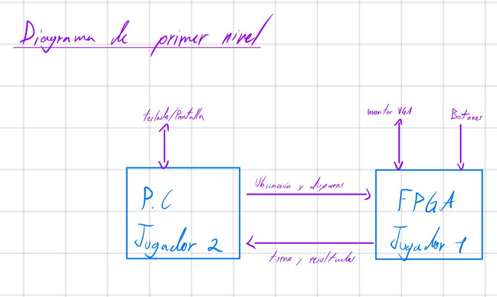

**Figura 6.1.** Diagrama de primer nivel: procesador con sus memorias, interconexión MMIO, periféricos y aplicación de PC. Se observa que el Jugador 1 interactúa con la tarjeta y el Jugador 2 solo a través de la UART.

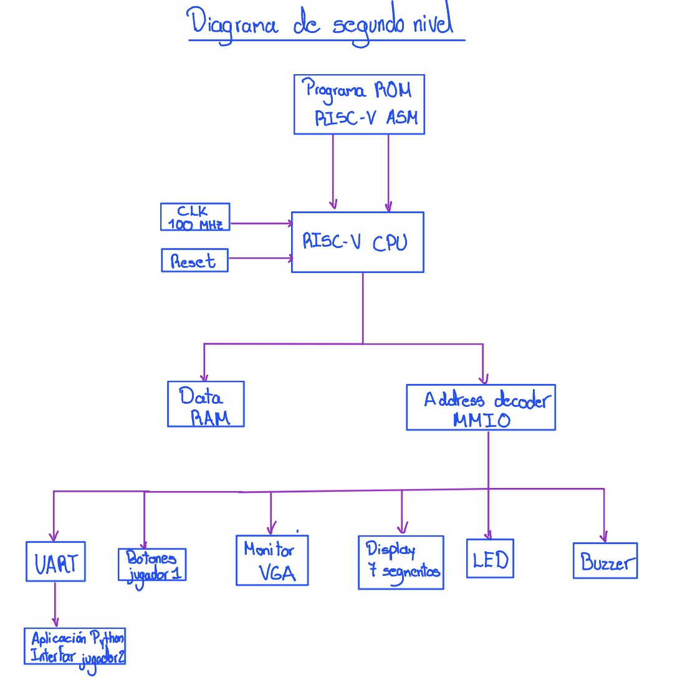

**Figura 6.2.** Diagrama de segundo nivel con las señales entre bloques. Se observa el bus de instrucciones independiente y el bus de datos compartido por RAM y periféricos.

Los diagramas de tercer nivel del procesador, la interconexión y los periféricos se presentan al inicio de las secciones 7 y 8 (`diagrama_tercer_nivel1.jpeg` y `diagrama_tercer_nivel2.jpeg`).

### 6.3 Flujo de la partida

1. **Inicialización.** Al arrancar (o al activar RST), `init_game` pone `GAME_STATE = 0` (colocación), `TURN = 1`, borra los cuatro tableros y las 300 posiciones del VGA, dibuja el título «BATALLA NAVAL», muestra el cursor sobre el tablero del J1, enciende el LED de colocación (`001`) y actualiza el marcador de victorias y las estadísticas.
2. **Colocación concurrente.** El J1 mueve el cursor con los botones, rota con SEL y confirma con OK; cada colocación válida escribe el barco en `BOARD_J1` y en el VGA, y una inválida activa el buzzer. En paralelo, el J2 envía tramas `P` por UART que se validan y responden con `PA` o `PR`. El orden de finalización es indiferente.
3. **Inicio de batalla.** Cuando `PLACED_J1 = 3` y `PLACED_J2 = 3` se pasa a `GAME_STATE = 1`, turno del J1, LED `010`, y se envían `B` y `T,1`.
4. **Batalla.** El J1 dispara con OK sobre el tablero del J2 (`DR`) y el J2 con `S` por UART (`SR`). Cada disparo válido actualiza `SHOTS_*`, el VGA, el buzzer (impacto, fallo o hundido) y pasa el turno (`T,jugador`). Los disparos repetidos o fuera de turno se ignoran.
5. **Fin de partida.** Al hundirse toda la flota de un jugador se pasa a `GAME_STATE = 2`, se incrementa su contador de victorias, se actualizan displays y VGA, el LED pasa a `100`, suena el patrón de victoria y se envía `FIN,jugador`.
6. **Reinicio.** Con RST (SW1) en cualquier estado se vuelve a `init_game`, conservando el marcador de victorias.

---

## 7. Procesador RISC-V

El procesador está implementado en SystemVerilog y utiliza una arquitectura uniciclo de 32 bits. El diseño separa el núcleo, las memorias y la interconexión con periféricos, permitiendo verificar cada componente de forma independiente.

### 7.1 Núcleo

El módulo `riscv_core.sv` conecta el datapath y la unidad de control. Ejecuta un subconjunto de 29 instrucciones RV32I y proporciona buses independientes para instrucciones y datos.

#### Entradas y salidas

| Señal | Dirección | Ancho | Descripción |
| --- | --- | --- | --- |
| `clk_i` | Entrada | 1 bit | Reloj del procesador |
| `rst_i` | Entrada | 1 bit | Reset síncrono activo alto |
| `ProgIn_i` | Entrada | 32 bits | Instrucción entregada por la ROM |
| `DataIn_i` | Entrada | 32 bits | Dato leído desde RAM o periféricos |
| `ProgAddress_o` | Salida | 32 bits | Dirección de la instrucción actual |
| `DataAddress_o` | Salida | 32 bits | Dirección de datos calculada por la ALU |
| `DataOut_o` | Salida | 32 bits | Dato del segundo registro fuente para escritura |
| `we_o` | Salida | 1 bit | Habilitación de escritura de datos, bloqueada durante reset |

Las direcciones se expresan en bytes.

#### Diagrama del datapath

El siguiente esquema representa las conexiones funcionales principales. La ROM y la RAM/periféricos se encuentran fuera de `riscv_core`.

```text
                    +-------------------+
             +----->| Registro PC       |-----> ROM externa
             |      +-------------------+          |
             |               |                     | Instrucción
             |               v                     v
             |             PC + 4          Decodificación y control
             |               |                  |          |
             |               |                  v          v
             |               |          Banco de       Generador de
             |               |          registros      inmediatos
             |               |           |     |            |
             |               |          RD1   RD2           Imm
             |               |           |     |            |
             |               |           +-- MUX A/B -------+
             |               |                  |
             |               |                  v
             |               |                 ALU
             |               |                  |
             |               |             ALUResult
             |               |                  |
             |               |        RAM / MMIO externos
             |               |                  |
             |               |               DataIn
             |               |                  |
             |               +----> MUX de escritura <---- ALUResult
             |                              |
             |                              v
             |                       Banco de registros
             |
             +---- MUX siguiente PC <---- PC + 4
                            ^
                            |
                    Destino de salto
                            ^
                            |
                 PC / RD1 / Imm / comparación
```

El dato de escritura hacia RAM o MMIO proviene directamente de `RD2`. La lógica de saltos calcula su destino mediante un sumador independiente de la ALU.

#### Funcionamiento

Durante cada ciclo:

1. El PC presenta la dirección de la instrucción.
2. La ROM entrega la instrucción de forma combinacional.
3. El decodificador extrae los campos y la unidad de control genera las señales.
4. El banco de registros entrega los operandos y se construye el inmediato.
5. La ALU calcula el resultado o la dirección de datos.
6. Se seleccionan el dato de escritura y el siguiente PC.
7. En el flanco ascendente se actualizan los elementos habilitados.

Estas operaciones pertenecen a un mismo ciclo; no corresponden a etapas de un pipeline.

El reset devuelve el PC a cero y borra los registros modificables. Las escrituras externas se bloquean mientras `rst_i` está activo.

#### Relación con el sistema

El núcleo ejecuta el programa ensamblador que controla el juego. Obtiene instrucciones desde ROM y utiliza el bus de datos para acceder a RAM y periféricos.

El módulo `processor_subsystem.sv` integra el núcleo con ROM, RAM y selección del espacio MMIO. El núcleo también puede conectarse directamente a una interconexión externa si el top del equipo administra las memorias.

### 7.2 Unidad de control

El módulo `control_unit.sv` identifica la instrucción y genera las señales que coordinan el datapath.

#### Entradas y salidas

| Señal | Dirección | Ancho | Función |
| --- | --- | --- | --- |
| `opcode` | Entrada | 7 bits | Identifica la familia de instrucciones |
| `funct3` | Entrada | 3 bits | Especifica la operación |
| `funct7` | Entrada | 7 bits | Distingue variantes de instrucciones |
| `RegWrite` | Salida | 1 bit | Habilita escritura en el banco de registros |
| `ALUSrcA` | Salida | 1 bit | Selecciona RD1 o PC |
| `ALUSrcB` | Salida | 1 bit | Selecciona RD2 o inmediato |
| `ALUControl` | Salida | 4 bits | Selecciona la operación de la ALU |
| `ImmSrc` | Salida | 3 bits | Selecciona el formato del inmediato |
| `ResultSrc` | Salida | 2 bits | Selecciona el dato que se escribe en un registro |
| `BranchCtrl` | Salida | 2 bits | Selecciona la condición de bifurcación |
| `Branch` | Salida | 1 bit | Indica bifurcación condicional |
| `Jump` | Salida | 1 bit | Indica salto incondicional |
| `JALR` | Salida | 1 bit | Selecciona la base y el ajuste del salto indirecto |
| `MemWrite` | Salida | 1 bit | Solicita escritura en memoria o MMIO |

#### Tabla de señales de control

| Señal | Codificación |
| --- | --- |
| `ALUSrcA` | 0: RD1; 1: PC |
| `ALUSrcB` | 0: RD2; 1: inmediato |
| `ImmSrc` | 000: I; 001: S; 010: B; 011: J; 100: U |
| `ResultSrc` | 00: ALU; 01: dato leído; 10: PC+4; 11: cero |
| `BranchCtrl` | 00: BEQ; 01: BNE; 10: BLT; 11: BGE |

La siguiente tabla resume las señales principales por grupo. El símbolo `—` indica que la señal no afecta el resultado de esa instrucción; el RTL asigna valores definidos.

| Instrucción o grupo | RegWrite | ALUSrcA | ALUSrcB | ImmSrc | ResultSrc | MemWrite | Branch | Jump | JALR |
| --- | --- | --- | --- | --- | --- | --- | --- | --- | --- |
| Operaciones entre registros | 1 | 0 | 0 | — | 00 | 0 | 0 | 0 | 0 |
| Operaciones con inmediato | 1 | 0 | 1 | 000 | 00 | 0 | 0 | 0 | 0 |
| LW | 1 | 0 | 1 | 000 | 01 | 0 | 0 | 0 | 0 |
| SW | 0 | 0 | 1 | 001 | — | 1 | 0 | 0 | 0 |
| BEQ, BNE, BLT, BGE | 0 | — | — | 010 | — | 0 | 1 | 0 | 0 |
| JAL | 1 | — | — | 011 | 10 | 0 | 0 | 1 | 0 |
| JALR | 1 | — | — | 000 | 10 | 0 | 0 | 1 | 1 |
| LUI | 1 | 0 | 1 | 100 | 00 | 0 | 0 | 0 | 0 |
| AUIPC | 1 | 1 | 1 | 100 | 00 | 0 | 0 | 0 | 0 |

`ALUControl` depende de la operación concreta y se describe en la sección 7.4.

#### Funcionamiento

La unidad es combinacional: sus salidas dependen de los campos de la instrucción actual.

Primero establece valores por defecto que deshabilitan escrituras y cambios de flujo. Después activa las señales correspondientes a la instrucción reconocida. Para LUI selecciona el inmediato superior como resultado; para AUIPC selecciona el PC y lo suma al inmediato superior.

Las instrucciones no soportadas no escriben registros ni memoria y permiten que el PC avance secuencialmente, sin generar una excepción.

#### Relación con el sistema

La unidad de control coordina los componentes internos del procesador. No contiene reglas del juego ni lógica específica de periféricos: estas acciones dependen del programa ejecutado y de las direcciones utilizadas.

### 7.3 Banco de registros

El módulo `register_file.sv` almacena los operandos y resultados temporales del procesador.

#### Entradas y salidas

| Señal | Dirección | Ancho | Descripción |
| --- | --- | --- | --- |
| `clk_i` | Entrada | 1 bit | Reloj |
| `rst_i` | Entrada | 1 bit | Reset síncrono activo alto |
| `RegWrite` | Entrada | 1 bit | Habilitación de escritura |
| `rs1` | Entrada | 5 bits | Índice del primer registro fuente |
| `rs2` | Entrada | 5 bits | Índice del segundo registro fuente |
| `rd` | Entrada | 5 bits | Índice del registro destino |
| `WriteData` | Entrada | 32 bits | Dato a almacenar |
| `RD1` | Salida | 32 bits | Contenido del primer registro fuente |
| `RD2` | Salida | 32 bits | Contenido del segundo registro fuente |

#### Funcionamiento

El banco presenta 32 registros arquitectónicos de 32 bits. El registro x0 es una constante y las escrituras dirigidas a él se ignoran; únicamente x1 a x31 necesitan almacenamiento.

Los dos puertos de lectura son combinacionales. La escritura se realiza en el flanco ascendente si `RegWrite=1`, `rd` es diferente de cero y el reset no está activo.

El reset tiene prioridad sobre la escritura y coloca x1 a x31 en cero.

#### Relación con el sistema

`RD1` y `RD2` alimentan las operaciones del datapath. Además, `RD2` proporciona el dato utilizado por SW y ambos operandos se emplean para evaluar bifurcaciones.

`WriteData` recibe el resultado seleccionado por el multiplexor de escritura: ALU, memoria o PC+4.

### 7.4 ALU

El módulo `alu.sv` implementa la unidad aritmético-lógica de 32 bits.

#### Entradas y salidas

| Señal | Dirección | Ancho | Descripción |
| --- | --- | --- | --- |
| `ALUOperandA` | Entrada | 32 bits | Primer operando |
| `ALUOperandB` | Entrada | 32 bits | Segundo operando |
| `ALUControl` | Entrada | 4 bits | Operación seleccionada |
| `ALUResult` | Salida | 32 bits | Resultado |

#### Operaciones soportadas

| ALUControl | Operación | Resultado |
| --- | --- | --- |
| 0000 | ADD | A + B |
| 0001 | SUB | A − B |
| 0010 | AND | AND bit a bit |
| 0011 | OR | OR bit a bit |
| 0100 | XOR | XOR bit a bit |
| 0101 | SLL | Desplazamiento lógico a la izquierda |
| 0110 | SRL | Desplazamiento lógico a la derecha |
| 0111 | SRA | Desplazamiento aritmético a la derecha |
| 1000 | SLT | 1 si A < B con signo; 0 en otro caso |
| 1001 | SLTU | 1 si A < B sin signo; 0 en otro caso |
| 1010 | PASS_B | Entrega B para implementar LUI |

#### Funcionamiento

La ALU es combinacional y no almacena resultados. Los desplazamientos utilizan los cinco bits inferiores del segundo operando, por lo que el desplazamiento efectivo está entre 0 y 31 posiciones.

SRA conserva el signo del operando al desplazar hacia la derecha. SLT interpreta los operandos con signo, mientras que SLTU los interpreta sin signo. Los códigos de control reservados producen cero.

#### Relación con el sistema

La ALU realiza los cálculos del programa y genera las direcciones de LW y SW. También ejecuta la suma PC más inmediato superior para AUIPC.

Las condiciones de branch y los destinos de salto se calculan en bloques separados.

### 7.5 Generador de inmediatos y lógica de saltos

Estos componentes construyen las constantes de las instrucciones y determinan los cambios de flujo del programa.

#### Entradas y salidas

**Generador de inmediatos: `immediate_generator.sv`**

| Señal | Dirección | Ancho | Descripción |
| --- | --- | --- | --- |
| `ProgIn_i` | Entrada | 32 bits | Instrucción actual |
| `ImmSrc` | Entrada | 3 bits | Formato del inmediato |
| `Imm` | Salida | 32 bits | Inmediato construido |

**Comparador: `branch_comparator.sv`**

| Señal | Dirección | Ancho | Descripción |
| --- | --- | --- | --- |
| `RD1`, `RD2` | Entrada | 32 bits cada una | Operandos de comparación |
| `BranchCtrl` | Entrada | 2 bits | Condición que se evalúa |
| `BranchTaken` | Salida | 1 bit | Resultado de la condición |

**Lógica de saltos: `branch_jump_logic.sv`**

| Señal | Dirección | Ancho | Descripción |
| --- | --- | --- | --- |
| `PC` | Entrada | 32 bits | Dirección actual |
| `RD1` | Entrada | 32 bits | Base para JALR |
| `Imm` | Entrada | 32 bits | Desplazamiento |
| `BranchTaken` | Entrada | 1 bit | Resultado del comparador |
| `Branch`, `Jump`, `JALR` | Entrada | 1 bit cada una | Señales de control |
| `TargetPC` | Salida | 32 bits | Destino calculado |
| `PCSrc` | Salida | 1 bit | Selección del destino frente a PC+4 |

#### Funcionamiento

El generador reconstruye los inmediatos según el formato:

| Formato | Construcción |
| --- | --- |
| I | Bits `[31:20]`, extendidos con signo |
| S | Bits `[31:25]` y `[11:7]`, extendidos con signo |
| B | Bits `[31]`, `[7]`, `[30:25]`, `[11:8]` y un cero final, extendidos con signo |
| J | Bits `[31]`, `[19:12]`, `[20]`, `[30:21]` y un cero final, extendidos con signo |
| U | Bits `[31:12]` seguidos de 12 ceros |

Los inmediatos B y J ya incluyen el bit inferior cero y no requieren un desplazamiento adicional.

El comparador evalúa igualdad, desigualdad, menor que y mayor o igual. BLT y BGE utilizan comparación con signo.

La lógica calcula:

- Branch y JAL: `TargetPC = PC + Imm`.
- JALR: `TargetPC = (RD1 + Imm) & 0xFFFFFFFE`.
- Selección: `PCSrc = Jump | (Branch & BranchTaken)`.

Si `PCSrc=0`, se utiliza PC+4. Para JALR se limpia únicamente el bit cero; no se fuerza a cero el bit uno.

#### Relación con el sistema

Estos bloques permiten ejecutar condiciones, ciclos y llamadas del programa ensamblador. JAL y JALR también seleccionan PC+4 como dirección de retorno para el registro destino.

### 7.6 Memorias ROM y RAM

Las memorias se implementan en `program_rom.sv` y `data_ram.sv`.

#### Entradas y salidas

**ROM**

| Elemento | Tipo | Ancho | Descripción |
| --- | --- | --- | --- |
| `INIT_FILE` | Parámetro | Cadena | Ruta del archivo hexadecimal |
| `addr_i` | Entrada | 32 bits | Dirección de byte de la instrucción |
| `instr_o` | Salida | 32 bits | Instrucción leída |

**RAM**

| Señal | Dirección | Ancho | Descripción |
| --- | --- | --- | --- |
| `clk_i` | Entrada | 1 bit | Reloj de escritura |
| `we_i` | Entrada | 1 bit | Habilitación de escritura |
| `addr_i` | Entrada | 10 bits | Índice local de palabra |
| `wdata_i` | Entrada | 32 bits | Dato a escribir |
| `rdata_o` | Salida | 32 bits | Dato leído |

#### Funcionamiento

La ROM contiene 2048 palabras de 32 bits, equivalentes a 8 KiB. Se inicializa con instrucciones NOP y, cuando se especifica `INIT_FILE`, carga el archivo mediante `$readmemh`.

Su lectura es combinacional. Para direcciones alineadas menores que `0x00002000`, selecciona la palabra mediante `addr_i[12:2]`. Una dirección inválida devuelve NOP.

La RAM contiene 1024 palabras de 32 bits, equivalentes a 4 KiB. Su dirección de entrada es un índice de palabra, no una dirección global de byte. El subsistema selecciona el rango `0x00002000–0x00002FFF` y utiliza los bits `[11:2]` para obtener el índice.

La lectura de RAM es combinacional y la escritura ocurre en el flanco ascendente cuando `we_i=1`. La memoria no se borra durante reset ni tiene inicialización automática de datos.

#### Relación con el sistema

La ROM proporciona el programa que ejecuta el núcleo. La RAM almacena variables y estructuras de datos utilizadas por ese programa.

Los buses separados permiten buscar instrucciones y acceder a datos durante el mismo ciclo. El archivo `handoff.hex` incluido en la entrega contiene un diagnóstico de RAM y MMIO, no el programa completo de Batalla Naval.

### 7.7 Decodificador de direcciones y multiplexor de lectura

En la entrega local, la selección de RAM y del espacio MMIO se encuentra dentro de `processor_subsystem.sv`. La decodificación individual de cada periférico corresponde a la interconexión externa del equipo.

#### Entradas y salidas

Las señales internas utilizadas por la lógica son:

| Señal | Origen o destino | Ancho | Descripción |
| --- | --- | --- | --- |
| `address` | Desde el núcleo | 32 bits | Dirección de datos |
| `wdata` | Desde el núcleo | 32 bits | Dato de escritura |
| `core_we` | Desde el núcleo | 1 bit | Solicitud de escritura |
| `ram_data` | Desde RAM | 32 bits | Dato leído de RAM |
| `rdata` | Hacia el núcleo | 32 bits | Dato seleccionado |

La interfaz MMIO externa es:

| Señal | Dirección | Ancho | Descripción |
| --- | --- | --- | --- |
| `mmio_rdata_i` | Entrada | 32 bits | Lectura seleccionada por la interconexión externa |
| `mmio_addr_o` | Salida | 32 bits | Dirección completa de byte |
| `mmio_wdata_o` | Salida | 32 bits | Dato de escritura |
| `mmio_sel_o` | Salida | 1 bit | Selección válida del espacio MMIO |
| `mmio_we_o` | Salida | 1 bit | Escritura MMIO habilitada |

#### Funcionamiento

La lógica verifica primero que los dos bits inferiores de la dirección sean cero. Esto identifica accesos alineados a palabras de cuatro bytes.

| Recurso | Condición de selección |
| --- | --- |
| RAM | Dirección alineada desde `0x00002000` hasta `0x00002FFF` |
| MMIO | Dirección alineada desde `0x00010000` hasta `0x0001FFFF`, fuera de reset |

La escritura RAM requiere `core_we`, selección RAM y reset inactivo. La escritura MMIO se obtiene mediante:

```systemverilog
assign mmio_we_o = core_we && mmio_sel_o;
```

El multiplexor devuelve el dato de RAM cuando está seleccionada, el dato MMIO cuando corresponde a ese espacio y cero en los demás casos:

```systemverilog
assign rdata = ram_sel ? ram_data :
               (mmio_sel_o ? mmio_rdata_i : 32'b0);
```

Los accesos de datos desalineados se ignoran al escribir y devuelven cero al leer. No generan una excepción.

`mmio_sel_o` depende de la dirección, no de una señal de lectura. Por ello, no debe emplearse por sí sola para consumir datos UART o limpiar banderas.

#### Relación con el sistema

La interconexión externa identifica el periférico específico, habilita únicamente su escritura y selecciona su dato de lectura. Si una dirección MMIO no corresponde a ningún dispositivo, esa interconexión debe devolver cero.

---

## 8. Periféricos

<!-- Sugerencia general: incluir al inicio de la sección los diagramas de tercer nivel de
los periféricos. -->

### 8.1 Periférico VGA

Módulo `vga_periferico`, que agrupa `clk_wiz_pixel`, `vga_timing`, `vga_memory` y `vga_color_rgb` (con `vga_font`). El diagrama de tercer nivel de los periféricos aparece en la Figura 8.1 y el de cuarto nivel de cada subbloque en las Figuras 8.2 a 8.4.

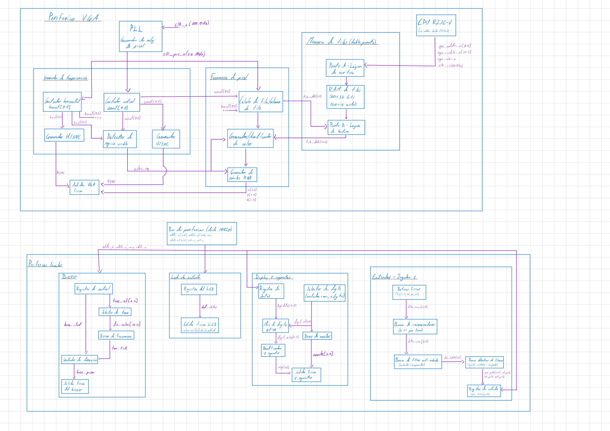

**Figura 8.1.** Diagrama de tercer nivel del periférico VGA y de los periféricos locales. Se observan los dos dominios de reloj del VGA (100 MHz para la escritura, 25 MHz para la lectura) y los cuatro bloques de periféricos locales.

#### Entradas y salidas

**Tabla 8.1.** Puertos de `vga_periferico`.

| Señal | Dirección | Ancho | Descripción |
|---|---|---|---|
| `clk_i` | Entrada | 1 | Reloj del sistema, 100 MHz |
| `rst_i` | Entrada | 1 | Reset síncrono activo en alto |
| `vga_we_i` | Entrada | 1 | Escritura de un tile (ya calificada por `address_decoder`) |
| `vga_addr_i` | Entrada | 9 | Índice del tile (0–299) |
| `vga_wdata_i` | Entrada | 32 | Palabra de tile (Tabla 3.6) |
| `cursor_ctrl_i` | Entrada | 8 | Registro del cursor (visible, tablero, fila, columna) |
| `hsync_o`, `vsync_o` | Salida | 1 c/u | Sincronismos horizontal y vertical, activos en bajo |
| `r_o`, `g_o`, `b_o` | Salida | 4 c/u | Canales de color del DAC VGA |

#### Diagrama interno

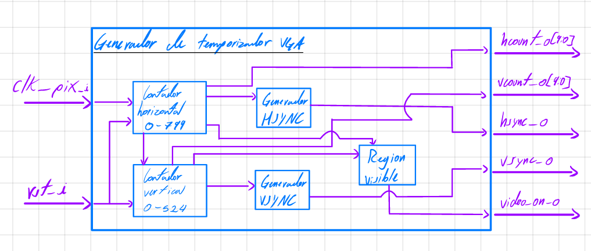

**Figura 8.2.** Generador de temporización (`vga_timing`): contadores `hcount` y `vcount`, comparadores de sincronismo y `video_on`.

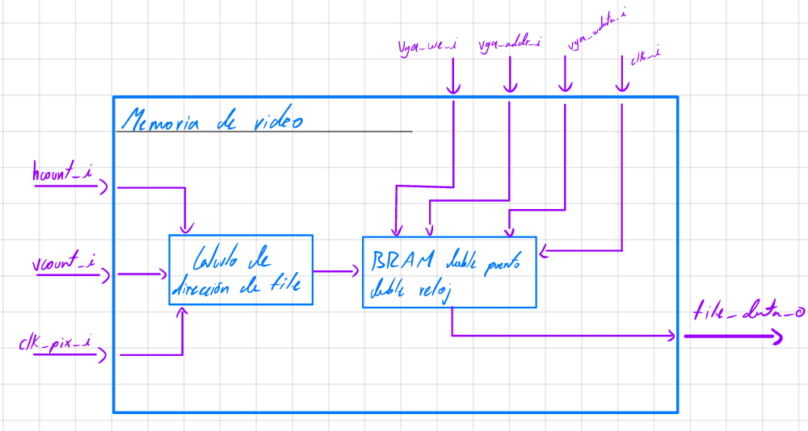

**Figura 8.3.** Memoria de tiles de doble puerto (`vga_memory`): cálculo de dirección y puertos A (100 MHz) y B (25 MHz).

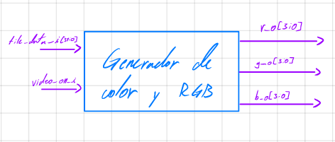

**Figura 8.4.** Generador de color y RGB (`vga_color_rgb`): decodificación del tile, texto, cuadrícula, cursor y salida de color.

#### Funcionamiento

**Temporización.** `vga_timing` cuenta con el reloj de píxel de 25 MHz: `hcount` recorre 0–799 y `vcount` 0–524. `hsync` se pone en bajo durante 96 ciclos tras 640 + 16 píxeles y `vsync` en bajo durante 2 líneas tras 480 + 10 líneas (Tabla 4.1). `video_on` es verdadero si `hcount < 640` y `vcount < 480`.

**Cálculo de la casilla.** La columna y la fila de tile salen directamente de los bits altos de los contadores (`hcount[9:5]`, `vcount[9:5]`), y la dirección es `fila·20 + columna`. Los bits bajos (`hcount[4:0]`, `vcount[4:0]`) indican la posición del píxel dentro del tile de 32×32.

**Sincronización entre dominios.** El puerto A de la memoria escribe con `clk_i`; el puerto B lee con `clk_pix` con latencia de 1 ciclo. Para alinear el dato leído con su posición, `vga_periferico` retrasa un ciclo `video_on`, el píxel dentro del tile y la columna y fila del tile. El reset del dominio de video es `rst_pix = rst_i | ~pll_locked`, de modo que la temporización no arranca hasta que el PLL está estable.

**Generación de color.** `vga_color_rgb` determina, por prioridad: (1) negro fuera de la zona visible, (2) carácter si `TEXT_ENABLE = 1` (la fuente de 8×8 de `vga_font` se escala 4× para llenar el tile, con el píxel `[4:2]`), (3) negro fuera de los dos tableros (J1: columnas 1–8, J2: columnas 11–18, filas 6–13), (4) borde amarillo del cursor, (5) línea negra de cuadrícula en el primer píxel de cada casilla, y (6) el color de la casilla según la Tabla 3.7.

**Justificación de la cuadrícula.** Se eligió 20×15 tiles de 32×32 porque 640 y 480 son múltiplos exactos de 32 (20 y 15), el tamaño es potencia de 2 (los cocientes y restos son simples cortes de bits) y los tableros de 8×8 caben con margen para el HUD de texto (título, marcador y estadísticas).

#### Relación con el sistema

El CPU solo escribe en el VGA: el decodificador genera `we_vga` y `vga_addr = (mmio_addr − 0x11000) >> 2`. El registro del cursor (`0x0001_0148`) se mantiene en `sistema_top` (`vga_cursor_ctrl`) y se conecta a `cursor_ctrl_i`. Las salidas `hsync_o`, `vsync_o`, `r_o`, `g_o` y `b_o` van directamente a los pines del conector VGA (Sección 11). La lectura del VGA por el CPU devuelve cero.

### 8.2 Periférico de entradas del Jugador 1

Módulo `btn_input` (con `button_debouncer`), instanciado en `perifericos_locales`.

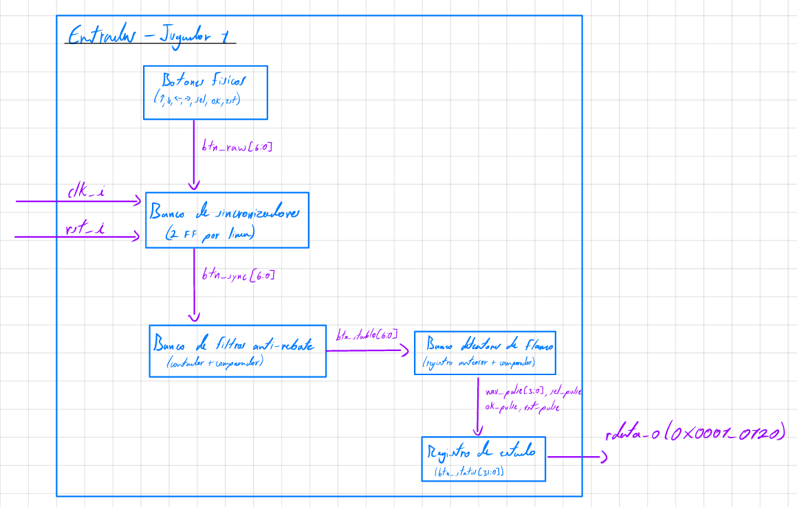

**Figura 8.5.** Condicionador de entradas: sincronizador, filtro antirrebote, detector de flanco y registro de estado.

#### Entradas y salidas

**Tabla 8.2.** Puertos de `btn_input`.

| Señal | Dirección | Ancho | Descripción |
|---|---|---|---|
| `clk_i` | Entrada | 1 | Reloj de 100 MHz |
| `rst_i` | Entrada | 1 | Reset síncrono activo en alto |
| `btn_raw_i` | Entrada | 7 | Botones/interruptores sin filtrar (Tabla 3.8) |
| `ack_i` | Entrada | 1 | Lectura confirmada del registro; borra los pulsos |
| `rdata_o` | Salida | 32 | `btn_status` (bits [6:0] válidos) |

Parámetros: `CLK_FREQ_HZ = 100 000 000` y `DEBOUNCE_MS = 10`.

#### Funcionamiento

Un generador de habilitación (`ce_1ms`) produce un pulso cada 100 000 ciclos (1 ms). Las siete entradas pasan por un sincronizador de dos flip-flops (`btn_meta`, `btn_sync`) y por una instancia de `button_debouncer` cada una, que acepta un nuevo nivel después de 10 muestras de 1 ms estables. Un detector de flancos compara el nivel estable con el anterior y genera un pulso de un ciclo en el flanco de subida. Ese pulso se almacena en el registro de estado `btn_status`, donde permanece hasta que `ack_i` lo borra. Un mismo botón mantenido pulsado produce un solo evento.

#### Relación con el sistema

`rdata_o` entra a `read_mux` como `input_rdata_i`. `sistema_top` genera `input_ack_i = sel_input && cpu_ce && !mmio_we`, de manera que solo una lectura confirmada de la dirección `0x0001_0120` consume los pulsos. El firmware lee este registro una vez por iteración de `main_loop` y despacha las acciones según el estado del juego.

### 8.3 Periférico UART

Módulo `uart_peripheral`, con `baud_gen`, `uart_tx` y `uart_rx`.

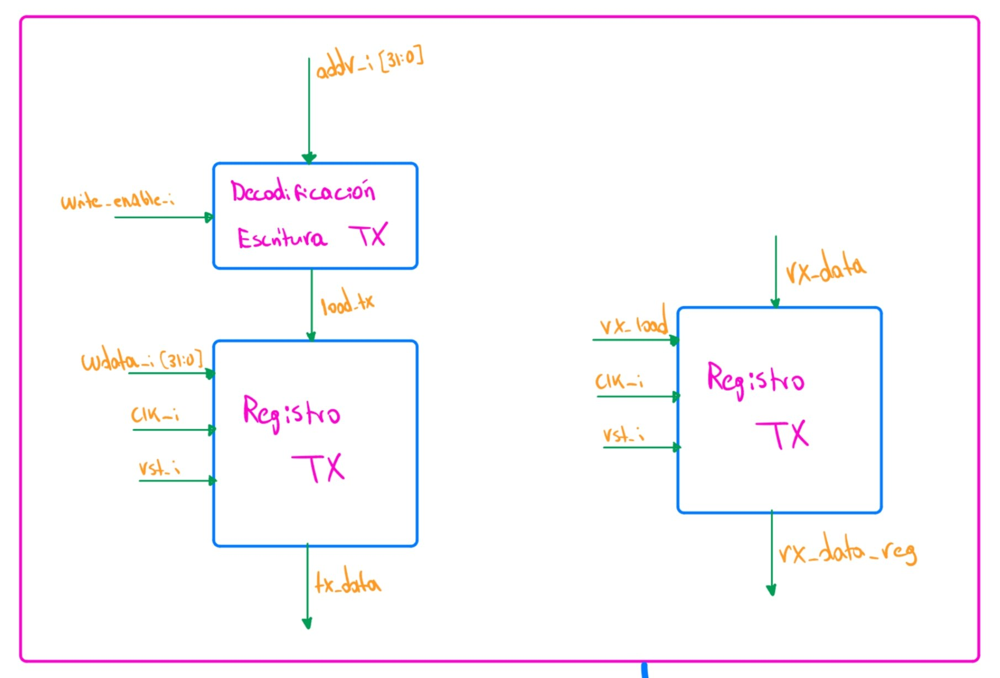

**Figura 8.6.** Registros del periférico UART (control/estado, TX y RX).

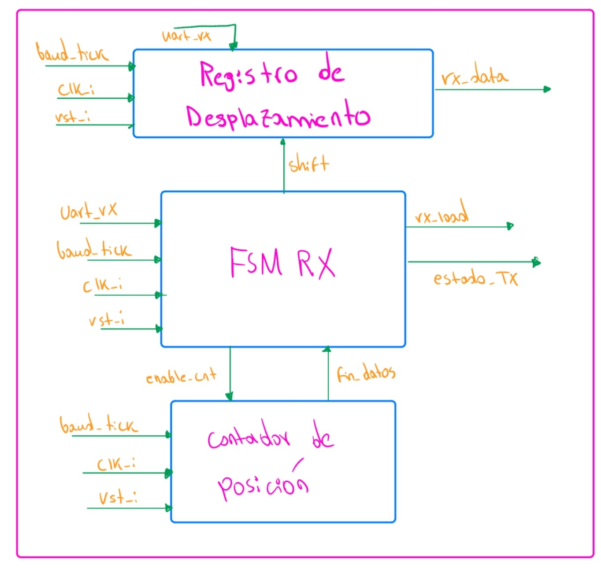

**Figura 8.7.** Receptor UART y su máquina de estados.

#### Entradas y salidas

**Tabla 8.3.** Puertos de `uart_peripheral`.

| Señal | Dirección | Ancho | Descripción |
|---|---|---|---|
| `clk_i`, `rst_i` | Entrada | 1 | Reloj de 100 MHz y reset síncrono activo en alto |
| `write_enable_i` | Entrada | 1 | Escritura habilitada para el UART |
| `addr_i` | Entrada | 2 | 00 STATUS, 01 TX, 10 RX |
| `wdata_i` | Entrada | 32 | Dato de escritura |
| `rdata_o` | Salida | 32 | Dato de lectura (STATUS o RX) |
| `uart_rx_i` | Entrada | 1 | Línea RX desde el puente USB-UART (pin C4) |
| `uart_tx_o` | Salida | 1 | Línea TX hacia el puente USB-UART (pin D4) |

#### Funcionamiento

`baud_gen` divide 100 MHz entre 868 y emite un pulso `baud_tick_o` por bit. `uart_tx` serializa el byte escrito en TX (inicio, 8 datos LSB primero, parada) y mantiene `TX_BUSY` hasta terminar. `uart_rx` sincroniza la línea, detecta el flanco de inicio, espera medio bit y muestrea cada bit en su centro; al recibir una trama correcta genera `rx_valid`, y si el bit de parada no es 1 genera `rx_frame_error`. El periférico guarda el byte en `rx_data_r` y mantiene `RX_VALID` hasta que el CPU lo borra escribiendo 1 en el bit 1 de STATUS.

Se reutilizó el periférico UART del Proyecto 2 con su interfaz de registros (STATUS, TX, RX). En el sistema final se integra mediante el desplazamiento de direcciones `addr_i = (mmio_addr − 0x10040) >> 2` y se parametriza con `CLK_FREQ_HZ = 100 MHz` y `BAUD_RATE = 115 200`.

<!-- PENDIENTE: indicar con precisión qué cambios se hicieron respecto al módulo del Proyecto 2 (comparar con ese repositorio) -->

#### Relación con el sistema

El firmware consulta STATUS en `poll_uart` (bit 1) y en `uart_putc` (bit 0), y cada byte recibido alimenta la máquina de estados del protocolo (Sección 3.9). Los pines `uart_rx_i` y `uart_tx_o` se conectan al puente USB-UART de la Nexys 4, lo que permite usar la misma conexión USB para programar y para jugar.

### 8.4 Displays de 7 segmentos

Módulo `seg7_ctrl`.

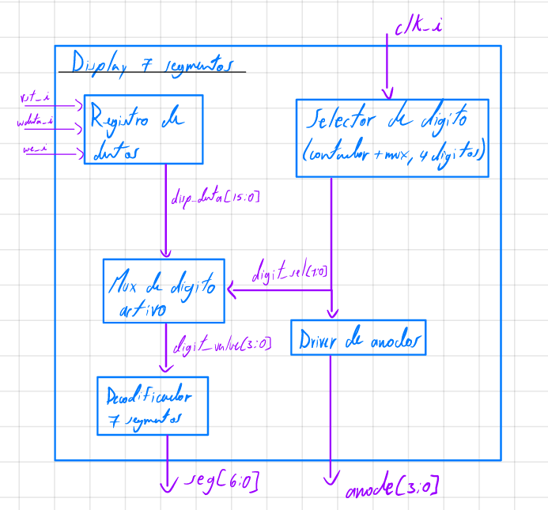

**Figura 8.8.** Controlador de displays: registro de datos, selector de dígito, multiplexor, decodificador y driver de ánodos.

#### Entradas y salidas

**Tabla 8.4.** Puertos de `seg7_ctrl`.

| Señal | Dirección | Ancho | Descripción |
|---|---|---|---|
| `clk_i`, `rst_i` | Entrada | 1 | Reloj de 100 MHz y reset |
| `wdata_i` | Entrada | 32 | Dato BCD (bits [15:0]) |
| `we_i` | Entrada | 1 | Escritura del registro `disp_data` |
| `seg_o` | Salida | 7 | Segmentos `gfedcba`, activos en bajo |
| `anode_o` | Salida | 8 | Ánodos de los 8 dígitos, activos en bajo |
| `rdata_o` | Salida | 32 | Valor del registro `disp_data` |

#### Funcionamiento

El registro `disp_data[15:0]` contiene cuatro dígitos BCD: `[15:12]` decenas de victorias del J1, `[11:8]` unidades del J1, `[7:4]` decenas del J2 y `[3:0]` unidades del J2. Un contador de `DIGIT_HOLD_CYCLES = 100 000` ciclos (1 ms) selecciona cíclicamente uno de los cuatro dígitos activos; cada dígito se refresca entonces cada 4 ms (250 Hz) y no se percibe parpadeo. El dígito elegido se decodifica a siete segmentos (activos en bajo: por ejemplo `0 → 1000000`, `1 → 1111001`, `8 → 0000000`) y se activa su ánodo en bajo; los ánodos AN4–AN7 permanecen apagados. El punto decimal `dp_o` se mantiene en 1 (apagado).

#### Relación con el sistema

Se escribe en `0x0001_0130` desde `update_display` del firmware, que convierte cada contador de victorias a dos dígitos decimales (módulo 100). `rdata_o` regresa a `read_mux`. Las salidas `seg_o` y `anode_o` van a los pines del display de la Nexys 4 (Sección 11). `seg7_ctrl.sv` emite una advertencia de simulación (`unique case` sin cubrir todos los valores de 4 bits) porque los códigos 10–15 no son BCD válidos.

### 8.5 LED de estado

Módulo `led_reg`.

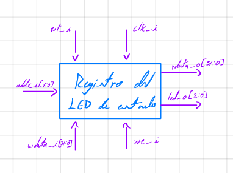

**Figura 8.9.** Registro del LED de estado.

#### Entradas y salidas

**Tabla 8.5.** Puertos de `led_reg`.

| Señal | Dirección | Ancho | Descripción |
|---|---|---|---|
| `clk_i`, `rst_i` | Entrada | 1 | Reloj y reset (el reset pone `led_o` en 0) |
| `wdata_i` | Entrada | 32 | Se usan los bits [2:0] |
| `we_i` | Entrada | 1 | Escritura del registro |
| `led_o` | Salida | 3 | LED0–LED2 |
| `rdata_o` | Salida | 32 | `{29'b0, led_o}` |

#### Funcionamiento

Es un registro de 3 bits cuya salida va directamente a los LED. **Tabla 8.6.** Codificación utilizada por el firmware.

| Fase | `led_o[2:0]` | Constante de `game.S` |
|---|---|---|
| Colocación de barcos | `001` | `LED_PLACEMENT` |
| Batalla | `010` | `LED_BATTLE` |
| Partida terminada | `100` | `LED_FINISHED` |

#### Relación con el sistema

Se escribe en `0x0001_0138` al iniciar la partida, al comenzar la batalla y al terminar. No tiene otra lógica ni interviene en el flujo del programa.

### 8.6 Buzzer

Módulo `buzzer_gen`.

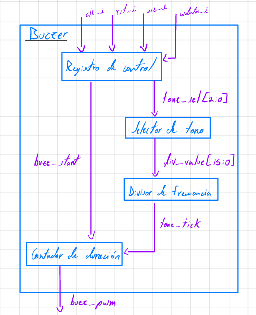

**Figura 8.10.** Generador de sonidos del buzzer.

#### Entradas y salidas

**Tabla 8.7.** Puertos de `buzzer_gen`.

| Señal | Dirección | Ancho | Descripción |
|---|---|---|---|
| `clk_i`, `rst_i` | Entrada | 1 | Reloj de 100 MHz y reset |
| `wdata_i` | Entrada | 32 | `[2:0]` evento, `[3]` inicio |
| `we_i` | Entrada | 1 | Escritura del registro de control |
| `buzz_pwm_o` | Salida | 1 | Nivel alto = buzzer sonando |
| `rdata_o` | Salida | 32 | `{28'b0, ocupado, tone_sel[2:0]}` |

#### Funcionamiento

El buzzer de la tarjeta es **activo de corriente continua**: suena a su frecuencia propia cuando se le aplica un nivel alto, por lo que no se generan tonos de distinta frecuencia. Cada evento se distingue por un patrón de pitidos (cantidad y duración) generado por una máquina de estados que alterna los estados de encendido y apagado y cuenta milisegundos. Una escritura con `wdata_i[3] = 1` inicia el patrón y una nueva orden interrumpe y reinicia el patrón en curso. El CPU solo escribe el evento; la duración la controla el hardware, por lo que el programa no se bloquea.

**Tabla 8.8.** Eventos del buzzer.

| `wdata[2:0]` | Evento | Patrón | Valor escrito por `game.S` |
|---|---|---|---|
| `000` | Impacto | 1 pitido de 150 ms | `0x08` (8) |
| `001` | Fallo | 2 pitidos de 100 ms (120 ms de pausa) | `0x09` (9) |
| `010` | Barco hundido | 3 pitidos de 120 ms (100 ms de pausa) | `0x0A` (10) |
| `011` | Colocación inválida | 1 pitido de 400 ms | `0x0B` (11) |
| `100` | Victoria | 5 pitidos de 150 ms (80 ms de pausa) | `0x0C` (12) |

#### Relación con el sistema

Se escribe en `0x0001_0140` desde las rutinas de disparo (J1 y J2), de colocación inválida y de victoria. La salida `buzz_pwm_o` va al pin JA1 (B13) del PMOD. `rdata_o` permite al programa saber si hay un patrón en curso, aunque el firmware actual no lo consulta.

### 8.7 Generación de relojes

Módulo `clk_wiz_pixel` (IP Clocking Wizard, `rtl/vga/ip/clk_wiz_pixel/clk_wiz_pixel.xci`).

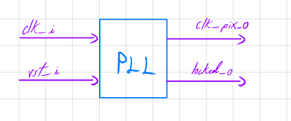

**Figura 8.11.** Generación del reloj de píxel con PLL.

#### Entradas y salidas

**Tabla 8.9.** Puertos de `clk_wiz_pixel`.

| Señal | Dirección | Ancho | Descripción |
|---|---|---|---|
| `clk_in1` | Entrada | 1 | Reloj de 100 MHz de la tarjeta |
| `reset` | Entrada | 1 | Reset del PLL (`rst_i`) |
| `clk_out1` | Salida | 1 | Reloj de píxel de 25 MHz |
| `locked` | Salida | 1 | 1 cuando el reloj de salida es estable |

#### Funcionamiento

El sistema utiliza dos relojes: `clk_i` de 100 MHz, que viene del oscilador de la tarjeta (pin E3) y gobierna el procesador (mediante `cpu_ce`), las memorias y todos los periféricos, y `clk_pix` de 25 MHz, generado por el PLL a partir de `clk_i` y utilizado solo en el dominio de video (`vga_timing`, lectura de `vga_memory`, retardos y generación de color). La señal `locked` se combina con el reset: `rst_pix = rst_i | ~pll_locked` mantiene el dominio de video en reset hasta que el reloj es estable. El reloj de píxel de 25 MHz es exactamente `100 MHz / 4`; la frecuencia nominal VGA es 25,175 MHz y la diferencia (0,7 %) es aceptada por los monitores.

#### Relación con el sistema

`vga_periferico` instancia el PLL y distribuye `clk_pix` internamente. Los testbenches de los subbloques VGA (`vga_timing_tb`, `vga_memory_tb`, `vga_color_rgb_tb`) no incluyen el PLL. Para simular el sistema completo con Icarus Verilog, que no dispone de la IP de Vivado, se utilizó un modelo de comportamiento de `clk_wiz_pixel` (período de 40 ns y `locked` activado tras un retardo) que no forma parte del repositorio. El archivo de restricciones declara el reloj de 100 MHz; Vivado deriva automáticamente el reloj generado de 25 MHz.

<!-- PENDIENTE: confirmar en el reporte de Vivado la frecuencia real de clk_out1 y el uso de MMCM/PLL -->

---

## 9. Programa en ensamblador

### 9.1 Estructura general del programa

<!-- Sugerencia: secciones del programa, constantes de direcciones, etiquetas
principales y flujo general. -->

### 9.2 Convenciones de llamado y uso de registros

<!-- Sugerencia: tabla registro → uso, paso de argumentos y retorno, manejo de la pila. -->

### 9.3 Máquina de estados del juego

<!-- Sugerencia: diagrama de estados del control principal con las condiciones de
transición. -->

### 9.4 Subrutinas principales

<!-- Sugerencia: tabla (Subrutina | Entradas | Salidas | Descripción). -->

### 9.5 Fase de colocación de barcos

<!-- Sugerencia: cursor, rotación, validación, colocación concurrente de ambos jugadores y
control de quién terminó. -->

### 9.6 Fase de batalla

<!-- Sugerencia: turnos, lectura de entradas y tramas, validación de disparo repetido,
actualización de tableros y de los periféricos. -->

### 9.7 Fin de la partida

<!-- Sugerencia: resultado en VGA, resumen enviado por UART, contadores y reinicio. -->

### 9.8 Ocultamiento de información

<!-- Sugerencia: cómo se garantiza que ningún jugador recibe la disposición de la flota del
otro. -->

---

## 10. Aplicación de PC del Jugador 2

### 10.1 Arquitectura de la aplicación

<!-- Sugerencia: lenguaje, librería serial, configuración del puerto y estructura. -->

### 10.2 Interfaz de usuario

<!-- Sugerencia: tablero propio, estado conocido del tablero rival e indicador de turno. -->

### 10.3 Validación de entradas y manejo de errores

### 10.4 Interpretación de paquetes

### 10.5 Instrucciones de ejecución

---

## 11. Asignación de pines

<!-- Sugerencia: tabla copiada del archivo de restricciones (señal, pin, estándar) que cubra
reloj, botones, UART, VGA, displays, LED y buzzer. -->

---

## 12. Presentación de resultados

<!--
Sugerencia general: peso 30% de la rúbrica. Debe ser explícita y autocontenida, y solo
mostrar evidencia (sin análisis crítico; eso va en la sección 13). Mínimo obligatorio:
  (a) simulaciones autoverificables del núcleo y de los periféricos,
  (b) simulación post-implementación temporizada (fragmento del programa y validación de un disparo),
  (c) evidencia física: VGA, aplicación de PC, buzzer, displays y LED,
  (d) evidencia de que ningún jugador ve la flota del otro,
  (e) fotografía del sistema completo en la FPGA,
  (f) utilización de recursos y timing copiados literalmente de los reportes de Vivado.
-->

### 12.1 Verificación por simulación

#### Testbenches

<!-- Sugerencia: tabla (Testbench | Qué verifica | Resultado) para núcleo, memorias,
interconexión, VGA, entradas, UART, displays/buzzer y sistema completo. -->

#### Resultado de los testbenches autoverificables

<!-- Sugerencia: captura de consola con PASS/FAIL y número de comprobaciones. -->

#### Formas de onda relevantes

<!-- Sugerencia: reset y primera instrucción, accesos a RAM y periféricos, salto
condicional, escritura de un tile, sincronismos, trama UART y validación de un disparo. -->

#### Simulación post-implementación temporizada

<!-- Sugerencia: fragmento representativo del programa y validación de un disparo. -->

#### Tabla de casos de prueba

<!-- Sugerencia: tabla (Caso | Estímulo | Resultado esperado | Resultado obtenido) con
colocaciones válidas e inválidas, impacto, fallo, disparo repetido, hundido, victoria,
BTN_RST y byte UART inválido. -->

### 12.2 Resultados físicos y funcionales

#### Fase de colocación

<!-- Sugerencia: captura o foto de la pantalla VGA durante la colocación. -->

#### Fase de batalla

<!-- Sugerencia: captura o foto de ambos tableros y del HUD. -->

#### Fin de la partida

<!-- Sugerencia: pantalla de resultado con el jugador ganador. -->

#### Aplicación de PC del Jugador 2

<!-- Sugerencia: captura de la aplicación con el tablero propio y el estado del rival. -->

#### Información oculta

<!-- Sugerencia: evidencia de que cada jugador solo ve impactos y fallos del rival. -->

#### Indicadores locales

<!-- Sugerencia: displays, LED por fase y los cinco sonidos del buzzer. -->

#### Fotografía del sistema completo

<!-- Sugerencia: OBLIGATORIA. Foto del montaje con la tarjeta, el monitor VGA y la PC. -->

### 12.3 Síntesis, implementación y utilización de recursos

#### Utilización de recursos

<!-- Sugerencia: tabla (Recurso | Utilizado | Disponible | % Utilización) con LUT, FF,
slices, BRAM, DSP, IO y PLL/MMCM, copiada del reporte de Vivado. -->

#### Análisis de timing

<!-- Sugerencia: WNS, TNS y hold slack copiados del reporte, confirmando si se cumple el
timing para el reloj de 100 MHz y el de píxel, con captura del reporte. -->

#### Evidencia de síntesis e implementación

<!-- Sugerencia: RTL elaborado, vista del dispositivo, ausencia de latches y de errores
críticos, y modelo exacto de la FPGA. -->

---

## 13. Análisis e interpretación de resultados

<!-- Sugerencia general: peso 25% de la rúbrica. Comparar valores teóricos, simulados y
experimentales e identificar causas de diferencias o errores. Referenciar los datos de
la sección 12 por número de figura o tabla sin repetirlos. -->

### 13.1 Análisis del procesador

<!-- Sugerencia: comportamiento observado, camino crítico y frecuencia máxima frente a la
real. -->

### 13.2 Análisis del periférico VGA

<!-- Sugerencia: estabilidad de la imagen, refresco teórico frente a observado y efecto del
cruce de dominios de reloj. -->

### 13.3 Análisis de la comunicación UART y la aplicación de PC

<!-- Sugerencia: protocolo especificado frente a tramas observadas, confiabilidad y
pérdidas. -->

### 13.4 Análisis del programa en ensamblador

<!-- Sugerencia: tamaño del programa frente a la ROM, uso de RAM y coordinación de turnos y
de la colocación concurrente. -->

### 13.5 Análisis de síntesis, timing y recursos

<!-- Sugerencia: margen de timing, módulos que más consumen y escalabilidad. -->

### 13.6 Problemas y soluciones

<!-- Sugerencia: tabla (Problema | Causa probable | Diagnóstico | Solución aplicada o
recomendada). -->

---

## 14. Conclusiones

<!-- Sugerencia: peso 15% de la rúbrica. Conclusiones numeradas, fundamentadas y
conectadas con los objetivos (sección 2) y los resultados (secciones 12 y 13). Incluir
lecciones aprendidas sobre la relación entre hardware y software, limitaciones y
mejoras futuras. -->

---

## Anexos (opcional)

<!-- Sugerencia: código ensamblador completo, tabla completa de pines y cualquier material
de soporte que no encaje en el cuerpo del informe. -->

## Referencias

<!-- Sugerencia: documentación de RISC-V, manual de la tarjeta, estándar VGA y demás
fuentes usadas. -->
